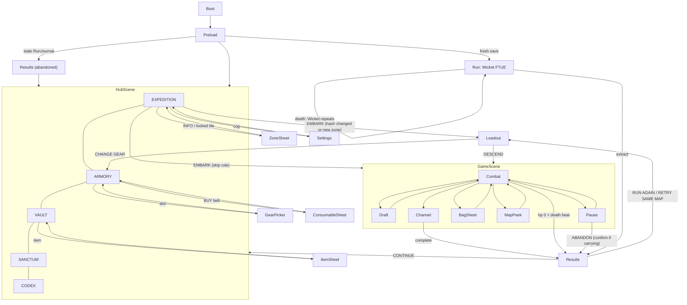

# Duskhaul V2 — production overhaul PRD

> Supersedes, section by section, `PRD.md` §1b, §2A, §4, §5 (all), §6, §7, §8, §9, §10, §11 (asset list), §13, §14, §14b, §15, §16, §17, §18, §19. Sections of `PRD.md` not named here (§1 fantasy/lexicon, §3 controls except where §3 below amends, §11 palette/style rules, §12 audio vocabulary, §20 store listing) stay law.

- Slug: `2026-08-29-duskhaul` (V2 of the SAME folder; `games/2026-08-29-duskhaul-ai/` is a frozen reference — never edit it)
- Family: `A` real-time arena · subgenre survivor × extraction roguelite · Director `RunDirector` · Camera follow-arena · Input joystick (one thumb) + taps · Frame 720x1280 portrait, SAFE top 140 / bottom 220 / side 40 · Phaser 4.2.1 + Vite + TS strict
- Run: **480 s frame** + Collapse; ends only by extraction or death (unchanged thesis)
- Inputs to this spec: `local://duskhaul-design-audit.md` (DesignAudit), `local://duskhaul-flow-audit.md` (FlowAudit — §2 wireframes and §3 matrices ADOPTED), `local://duskhaul-critic-baseline.md` (NO-SHIP verdict, F1-F15), `local://duskhaul-tech-map.md` (file/seam facts).
- Numbers carry units. Every authored payout names its claim condition and reader (§5.30). Every frozen seam names producer `file:symbol` and consumer `file:call-site` (§16.1).

---

## V2.0 Scope table

Status `V2` = ships in this overhaul; `roadmap` = not built now. Change ids = DesignAudit §5.

| # | Change | Status | Workstream(s) | Spec § |
|---|---|---|---|---|
| 1 | Map 1440x2160 → 6144x6144, retire 1600² design space | V2 | WS-World (+WS-Contracts TUNING) | §3 |
| 2 | `systems/mapgen.ts` generator (masks → stamps → Poisson clusters → clearance → connectivity) | V2 | WS-World | §3 |
| 3 | Enemy flow-field nav + separation + leash | V2 | WS-World (`core/grid.ts` API), WS-Actors (steering) | §3.9, §5.6 |
| 4 | Actor scale by visible px + hitbox/range rescale | V2 | WS-Actors, WS-Arsenal, WS-Contracts | §5.4, §7 |
| 5 | Baked outlines (enemy red / hero green) | V2 | WS-Actors | §13.1 |
| 6 | Floor rework (256 px tiles ×3 variants, splats, roads, value band) | V2 | WS-World, WS-Art | §3.7, §11 |
| 7 | 5-tab Hub replacing Menu + Meta | V2 | WS-UI | §14.2-14.8 |
| 8 | Loot split (valuables / gear / shards), bag grid, casket as visible slot | V2 | WS-Loot, WS-Meta (gear data), WS-UI | §5.14-5.16, §14.11 |
| 9 | Death consolation: Hauler XP always, tithe 25% base | V2 | WS-Meta, WS-Loot | §5.26, §10 |
| 10 | XP curve `10+8(L-1)(+12(L-20))`, 20-24 drafts/run | V2 | WS-Contracts (TUNING), WS-Actors (`objects/player.ts`), WS-Balance (sim) | §6.1 |
| 11 | Density curve 30/70/120/170/200-230, cap 250, leash | V2 | WS-Balance (waves), WS-Actors (spawn/leash) | §6.3 |
| 12 | POI layer (chests, lairs, den, shrines, vault, veins, lore, events) | V2 | WS-Loot (`systems/poi.ts`), WS-World (anchors) | §5.12 |
| 13 | Breakables + pickups | V2 | WS-Loot | §5.13 |
| 14 | Minimap + fog + full-map peek; compass ≤5 arrows | V2 | WS-UI | §14.10 |
| 15 | Per-run gate candidates by depth; closing warn 25 s; suppress 600; Collapse clamp 1000-2400 | V2 | WS-World (candidates), WS-Loot (`systems/extraction.ts`) | §2.3, §3.6 |
| 16 | FTUE run (Wicket, 240 s) + non-modal coach | V2 | WS-UI (coach), Integrator (run wiring), WS-Meta (flag) | §5.28, §14.14 |
| 17 | Menu entrance layout jump | V2 (removed by #7: hub has no slide tweens) | WS-UI | §14.2 |
| 18 | PRD resync (stale player stats, arena size, XP curve, collapse bonus) | V2 (this document) | DesignAudit | §18 |
| 19 | 20 weapons + 20 evolutions; 4 weapon + 4 charm slots; 21 charms; pairs unlock 6 at L1 → all 20 by L30 (AMENDED §5.8b) | V2 | WS-Arsenal, WS-Meta (ladder), WS-Art | §5.8-5.9, §5.8b |
| 20 | Elite affix system (8) + Elite Chest | V2 | WS-Actors (affixes), WS-Loot (chest) | §5.5 |
| 21 | 4 zone bosses (Warden skins, distinct attack sets) + 4 mid-bosses (elite art ×1.6) | V2 | WS-Actors | §5.6 |
| 22 | Roster +4 shared, +1 exclusive per zone | V2 | WS-Actors, WS-Art | §5.4 |
| 23 | Gear: 6 slots, 6 rarities, 30 bases, 20 affixes, 8 uniques, merge, item level | V2 | WS-Meta | §5.15 |
| 24 | Valuables (24) | V2 | WS-Loot | §5.14 |
| 25 | Sanctum 40 nodes | V2 | WS-Meta (data), WS-UI (tab) | §5.18 |
| 26 | Account level 1-40 ladder; zone unlock = level + prior extract | V2 | WS-Meta | §5.20 |
| 27 | 4 Hauler classes | V2 | WS-Meta (data), WS-Actors (player), WS-UI | §5.19 |
| 28 | Hazard H1-H5 per zone | V2 | WS-Meta (data), WS-Balance | §5.21 |
| 29 | Contracts board 36 + weekly | V2 | WS-Meta | §5.22 |
| 30 | Codex/Bestiary + 60 achievements | V2 | WS-Meta, WS-UI | §5.23 |
| 31 | Conditional extracts (Toll / Offering / Bell) | V2 | WS-Loot, WS-World (placement) | §5.25 |
| 32 | Region depth rings (threat / chest bias) | V2 | WS-World, WS-Loot, WS-Balance | §3.3 |
| 33 | Greed meter replaces `collapseHaulBonus` | V2 | WS-Loot (settle), WS-UI (HUD) | §5.26 |
| 34 | Draft card info (delta, evolves-with, slot pips) | V2 | WS-UI (`ui/cards.ts`), WS-Arsenal (`describeCard`) | §14.13 |
| 35 | Daily Rite (2 mutators) + streak; menu toggle removed | V2 | WS-Meta, WS-UI | §5.24 |
| 36 | Results V2 (kept/lost/progress blocks) | V2 | WS-UI | §14.12 |
| 37 | Grave's Pity mercy | V2 | WS-Meta | §5.28 |
| 38 | VFX colour discipline, off-screen elite chevrons, boss bar, death beat | V2 | WS-Arsenal (hero VFX), WS-Actors (enemy VFX, death beat), WS-UI (bars/chevrons) | §13 |
| 39 | Pre-run consumable belt (2 slots) | V2 | WS-Meta (data/buy), WS-Loot (use), WS-UI | §5.27 |
| 40 | Wandering Fence event | V2 | WS-Loot | §5.12.7 |
| 41 | Hero skins ×4 | **roadmap** | — | §17 |
| 42 | Lighting pools | V2 | WS-World, WS-Art | §3.7 |
| 43 | Gloam Step charm (auto-dash) | V2 | WS-Arsenal | §5.9 |
| 44 | Cruft deletion (template families, dead TUNING keys, dead UI) | V2 | Integrator (files), WS-Contracts (TUNING keys + game-local `scripts/w1-contract-check.mjs`) | §16.3 |
| 45 | Weekly Rift | V2 | WS-Meta, WS-UI | §5.24 |
| T1 | `?mute=1` URL param + `window.__AUDIO__()` → `{forcedByUrl, requested, played}` | V2 | WS-Meta (`core/audio.ts`) | §12 |

---

## 1. Pillars (numeric)

| Pillar | Measure | Gate |
|---|---|---|
| Readable horde | trash visible height ≥ 60 px, hero 112 px, every hostile red-outlined, hero green-outlined | art_review + cert screenshot at 540 w shows ≥ 90% of hostiles ≥ 45 css px |
| Power fantasy | live enemies within 900 px 50-90 at 240 s, 60-140 at 420 s (bodies ~2.5× V1 size, AMENDED §18a); drafts: live cert run is the pacing authority, sim band 28-48 on runs ≥ 420 s | sim bands §19 |
| Geography has purpose | new POI enters compass/minimap every 8-14 s of free movement; ≥ 45 POIs per run | mapgen selftest |
| Greed is the dial | haul monotone A < B < C and Greed meter ×1.0-1.25 (AMENDED §18a economy retune) | sim greed-premium gate |
| Every run pays | Hauler XP on every run; 25% shards on death | results screen always shows a progress bar that moved |
| Meta depth | Sanctum 100% ≈ 80-120 runs; item levels + affix rerolls + Dread Ascension as endless ◆ sinks; ≥ 20 difficulty rungs (AMENDED §18a economy retune) | §6.5 pacing math |

---

## 2. Run architecture (supersedes PRD §2A)

### 2.1 Beat sheet (480 s)

| Phase | Window | Threat | Live target (≤ 900 px of hero) | Player power (level) | Beats |
|---|---|---|---|---|---|
| Grace | 0-30 s | ×1.0 | 12 → 25 | L1 → L4 (first draft ≤ 10 s) | first breakables, first POI on compass at 0 s |
| Early | 30-120 s | ×1.3 | 25 → 45 | L4 → L11 | Event 1 at 100 s; Gate A opens 90 s; elite lair wakes on approach |
| Mid | 120-240 s | ×1.7 | 45 → 70 | L11 → L16 | elite 150 s; Gate A closes 180 s; Gate B opens 220 s; Event 2 at 220 s; Mid-boss Den opens 240 s; Greed meter starts 240 s |
| Late | 240-360 s | ×2.3 | 70 → 90 | L16 → L22 | elite 270 s; Fence window 180-300 s; Event 3 at 340 s; Gate B closes 340 s |
| Climax | 360-480 s | ×3.2 | 90 → 100 | L22 → L27 | elite 390 s; zone boss at Gate C 420 s; Gate C opens 420 s |
| Collapse | 480 s+ | ×3.2 +0.4 per 3 s | trash drip stops; elites every 3 s | full | ring on Gate C; extract or die |

Threat for any spawn: `phaseMult(t) × zone.threatBase × hazard.threatMul × depthMul(region)` (§3.3, §5.21).

### 2.2 Gate schedule (V2)

| Gate | Opens | Closes | Distance from spawn (path) | Guard |
|---|---|---|---|---|
| A — Wicket of Ash | **90 s** | **180 s** | 1,400-2,200 px, depth 0-1 | none |
| B — Dirge Door | **220 s** | **340 s** | 2,400-3,400 px, depth 1 | elite + 8 adds at open +10 s within 300 px |
| C — Bleak Arch | 420 s | never (Collapse) | 4,000-5,200 px, depth 2 | zone boss spawns 260 px from gate at 420 s |
| Conditional (1 per run) | per kind §5.25 | per kind | any unused candidate, ≥ 1,600 px from spawn | none |

`gate.closingWarnS` 25 s; `gate.previewS` 60 s; compass shows every gate from 0 s as a grey `OPENS m:ss` chip (critic F7) and switches to state colours inside `previewS`.

### 2.3 Extraction channel (unchanged law)

Channel rule v2 and the completability invariant `(player.invulnMs - extract.hitStallMs) * extract.minRate > extract.hitSetbackMs` stay law (`500 * 0.55 = 275 > 200`). V2 changes only: `gate.radius` 120 → **150**, `extract.suppressRadius` 400 → **600** (bigger bodies). Collapse: `collapse.minStart` 700 → **1000**, `maxStart` 1200 → **2400**, `ringSpeedMax` 90 → **140** px/s, `ringAccel` 0.8 → **4** px/s² and `minRadius` 140 → **170** px (AMENDED on build, §18a: a 2,400 px ring closes inside 30 s, measured by `extraction.selftest`; 170 keeps the hold radius outside `gate.radius` 150).

### 2.4 Run end → meta hand-off (supersedes PRD §2A tail)

- Extracted: shards × Greed multiplier bank to stash; every carried item lands in the Vault; Hauler XP ×1.0; contracts/achievements/codex tick.
- Died: shards × `deathKeepPct` (25 base, 40/55 with Rot Tithe) bank; casket items bank; everything else lost (LOST list); Hauler XP ×0.6; codex/contracts still tick for kills.
- Abandoned (pause → ABANDON, or reload/tab-close mid-run via `RunJournal`): settles exactly as a death with reason `ABANDONED`; next boot shows Results(died, `LEFT MID-RUN`) before the Hub (FlowAudit R2b).

---

## 3. World generation (new; supersedes PRD §5.7 coordinates)

### 3.1 Size

`TUNING.arena.width = height = 6144` px (12.1× the V1 3.11 Mpx²). Nav cell 64 px → 96×96 = 9,216 cells. Mask raster 32 px → 192×192. Edge-to-edge 17 s at 360 px/s. `ZONE_DESIGN_SIZE` and `zoneGates()` are deleted; gate positions come from mapgen.

### 3.2 Pipeline (`systems/mapgen.ts generateMap`, pure TS, no Phaser import, deterministic on `Rng(`map:${zone}:${seed}`)`)

| Step | Operation | Parameters |
|---|---|---|
| 1 Regions | 9 seeds on a jittered 3×3 lattice (cell 2048, jitter ±420), 2 Lloyd iterations, Voronoi on the 32 px raster | `mapgen.regionGrid` 3, `regionJitter` 420, `lloydIters` 2 |
| 2 Spawn | pick one of the 4 edge-middle regions (N/E/S/W); spawn point = region centroid pushed 30% toward the map edge | — |
| 3 Depth | BFS over region adjacency from spawn region: depth 0 (1 region), depth 1 (adjacent), depth 2 (rest) | `depthMul` [1.0, 1.1, 1.3] (AMENDED §18a) |
| 4 Landmark per region | one landmark stamp (§3.5) at region centroid ± 200 px | 9 per map |
| 5 Roads | MST over region centroids + POI anchors, plus `extraEdgeRatio` 0.2 loop edges; carve width 360 px on the raster; road material decals | `roadWidth` 360 |
| 6 POI anchors | Bridson Poisson-disk over walkable raster. MAJOR POIs (`data/stamps.ts MAJOR_POIS`: den, vault, lair, event yard, fence, gilt chest `chest_t3`) are ≥ 900 px apart (`poiMinSpacing`). Every other POI is ≥ 450 px from any POI, and no two clearings overlap. Gates, chests, vault, shrines and bells sit ≥ 700 px from the world edge. (AMENDED §18a: a uniform 900 px spacing produced a visible lattice.) Kinds are assigned by the §5.12 quota table, respecting depth rules; each POI gets its clearing radius | ≥ 45 anchors incl. 600 lazy breakables handled separately |
| 7 Gate candidates | 5 per map from zone `gateSlots` weights by depth (§3.6); pick A/B/C + 1 conditional per run | distance bands §2.2 |
| 8 Plazas | one plaza ≥ 800 px diameter per region, not overlapping POI clearings | `plazaDiameter` 800 |
| 9 Masks | border band 192; spawn clearing r 600; gate clearing r 400; POI clearings (per kind); roads; plazas; hazard fields (zone.ts asks for them via `hazardAnchors`) | — |
| 10 Stamps | landmark + POI stamps placed first (prop id, dx, dy, bodyRadius); each validated against masks | §3.5 |
| 11 Cluster seeds | Bridson Poisson-disk over un-masked cells, `clusterMinSpacing` 420 px (≈ 110-140 seeds) | — |
| 12 Cluster archetype | weighted by zone biome table §3.5: wall run (3-6 segments on a line, 0-1 gap ≥ 220), grove/rubble (3-7 props within 60-200 px), graveyard grid (3×3 to 4×5, 110 px pitch), monolith (1 large), debris (decals only) | same prop family per cluster |
| 13 Coverage | stop adding clusters when blocking footprint reaches `coverageTarget` 0.105 of walkable area; clamp band 0.09-0.12 | — |
| 14 Clearance | distance transform on the blocker raster (inflated by 48 px); any walkable cell with free width < 240 px outside a stamp doorway ⇒ delete smallest blocker touching it; ≤ 15% of walkable cells may have free width < 360 | `minCorridor` 240, `narrowShareMax` 0.15 |
| 15 Connectivity | flood fill from spawn on inflated raster; every walkable pocket must connect (else delete smallest adjacent blocker, retry); every gate candidate and POI anchor reachable with BFS path ≤ 1.35× euclidean | `pathFactorMax` 1.35 |
| 16 Retry | up to 8 repair passes; on failure reseed with `${seed}#n` (n ≤ 3); log `mapgen:reroll` | `maxRepairs` 8, `maxReseeds` 3 |
| 17 Decals | non-blocking decals 1 per 54 k px² walkable (≈ 700), weighted to roads/plazas edges; material splats 1 per 120 k px² (≈ 300) | — |
| 18 Lighting pools | 1 per 350 k px² (≈ 100) on light-emitting props and landmark stamps | §3.7 |
| 19 Nav export | `blocked` Uint8Array 96×96 from blocker bodies inflated by 32 px (hero body) | `navCell` 64 |
| 20 Metrics | coverage, minCorridor, narrowShare, pathFactor per gate/POI, poiCount, reseeds, ms | selftest bands §3.8 |

Hard rules: no single blocker body radius > 190 px (cert-driver treats bodies ≤ 400 px as props, `scripts/cert-driver.mjs:1903-1953`); no blocker within any gate clearing (r 400) or POI clearing (critic F4: a prop sat on Gate C at (1291,1957)).

### 3.3 Region depth rules

| Depth | Regions | Threat `depthMul` | Chest tier bias | Allowed POIs |
|---|---|---|---|---|
| 0 | 1 (spawn) | 1.00 | +0 | T1 chests, veins, lore, shrines (Grave, Gilt) |
| 1 | 3-4 | 1.10 | +1 | T1-T3 chests, 2 lairs, shrines, events, Gate A/B, conditional |
| 2 | 4-5 | 1.30 | +2 | T2-T4 chests, 1 lair, Den, Vault, Gate C |

Enemies read the depth of the cell they spawn in (`GeneratedMap.depthAt(x,y)`).

### 3.4 Output type — see §16.1 `GeneratedMap`.

### 3.5 Stamps & cluster tables (`data/stamps.ts`, `data/props.ts`)

Stamp = `{ id, radius, props: {propId, dx, dy, bodyRadius?, rot?}[], doorways: {angle, width}[] }`. Minimum set per zone: 9 landmarks (one per region slot) + POI stamps: chest nook (r 180), lair ring (r 360, 2 doorways ≥ 240), den arena (r 480, 4 doorways ≥ 260, closable bone wall), shrine plinth (r 140), vault court (r 260, 1 doorway ≥ 220), gate apron (r 400, no blockers), fence camp (r 200), event yard (r 420).

Landmarks per zone (stamp id → art):

| Zone | 9 landmark stamps |
|---|---|
| castle | `lm-belltower`, `lm-ossuary`, `lm-chapelruin`, `lm-barracks`, `lm-cistern`, `lm-gallowsyard`, `lm-cryptmouth`, `lm-rampartbreach`, `lm-thronecourt` |
| outlands | `lm-gibbetrow`, `lm-ribcage`, `lm-mudcamp`, `lm-windmill`, `lm-carrionfield`, `lm-bonebridge`, `lm-burnedfarm`, `lm-standingstones`, `lm-ashpit` |
| desert | `lm-sunkenhead`, `lm-drywell`, `lm-shadecanopy`, `lm-obelisk`, `lm-caravanwreck`, `lm-tombgate`, `lm-dunespine`, `lm-saltflat`, `lm-scarabmound` |
| winter | `lm-frozenshrine`, `lm-torchcircle`, `lm-icecavern`, `lm-widowspire`, `lm-corpselake`, `lm-brokenwall`, `lm-pineclutch`, `lm-yetiden`, `lm-crownsteps` |

Cluster archetype weights (wall / grove-rubble / graveyard / monolith / debris): castle 35/20/25/10/10, outlands 10/40/15/15/20, desert 15/25/10/25/25, winter 20/35/10/20/15. Prop families per archetype reuse the existing `props-<zone>-a/b` cells (`data/props.ts`) plus the new cells in §11.

### 3.6 Gate candidate slots (per zone, `data/zones.ts gateSlots`)

Each zone authors 5 slot rules `{ depth, minDist, maxDist, weight, kinds }`. Selection: A from depth ≤ 1 with 1,400-2,200 path px; B depth 1 with 2,400-3,400; C depth 2 with 4,000-5,200; conditional from the remainder, ≥ 1,600 px from spawn and ≥ 1,500 px from every other chosen gate. All gates ≥ 1,500 px apart.

### 3.7 Floor, materials, lighting (#6, #42)

- Floor: 3 tile variants per zone `floor-<zone>-a|b|c`, 256×256, stones 32-40 px; blended by 512 px value noise into a 24×24 grid of 256 px chunks rendered as a Phaser `Tilemap` layer (tile 256, 24×24 = 576 tiles, culled).
- Value band: floor luminance L* 18-32 (mean 25); grout never < L* 12 or > L* 38; saturation ≤ 25%; floor never uses hue 350-20° or 95-150° above 30% saturation (keeps outline identity). `FLOOR_GRADE` retuned per zone after art lands (measured by `xd://art_review`).
- Roads: `road-<zone>` 256 tile drawn on road raster cells, luminance −10% vs floor.
- Splats: `splat-<zone>-a|b|c` 512 px soft-edged decals (moss / mud / snowdrift / sand ripple), alpha 0.55.
- Lighting pools: additive `fx-lightpool` 512 px radial, tint per zone (castle `#f7a446`, outlands `#d9a24b`, desert `#f3ca67`, winter `#9fd3ff`), alpha 0.32, 1.2 s flicker ±0.04; ≈ 100 per map, chunk-culled. Ground grade darkened ×0.85 so pools read.
- Y-sort: props with `tall: true` (columns, pines, gibbets, towers) use depth `10 + y/6144` split: base below actors, top sprite `setDepth(30)` occluding actors at alpha 0.6 when the hero is behind (tech-map P1 Y-sort).

### 3.8 Selftest bands (`sim/kits/mapgen.selftest.ts`, 200 seeds × 4 zones)

| Metric | Band |
|---|---|
| blocking coverage of walkable area | 0.09-0.12 |
| min free corridor outside doorways | ≥ 240 px |
| narrow (< 360 px) walkable share | ≤ 0.15 |
| unreachable walkable cells | 0 |
| path factor spawn → each gate / POI | ≤ 1.35 |
| POI anchors (excl. breakables) | 45-60; MAJOR POIs (den, vault, lair, event yard, fence, gilt chest) ≥ 900 px apart; all other POIs ≥ 450 px apart with no overlapping clearings; gates/chests/vault/shrines/bells ≥ 700 px from the world edge |
| gate distances | inside §2.2 bands, all gates ≥ 1,500 px apart |
| blockers inside gate r 400 / POI clearings | 0 |
| max blocker body radius | ≤ 190 px |
| reseed rate | ≤ 10% of seeds |
| generation time (Node, M-class laptop) | median ≤ 120 ms, p95 ≤ 250 ms |
| determinism | same seed ⇒ byte-identical `blocked` + anchor list |

### 3.9 Navigation & spawning on the big map

- `NavGrid.fromBlocked(cols, rows, cell, blocked)`; flow field toward the hero rebuilt every `nav.rebuildMs` 250 ms (or when the hero changes cell) over a window of `nav.windowCells` 40 (2,560 px) around the hero (`buildFlowFieldWindow`). Outside the window: straight steer.
- Separation: boids push within `1.1 × bodyRadius`, strength `nav.separation` 0.6, spatial-hash neighbours ≤ 6.
- Spawn ring: `VIEW/2 + enemy.spawnMargin` (70 → **140**), reject nav-blocked cells and cells inside open-gate `suppressRadius`.
- Leash: an enemy > `enemy.leashPx` 1,800 px from the hero and off-screen > `enemy.leashMs` 4,000 ms is re-seated on the spawn ring (not killed, no drops).
- POI-owned populations (lair, den, vault, events) activate at `poi.activateRadius` 900 px and do not count against ambient `maxAlive` until active; ambient budget = `maxAlive − activePoiBodies`.
- Hazard nodes scale with area: `systems/zone.ts` receives `hazardAnchors` from mapgen; counts ×9 (braziers 54, pits 45, ice 36 + torches 45, ash zones 12 streaming along roads).

---

## 4. Systems map (supersedes PRD §4)

| System | Module | Owner WS | Notes |
|---|---|---|---|
| Director | `core/run.ts` | (unchanged) | |
| Map generation | NEW `systems/mapgen.ts` | World | pure TS; sim + scene |
| Stamps | NEW `data/stamps.ts` | World | |
| Arena render/bodies | `systems/arena.ts` | World | consumes `GeneratedMap.layout`, chunk culling, Tilemap floor |
| Navigation | `core/grid.ts` | World | `fromBlocked`, `buildFlowFieldWindow` |
| Zone hazards | `systems/zone.ts`, `data/zones.ts` | World | hazards at mapgen anchors; `gateSlots` |
| Combat core | `systems/combat.ts` | Actors | spawns, steering, leash, contact, pickup magnet, boss/mid-boss patterns |
| Weapons | NEW `systems/weapons.ts` (split from combat.ts by Contracts) | Arsenal | 12 patterns + evolutions + charms |
| Enemies/affixes | `data/enemies.ts`, NEW `data/eliteAffixes.ts`, `objects/enemy.ts` | Actors | |
| Outlines | NEW `core/outline.ts` | Actors | preload bake |
| Draft pool | `data/upgrades.ts`, NEW `data/charms.ts`, `data/weapons.ts` | Arsenal | |
| Bag | `systems/bag.ts` | Loot | grid, casket, settle |
| POIs/events/fence | NEW `systems/poi.ts`, NEW `data/pois.ts` | Loot | |
| Breakables/pickups | NEW `objects/breakable.ts`, NEW `data/pickups.ts` | Loot | |
| Valuables | NEW `data/valuables.ts` | Loot | |
| Extraction | `systems/extraction.ts` | Loot | + conditional kinds, greed |
| Gear/affixes/uniques | NEW `data/gear.ts`, NEW `data/affixes.ts` | Meta | `rollGear` consumed by Loot |
| Save/meta API | `core/progression.ts` | Meta | v4 schema |
| Sanctum/classes/contracts/achievements/hazards/mutators | NEW `data/*.ts` | Meta | |
| Codex/collections | `core/collections.ts` | Meta | |
| Daily/Weekly | `core/daily.ts` | Meta | |
| Contracts runtime | NEW `core/contracts.ts` | Meta | |
| Audio mute param | `core/audio.ts` | Meta | T1 |
| Hub | NEW `scenes/hub/**` | UI | replaces `scenes/menu.ts`, `scenes/meta.ts` |
| HUD/minimap/bag strip/pause/cards/coach | `ui/**` | UI | |
| Waves & sim | `data/waves.ts`, `sim/**` | Balance | |
| Run scene | `slices/arena/game.ts` | Integrator | wires all producers |

---

## 5. Content tables

### 5.1 Player base (supersedes PRD §5.1; `TUNING.player`)

| Key | V1 | V2 | Unit |
|---|---|---|---|
| `maxHp` | 110 | 110 | hp |
| `moveSpeed` | 330 | **360** | px/s |
| `visiblePx` | (96 cell) | **112** | px silhouette height |
| `size` (cell display) | 96 | **162** (= 112 × 256 / 177.5 hero-idle subject mean) | px |
| `bodyRadius` | circle 70 in 256 cell | **34** | world px |
| `range` | 300 | **380** | px |
| `pickupRadius` | 150 | **170** | px |
| `invulnMs` | 700 | 700 (law) | ms |
| `regenPerSecond` | 0.4 | **0.8** (stat `regenPerS`; AMENDED §18a) | hp/s |
| `critChance` / `critMul` | 0.05 / 2 | same | |

### 5.2 Stat keys (frozen union V2; `config.ts PLAYER_BASE_STATS`)

`maxHp, moveSpeed, damageMul, cooldownMul, area, critChance, critMul, pickupRadius, shardsMul, channelMs, bagCells, projectileBonus, durationMul, regenPerS, contactDamageMul, xpMul, luck`. (`bagSlots` renamed `bagCells`: 12 base.) Base values: `projectileBonus 0, durationMul 1, regenPerS 0.8, contactDamageMul 1, xpMul 1, luck 0`.

### 5.3 Classes (#27; `data/classes.ts`; hero sprite reused; identity = start weapon + stats; optional sash overlay `hero-sash-<id>` only if WS-Art ships it)

| id | Name | Unlock | Start weapon | Passive | Stat deltas |
|---|---|---|---|---|---|
| `duskhauler` | Duskhauler | L1 | Rustspike | Scavenger: +15% shards from veins and caches | none |
| `gravewarden` | Gravewarden | L10 | Bone Halo | Bulwark: contact damage −15%; knockback ×2 | maxHp +30%, moveSpeed −10% |
| `ashwitch` | Ashwitch | L16 | Ash Ring | Kindling: burn DoTs +25% duration | area +20%, maxHp −20 |
| `widowblade` | Widowblade | L25 | Widow's Lance | Grief Edge: crits restore 1 hp (max 5/s) | critChance +10%, maxHp −10 |

### 5.4 Enemy roster (#22; supersedes PRD §5.2; `data/enemies.ts`)

`visiblePx` is law; `size = round(visiblePx × 256 / subjectHeightMean)` where `subjectHeightMean` is read from that sheet's `sprite-metadata.json` `outputSubjectHeightMean` (known: husk 157, ratking 81.5, pyreling 90.5, scarab 84, bonecaster 181, hero 177.5). `bodyRadius = round(0.36 × visiblePx)`. Contact reach = `bodyRadius + player.bodyRadius` in scene AND sim. HP/dmg/speed unchanged for V1 rows unless listed; `moveSpeed ×1.1` for all rows (ratio vs 360 px/s hero).

| id | Name | visiblePx | hp | dmg | spd (×1.1 applied) | xp | ◆ | Behaviour | First seen | Zone |
|---|---|---|---|---|---|---|---|---|---|---|
| husk | Grave Husk | 76 | 18 | 6 | 88 | 4 | 1 | chase | 0 | shared |
| wretch | Gloam Wretch | 70 | 12 | 5 | 165 | 4 | 1 | chase | 30 | shared |
| ratking | Rot Ratking | 64 | 8 | 4 | 132 | 3 | 1 | swarm ×6 | 45 | shared |
| cryptcrawler **NEW** | Crypt Crawler | 60 | 6 | 3 | 190 | 2 | 1 | swarm ×8 | 20 | shared |
| bonecaster | Bonecaster | 80 | 24 | 8 | 66 | 6 | 3 | ranged r 320, shot 18 px red-rimmed | 90 | shared |
| thornhound | Thornhound | 84 | 30 | 10 | 143 | 6 | 3 | orbit-charge | 120 | shared |
| paleknight | Pale Knight | 110 | 90 | 14 | 60 | 12 | 5 | tank | 150 | shared |
| lanternmonk **NEW** | Lantern Monk | 84 | 30 | 10 | 60 | 7 | 3 | lob: AoE r 90 at hero pos, 900 ms amber ground telegraph, cd 3.5 s, range 380 | 150 | shared |
| shroudmoth | Shroudmoth | 72 | 16 | 7 | 110 | 5 | 2 | drift (ignores props) | 180 | shared |
| bulwark **NEW** | Bone Bulwark | 112 | 120 | 12 | 55 | 14 | 6 | shield: frontal 180° takes ×0.3 dmg | 200 | shared |
| gildedghoul | Gilded Ghoul | 84 | 50 | 6 | 176 | 10 | 15 + 1 valuable roll | flee | 200 | shared |
| pyreling | Pyreling | 64 | 14 | 12 | 121 | 5 | 2 | death burst r 80 (300 ms red flash) | 210 | shared |
| marrowworm | Marrowworm | 100 | 40 | 9 | 77 | 8 | 4 | split ×2 | 240 | shared |
| gibbet **NEW** | Gibbet Wight | 96 | 45 | 14 | 99 | 9 | 4 | hook: 1,400 ms red line telegraph (len 420), pulls hero 160 px, cd 6 s | 250 | shared |
| dirgebell | Dirgebell | 90 | 35 | 0 | 77 | 10 | 5 | aura +25% spd r 200 | 270 | shared |
| ashwraith | Ashwraith | 78 | 22 | 9 | 99 | 6 | 3 | blink 200 px / 3 s | 300 | shared |
| chapelghast | Chapel Ghast | 80 | 28 | 9 | 105 | 6 | 3 | orbit-charge | 60 | castle |
| gargoyle | Rust Gargoyle | 110 | 60 | 12 | 110 | 10 | 5 | perch/dive 6 s | 240 | castle |
| choirwraith **NEW** | Choir Wraith | 84 | 34 | 8 | 94 | 7 | 3 | scream: slow 25% r 160 for 2 s, cd 5 s, 600 ms ring telegraph | 90 | castle |
| kite | Carrion Kite | 76 | 20 | 8 | 187 | 5 | 2 | swoop | 60 | outlands |
| giant | Sloughed Giant | 150 | 140 | 16 | 50 | 14 | 6 | tank + slam r 130 (800 ms) | 240 | outlands |
| mirehag **NEW** | Mire Hag | 96 | 60 | 10 | 66 | 8 | 4 | trail: mud slow 30% segments r 60, 4 s | 120 | outlands |
| leech | Dune Leech | 84 | 26 | 10 | 99 | 6 | 3 | burrow/surface 7 s | 60 | desert |
| scarab | Gilt Scarab | 70 | 45 | 6 | 154 | 8 | 4 (+3/hit) | chase | 240 | desert |
| sandrevenant **NEW** | Sand Revenant | 88 | 50 | 12 | 110 | 8 | 4 | revive once at 50% hp after 2 s collapse | 120 | desert |
| widow | Frost Widow | 120 | 70 | 14 | 94 | 10 | 5 | web slow r 120 | 60 | winter |
| yeti | Hollow Yeti | 160 | 180 | 20 | 66 | 16 | 7 | tank, enrage < 30% spd 121 | 240 | winter |
| rimestalker **NEW** | Rime Stalker | 92 | 55 | 13 | 154 | 8 | 4 | stalk: alpha 0.25 until ≤ 260 px from hero (outline stays 100%) | 120 | winter |

New behaviours added to `EnemyBehaviour`: `'lob' | 'shield' | 'hook' | 'scream' | 'trail' | 'revive' | 'stalk'`. Bug fix: `enemy.ts:200` orbitAngle uses the player, not screen centre.

### 5.5 Elites & affixes (#20; `data/eliteAffixes.ts`)

Elite = any shared/zone archetype promoted: hp × `elite.hpMul` **8**, visiblePx × 1.6 (cap 170), dmg × 1.5, 1 affix, red outline 4 px + `#7a0000` pulse, affix icon 28 px, name plate `<Affix> <Name>`. Sources: scripted 150/270/390 s (phase archetype), lairs (3), composition swaps (`wave.eliteSwapEveryS` 40 from 285 s), Collapse every 3 s, Gate B guard. Kill ⇒ Elite Chest (§5.12) + `loot.eliteValuables` 1 + 25 ◆.

| id | Name | Effect | Numbers | Telegraph |
|---|---|---|---|---|
| `vampiric` | Vampiric | heals from damage dealt | 20% of dmg dealt, cap 5% maxHp/s | red mist trail |
| `hasted` | Hasted | faster | move ×1.4, attack cd ×0.7 | speed streaks |
| `shielded` | Shielded | frontal DR | frontal 180° dmg ×0.3 | bone shield sprite |
| `splitter` | Splitter | spawns minions | 4 base-archetype minions on death | 400 ms crack glow |
| `frenzied` | Frenzied | enrage | < 50% hp: speed ×1.5, dmg ×1.3 | red rim tween |
| `warded` | Warded | periodic immunity | immune 1 s every 4 s | violet ring during immunity |
| `plagued` | Plagued | death/walk pools | pool r 90, 3 dps, 4 s, every 1.5 s of walking | amber ground ring |
| `magnetic` | Magnetic | pulls hero | pull 60 px/s within r 250 | swirl ring r 250 alpha 0.2 |

### 5.6 Zone bosses & mid-bosses (#21)

Zone boss replaces the single Warden: hp × `boss.hpMul` **70** (grunt-at-phase), visiblePx 260, dmg 22 contact, 3 phases at 66%/33% (`boss.phase2At/phase3At` unchanged), phase-2 shield ×0.35 while adds live (unchanged), top boss bar 560×20 at (80,150). Kill ⇒ Boss Chest (2 items, tier bias +2, 1 Dread Sigil first kill per zone per hazard), 120 ◆.

| Zone | Boss (art) | Phase 1 | Phase 2 (≤ 66%) | Phase 3 (≤ 33%, speed ×1.4) |
|---|---|---|---|---|
| castle | **Bell Warden of Bleakspire** (`boss-warden-*`) | *Toll*: 3 concentric rings expand r 120→520 at 220 px/s, 18 dmg, 700 ms bell-glow telegraph, every 3.5 s · *Chain Sweep*: 160° arc r 260, 26 dmg, 900 ms windup | summon 6 husk every 12 s · *Bell Drop*: 4 circles r 110 at hero-predicted positions, 1,000 ms telegraph, 30 dmg | *Bullet Ring*: 14 shots every 3 s (500 ms telegraph) + Toll every 2.5 s |
| outlands | **Ashen Warden** (`boss-warden-*-outlands`) | *Ash Geyser*: 5 geysers in a line toward hero, r 90, 24 dmg, 800 ms each, staggered 120 ms · *Gust*: push 140 px/s for 1.5 s, 600 ms arrow warning | summon 8 kites every 14 s · *Bone Rain*: 12 circles r 70 in r 500, 900 ms, 20 dmg | *Spiral*: 3 arms × 6 shots / 0.4 s for 3 s, every 6 s + Ash Geyser every 4 s |
| desert | **Sun-Eaten Warden** (`boss-warden-*-desert`) | *Burrow Charge*: sinks 600 ms, surfaces under hero after 1,200 ms circle telegraph r 140, 32 dmg · *Sand Wall*: 6 pillar line blocks 5 s (static bodies r 50) | summon 4 leeches · *Scorch Beam*: 400 px beam sweeping 180°/s for 3 s, 800 ms line telegraph, 12 dmg/0.2 s | *Sinkholes*: 3 pits r 160 slow 50% 8 s + Burrow Charge every 4 s |
| winter | **Rime Warden** (`boss-warden-*-winter`) | *Ice Lance*: 5 lances 30° spread, 900 ms telegraph lines, 20 dmg · *Frost Nova*: r 300, 1,000 ms windup, slow 80% 1 s | summon 2 frost widows · *Glacier*: 3 ice walls (static, 6 s) cutting toward hero | *Blizzard*: 20 icicles r 60 over 4 s, 700 ms each + Frost Nova every 5 s |

Mid-bosses (#21; Den POI, opens 240 s, depth 2; elite art × 1.6 → visiblePx 200; hp × `midboss.hpMul` **30**; fixed affix; kill ⇒ guaranteed Gilded+ gear, 1 Dread Key, 150 ◆):

| Zone | Mid-boss (art, affix) | Attack 1 | Attack 2 |
|---|---|---|---|
| castle | **Sexton of Bleakspire** (`elite-reaper-*`, Shielded) | *Triple Reap*: 3 × 140° sweeps r 220, windups 700/500/500 ms, 22 dmg | *Grave Call*: summon 5 husks every 12 s |
| outlands | **Gibbet Herald** (`elite-herald-*`, Splitter) | *Rally Banner*: plants banner (8 s) → +50% spawns within r 600 | *Spear Line*: charge 520 px, 800 ms line telegraph, 28 dmg |
| desert | **Sand Matron** (`elite-matron-*`, Plagued) | *Web Slick*: 3 slow fields r 140 (40%) 6 s | *Egg Burst*: 4 eggs hatch 3 crypt crawlers each after 2 s (egg glow) |
| winter | **Rime Reaper** (`elite-reaper-*`, Hasted) | *Blink Reap*: 600 ms ring at hero then 360° sweep r 200, 24 dmg | *Frost Trail*: slow 30% trail r 60, 4 s |

Den rule: entering r 480 closes a bone wall (4 static segments on doorways) for `midboss.lockS` 20 s or until the mid-boss dies.

### 5.7 Waves (supersedes PRD §5.4 targets; `data/waves.ts`, owner WS-Balance)

WS-Balance authors ≥ 22 timeline rows so live counts hit §6.3. Mandatory rows: 0 s husk drip + crypt crawler swarm from 20 s; every archetype enters at its `firstSeenS`; zone exclusives from their `firstSeenS`; events at 100/220/340 s (§5.12.6); elites 150/270/390 s; boss 420 s; breathers `events.breatherAtS` [290, 412] kept.

### 5.8 Weapons (#19; `data/weapons.ts`, patterns in `systems/weapons.ts`)

4 weapon slots (`weapons.maxSlots` 4), rank 1-4 (`weapons.maxBoosts` 3, law from V1 amendment retained). Evolution = rank 4 + partner charm owned (any rank) ⇒ next Elite/Boss Chest grants it; if no chest within `evolution.fallbackS` 60 s of eligibility, the evolution card enters the next draft (guaranteed within 2 drafts). Hero VFX palette cool (cyan `#6fd6ff`, violet `#ad6eef`, bone `#eae1bf`, gloam green `#9bdf9f`); never red/amber.

| id | Name | Pattern | Base dmg | CD ms | Geometry | Rank growth (per boost) | Unlock | Evolution (partner charm) | Evolved stats |
|---|---|---|---|---|---|---|---|---|---|
| bolt | Rustspike | nearest-target projectile | 12 (AMENDED from 8) | 900 | speed 700, size 22 | +1 proj at boost 1 & 3; +20% dmg boost 2 | L1 | **Coffin Nail** (Grave Oath) | 3 proj, pierce 3, dmg 20 |
| orbit | Bone Halo | orbiting blades | 9 / hit (AMENDED from 6) | hit cd 380 | r 190, 1 blade | +1 blade | L1 | **Marrow Wheel** (Ossuary Bell) | r 380, 4 blades, dmg 10 |
| nova | Ash Ring | radial burst | 15 (AMENDED from 10) | 1600 | r 320, falloff 0.4 | +25% dmg, −10% cd | L1 | **Pyre Shroud** (Dirge Drum) | + burn field 3 s 8 dps r 320 |
| scythe | Gloam Scythe | frontal arc | 14 | 1200 | 140°, r 180 | +25% dmg | L1 | **Dirge Reaper** (Husk Heart) | 360°, +50% dmg |
| rail | Widow's Lance | piercing beam | 36 (AMENDED from 24) | 2200 | pierce 4, len 640 | +1 pierce, +25% dmg | L3 | **Sorrow Piercer** (Widow's Eye) | dmg 60, +30% crit chance |
| hex | Thorn Hex | chain | 9 | 1400 | 4 jumps, 220 px | +1 jump | L6 | **Rot Chorus** (Gilt Tongue) | 6 jumps, DoT 3 s 6 dps |
| skull | Wailing Skull | homing | 12 | 1500 | speed 420, turn 4 rad/s, 1 skull | +1 skull at boost 1 & 3; +20% dmg boost 2 | L8 | **Choir of Skulls** (Grave Lodestone) | 4 skulls, each explodes r 90 for 50% |
| censer | Plague Censer | ground pools on enemies | 6 dps | 2400 | pool r 110, 3 s, target within 420 | +1 pool | L14 | **Pestilent Thurible** (Candle of Hours) | pools r 150, 5 s, slow 30% |
| sickle | Grave Sickle | boomerang | 16 | 1800 | out 420 px, pierce ∞ | +20% dmg; +1 sickle at boost 3 | L20 | **Moon Harvester** (Gloam Spur) | 3 sickles on spiral path, 26 dmg |
| lash | Thorn Lash | horizontal whip | 15 | 1300 | rect 360×90, alternating side | both sides at boost 1; +20% dmg | L28 | **Briar Scourge** (Rust Mail) | both sides, 30 dmg, bleed 2 dps 3 s |
| breath | Pyre Breath | cone in move dir | 5 / 200 ms tick | 2000 | 60°, len 260, 1 s | +15° cone, +20% dmg | L32 | **Cinder Maw** (Marrow Salve) | 90°, len 360, 2 s, ignite 4 dps, cd 1600 |
| spears | Gallows Spears | ground eruption | 22 | 2000 | 3 spikes r 60 under enemies within 380, 350 ms telegraph (cyan) | +1 spike | L36 | **Gallows Forest** (Nail Pouch) | 8 spikes in a line to densest cluster, root 1 s |

Class start weapons occupy slot 1. `STARTING_WEAPON` becomes `classDef(id).startWeapon`.

### 5.9 Charms (#19, #43; `data/charms.ts`; 4 slots `charms.maxSlots` 4; rank 1-5)

| id | Name | Per rank | Evolves |
|---|---|---|---|
| `c_oath` | Grave Oath | damageMul +8% | Rustspike |
| `c_bell` | Ossuary Bell | area +10% | Bone Halo |
| `c_drum` | Dirge Drum | cooldownMul −6% | Ash Ring |
| `c_heart` | Husk Heart | maxHp +15 | Gloam Scythe |
| `c_eye` | Widow's Eye | critChance +4% | Widow's Lance |
| `c_tongue` | Gilt Tongue | shardsMul +8% | Thorn Hex |
| `c_lodestone` | Grave Lodestone | pickupRadius +25 | Wailing Skull |
| `c_candle` | Candle of Hours | durationMul +12% | Plague Censer |
| `c_spur` | Gloam Spur | moveSpeed +6% | Grave Sickle |
| `c_mail` | Rust Mail | contactDamageMul −5% | Thorn Lash |
| `c_salve` | Marrow Salve | regenPerS +0.3 | Pyre Breath |
| `c_pouch` | Nail Pouch | projectileBonus +1 at ranks 2 and 4; +5% dmg other ranks | Gallows Spears |
| `c_step` | Gloam Step (#43) | on contact hit with cd ready: auto-dash 180 px away from attacker, 300 ms i-frames; cd 6.0/5.0/4.2/3.6/3.0 s | — |

### 5.8b Arsenal 20 (user request; supersedes the weapon and charm COUNTS of §5.8/§5.9 and the weapon rungs of §5.20)

The arsenal grows to **20 weapons + 20 evolutions + 21 charms**: 20 partner charms plus the unpaired `c_step`. Every weapon has exactly one partner charm, and each weapon unlocks together with its partner as a **pair**. The 12 existing weapons (§5.8) and 13 charms (§5.9) keep their stats, partners and evolutions. Slots stay at 4 weapons + 4 charms, rank 1-4 per weapon and 1-5 per charm. Evolution rule unchanged: rank 4 + partner charm owned, delivered by an Elite or Boss Chest, or by the 60 s draft fallback.

#### 5.8b.1 Eight new weapons (`data/weapons.ts`, `systems/weapons.ts`, `TUNING.weapons.<id>`)

Each pattern is mechanically distinct from the 12 existing weapons and from the other 7. Rank = boosts + 1; the B1/B2/B3 columns show what each boost card adds.

| id | Name | Pattern (what is new) | Rank 1 | B1 | B2 | B3 | Evolution (partner) | Evolved |
|---|---|---|---|---|---|---|---|---|
| `aura` | Mourning Pall | **Constant damage aura** centred on the hero; no projectile, no cooldown | r 110, 6 dmg per 500 ms tick, knockback 40 px/s | r +20 | +30% dmg | tick 400 ms | **Pall of the Dead** (`c_pin`) | r 200, 10 dmg / 350 ms, enemies inside −25% speed, a kill inside heals 1 hp (cap 5 hp/s) |
| `chakram` | Ossuary Disc | **Ricochet disc:** hits a target, then bounces to the nearest un-hit enemy within 260 px; reflects off blockers | 13 dmg, cd 1400, speed 520, size 40, 3 bounces | +1 bounce | +20% dmg | +1 disc | **Wheel of Sorrows** (`c_knuckle`) | 3 discs, 7 bounces, 20 dmg, crits don't use a bounce, discs return to the hero |
| `wake` | Gloam Wake | **Movement trail:** drops a cold-fire segment every 60 px moved, only while moving ≥ 60 px/s | segment r 45, life 2.0 s, 8 dmg per 400 ms | +25% dmg | r +15 | life +1 s | **River of Dusk** (`c_sole`) | r 80, life 4 s, 14 dmg per 400 ms, slows 30% |
| `snares` | Grave Snares | **Proximity mines:** drops a snare at the hero's feet; it arms after 400 ms and blasts when an enemy comes within 70 px | cd 1600, blast r 120, 30 dmg, max 4 live | +1 max, −10% cd | +25% dmg | blast r +30 | **Ossuary Minefield** (`c_fuse`) | max 10, 45 dmg, each blast detonates snares within 220 px, root 0.8 s |
| `siphon` | Marrow Siphon | **Lifesteal tether:** continuous beam locked to the nearest enemy within 320 px; retargets instantly on a kill | 4 dmg per 200 ms (20 dps), heals 3% of damage | range +60 | +25% dmg | +1 tether | **Heartdrinker** (`c_vial`) | 3 tethers, 7 dmg per 200 ms, heal 6% (cap 6 hp/s), a tethered kill passes the tether to the nearest enemy |
| `bombs` | Rattle Urns | **Bouncing lob:** an urn thrown at the densest point within 420 px, hops 140 px onward per bounce and explodes on every bounce | cd 2000, 3 bounces, blast r 90, 14 dmg | +1 bounce | +25% dmg | +1 urn | **Ossuary Barrage** (`c_powder`) | 3 urns, 5 bounces, each bounce also throws 2 bone shards (8 dmg, straight, 300 px) |
| `totem` | Dirge Totem | **Placed beacon:** plants a totem at the hero's position that pulses damage in a ring | cd 7000, life 6 s, pulse r 200 every 800 ms, 10 dmg, max 1 | life +2 s | +25% dmg | r +40 | **Cathedral of Bones** (`c_hymnal`) | max 2, r 300, pulse every 600 ms, 16 dmg, pulls enemies toward it at 40 px/s |
| `thralls` | Husk Thralls | **Summoned minions** that chase and bite (allies, not projectiles) | cd 12000, 1 thrall: hp 40, speed 300, bite 10 per 700 ms, life 12 s, body r 26 | +1 max | +30% bite & hp | +1 max | **Legion of the Hollow** (`c_collar`) | 4 permanent thralls, bite 16; on death a thrall bursts (r 90, 30 dmg) and respawns after 4 s |

Rank 1 damage is scaled to the shipped starters (bolt 12 per 900 ms, lash 15 per 1300 ms). Thralls are allies: 2 px `#39ff6a` outline at 0.7 alpha, max 4 alive, they collide with enemies, never body-block the hero, never contest gates, and count toward the hero fields budget (§15).

**Hero FX palette (law for all 20 weapons):** cool colours only — cyan `#6fd6ff`, violet `#ad6eef`, bone `#eae1bf`, pale steel `#9fb3c8`, gloam green `#9bdf9f`. Never red, amber or orange (those mean hostile), and never the outline green `#39ff6a` (reserved for hero/ally outlines). Wake and totem are cold violet fire; snares and urns are bone with cyan runes; the siphon beam is violet with a bone core; thralls are pallid grey with cyan eyes.

#### 5.8b.2 Eight new partner charms (`data/charms.ts`; rank 1-5, value per rank)

| id | Name | Per rank | Evolves |
|---|---|---|---|
| `c_pin` | Widow's Pin | contactDamageMul −4% | Mourning Pall |
| `c_knuckle` | Cheater's Knucklebone | critMul +0.08 | Ossuary Disc |
| `c_sole` | Pilgrim's Sole | moveSpeed +4% | Gloam Wake |
| `c_fuse` | Sexton's Fuse | area +8% | Grave Snares |
| `c_vial` | Marrow Vial | regenPerS +0.2 | Marrow Siphon |
| `c_powder` | Ossuary Powder | damageMul +6% | Rattle Urns |
| `c_hymnal` | Dirge Hymnal | cooldownMul −5% | Dirge Totem |
| `c_collar` | Bone Collar | durationMul +10% | Husk Thralls |

New ids extend the frozen unions in `data/types-v2.ts`: `WeaponId += 'aura' | 'chakram' | 'wake' | 'snares' | 'siphon' | 'bombs' | 'totem' | 'thralls'`; `CharmId += 'c_pin' | 'c_knuckle' | 'c_sole' | 'c_fuse' | 'c_vial' | 'c_powder' | 'c_hymnal' | 'c_collar'`.

#### 5.8b.3 Pair unlock ladder (`data/sanctum.ts ACCOUNT_LADDER`; unlock keys `weapon:<id>` + `charm:<partner>` in the SAME rung)

| Account level | Pair (weapon + partner charm) | Why at this rung |
|---|---|---|
| 1 | Rustspike + Grave Oath · Bone Halo + Ossuary Bell · Ash Ring + Dirge Drum · Gloam Scythe + Husk Heart · Mourning Pall + Widow's Pin · Widow's Lance + Widow's Eye | 6 starter pairs, 6 distinct ranges: ranged single target, orbit, radial burst, frontal melee, passive aura, straight-line pierce |
| 2 | Wailing Skull + Grave Lodestone | homing |
| 3 | Ossuary Disc + Cheater's Knucklebone | ricochet |
| 4 | Thorn Hex + Gilt Tongue | chain |
| 5 | Gloam Wake + Pilgrim's Sole | movement-driven |
| 7 | Grave Sickle + Gloam Spur | boomerang path |
| 9 | Plague Censer + Candle of Hours | ground pools |
| 11 | Grave Snares + Sexton's Fuse | placed mines |
| 13 | Marrow Siphon + Marrow Vial | tether + sustain |
| 15 | Thorn Lash + Rust Mail | alternating sides |
| 18 | Rattle Urns + Ossuary Powder | bouncing lob |
| 21 | Dirge Totem + Dirge Hymnal | placement, positioning |
| 24 | Pyre Breath + Marrow Salve | directional cone |
| 27 | Husk Thralls + Bone Collar | minions |
| 30 | Gallows Spears + Nail Pouch | delayed ground eruption |

All 20 pairs are unlocked by L30. `c_step` (Gloam Step) unlocks at **L6** (moved from L11). Class start weapons are unlocked before their class: the Gravewarden (L10) starts with Bone Halo, the Ashwitch (L16) with Ash Ring, the Widowblade (L25) with Widow's Lance — all three are L1 pairs.

**Offer rules.**
- The run's weapon pool = account-unlocked weapons.
- The run's charm pool = the partners of account-unlocked weapons, plus `c_step` from L6.
- A charm whose weapon is still locked is **never** offered.

**Migration.** A save that already holds `weapon:<id>` for a weapon not yet reached under this ladder keeps it and is granted its `charm:<partner>`. Nothing is revoked.

#### 5.8b.4 Starter guarantee (`data/upgrades.ts rollUpgradeChoices`; the run tracks the counters)

1. **Early weapon unlocks.** Each of the first 3 drafts of a run contains ≥ 1 weapon-unlock card, as long as a weapon slot is free and an unowned unlocked weapon exists. With 6 L1 pairs and 4 slots, a new account fills its 4 slots by draft 3; the 2 pairs left over vary builds between runs.
2. **Rank and partner pity (as shipped by WS-Arsenal).** Drafts are indexed from 0 within a run. On a draft whose index ≡ 1 (mod 3), the boost card of the highest-rank weapon that is not yet evolved is forced into the hand (rank pity). On a draft whose index ≡ 2 (mod 3), if any owned weapon at rank ≥ 2 lacks its partner charm, that partner's unlock card is forced into the hand (partner pity). Together with rule 1, every 3 drafts carry one weapon-progress card and one partner card until the weapon can evolve.
3. **Charm slot reservation.** While any owned weapon's partner is missing and 3 of 4 charm slots are used, unlock cards for charms that are no one's partner (`c_step`, or partners of weapons not owned) are withheld. The last slot stays free for a partner.
4. **Forced evolution** (unchanged, §5.8): an eligible weapon gets its evolution from the next Elite or Boss Chest. If no chest arrives within `evolution.fallbackS` 60 s, the evolution card is forced into the next draft.
5. **Selftest (WS-Arsenal).** A seeded 200-run draft simulation on an L1 account with no rerolls, 22 drafts per run, and always picking the offered weapon, partner or boost for the first-owned weapon, must evolve ≥ 1 weapon by draft 16 in 100% of runs.

#### 5.8b.5 Art for the 8 new pairs (WS-Art; add to §11)

| Asset id | Cell px | Frames | Play | Facing / notes |
|---|---|---|---|---|
| `wpn-aura` / `wpn-aura-evo` | 512 | 4 / 4 | loop | radial, no facing; alpha ring, drawn under actors |
| `wpn-chakram` / `wpn-chakram-evo` | 96 / 128 | 4 / 4 | loop (spin) | no facing; rotated in code |
| `wpn-wake` / `wpn-wake-evo` | 128 / 160 | 4 / 4 | loop (flicker) | ground decal, no facing |
| `wpn-snares` / `wpn-snares-evo` | 64 / 80 | 2 / 2 | loop (armed idle) | no facing |
| `wpn-snares-blast` / `wpn-snares-blast-evo` | 192 / 256 | 5 / 5 | one-shot | radial |
| `wpn-siphon` / `wpn-siphon-evo` | 64×256 | 4 / 4 | loop | beam segment drawn pointing RIGHT; stretched and rotated in code |
| `wpn-bombs` / `wpn-bombs-evo` | 64 / 80 | 4 / 4 | loop (tumble) | no facing |
| `wpn-bombs-blast` / `wpn-bombs-blast-evo` | 160 / 192 | 5 / 5 | one-shot | radial; evo also uses `wpn-bombs-shard` 32 px, 1 frame, drawn pointing right |
| `wpn-totem` / `wpn-totem-evo` | 128 / 160 | 4 / 4 | loop (idle) | upright, no flip |
| `wpn-totem-pulse` / `wpn-totem-pulse-evo` | 512 | 5 / 5 | one-shot | radial ring |
| `wpn-thralls-move` / `wpn-thralls-evo-move` | 256 | 4 / 4 | loop | faces RIGHT (flip on velocity.x < 0); target visible height 70 px |
| `wpn-thralls-bite` / `wpn-thralls-evo-bite` | 256 | 4 / 4 | one-shot | faces RIGHT |
| `wpn-thralls-death` / `wpn-thralls-evo-burst` | 256 / 192 | 4 / 5 | one-shot | death crumble / evolved burst |
| `icon-wpn-<id>` ×8, `icon-evo-<id>` ×8 | 96 | 1 | — | ids above |
| `icon-charm-<id>` ×8 | 96 | 1 | — | `c_pin`, `c_knuckle`, `c_sole`, `c_fuse`, `c_vial`, `c_powder`, `c_hymnal`, `c_collar` |

Totals after this change: icons `icon-wpn` ×20, `icon-evo` ×20, `icon-charm` ×21.

### 5.10 Draft pool (`data/upgrades.ts`, supersedes PRD §5.3 card list)

Cards: 20 weapon unlocks + 20 weapon boosts + 20 evolutions + 21 charm unlocks + 21 charm ranks + 7 stat cards (V1 `stat_*`, unchanged values) + `fx_lastgasp` + 2 fillers (`fill_bread` heal 30% maxHp, `fill_purse` +50 ◆) = **112** (AMENDED from 72, §5.8b). Only cards for account-unlocked weapons and their partner charms are ever offered; the §5.8b.4 starter guarantee sits on top of the rules below. Fillers appear only when < 3 legal cards remain. Rarity weights 60/30/10 unchanged. Rules: ≥ 1 non-weapon card per hand; weapon-unlock cards stop at 4 weapons, charm-unlock at 4 charms; only account-unlocked weapons enter the pool (§5.20). Rerolls: `draft.rerollsPerRun` 2 (+1 per `m_reroll` level), banishes `draft.banishPerRun` 0 (+1 per `e_banish` level). `draft.rerollCost` deleted.

`describeCard(card, state)` (WS-Arsenal) returns `{ title, kindLabel:'NEW WEAPON'|'WEAPON +1'|'EVOLUTION'|'NEW CHARM'|'CHARM +1'|'STAT'|'EFFECT', rankFrom, rankTo, rankMax, deltaLine /* e.g. "Damage 10 → 12.5" */, evolvesWith?: string, slotLine /* "WEAPONS 2/4 · CHARMS 1/4" */ }`.

### 5.11 Level-up cadence

Drafts per run: the live cert run is the pacing authority (a live veteran reaches 27 drafts by 232-262 s); the sim band is 28-48 on runs ≥ 420 s (AMENDED 2026-09-25, §18a). Math and consumers are in §6.1.

### 5.12 POIs (#12; `data/pois.ts`, runtime `systems/poi.ts`)

| Kind | Per run | Clearing r | Depth | Interaction | Reward | Risk |
|---|---|---|---|---|---|---|
| `chest_t1` Reliquary (rusted) | 6 | 180 | 0-1 | stand 1.5 s (channel rules as gate: hit −200 ms, contested ×0.7) | 1 item (tier bias +0) + 25-40 ◆ (AMENDED) | channel |
| `chest_t2` Reliquary (bronze) | 4 | 180 | 1-2 | 2.0 s | 1 item (+1) + 35-55 ◆ (AMENDED) | |
| `chest_t3` Reliquary (gilt) | 3 | 180 | 1-2 | 2.5 s | 2 items (+1) + 50-75 ◆ (AMENDED) | 4 guards spawn on open |
| `vault` Dread Vault | 1 | 260 | 2 | 1 Dread Key = instant, or 12 s channel inside 2.5× density r 260 | 2 items (min Gilded rarity) + 1 valuable t4 | density pocket |
| `lair` Elite Lair | 3 | 360 | 1,1,2 | dormant affixed elite + 6-10 guards, wakes at 600 px | Elite Chest + Dread Key 35% | elite |
| `den` Mid-boss Den | 1 | 480 | 2 | opens 240 s; bone wall 20 s | §5.6 | locked arena |
| `shrine_*` Shrines | 5 (one each) | 140 | any | stand 1 s | see 5.12.5 | per kind |
| `vein` Shard vein / ossuary pile | 24 | 80 | any | stand 3 s (2 s with `g_vein`) | 25-40 ◆ | idle |
| `lore` Lore stone | 3 (of 6 per zone) | 60 | any | touch | Codex entry + 25 Hauler XP | none |
| `bell` Bell (Bell Gate only) | 2 | 120 | 1-2 | stand 2 s | opens Bell Gate 60 s | wave of 12 on ring |
| `fence` Wandering Fence (#40) | 1 (60% chance) | 200 | 1 | appears 180-300 s, leaves after 90 s | trades 5.12.7 | none |
| `event_*` | 3 | 420 | 1-2 | §5.12.6 | per event | detour |
| Elite Chest (drop) | per elite kill | — | — | walk over | 1 draft-quality pick: evolution if eligible, else choose 1 of 3 (weapon boost / charm rank / stat) + 1 item roll (tier bias +1) | — |
| Boss Chest (drop) | per boss | — | — | walk over | evolution if eligible + 2 items (+2) | — |

5.12.5 Shrines: `shrine_blood` Blood Shrine — maxHp −20% this run ⇒ 2 immediate drafts; `shrine_gilt` Gilt Shrine — +30% shards 60 s and +50% spawns 60 s; `shrine_bone` Bone Shrine — reroll every charm to a random charm of equal rank; `shrine_grave` Grave Shrine — heal 100%; `shrine_curse` Curse Shrine — 3 affixed elites spawn at r 500; next 3 item rolls +1 tier.

5.12.6 Events (spawn at an event yard ≥ 1,200 px from hero, compass arrow 20 s before): `ev_caravan` Gilded Caravan — 5 Gilded Ghouls flee along the nearest road at 176 px/s for 40 s (each 15 ◆ + valuable roll 50%); `ev_vigil` Bell Vigil — hold r 200 for 25 s vs 3 waves of 20 ⇒ item roll tier bias +2; `ev_rising` Grave Rising — kill 60 enemies inside r 420 within 30 s ⇒ Elite Chest. Order random per run, times 100/220/340 s.

5.12.7 Fence trades (pick 1 per visit; +1 with `g_fence`): give 1 gear ⇒ heal 50%; give 1 valuable ⇒ +2 rerolls; pay 60 ◆ ⇒ reveal all POIs on minimap; give 2 items ⇒ 1 item tier +1.

Discovery: a POI is `discovered` when within 900 px (fog reveal radius `minimap.revealPx` 900, +300/lvl `e_compass`).

### 5.13 Breakables & pickups (#13; `objects/breakable.ts`, `data/pickups.ts`)

Breakables: `urn`, `coffin`, `crate` per zone art; hp 1 hit; density 1 per 60 k px² walkable ≈ 600/map, spawned lazily per 1024² chunk when the hero is within 1,400 px, despawned (state kept) beyond 2,200 px; destroyed state persists for the run.

| Drop | Chance | Effect |
|---|---|---|
| shards ×1-3 coins (AMENDED from ×3-8) | 55% | ◆ |
| XP cluster (5 orbs × 4 xp) | 15% | XP |
| `pk_bread` Grave Bread | 10% | heal 25 hp |
| `pk_bell` Dirge Bell | 6% | vacuum every XP orb on map to hero (2 s) |
| `pk_flask` Pyre Flask | 5% | 80 dmg to all enemies within r 520, 300 ms white flash |
| `pk_salt` Frost Salt | 5% | freeze enemies within r 700 for 3 s (bosses slowed 50%) |
| item roll t1 | 4% | 1 item (tier bias −1, min Tarnished) |

`breakable.dropBonus` +10%/lvl `g_breakable` multiplies non-shard chances.

### 5.14 Valuables (#24; `data/valuables.ts`; sell-only; cells 1-2)

Tier colour = rarity colours §5.15.1 (t1 Tarnished … t4 Gilded, t5 Dread). Sell price in ◆ = `round(Value × economy.sellMul 0.5 × (1 + 0.1 × g_sell level))` (AMENDED §18a). The Value column is table value (codex, bag swap rule, contracts); the sell price is half of it before `g_sell`. The metakit selftest asserts that `x_extract_greed` and a04 thresholds stay ≤ `TUNING.greed.maxMul`.

| id | Name | Tier | Cells | Value | Flavor |
|---|---|---|---|---|---|
| v_tallowstub | Tallow Stub | 1 | 1 | 20 | A candle end that burned for someone's wake |
| v_rustcoin | Rust Coin Roll | 1 | 1 | 25 | Pennies fused into a single green brick |
| v_bonecomb | Bone Comb | 1 | 1 | 25 | Teeth cut from a shinbone |
| v_ashurn | Ash Urn | 1 | 2 | 45 | Still full; the family never came |
| v_widowring | Widow's Ring | 2 | 1 | 50 | Engraved with a date nobody remembers |
| v_censerchain | Censer Chain | 2 | 1 | 55 | Silver-plated, mostly |
| v_psalter | Mouldered Psalter | 2 | 2 | 90 | Prayers the dark already answered |
| v_gargoyletooth | Gargoyle Tooth | 2 | 1 | 60 | Stone, and still sharp |
| v_carvedskull | Carved Skull | 2 | 2 | 95 | Scrimshaw of a drowned port |
| v_silvercup | Silver Grave-Cup | 3 | 1 | 110 | Poured for the dead, drunk by thieves |
| v_reliquarybox | Reliquary Box | 3 | 2 | 180 | The finger inside points north |
| v_gildedicon | Gilded Icon | 3 | 1 | 120 | A saint with the eyes scratched out |
| v_amberbeetle | Amber Beetle | 3 | 1 | 115 | A scarab asleep for a thousand dusks |
| v_frostpearl | Frost Pearl | 3 | 1 | 125 | Never melts in a living hand |
| v_bishopsring | Bishop's Seal | 3 | 1 | 130 | Signs indulgences for sins not yet done |
| v_giltchalice | Gilt Chalice | 4 | 2 | 260 | The Keep's communion cup |
| v_crownshard | Crown Shard | 4 | 1 | 200 | A piece of a king's circlet |
| v_sunmask | Sun-Eaten Mask | 4 | 2 | 280 | Gold beaten thin over a stranger's face |
| v_rimecrown | Rime Circlet | 4 | 1 | 220 | Frost-silver for a widow queen |
| v_saintsbone | Saint's Femur | 4 | 2 | 240 | Wrapped in gold wire and lies |
| v_duskgem | Duskgem | 5 | 1 | 340 | Holds the last light of a dead sun |
| v_gravecrown | Grave Crown | 5 | 2 | 400 | Worn by every Warden, in turn |
| v_blackcandle | Black Candle | 5 | 1 | 320 | Burns darkness instead of wax |
| v_hollowheart | Hollow Heart | 5 | 1 | 360 | A reliquary heart that still beats |

Roll: `rollValuable(rng, tierBias, zoneId)` with tier weights [46, 30, 16, 6, 2] shifted by bias (same shifting rule as V1 `relicTierWeights`).

### 5.15 Gear (#23; `data/gear.ts`, `data/affixes.ts`)

#### 5.15.1 Rarities

| r | Name | Colour | Affixes | Drop weight | Salvage (Bone Dust) | Implicit mult |
|---|---|---|---|---|---|---|
| 1 | Tarnished | `#a5a38b` | 0 | 50 | 1 | ×1.0 |
| 2 | Worn | `#6f8fa6` | 1 | 28 | 3 | ×1.15 |
| 3 | Burnished | `#c07a3a` | 2 | 14 | 8 | ×1.3 |
| 4 | Gilded | `#f3ca67` | 3 | 6 | 20 | ×1.5 |
| 5 | Dread | `#ad6eef` | 4 | 2 | 50 | ×1.75 |
| 6 | Hallowed | `#e8f0ff` | 4 + 1 capstone affix at max roll | 0 (merge only) | 120 | ×2.0 |

Swatches carry a 2 px `#7e7376` ring (PRD §11 contrast rule). Merge: 3 items of same base + same rarity (≤ 5) ⇒ 1 of rarity +1, item level = max of the 3, keeps the 1st item's affixes and rolls one new. Item level 1-20: implicit × (1 + 0.05 × (lvl−1)); cost to raise L→L+1 = `4 + 3L` Bone Dust + `round(60 × 1.22^(L−1))` ◆ (AMENDED from `10L` ◆; one item L1→L20 ≈ 11,650 ◆). Level cap per item = `min(20, 10 + 2 × highest hazard the player has extracted at)` (H1 → 12 … H5 → 20). Affix reroll (Vault): rerolls every affix of one item for `150 × rarity implicit mult × 1.6^n` ◆ + 10 dust, where n = rerolls already done on that item.

#### 5.15.2 Slots & 30 bases (implicit at rarity 1, level 1)

| Slot | Base 1 | Base 2 | Base 3 | Base 4 | Base 5 |
|---|---|---|---|---|---|
| `hood` | Sackcloth Hood — maxHp +8 | Gravedigger's Cap — pickupRadius +15 | Plague Mask — contactDamageMul −4% | Iron Coif — maxHp +12, moveSpeed −2% | Mourning Veil — critChance +2% |
| `shroud` | Burial Shroud — maxHp +10 | Rust Brigandine — contactDamageMul −6% | Pilgrim Cloak — moveSpeed +3% | Bone Lamellar — maxHp +16, moveSpeed −3% | Ash Mantle — area +4% |
| `grips` | Gut-Wrap Gloves — damageMul +3% | Iron Gauntlets — damageMul +4%, moveSpeed −1% | Thief's Grips — cooldownMul −3% | Hexbinder Wraps — durationMul +5% | Butcher's Mitts — critMul +0.1 |
| `boots` | Mud Boots — moveSpeed +3% | Grave Treads — moveSpeed +2%, maxHp +5 | Ashwalker Soles — regenPerS +0.1 | Courier Boots — moveSpeed +5%, maxHp −5 | Iron Sabatons — contactDamageMul −5% |
| `ring` | Tin Band — shardsMul +3% | Thornband — damageMul +3% | Bone Dice Ring — critChance +2% | Signet of Hours — cooldownMul −2% | Lodestone Loop — pickupRadius +20 |
| `amulet` | Rat-Tooth Charm — shardsMul +4% | Ash Locket — maxHp +8 | Dirge Pipe — pickupRadius +20 | Saint's Knuckle — xpMul +4% | Gloam Talisman — luck +1 |

#### 5.15.3 Affixes (20; value per rarity tier r1-r6 range; one of each per item)

| id | Label | r2 | r3 | r4 | r5 | r6 |
|---|---|---|---|---|---|---|
| a_hp | Max Health +N | 6-10 | 10-16 | 16-24 | 24-34 | 34-40 |
| a_dmg | Damage +N% | 2-3 | 3-5 | 5-7 | 7-10 | 10-12 |
| a_cd | Cooldown −N% | 1-2 | 2-3 | 3-5 | 5-7 | 7-8 |
| a_area | Area +N% | 2-3 | 3-5 | 5-7 | 7-9 | 9-10 |
| a_crit | Crit Chance +N% | 1-2 | 2-3 | 3-4 | 4-6 | 6-7 |
| a_critmul | Crit Damage +N | 0.05-0.1 | 0.1-0.15 | 0.15-0.2 | 0.2-0.3 | 0.3-0.35 |
| a_speed | Move Speed +N% | 1-2 | 2-3 | 3-4 | 4-6 | 6-7 |
| a_pickup | Pickup Range +N | 8-12 | 12-18 | 18-26 | 26-36 | 36-40 |
| a_shards | Shards +N% | 2-3 | 3-5 | 5-7 | 7-10 | 10-12 |
| a_xp | XP +N% | 2-3 | 3-5 | 5-7 | 7-9 | 9-10 |
| a_regen | Regen +N/s | 0.05-0.1 | 0.1-0.15 | 0.15-0.25 | 0.25-0.35 | 0.35-0.4 |
| a_armor | Contact Damage −N% | 1-2 | 2-4 | 4-6 | 6-8 | 8-9 |
| a_dur | Effect Duration +N% | 2-4 | 4-6 | 6-9 | 9-12 | 12-14 |
| a_proj | Projectiles +1 | — | — | — | 10% chance slot | guaranteed on Hallowed capstone roll pool |
| a_channel | Extract −N ms | 50-100 | 100-150 | 150-250 | 250-350 | 350-400 |
| a_bag | Bag +1 cell | — | — | 1 | 1 | 1 |
| a_luck | Luck +1 | — | — | 1 | 1 | 1 |
| a_iframes | I-frames +N ms | 10-20 | 20-30 | 30-50 | 50-70 | 70-80 |
| a_gatewin | Gate windows +N s | 2-3 | 3-5 | 5-8 | 8-12 | 12-15 |
| a_elitedmg | Damage vs elites +N% | 3-5 | 5-8 | 8-12 | 12-16 | 16-20 |

`a_proj` and `a_bag` and `a_luck` roll only at r ≥ 4 (a_proj at r5 weight 0.1). Totals clamp: `projectileBonus` from gear ≤ 1, `bagCells` from gear ≤ 2.

#### 5.15.4 Uniques (8; rarity Dread, fixed affixes; drop only from Boss Chest / Vault at 8% per item roll)

| id | Name | Slot | Fixed effects | Source note |
|---|---|---|---|---|
| u_dreadcrown | Dread Crown | hood | Damage +12%, Crit Damage +0.3 | legacy `r_dreadcrown` |
| u_sorrowplate | Sorrowplate | shroud | Max Health +30, Contact Damage −20% | legacy `r_sorrowplate` |
| u_gravekey | Gravekey | amulet | Extract −800 ms, vault opens without a key | legacy `r_gravekey` |
| u_duskmirror | Duskmirror | ring | Gate windows +20 s, minimap shows all gates from 0 s | legacy `r_duskmirror` |
| u_bellrope | Bell-Ringer's Rope | grips | Bone Halo/Marrow Wheel +2 blades, Area +8% | castle boss |
| u_gibbetboots | Gibbet Boots | boots | Move Speed +10%, Gloam Step cd −1 s if owned | outlands boss |
| u_suneater | Sun-Eater's Sigil | amulet | Burn/DoT damage +40%, Duration +15% | desert boss |
| u_rimeheart | Rimeheart | ring | Frost Salt pickups freeze 5 s; Regen +0.5/s | winter boss |

Item roll (`rollGear(rng, ctx)`): rarity weights 5.15.1 shifted by `tierBias + luck×0.5 + hazard.lootBias` (shift = move weight upward one step per point, same as V1 tier shifting); base uniform among 30; affixes drawn without replacement; item level = `1 + 2 × hazardIndex` (H1 → 1 … H5 → 9).

### 5.16 Bag & casket (#8; supersedes PRD §5.6)

- Grid `bag.cols` 4 × `bag.rows` 3 = 12 cells (+2 per `m_bag` level, max +4; +gear `a_bag` ≤ 2). Gear = 1 cell; valuables 1 or 2 cells (2-cell items occupy two adjacent cells in the same row, auto-packed).
- Casket: `bag.casketSlots` 1 (+1 `m_casket`); holds 1 item of any size; drawn as the first tile of the bag strip with a gilt lock icon.
- Pickup when full: if new item value (sell value; gear value = `gear.valueByRarity` [30,60,120,240,480,900]) > sum of the lowest-value set of unpinned items that frees enough cells ⇒ drop that set (toast `SWAPPED — dropped Rust Coin Roll (25 ◆)`, dropped items linger `bag.dropLingerS` 10 s), else leave the new item on the ground (toast `BAG FULL — Gilt Chalice left behind`). Tap toast ⇒ Bag quick-sheet.
- Manual: Bag quick-sheet (game time ×0.2) — tap item ⇒ `PIN TO CASKET` / `DROP`.
- Casket nudge: casket empty and a Gilded+ item carried ⇒ bag widget pulses once + toast `Pin your Gilded item — tap the bag` (once per run).
- Settlement contract §16.1 `Bag.settle`.

### 5.17 Currencies

Shards ◆, Bone Dust, Dread Sigils ✦, Hauler XP — earn/sink/death table in §9.

### 5.18 Sanctum (#25; `data/sanctum.ts`; 40 nodes; V1 ids retained so saved levels carry over)

Branch rows unlock by branch spend: row 1 (0 ◆), row 2 (≥ 1,000 ◆ spent in branch), row 3 (≥ 3,500), row 4 keystones (≥ 9,000 + Dread Sigils) (AMENDED from 0/400/1,500/4,000). Cost per level = `base × rowMul × growth^level` ◆, `rowMul` = root 1.5, row 1 4.5, row 2 3.5, row 3 3 (AMENDED §18a economy retune; the `base` column below is pre-multiplier); keystones are sigils, flat, unchanged.

| id | Branch/row | Title (effect first) | Flavor | Max | base | growth |
|---|---|---|---|---|---|---|
| n_oath | ROOT | Max Health +10 · Pickup +10 | Hauler's Oath | 1 | 30 | 1 |
| m_vitality | BODY/1 | Max Health +10 | Husk Vigor | 5 | 50 | 1.35 |
| m_might | BODY/1 | Damage +6% | Marrow Might | 5 | 70 | 1.4 |
| m_haste | BODY/1 | Move Speed +4% | Gloam Pace | 5 | 60 | 1.4 |
| b_regen | BODY/2 | Regen +0.2/s | Slow Marrow | 3 | 150 | 1.5 |
| b_armor | BODY/2 | Contact Damage −4% | Leathered Soul | 5 | 120 | 1.45 |
| b_crit | BODY/2 | Crit Chance +2% | Hate's Memory | 3 | 180 | 1.5 |
| b_area | BODY/2 | Area +5% | Widening Dark | 3 | 160 | 1.5 |
| b_cool | BODY/3 | Cooldown −3% | Quick Dirge | 3 | 400 | 1.6 |
| b_iframes | BODY/3 | I-frames +80 ms | Numb Flesh | 2 | 450 | 1.7 |
| m_revive | BODY/3 | Revive once per run at 30% health | Last Rite | 1 | 900 | 1 |
| b_startlevel | BODY/3 | Start every run at level 2 | Fore-Rite | 1 | 700 | 1 |
| b_proj | BODY/4 K | Projectiles +1 for every weapon | Nail Legion | 1 | 3 ✦ | 1 |
| b_undying | BODY/4 K | Last Rite revives at 50% and grants 3 s immunity (needs m_revive) | Undying Husk | 1 | 3 ✦ | 1 |
| m_greed | GREED/1 | Shards +8% | Gilt Sense | 5 | 55 | 1.35 |
| m_magnet | GREED/1 | Pickup Range +20 | Grave Pull | 4 | 40 | 1.3 |
| m_bag | GREED/1 | Bag +2 cells | Marrow Sack | 2 | 150 | 1.8 |
| m_tithe | GREED/2 | Keep 40% / 55% of shards on death (base 25%) | Rot Tithe | 2 | 300 | 1.8 |
| g_luck | GREED/2 | Luck +1 (rarer items) | Gloam Fortune | 3 | 250 | 1.6 |
| g_dust | GREED/2 | Bone Dust from salvage +15% | Ossuary Tax | 3 | 200 | 1.5 |
| g_sell | GREED/2 | Valuables sell for +10% | Fence's Friend | 3 | 220 | 1.5 |
| g_vein | GREED/3 | Veins +25% shards and mine in 2 s | Deep Pick | 2 | 450 | 1.6 |
| g_breakable | GREED/3 | Breakables drop items +10% more often | Urn Breaker | 2 | 400 | 1.6 |
| g_fence | GREED/3 | Fence offers one extra trade; appears 100% of runs | Known Face | 1 | 600 | 1 |
| g_startkey | GREED/3 | Start every run with 1 Dread Key | Sexton's Key | 1 | 800 | 1 |
| g_greedcap | GREED/4 K | Greed meter max ×1.25 → ×1.4 | Bottomless Hunger | 1 | 3 ✦ | 1 |
| g_midas | GREED/4 K | Elites drop +1 valuable | Gilded Touch | 1 | 3 ✦ | 1 |
| m_extract | ESCAPE/1 | Extract 0.5 s faster | Bleak Haste | 3 | 65 | 1.35 |
| m_ward | ESCAPE/1 | Gates stay open +15 s | Gate Ward | 2 | 90 | 1.45 |
| m_reroll | ESCAPE/1 | +1 reroll per run | Second Dirge | 2 | 80 | 1.5 |
| m_casket | ESCAPE/2 | +1 casket slot | Widow's Casket | 1 | 400 | 1 |
| e_banish | ESCAPE/2 | +1 banish per run | Unmaking | 2 | 250 | 1.6 |
| e_compass | ESCAPE/2 | Minimap reveal radius +300 | Dead Reckoning | 2 | 200 | 1.5 |
| e_toll | ESCAPE/2 | Toll Gates cost 15% instead of 25% | Ferryman's Discount | 1 | 350 | 1 |
| e_speedgate | ESCAPE/3 | Move Speed +20% within 600 px of an open gate | Homeward | 1 | 600 | 1 |
| e_contest | ESCAPE/3 | Contested channel rate 0.70 → 0.80 | Steady Hands | 1 | 700 | 1 |
| e_belt | ESCAPE/3 | Consumables carry +1 charge | Deep Pockets | 1 | 650 | 1 |
| e_beacon | ESCAPE/3 | Gate compass previews 120 s ahead | Far Bell | 1 | 500 | 1 |
| e_gravepact | ESCAPE/4 K | On death keep 1 random non-casket item | Grave Pact | 1 | 3 ✦ | 1 |
| e_gloamwalk | ESCAPE/4 K | 1.5 s invulnerability when a channel starts (once per gate) | Gloamwalk | 1 | 3 ✦ | 1 |

Count: 1 root + 13 BODY + 13 GREED + 13 ESCAPE = **40**. ✦ = Dread Sigil. Total shard cost to max every node = **84,375 ◆** + 18 ✦ with the row multipliers (AMENDED from 24,591 ◆; metakit selftest). Pacing (metakit model, ≈ 657 ◆/run): first node after run 1, 50% of levels by run 27, 100% by run 94. `m_casket` stays flat 400 × rowMul; `m_tithe` now 2 levels (V1 1 level ⇒ migration keeps level 1 = 40%). `m_bag` +2 cells per level (V1 +2 slots) — same number, new unit.

**Dread Ascension** (post-tree sink, added in the economy retune): opens when all 40 nodes are maxed (saves already maxed get it immediately). Each rank gives +1% damage and +1% shards, unlimited ranks; rank r costs `5,000 × 1.15^r` ◆. Owner WS-Meta (`data/sanctum.ts`), read by `core/progression.ts runLoadout`.

### 5.19 Class unlocks

Classes (§5.3) unlock on the account ladder (§5.20) at L10 / L16 / L25; `selectClass` refuses a locked id.

### 5.20 Account ladder (#26; constant `ACCOUNT_LADDER` in `data/sanctum.ts`, read by `core/progression.ts accountLevel` / `settleRun`)

XP to next level `200 + 75 × (L−1)`; L40 cumulative 63,375 XP. Hauler XP per run = `kills × 1 + secondsAlive × 0.5 + poisVisited × 25 + (extracted ? 100 : 0) + bossKills × 150`, × 1.0 extracted / × 0.6 death.

Non-weapon rewards follow the shipped `ACCOUNT_LADDER` (`data/sanctum.ts`). Weapon + partner-charm pairs are interleaved per §5.8b.3 (AMENDED: V2 spec gave 4 weapons at L1; the build had given 8 at L1 and all 12 by L5).

| Lv | Unlock |
|---|---|
| 1 | Bleakspire Keep H1; Duskhauler; pairs Rustspike + Grave Oath, Bone Halo + Ossuary Bell, Ash Ring + Dirge Drum, Gloam Scythe + Husk Heart, Mourning Pall + Widow's Pin, Widow's Lance + Widow's Eye; gear slots shroud, grips, ring |
| 2 | Contracts board (3 active); hood slot; **Wailing Skull + Grave Lodestone** |
| 3 | Vault SELL; **Ossuary Disc + Cheater's Knucklebone** |
| 4 | Vault MERGE; boots slot; **Thorn Hex + Gilt Tongue** |
| 5 | Ashen Outlands (needs 1 Keep extraction); Hazard H2; **Gloam Wake + Pilgrim's Sole** |
| 6 | +1 draft reroll per run; amulet slot; **Gloam Step charm** |
| 7 | Consumable belt slot 1; **Grave Sickle + Gloam Spur** |
| 8 | +1 draft banish per run; Daily Rite |
| 9 | Codex tier-2 lore; **Plague Censer + Candle of Hours** |
| 10 | Gravewarden class |
| 11 | **Grave Snares + Sexton's Fuse** |
| 12 | Sorrow Dunes (needs 1 Outlands extraction) |
| 13 | +150 Bone Dust; **Marrow Siphon + Marrow Vial** |
| 14 | +1 Dread Sigil |
| 15 | Weekly Rift; **Thorn Lash + Rust Mail** |
| 16 | Ashwitch class |
| 17 | Hazard H3 |
| 18 | Hazard H4 (needs H3 extraction in that zone); **Rattle Urns + Ossuary Powder** |
| 19 | Merge to Dread |
| 20 | Widow's Crown (needs 1 Dunes extraction); +1 draft reroll per run |
| 21 | +300 Bone Dust; **Dirge Totem + Dirge Hymnal** |
| 22 | Consumable belt slot 2 |
| 23 | Codex tier-3 lore |
| 24 | Contracts: 4 active; **Pyre Breath + Marrow Salve** |
| 25 | Widowblade class |
| 26 | Merge to Hallowed |
| 27 | Hazard H5 (needs 3 ✦ + H4 extraction); **Husk Thralls + Bone Collar** |
| 28 | +2 Dread Sigils |
| 29 | +500 Bone Dust + 1 ✦ |
| 30 | Title "Grave Robber"; **Gallows Spears + Nail Pouch** |
| 31 | Contracts reroll +1/day |
| 32 | +1 draft banish per run |
| 33 | Title "Duskhauler of Note" |
| 34 | +1 Weekly Rift attempt reward |
| 35 | Title "Wardenbane" |
| 36 | +1 casket slot |
| 37 | Hallowed capstone reroll (Vault) |
| 38 | Title "Hollow King" |
| 39 | Codex complete border |
| 40 | Title "The Dark Remembers" + 5 ✦ |

Zone unlock rule: level threshold AND ≥ 1 extraction in the previous zone (any hazard). `zone.unlockShards` deleted.

### 5.21 Hazard levels (#28; `data/hazards.ts`)

| H | Threat mul | Loot bias (tiers) | Item level | Extra | Unlock |
|---|---|---|---|---|---|
| H1 | 1.00 | +0 | 1 | — | zone unlock |
| H2 | 1.25 | +0.5 | 3 | elites +1 per scripted beat | L5 + extract H1 in zone |
| H3 | 1.55 | +1 | 5 | every elite has 1 extra affix | L17 + extract H2 |
| H4 | 1.90 | +1.5 | 7 | Collapse at 450 s | L18 + extract H3 |
| H5 | 2.40 | +2 | 9 | + forced affix `warded` or `vampiric` on every elite; boss phases at 75/40% | L27 + 3 ✦ + extract H4 |

Rewards: Hauler XP × (1 + 0.15 × (H−1)); shards unaffected (loot bias does the work). 4 zones × 5 = 20 rungs.

### 5.22 Contracts (#29; `data/contracts.ts`, runtime `core/contracts.ts`)

3 active (4 at L24); new contract rolls on claim; 1 free reroll/day (+1 at L31). Weekly contract: 3 steps, 2 ✦.

| id | Text (`{n}` = target) | Target | Reward |
|---|---|---|---|
| k_kill_any | Kill {n} enemies | 800 | 120 ◆ |
| k_kill_elite | Kill {n} elites | 5 | 150 ◆ |
| k_kill_boss | Defeat a zone boss | 1 | 250 ◆ + 20 dust |
| k_kill_mid | Defeat a mid-boss | 1 | 180 ◆ |
| k_kill_weapon | Kill {n} enemies with {weapon} | 300 | 120 ◆ |
| k_kill_zoneex | Kill {n} {zone} locals | 60 | 120 ◆ |
| k_kill_affix | Kill {n} {affix} elites | 2 | 140 ◆ |
| x_extract_any | Extract {n} times | 2 | 150 ◆ |
| x_extract_zone | Extract from {zone} | 1 | 150 ◆ |
| x_extract_b | Extract through a Dirge Door (B) | 1 | 160 ◆ |
| x_extract_c | Extract through a Bleak Arch (C) | 1 | 250 ◆ |
| x_extract_toll | Extract through a Toll Gate | 1 | 120 ◆ |
| x_extract_offer | Extract through an Offering Altar | 1 | 140 ◆ |
| x_extract_bell | Extract through a Bell Gate | 1 | 160 ◆ |
| x_extract_hazard | Extract at Hazard {h}+ | 1 | 200 ◆ + 1 item |
| x_extract_greed | Extract with Greed ×{n}+ | 1.15 (AMENDED from 1.3: the base cap is now ×1.25) | 200 ◆ |
| x_extract_haul | Extract with {n} ◆ carried | 400 | 180 ◆ |
| x_extract_items | Extract with {n} items | 6 | 160 ◆ |
| x_extract_gilded | Extract with {n} Gilded+ items | 2 | 220 ◆ |
| x_extract_nohit | Extract without dropping below 50% health | 1 | 200 ◆ |
| p_chests | Open {n} Reliquaries | 10 | 130 ◆ |
| p_vault | Open a Dread Vault and extract | 1 | 1 ✦ |
| p_shrines | Use {n} shrines | 4 | 110 ◆ |
| p_lairs | Clear {n} Elite Lairs | 3 | 150 ◆ |
| p_events | Complete {n} events | 2 | 140 ◆ |
| p_veins | Mine {n} veins | 12 | 100 ◆ |
| p_breakables | Break {n} urns | 150 | 100 ◆ |
| p_lore | Read {n} lore stones | 3 | 100 ◆ + 50 XP |
| p_fence | Trade with the Fence | 1 | 100 ◆ |
| b_evolve | Evolve {n} weapons in one run | 1 | 150 ◆ |
| b_evolve_two | Evolve 2 weapons in one run | 1 | 250 ◆ |
| b_level | Reach level {n} | 20 | 120 ◆ |
| b_charms | Own 4 charms in one run | 1 | 120 ◆ |
| m_salvage | Salvage {n} gear | 10 | 60 dust |
| m_merge | Merge {n} times | 2 | 80 dust |
| m_sell | Sell valuables worth {n} ◆ | 800 | 1 item (tier +1) |

Weekly (one per week, seed = ISO week): `wk_1` Extract 3 times at H2+ → `wk_2` Kill 2 zone bosses → `wk_3` Extract through Gate C once ⇒ 2 ✦ + 300 ◆.

### 5.23 Codex & achievements (#30; `core/collections.ts`, `data/achievements.ts`)

Codex sets: Bestiary (28 enemies + 8 bosses/mid-bosses; tiers at 10/100/1,000 kills: lore line, lore page, `+2% damage vs that enemy` each tier after 100), Arsenal (20 weapons + 20 evolutions + 21 charms, §5.8b), Armory (30 bases + 8 uniques seen), Valuables (24), Lore (6 stones × 4 zones = 24), Records (best haul per zone/hazard, fastest extract, latest extract).

60 achievements (reward: ◆ unless noted):

| id | Name | Condition | Reward |
|---|---|---|---|
| a01 | First Light | Extract once | 100 |
| a02 | Wicket Walker | Finish the Wicket tutorial | 50 |
| a03 | Deep Pockets | Extract with 10 items | 200 |
| a04 | Greedy | Extract with Greed ×1.25 (AMENDED from ×1.5) | 300 |
| a05 | Late Leaver | Extract after 480 s | 400 |
| a06 | Toll Payer | Extract through a Toll Gate | 100 |
| a07 | Offering Made | Extract through an Offering Altar | 100 |
| a08 | Bell Ringer | Extract through a Bell Gate | 150 |
| a09 | Arch Walker | Extract through Gate C | 200 |
| a10 | Every Door | Use all 6 gate kinds (A, B, C, Toll, Offering, Bell) | 1 ✦ |
| a11 | Keep Master | 3 mastery stars in Bleakspire Keep | 300 |
| a12 | Outlands Master | 3 stars in Ashen Outlands | 400 |
| a13 | Dunes Master | 3 stars in Sorrow Dunes | 500 |
| a14 | Crown Master | 3 stars in Widow's Crown | 600 |
| a15 | Bellbreaker | Kill the Bell Warden | 200 |
| a16 | Ashfall | Kill the Ashen Warden | 250 |
| a17 | Eclipse | Kill the Sun-Eaten Warden | 300 |
| a18 | Thaw | Kill the Rime Warden | 350 |
| a19 | Sexton's End | Kill the Sexton | 150 |
| a20 | Banner Torn | Kill the Gibbet Herald | 150 |
| a21 | Web Cutter | Kill the Sand Matron | 150 |
| a22 | Cold Reaping | Kill the Rime Reaper | 150 |
| a23 | Hazard II | Extract at H2 | 150 |
| a24 | Hazard III | Extract at H3 | 250 |
| a25 | Hazard IV | Extract at H4 | 400 |
| a26 | Hazard V | Extract at H5 | 2 ✦ |
| a27 | Thousand Dead | 1,000 kills lifetime | 100 |
| a28 | Ten Thousand | 10,000 kills | 300 |
| a29 | Hundred Thousand | 100,000 kills | 1 ✦ |
| a30 | Elite Hunter | 50 elite kills | 200 |
| a31 | Affix Collector | Kill one elite of each affix | 250 |
| a32 | Coffin Nail | Evolve Rustspike | 100 |
| a33 | Marrow Wheel | Evolve Bone Halo | 100 |
| a34 | Pyre Shroud | Evolve Ash Ring | 100 |
| a35 | Dirge Reaper | Evolve Gloam Scythe | 100 |
| a36 | Sorrow Piercer | Evolve Widow's Lance | 100 |
| a37 | Rot Chorus | Evolve Thorn Hex | 100 |
| a38 | Choir of Skulls | Evolve Wailing Skull | 100 |
| a39 | Pestilent Thurible | Evolve Plague Censer | 100 |
| a40 | Moon Harvester | Evolve Grave Sickle | 100 |
| a41 | Briar Scourge | Evolve Thorn Lash | 100 |
| a42 | Cinder Maw | Evolve Pyre Breath | 100 |
| a43 | Gallows Forest | Evolve Gallows Spears | 100 |
| a44 | Double Evolution | 2 evolutions in one run | 250 |
| a45 | Full Arsenal | 4 weapons at rank 4 in one run | 200 |
| a46 | Gravewarden | Unlock Gravewarden | 100 |
| a47 | Ashwitch | Unlock Ashwitch | 100 |
| a48 | Widowblade | Unlock Widowblade | 100 |
| a49 | Class Act | Extract with every class | 1 ✦ |
| a50 | Gilded | Own a Gilded item | 100 |
| a51 | Dread | Own a Dread item | 200 |
| a52 | Hallowed | Merge a Hallowed item | 1 ✦ |
| a53 | Unique Taste | Own 4 uniques | 300 |
| a54 | Collector | Discover all 24 valuables | 300 |
| a55 | Loremaster | Read all 24 lore stones | 300 |
| a56 | Sanctified | Buy 20 Sanctum nodes | 300 |
| a57 | Keystone | Buy a keystone | 200 |
| a58 | Contractor | Claim 25 contracts | 300 |
| a59 | Daily Devotion | 7-day Daily Rite streak | 1 ✦ |
| a60 | Riftwalker | Extract from a Weekly Rift | 1 ✦ |

Mastery stars per zone: ★1 extract any gate, ★2 extract Gate C, ★3 kill the zone boss and extract in the same run (any hazard).

### 5.24 Daily Rite & Weekly Rift (#35, #45; `core/daily.ts`, `data/mutators.ts`)

Daily Rite: seed = local date; zone rotates castle→outlands→desert→winter by day index; hazard = highest unlocked − 1 (min H1); 2 mutators from the pool (seeded); reward for first extraction of the day 200 ◆ + 30 dust; any finished Rite (extract or death) advances the streak; 7-day streak ⇒ 1 ✦ (then resets). Replayable, reward once. Unlock L8.

Weekly Rift: seed = ISO week; zone fixed by week % 4; hazard H4 (H3 if H4 locked); 3 mutators; reward first extraction 3 ✦ + 400 ◆ (+1 attempt reward at L34 = second-best attempt pays 150 ◆). Unlock L15.

| id | Mutator | Effect |
|---|---|---|
| mu_bloodmoon | Bloodmoon | elites ×2 frequency, item tier bias +1 |
| mu_famine | Famine | no Grave Bread; regen 0 |
| mu_gilded | Gilded Hour | shards ×1.5, enemies hp ×1.2 |
| mu_fog | Grave Fog | minimap reveal radius 450 |
| mu_haste | Hastened Dead | enemy speed ×1.2 |
| mu_glass | Glass Hauler | damage ×1.3, maxHp ×0.7 |
| mu_crowded | Crowded Graves | maxAlive 250 → 300 target +20% (perf-capped), XP ×1.2 |
| mu_earlydusk | Early Dusk | all gates −30 s, Collapse at 420 s |
| mu_armory | Armory Sealed | gear disabled; draft +1 choice (4 cards) |
| mu_pact | Blood Pact | casket disabled; tithe 50% |
| mu_bells | Tolling Bells | every 60 s a Bell Vigil wave spawns at hero |
| mu_lucky | Lucky Dead | breakable drop chances ×2 |

### 5.25 Conditional extracts (#31; `systems/extraction.ts`)

| Kind | Opens | Closes | Condition | Channel |
|---|---|---|---|---|
| `toll` Toll Gate — Ferryman's Gate | 90 s | 480 s | pay 25% of carried shards (min 40 ◆; 15% with `e_toll`) on channel start | 4 s |
| `offering` Offering Altar | 180 s | never | sacrifice the highest-value carried item (casket excluded) on channel start | 4 s |
| `bell` Bell Gate | when both bells rung | +60 s after opening | 2 `bell` POIs rung (stand 2 s; each spawns a 12-enemy wave) | 4 s |

One conditional per run, kind weighted toll 40 / offering 30 / bell 30. Compass/minimap show conditional gates from 0 s with their condition line.

### 5.26 Greed meter & death tithe (#33, #9)

- Greed multiplier `greed(t) = 1 + greed.stepPct/100 × floor(max(0, t − greed.startS)/greed.stepS)`, capped at `greed.maxMul` **1.25** (**1.4** with `g_greedcap`): start 240 s, step 48 s, **+5%** per step (AMENDED from +10% / cap 1.5 / 1.75, §18a economy retune) ⇒ ×1.05 at 300 s … ×1.25 at 480 s (5 steps); ×1.4 at 624 s, reachable only in Collapse overtime. Applies to banked shards on extraction only (not valuables, not XP). HUD chip `HAUL ×1.15`. Replaces `extract.collapseHaulBonus` (deleted).
- Death tithe: `meta.deathKeepPct` 25 (base) → 40 (`m_tithe` 1) → 55 (`m_tithe` 2). Casket items and tithe shards are the only death keep (+1 random item with `e_gravepact`).

### 5.27 Consumable belt (#39; `data/pickups.ts` defines, WS-Meta buys, WS-Loot uses)

Belt slot 1 at L7, slot 2 at L22; each slot holds 1 consumable type with 1 charge (+1 with `e_belt`). Bought in ARMORY with ◆; consumed only if used in-run (unused charges persist).

| id | Name | Price ◆ | Effect |
|---|---|---|---|
| cb_bread | Grave Bread | 40 | heal 40% maxHp |
| cb_flask | Pyre Flask | 60 | 120 dmg r 600 |
| cb_salt | Frost Salt | 50 | freeze r 700 for 3 s |
| cb_candle | Ward Candle | 120 | +1 casket slot this run (use before first pickup; stays until run end) |
| cb_oil | Lantern Oil | 45 | reveal all POIs on minimap for 60 s |

In-run HUD belt buttons (§14.10) consume the pointer before the joystick.

### 5.28 FTUE & mercy (#16, #37)

- Wicket run (first run of a fresh save, `meta.flags.ftueDone === false`): castle H1, fixed seed `wicket`, map 6144² but spawn region is a 1,600 px lit courtyard; run frame 240 s; threat ×0.7; spawn density × `wave.ftueDensityMul` 0.6; Gate A opens **40 s** (AMENDED from 60, §18a) at 1,200 px (lit path of lightpools); Gates B/C and conditional disabled; first relic-equivalent item (Worn `Ash Locket`) placed 400 px ahead at 0 s; first draft ≤ 10 s (xp orb trail); coach beats §14.14. Extraction ⇒ `ftueDone = true`, achievement a02. Death ⇒ the Wicket repeats; it repeats until the player extracts (AMENDED: the V2 spec's "max 2 retries, then `ftueDone` anyway" was not shipped; `ftue.maxRetries` deleted).
- Grave's Pity: after `mercy.deathStreak` 2 consecutive deaths, next run: maxHp +15%, first chest opened is tier +1; hidden (no UI). Resets on extraction.

### 5.29 Zones (supersedes PRD §5.7; `data/zones.ts`)

| id | Name | Unlock | threatBase | Hazard (counts scaled ×9) | Exclusives | Loot bias | Boss / mid-boss |
|---|---|---|---|---|---|---|---|
| castle | Bleakspire Keep | L1 | 1.00 | braziers 54 (8 dmg r 110 / 5 s, 2 s telegraph) | chapelghast, gargoyle, choirwraith | +0.25 | Bell Warden / Sexton |
| outlands | Ashen Outlands | L5 + Keep extract | 1.15 | bonestorm (gust 90 px/s 6 s / 45 s; 12 ash zones on roads) | kite, giant, mirehag | +0.5 | Ashen Warden / Gibbet Herald |
| desert | Sorrow Dunes | L12 + Outlands extract | 1.30 | 45 sinksand pits; scorch 380-420 s outside shade | leech, scarab, sandrevenant | +0.75 | Sun-Eaten Warden / Sand Matron |
| winter | Widow's Crown | L20 + Dunes extract | 1.50 | gale slow 30% outside 45 torch radii; 36 ice sheets | widow, yeti, rimestalker | +1.0 | Rime Warden / Rime Reaper |

Loot bias = rarity/valuable tier shift points (replaces V1 per-tier `lootBias` percentages).

### 5.30 Claimability ledger (supersedes PRD §5.8)

| Payout | Defined | Claim condition | Read by |
|---|---|---|---|
| Kill ◆ / XP | `data/enemies.ts`, `TUNING.economy.killShardChanceByS` | kill + walk within pickupRadius; ◆ drops on a seeded chance (0.5 at 0 s → 0.3 at 240 s → 0.08 at 360 s; elites and bosses always pay); XP always drops | `systems/combat.ts` magnet → `slices/arena/game.ts` → `Bag.addShards`, `Player.addXp` |
| Chest items | `data/pois.ts` | channel chest 1.5-2.5 s | `systems/poi.ts onChestOpened` → `game.ts` → `Bag.add` |
| Elite/Boss Chest | `data/pois.ts`, `TUNING.evolution` | kill elite/boss, walk over | `systems/poi.ts` → `game.ts` → `WeaponSystem.evolve` / draft |
| Vault | `data/pois.ts` | key or 12 s channel | `systems/poi.ts` |
| Shrines | `data/pois.ts` | stand 1 s | `systems/poi.ts onShrine` → `game.ts` |
| Veins | `TUNING.poi.vein*` | stand 3 s | `systems/poi.ts` |
| Events | `data/pois.ts` | event objective | `systems/poi.ts` |
| Fence | `data/pois.ts` | reach fence within 90 s | `systems/poi.ts onFenceTrade` |
| Breakable drops | `data/pickups.ts` | hit breakable, walk over drop | `objects/breakable.ts` → `game.ts` |
| Greed | `TUNING.greed` | extract after 300 s | `systems/extraction.ts greedMul` → `Bag.settle` |
| Tithe | `TUNING.meta.deathKeepPct`, `m_tithe` | die carrying ◆ | `RunLoadoutV2.deathKeepPct` → `Bag.settle` |
| Conditional gates | `TUNING.gates.*` | condition §5.25 | `systems/extraction.ts` |
| Contracts/achievements | `data/contracts.ts`, `data/achievements.ts` | stat events | `core/contracts.ts ingestRunReport`, `core/collections.ts` |
| Hauler XP | `TUNING.account` | any run end | `core/progression.ts settleRun` |
| Daily/Weekly | `core/daily.ts` | first extraction of the period | `settleRun` |
| Consumables | `data/pickups.ts` | buy in Armory, tap belt in run | `core/progression.ts buyConsumable` → `RunLoadoutV2.belt` → `game.ts` |
| Sanctum nodes | `data/sanctum.ts` | buy in Sanctum | `core/progression.ts runLoadout` |

---

## 6. Progression math (supersedes PRD §6)

### 6.1 XP curve (#10)

`xpNeeded(L) = xp.base + xp.linear × (L−1) + (L > xp.kneeLevel ? xp.kneeStep × (L − xp.kneeLevel) : 0)` = **`12 + 20(L−1) (+30(L−20))`** (AMENDED from `10 + 8(L−1) (+12(L−20))`, §18a: 4-weapon builds out-levelled the spec curve, ~43 drafts/run measured by WS-Balance). Cumulative XP to reach a level: L4 = 96, L8 = 504, L16 = 2,280, L20 = 3,648, L24 = 5,516 (5,336 linear + 180 knee). Targets: first level ≤ 10 s, L11 @ 120 s, L16 @ 240 s, L22 @ 360 s, L25-27 @ 420-480 s. Draft bands (AMENDED 2026-09-25, §18a sim-band re-scope): the live cert run is the pacing authority, and the sim band is 28-48 drafts on runs ≥ 420 s; the earlier 20-24 target is retired. `xp.growth` deleted. Consumers: `objects/player.ts xpNeeded`, `sim/families/arena.ts`. (The V2 spec's "+knee 72 → 2,398" was a double count; the old curve's L24 cumulative was 2,326.)

### 6.2 Threat

`threat = phaseMult(t) × zone.threatBase × hazard.threatMul × depthMul`; HP = `base × enemy.hpMul(t) × threat`, where `enemy.hpMul` ramps linearly from 1 at 60 s to **3** at 240 s (`enemy.hpMulRampS` [60, 240]); trash damage = `base × (1 + (threat−1)/2) × enemy.dmgMul` **0.75** (elites/bosses use their own `dmgMul` and are not reduced) — both AMENDED on build, §18a. Worked, husk at 300 s in winter H3 depth 2: 18 × 3 × 2.3 × 1.5 × 1.55 × 1.3 = **375 hp**; threat 6.95 ⇒ dmg 6 × (1 + 5.95/2) × 0.75 = **18**.

### 6.3 Density (#11)

| t (s) | live ≤ 900 px target (`wave.densityTarget`) | cap |
|---|---|---|
| 0 | 12 | 250 |
| 30 | 25 | 250 |
| 120 | 45 | 250 |
| 240 | 70 | 250 |
| 420 | 100 | 250 |

AMENDED on build (§18a, critic V2 F1: 131-220 bodies near the hero by 100 s at the spec density). Linear interpolation between points. The spawner throttles against the target: no ordinary spawn while live-near-hero ≥ target; the leash re-seats off-screen stragglers only while live-near-hero is under target. The Wicket multiplies the target by `wave.ftueDensityMul` 0.6. `enemy.maxAlive` 220 → **250** stays as the perf ceiling; POI-owned bodies are excluded until active; composition swaps from 285 s (every 40 s) are unchanged. Sim gate: median live at 240 s ∈ [50, 90], at 420 s ∈ [60, 140] (AMENDED 2026-09-25, §18a). Bodies are ~2.5× the V1 on-screen size, so these counts fill as much screen as the V1 spec's 120/200.

### 6.4 Power vs threat

Target `powerRatio` (median bot DPS ÷ incoming HP/s needed to hold) 1.15 Early, 1.1 Mid, 0.95 at each elite, 0.9 at boss; 20 s after first evolution ≥ 1.4 (screen-clear beat). First evolution median ≤ 300 s (4 slots + Elite Chest delivery).

### 6.5 Economy per run & meta pacing

| Route | Extract | ◆ banked (measured median/mean, economy retune) | Items kept | Hauler XP |
|---|---|---|---|---|
| Courier (Gate A / Toll, ~150 s) | 90% | 276 / 287 | 3-5 (mostly T1-T2) | ~420 |
| Mid (Gate B, ~300 s) | 70% | 927 / 984 (×1.05-1.1 greed) | 6-9 | ~720 |
| Deep (Gate C, ~440 s) | 50% | 2,088 / 2,147 (×1.2-1.25) | 9-12 (incl. Gilded+) | ~1,050 |
| Death | — | 161 / 211 (tithe 25%) | casket 1 | ~430 |

Measured economy (economy retune, sim seed `econ`, 10 runs/lane/zone, ceiling bot), banked ◆ median/mean: Gate A 276/287, B 927/984, C 2,088/2,147, Offering 609/631, death 161/211, all runs 398/643. Banked valuables add 83 ◆/run of table value (≈ 42 ◆ sold); gear is 91% of carried item value and salvage-only. Sellable income ≈ 685 ◆/run. Sinks: Sanctum 84,375 ◆ + 18 ✦ (100% ≈ run 94, ≈ 9.4 h at 6 min/run; the sim bot kills ~1.5-2× faster than live, so live pacing is slower); item levels ≈ 11,650 ◆ per item L1→L20 (≈ 69,900 ◆ for six slots) plus Bone Dust; affix rerolls; Dread Ascension (endless); consumables 40-120 ◆ each. Account L40 ≈ 90-110 runs.

---

## 7. TUNING (`src/config.ts`; WS-Contracts lands ALL keys; value = spec)

Changed (V1 → V2) and new keys. Every key names its reader.

| Path | V1 | V2 | Reader |
|---|---|---|---|
| `arena.width` / `height` | 1440 / 2160 | 6144 / 6144 | `systems/mapgen.ts`, `systems/arena.ts`, sim |
| `arena.tileSize` | 512 | 256 | `systems/arena.ts` |
| `arena.propsMin/propsMax/spawnClearRadius/decalCount` | 14/20/260/16 | DELETED (mapgen owns) | — |
| `mapgen.regionGrid` | — | 3 | mapgen |
| `mapgen.regionJitter` | — | 420 | mapgen |
| `mapgen.lloydIters` | — | 2 | mapgen |
| `mapgen.maskCell` | — | 32 | mapgen |
| `mapgen.navCell` | — | 64 | mapgen, `core/grid.ts` caller |
| `mapgen.roadWidth` | — | 360 | mapgen |
| `mapgen.extraEdgeRatio` | — | 0.2 | mapgen |
| `mapgen.poiMinSpacing` | — | 900 between MAJOR POIs (`data/stamps.ts MAJOR_POIS`); 450 for all others; edge margin 700 for gates/chests/vault/shrines/bells | mapgen |
| `mapgen.clusterMinSpacing` | — | 420 | mapgen |
| `mapgen.coverageTarget` / `coverageMin` / `coverageMax` | — | 0.105 / 0.09 / 0.12 | mapgen, selftest |
| `mapgen.minCorridor` | — | 240 | mapgen, selftest |
| `mapgen.narrowShareMax` | — | 0.15 | mapgen, selftest |
| `mapgen.pathFactorMax` | — | 1.35 | mapgen, selftest |
| `mapgen.plazaDiameter` | — | 800 | mapgen |
| `mapgen.borderBand` / `spawnClear` / `gateClear` | — | 192 / 600 / 400 | mapgen |
| `mapgen.maxBodyRadius` | — | 190 | mapgen, selftest |
| `mapgen.maxRepairs` / `maxReseeds` | — | 8 / 3 | mapgen |
| `mapgen.decalPerPx2` / `splatPerPx2` / `lightPoolPerPx2` / `breakablePerPx2` | — | 1/54000, 1/120000, 1/350000, 1/60000 | mapgen |
| `mapgen.depthMul` | — | [1.0, 1.1, 1.3] (AMENDED from [1.0, 1.2, 1.45]) | combat spawn, sim |
| `mapgen.chestTierBiasByDepth` | — | [0, 1, 2] | poi |
| `mapgen.gateDist` | — | a [1400,2200], b [2400,3400], c [4000,5200], x min 1600, separation 1500 | mapgen |
| `nav.rebuildMs` / `windowCells` / `separation` / `separationNeighbours` | — | 250 / 40 / 0.6 / 6 | `systems/combat.ts` |
| `player.moveSpeed` | 330 | 360 | player, sim |
| `player.size` | 96 | 162 | player |
| `player.visiblePx` / `bodyRadius` | — | 112 / 34 | player, combat, sim |
| `player.range` | 300 | 380 | weapons |
| `player.pickupRadius` | 150 | 170 | player stats |
| `enemy.spawnMargin` | 70 | 140 | combat, sim |
| `enemy.maxAlive` | 220 | 250 | combat, sim |
| `enemy.bodyRadiusRatio` | — | 0.36 | enemy, sim |
| `enemy.speedMul` | — | 1.1 | `data/enemies.ts` |
| `enemy.leashPx` / `leashMs` | — | 1800 / 4000 | combat |
| `enemy.hpMul` / `hpMulRampS` | — | 3 / [60, 240] | `data/enemies.ts scaleEnemy`, sim |
| `enemy.dmgMul` | — | 0.75 (trash only) | `data/enemies.ts scaleEnemy`, sim |
| `wave.densityTarget` | — | [[0,12],[30,25],[120,45],[240,70],[420,100]] | `systems/combat.ts` spawn throttle + leash, sim |
| `wave.ftueDensityMul` | — | 0.6 | spawn throttle during the Wicket |
| `player.regenPerSecond` | 0.4 | 0.8 | `PLAYER_BASE_STATS.regenPerS` |
| `elite.hpMul` / `sizeMul` / `sizeCap` / `dmgMul` | (6 hard-coded) | 8 / 1.6 / 170 / 1.5 | `data/enemies.ts`, combat |
| `elite.affixes.*` | — | §5.5 numbers (vampiric 0.2/0.05, hasted 1.4/0.7, shielded 0.3, splitter 4, frenzied 0.5/1.5/1.3, warded 1000/4000, plagued 90/3/4000/1500, magnetic 60/250) | `objects/enemy.ts` |
| `elite.shards` | 25 (economy.currencyPerElite) | 25 | game.ts |
| `boss.hpMul` | (40 hard-coded) | 70 | enemies |
| `boss.visiblePx` | 120 size | 260 | enemies |
| `boss.<zone>.*` | — | §5.6 per-attack numbers (windupMs, radius, dmg, count, cdMs) | `objects/enemy.ts` boss patterns |
| `midboss.hpMul` / `visiblePx` / `lockS` / `opensS` | — | 30 / 200 / 20 / 240 | enemies, poi |
| `weapons.maxSlots` | 3 | 4 | weapons, upgrades |
| `weapons.maxBoosts` | 3 | 3 (law) | weapons |
| `weapons.<id>.*` | 4 patterns | 12 patterns §5.8 geometry | `systems/weapons.ts` |
| `charms.maxSlots` / `maxRank` | — | 4 / 5 | weapons, upgrades |
| `charms.gloamStep` | — | dash 180, iframes 300, cd [6000,5000,4200,3600,3000] | weapons |
| `evolution.fallbackS` | — | 60 | game.ts draft |
| `xp.base` / `linear` / `kneeLevel` / `kneeStep` | 15 / (growth 1.5) | 12 / 20 / 20 / 30 (AMENDED from 10 / 8 / 20 / 12) | player, sim |
| `xp.growth` | 1.5 | DELETED | — |
| `draft.rerollsPerRun` / `banishPerRun` | (rerollCost 0) | 2 / 0 | game.ts, cards |
| `draft.rerollCost` | 0 | DELETED | — |
| `gate.a` / `gate.b` / `gate.c` | 120-210 / 240-360 / 420 | 90-180 / 220-340 / 420 | extraction |
| `gate.radius` | 120 | 150 | extraction |
| `gate.closingWarnS` | 15 | 25 | extraction, compass |
| `gate.previewS` | 60 | 60 (120 with `e_beacon`) | compass |
| `gates.toll` | — | opens 90, closes 480, pct 0.25, min 40 | extraction |
| `gates.offering` | — | opens 180 | extraction |
| `gates.bell` | — | bells 2, openS 60, stand 2000 ms, wave 12 | extraction, poi |
| `gates.conditionalWeights` | — | toll 40 / offering 30 / bell 30 | mapgen |
| `extract.suppressRadius` | 400 | 600 | combat |
| `extract.collapseHaulBonus` | 0.5 | DELETED (Greed replaces) | — |
| `collapse.minStart` / `maxStart` / `ringSpeedMax` / `ringAccel` / `minRadius` | 700 / 1200 / 90 / 0.8 / 140 | 1000 / 2400 / 140 / 4 / 170 | extraction |
| `greed.startS` / `stepS` / `stepPct` / `maxMul` | — | 240 / 48 / 5 / 1.25 (1.4 with `g_greedcap`) | extraction, HUD |
| `bag.slots` | 8 | DELETED → `bag.cols` 4, `bag.rows` 3 | bag |
| `bag.casketSlots` / `dropLingerS` / `autoPinHighest` | 1 / 10 / false | 1 / 10 / false | bag |
| `loot.tierWeights` / `salvage` / `firstRelicS` / `relicDripS` | 60/27/10/3, 10/30/80/200, 35, 26 | DELETED (items come from POIs/breakables/elites) | — |
| `loot.eliteValuables` / `bossItems` / `eliteTierBias` / `bossTierBias` | 2 relics / 3 | 1 / 2 / 1 / 2 | poi, game.ts |
| `loot.cache*` | 30 s drip | DELETED (veins + breakables replace) | — |
| `chest.*` (timed 165/345) | — | DELETED (world chests) | — |
| `shrine.*` (Dread Shrine) | — | DELETED → `poi.vault.*` (densityMul 2.5, radius 260, channelMs 12000) | poi |
| `poi.activateRadius` | — | 900 | poi, combat |
| `poi.chest` | — | t1 1500 ms/0 bias/25-40 ◆; t2 2000/1/35-55; t3 2500/1/50-75, guards 4 | poi |
| `poi.vein` | — | standMs 3000, shards 25-40 | poi |
| `poi.lair` | — | wakePx 600, guards 6-10, keyChance 0.35 | poi |
| `poi.eventTimesS` | — | [100, 220, 340] | poi |
| `poi.events.*` | — | caravan 5 / 176 px/s / 40 s; vigil r 200 / 25 s / 3×20; rising 60 kills / 30 s / r 420 | poi |
| `poi.fence` | — | chance 0.6, windowS [180, 300], stayS 90 | poi |
| `poi.shrines.*` | — | blood 0.2 / 2 drafts; gilt 1.3 / 1.5 / 60 s; curse 3 elites / r 500 / +1 tier ×3 | poi |
| `breakable.chunk` / `spawnPx` / `despawnPx` | — | 1024 / 1400 / 2200 | breakable |
| `breakable.drops` | — | §5.13 table (`shards.coins` [1, 3]) | breakable |
| `economy.killShardChanceByS` | — | [[0, 0.5], [240, 0.3], [360, 0.08]] (linear between points; elites/bosses always pay) | `systems/combat.ts` kill drops, sim |
| `economy.sellMul` | — | 0.5 | `core/progression.ts sellItems`, `scenes/hub/vault.ts` |
| `economy.affixReroll` | — | base 150 ◆ × rarity implicit mult × 1.6^n + 10 dust | `core/progression.ts`, `scenes/hub/vault.ts` |
| `sanctum.rowMul` / `rowGates` | — | root 1.5, rows 4.5 / 3.5 / 3 / gates 0 / 1,000 / 3,500 / 9,000 | `data/sanctum.ts` |
| `sanctum.ascension` | — | base 5,000 ◆, growth 1.15, +1% damage and +1% shards per rank | `data/sanctum.ts`, `core/progression.ts` |
| `pickups.*` | — | bread 25 hp; bell 2000 ms; flask 80 / 520; salt 3000 / 700 | game.ts |
| `gear.valueByRarity` | — | [30, 60, 120, 240, 480, 900] | bag |
| `gear.rarityWeights` | — | [50, 28, 14, 6, 2, 0] | `data/gear.ts` |
| `gear.dustByRarity` | — | [1, 3, 8, 20, 50, 120] | progression |
| `gear.levelCost` | — | dust `4 + 3L`, ◆ `round(60 × 1.22^(L−1))`; cap `min(20, 10 + 2 × highest hazard extracted)` | progression |
| `gear.uniqueChance` | — | 0.08 (boss/vault rolls) | gear |
| `meta.deathKeepPct` | 0 | 25 | loadout |
| `meta.tithePct` | [25] | [40, 55] | loadout |
| `account.xpBase` / `xpStep` / `deathMul` / `perKill` / `perSecond` / `perPoi` / `extractBonus` / `perBoss` | — | 200 / 75 / 0.6 / 1 / 0.5 / 25 / 100 / 150 | progression |
| `hazard.*` | — | §5.21 table | `data/hazards.ts` (copy of numbers lives there; TUNING holds only `hazard.xpPerLevel` 0.15) |
| `mercy.deathStreak` / `hpBonus` / `chestBias` | — | 2 / 0.15 / 1 | loadout, poi |
| `minimap.size` / `scale` / `revealPx` / `peekMs` | — | 160 / 1:38.4 (6144→160) / 900 / 1500 | ui/minimap |
| `outline.enemyPx` / `elitePx` / `bossPx` / `heroPx` / `enemyColor` / `heroColor` / `eliteGlow` | — | 3 / 4 / 5 / 3 / 0xff2d2d / 0x39ff6a / 0x7a0000 | `core/outline.ts`, preload |
| `lighting.poolAlpha` / `flicker` / `gradeMul` | — | 0.32 / 0.04 / 0.85 | arena |
| `ftue.runS` / `gateAOpenS` / `gateADist` / `threatMul` | — | 240 / 40 / 1200 / 0.7 (`maxRetries` deleted: the Wicket repeats until extracted) | game.ts |
| `perf.lowTierFps` / `lowTierWindowMs` | — | 50 / 5000 | arena, game.ts |
| `effects.glassCannon`, `effects.bulwark`, `economy.winBonus`, `economy.scorePerKill`, `economy.scorePerSecond`, `economy.currencyPerElite` (→ `elite.shards`), `zone.unlockShards` | present | DELETED with `scripts/w1-contract-check.mjs` resync | — |

Invariant retained: `(player.invulnMs − extract.hitStallMs) × extract.minRate > extract.hitSetbackMs` (700: 275 > 200).

---

## 8. Variety proof (supersedes PRD §8)

| Route | Enablers | Play | Why not dominated |
|---|---|---|---|
| Delver | Gravewarden, Bone Halo → Marrow Wheel (Ossuary Bell), BODY branch, Sorrowplate | depth-2 chests, Vault, boss, Gate C / Offering | best haul & uniques; ~50% death; slow early clear |
| Courier | Duskhauler, Rustspike + Grave Sickle, Gloam Spur/Step, GREED branch, Toll e_toll | veins, breakables, depth 0-1 chests, Gate A or Toll | ~90% extract, ~35% of Delver haul, top contract throughput; never sees uniques |
| Duelist | Widowblade, Widow's Lance → Sorrow Piercer (Widow's Eye), crit gear | lairs + Den for Elite Chests & Dread Keys, Gate B | best rarity per minute; weak to Collapse swarm |
| Pyre | Ashwitch, Ash Ring → Pyre Shroud, Plague Censer, Candle of Hours | events (Vigil, Rising), density farming | best XP/codex; fragile (−20 hp), relies on area uptime |

Sim lanes (WS-Balance) = these 4. The spread gate `MAX_LANE_SPREAD` ≤ 0.45 on extraction rate applies to the risk lanes only (Delver / Duelist / Pyre); Courier is gated separately at ≥ 85% (AMENDED 2026-09-25, §18a).

---

## 9. Economy (supersedes PRD §9)

| Currency | Earned | Sinks | On death |
|---|---|---|---|
| Shards ◆ | kills, veins, chests, events, selling valuables, contracts, achievements | Sanctum, item levels, consumables | tithe keeps 25/40/55% |
| Items (gear, valuables) | chests, elites, bosses, vault, events, breakables (4%) | equip / merge / salvage (dust) / sell (◆) | lost unless casket (or Grave Pact) |
| Bone Dust | salvage (×1.15 per `g_dust` lvl) | item levels, merges (free), Hallowed capstone reroll (40) | meta only |
| Dread Sigils ✦ | first boss kill per zone per hazard, Vault contract, weekly, achievements, daily streak, L40 | 6 keystones (18), H5 unlock (3) | meta only |
| Hauler XP | every run | account ladder | ×0.6 |

No in-run ◆ spending except Fence (60 ◆ reveal) and Toll Gate — both are extraction-risk decisions, logged §18.

---

## 10. Save schema v4 + migration (supersedes PRD §10)

```ts
// core/progression.ts — META_VERSION 4
export interface MetaSaveV4 {
  version: 4;
  currency: number;                         // ◆
  dust: number;                             // Bone Dust
  sigils: number;                           // ✦
  account: { xp: number };                  // level derived by accountLevel()
  unlocks: string[];                        // 'zone:<id>', 'class:<id>', 'weapon:<id>', 'hazard:<zone>:<h>', 'belt:1', 'belt:2', feature flags
  upgrades: Record<string, number>;         // Sanctum node id -> level (V1 ids preserved)
  vault: { gear: GearInstance[]; valuables: ValuableInstance[] };
  equipped: Record<GearSlot, string | null>; // item uid per slot
  classId: ClassId;
  belt: [{ id: ConsumableId; charges: number } | null, { id: ConsumableId; charges: number } | null];
  consumables: Record<ConsumableId, number>; // owned stock
  selection: { zone: ZoneId; hazard: Record<ZoneId, HazardLevel>; lastLoadoutHash: string };
  stats: { runs: number; extracts: number; deaths: number; bestHaul: Record<string, number>; fastestExtractS: number; latestExtractS: number;
           kills: number; eliteKills: number; bossKills: Record<string, number>; chests: number; contractsClaimed: number; deathStreak: number };
  mastery: Record<ZoneId, { extract: boolean; gateC: boolean; bossAndExtract: boolean }>;
  codex: { kills: Record<string, number>; seen: Record<string, true>; lore: string[] };  // seen: 'wpn:<id>','evo:<id>','charm:<id>','gear:<base>','uniq:<id>','val:<id>'
  achievements: Record<string, 'done' | 'claimed'>;
  contracts: { active: { id: string; progress: number; target: number; params: Record<string, string> }[]; rerollDay: string; rerollsLeft: number;
               weekly: { week: string; step: 0 | 1 | 2 | 3; progress: number } };
  daily: { day: string; played: boolean; rewarded: boolean; streak: number; lastDay: string };
  weekly: { week: string; rewarded: boolean; best: number };
  flags: { ftueDone: boolean; ftueTries: number; seenCoach: string[]; newBadges: string[] };
  collections: Record<string, string[]>;    // template collections kept for core/collections.ts
}
```

Migration `MIGRATIONS[3]` (v3 → v4), deterministic, idempotent:

1. `currency` kept; `dust = 0`; `sigils = 0`.
2. `upgrades` kept verbatim (ids unchanged). `m_tithe` level 1 now means 40%. Unknown ids dropped.
3. `unlocks`: `zone:*` kept (players who bought zones keep them); add `class:duskhauler`, `weapon:bolt|orbit|nova|scythe`.
4. `account.xp = stats.runs × 150 + stats.wins × 100` (V1 players start ≈ L2-L6).
5. `stash` relic ids → `vault.gear` via the table below, uid `m3-<index>`; affix values exact; item level 1. Duplicates each convert.
6. `gear.blade/shroud/trinket` → `equipped[<converted slot>] = uid` of the FIRST converted stash entry with that relic id; if two map to the same slot, the later one stays unequipped.
7. `stats`: `runs`, `extracts = wins`, `deaths = runs − wins`, `bestHaul.castle = bestScore`, `bossKills.castle = wardenKills`; rest 0.
8. `flags.ftueDone = stats.runs > 0`; `seenCoach` from the V1 coach flags.
9. `stars`, `streak`, `boosters` dropped; `collections` kept.

| V1 relic | → base (slot) | Rarity | Affixes |
|---|---|---|---|
| r_toothcharm | Rat-Tooth Charm (amulet) | Tarnished | — |
| r_rustbuckle | Burial Shroud (shroud) | Tarnished | — |
| r_waxseal | Gut-Wrap Gloves (grips) | Tarnished | — |
| r_bonedice | Bone Dice Ring (ring) | Tarnished | — |
| r_thornring | Thornband (ring) | Worn | a_dmg 3 |
| r_ashlocket | Ash Locket (amulet) | Worn | a_hp 8 |
| r_gloamboot | Mud Boots (boots) | Worn | a_speed 2 |
| r_dirgepipe | Dirge Pipe (amulet) | Worn | a_pickup 10 |
| r_marrowidol | Thief's Grips (grips) | Burnished | a_cd 3, a_dmg 4 |
| r_widowveil | Mourning Veil (hood) | Burnished | a_hp 12, a_iframes 25 |
| r_giltskull | Rat-Tooth Charm (amulet) | Burnished | a_shards 5, a_xp 4 |
| r_pyreheart | Ash Mantle (shroud) | Burnished | a_area 5, a_dmg 3 |
| r_dreadcrown | u_dreadcrown | Dread (unique) | fixed |
| r_sorrowplate | u_sorrowplate | Dread (unique) | fixed |
| r_gravekey | u_gravekey | Dread (unique) | fixed |
| r_duskmirror | u_duskmirror | Dread (unique) | fixed |

The mapping table lives in `data/gear.ts LEGACY_RELIC_MAP` (literal ids; no import from the retired `data/relics.ts`). `RunJournal` v2 adds `items: LootItem[]` (casket uids) and `shards`; a v1 journal on boot settles with its old relic ids converted by the same table.

---

## 11. Art (#6, #22, #42; input to `game-art`; owner WS-Art; style law from PRD §11 unchanged)

Registry: every id below enters `art/manifest.json` and is regenerated into `src/data/art.ts` by `node scripts/gen-art-registry.mjs` (integrator runs it). Cell sizes are sheet cells; `visiblePx` targets from §5.4 drive display. Outlines are NOT painted (baked in code, §13.1) — art keeps its 1 px dark contour only.

| Group | Asset ids | Cell px | Frames / anim | Notes |
|---|---|---|---|---|
| enemies-v2 | `enemy-cryptcrawler-move`, `-death` | 256 | 4 / 4 | spider-rat, low silhouette, must read at 60 px |
| enemies-v2 | `enemy-lanternmonk-move`, `-attack`, `-death` | 256 | 4 / 4 / 4 | hooded monk + swinging lantern; attack = lob |
| enemies-v2 | `enemy-bulwark-move`, `-death` | 256 | 4 / 4 | skeleton behind a door-sized bone shield (shield faces right) |
| enemies-v2 | `enemy-gibbet-move`, `-attack`, `-death` | 256 | 4 / 4 / 4 | hanged wight with hook chain |
| enemies-v2 | `enemy-choirwraith-move`, `-attack`, `-death` | 256 | 4 / 4 / 4 | castle; open-mouthed choir ghost |
| enemies-v2 | `enemy-mirehag-move`, `-death` | 256 | 4 / 4 | outlands; mud-dripping crone |
| enemies-v2 | `enemy-sandrevenant-move`, `-death`, `-revive` | 256 | 4 / 4 / 4 | desert; sand-bound mummy |
| enemies-v2 | `enemy-rimestalker-move`, `-death` | 256 | 4 / 4 | winter; gaunt ice-stalker |
| floors | `floor-<zone>-a`, `-b`, `-c` (12) | 256 | 1 | stones 32-40 px, L* 18-32, seamless, variants share edge palette |
| floors | `road-<zone>` (4) | 256 | 1 | cobble/packed dirt/hard sand/packed snow, L* −10% |
| floors | `splat-<zone>-a`, `-b`, `-c` (12) | 512 | 1 | soft-edge alpha decals (moss/mud/snowdrift/sand ripple) |
| props | `props-<zone>-c` (4 sheets) | 256 (3×3) | 1 | wall straight, wall corner, broken wall, tall pillar/tree, rubble, gravestone, monolith, gibbet/lamp post, fence; bodies ≤ 190 px radius |
| props | `props-<zone>-tall-top` (4 sheets) | 256 (3×3) | 1 | upper halves of tall props for Y-sort occlusion |
| landmarks | `landmarks-<zone>` (4 sheets, 9 cells each, ids §3.5) | 512 (3×3) | 1 | one unique landmark per region; readable at 1:38 minimap as a 12 px glyph |
| poi | `poi-chest-t1`, `-t2`, `-t3` | 128 | 4 (open) | rusted / bronze / gilt reliquary |
| poi | `poi-vault` | 256 | 2 (closed, open) | door with Dread lock |
| poi | `poi-lair-banner` | 128 | 4 (flutter) | red-rimmed skull banner |
| poi | `poi-shrine-blood`, `-gilt`, `-bone`, `-grave`, `-curse` | 192 | 4 (idle glow) | colour identity: blood `#8b1e1e`, gilt `#d9a24b`, bone `#eae1bf`, grave `#6fd6ff`, curse `#ad6eef` |
| poi | `poi-vein` | 128 | 3 (full → depleted) | ossuary pile with shard glints |
| poi | `poi-lore` | 128 | 1 | carved headstone with glyph |
| poi | `poi-bell` | 192 | 4 (swing) | bell on a gibbet frame |
| poi | `poi-den-wall` | 256 | 2 (rise, idle) | bone wall segment |
| poi | `npc-fence` | 256 | 4 idle | hunched fence with lantern cart |
| gates | `gate-toll-closed`, `-open`; `gate-offering-closed`, `-open`; `gate-bell-closed`, `-open` | 256 | 1 / 4 | share silhouette with existing gate arch; toll = ferry chain, offering = altar, bell = bell arch |
| breakables | `brk-<zone>` (4 sheets: urn, coffin, crate × intact/broken) | 128 | 2 | |
| pickups | `pk-bread`, `pk-bell`, `pk-flask`, `pk-salt`, `pk-xpcluster`, `pk-key` | 64 | 4 glint | |
| weapon-fx | `wpn-skull`, `wpn-skull-evo` | 64 | 4 | cool palette |
| weapon-fx | `wpn-censer-pool`, `wpn-censer-pool-evo` | 256 | 4 | green-grey miasma (not hero green `#39ff6a`) |
| weapon-fx | `wpn-sickle`, `wpn-sickle-evo` | 96 | 4 spin | |
| weapon-fx | `wpn-lash`, `wpn-lash-evo` | 384×96 | 3 | |
| weapon-fx | `wpn-breath`, `wpn-breath-evo` | 256 | 4 | cyan-violet spirit flame (not orange: warm = enemy) |
| weapon-fx | `wpn-spear`, `wpn-spear-evo` | 128 | 5 eruption | bone-white |
| boss-fx | `fx-bell-ring`, `fx-geyser`, `fx-scorch-beam`, `fx-icicle`, `fx-ice-wall`, `fx-sand-pillar` | 512 / 128 / 64×400 / 64 / 256 / 128 | 4 / 5 / 3 / 4 / 2 / 3 | warm red/amber (hostile) except ice (cold cyan with red rim) |
| fx | `fx-lightpool` | 512 | 1 | radial white→transparent (tinted in code) |
| fx | `fx-shadow` | 128×64 | 1 | soft ellipse |
| fx | `fx-chest-beam` | 64×256 | 4 | tier-coloured item beam |
| icons | `icon-wpn-<id>` ×20, `icon-evo-<id>` ×20 (8 new ids in §5.8b.5) | 96 | 1 | |
| icons | `icon-charm-<id>` ×21 | 96 | 1 | |
| weapon-fx | 8 new pairs: see §5.8b.5 (`wpn-aura`, `wpn-chakram`, `wpn-wake`, `wpn-snares`, `wpn-siphon`, `wpn-bombs`, `wpn-totem`, `wpn-thralls-*`, each with `-evo`) | per §5.8b.5 | | cool palette law §5.8b.1 |
| icons | `icon-gear-<baseId>` ×30, `icon-uniq-<id>` ×8 | 96 | 1 | base ids = §5.15.2 names kebab-cased |
| icons | `icon-val-<id>` ×24 | 96 | 1 | |
| icons | `icon-affix-<id>` ×8 | 32 | 1 | shown over elites |
| icons | `icon-cb-<id>` ×5 | 96 | 1 | belt |
| icons | `icon-cur-dust`, `icon-cur-sigil` (shard exists) | 64 | 1 | |
| icons | `icon-tab-expedition`, `-armory`, `-vault`, `-sanctum`, `-codex` | 56 | 1 | |
| icons | `mm-gate`, `mm-gate-cond`, `mm-chest`, `mm-lair`, `mm-den`, `mm-shrine`, `mm-vault`, `mm-event`, `mm-fence`, `mm-boss` | 24 | 1 | |
| icons | `icon-class-<id>` ×4 | 128 | 1 | crops of hero art are acceptable |
| key art | `zone-key-<zone>` ×4 | 640×300 | 1 | crops of existing `bg-<zone>` acceptable |
| OPTIONAL | `hero-sash-<class>-idle`, `-run` (gravewarden/ashwitch/widowblade) | 256 | 4 / 6 synced to hero | ship only if frame-synced; else classes have no overlay |

No new hero, elite or boss bodies: mid-bosses reuse `elite-*` at ×1.6; zone bosses reuse `boss-warden-*` skins.

---

## 12. Audio (PRD §12 vocabulary kept) + tooling T1

- `?mute=1` (also `?mute=true`): `core/audio.ts` reads `URLSearchParams` once at module init → `forcedByUrl = true`; every `sfx()`/music call becomes a no-op; the persisted `muted` pref is NEVER written.
- `window.__AUDIO__ = () => ({ forcedByUrl: boolean, requested: number, played: number })` — `requested` counts every `sfx()`/`sfxArp()`/music-start call, `played` counts calls that reached the Web Audio graph. Installed by `installAudioDebug()` (exported from `core/audio.ts`, called in `src/main.ts` before `new Phaser.Game`).
- New events map to existing voices: chest open `coin`, item pickup by rarity (`pickup` ≤ Worn, `levelup` Burnished+), elite spawn `warn`, boss phase `boom`, bell `ui`, fence `ui`, belt use `power`. No new voices.

---

## 13. Readability & juice (#5, #38; supersedes PRD §13 where named)

### 13.1 Outlines (baked, `core/outline.ts`)

| Actor | Screen px | Colour | Extra |
|---|---|---|---|
| Hero | 3 | `#39ff6a` | `fx-shadow` 0.45 alpha under feet; HP ring under feet < 50% |
| Trash enemy | 3 | `#ff2d2d` | `fx-shadow` 0.35 |
| Elite / mid-boss | 4 | `#ff2d2d` + 3 px `#7a0000` glow pulse 800 ms (separate pooled ring sprite) | affix icon 28 px, name plate |
| Zone boss | 5 | `#ff2d2d` + 6 px `#3a0000` | top boss bar |
| Enemy projectiles | 2 rim (art or code ring) | `#ff2d2d`, core `#ff7a3d` (AMENDED from `#ffb3a0`, critic V2 F15: the pale core read as a pickup) | ≥ 18 px, trail 3 ghosts |
| Hero projectiles/VFX | none | cool palette only (§5.8) | never red/amber/green-`#39ff6a` |

Algorithm: for each actor sheet in `OUTLINE_SET` (hero anims + every enemy/elite/boss anim key), per frame: alpha-dilate by `d = ceil(px × 256 / displaySizeForThatKey)` source px (8-direction stamps of the alpha mask), fill with the outline colour, composite the original frame on top, write into a CanvasTexture sheet with identical frame geometry; register key `outlineKey(key) = key + '-ol'` and an animation with the same frame rate/loop. Actors play `-ol` keys only; the non-outlined keys stay loaded for the Codex portraits. Elites use enemy sheets baked a second time with d for 4 px (`-ol4`), bosses `-ol5`. Budget: bake ≤ 900 ms total on first boot [INFERENCE: unmeasured; if > 900 ms, bake lazily per zone group before the run starts behind the Loadout sheet's DESCEND fade].

### 13.2 Juice / telegraph discipline

- Hostile telegraphs: amber `#e8c547` fill 0.25 + 3 px edge; lethal-strike frames switch edge to `#ff2d2d`. Minimum telegraph 500 ms for any hit ≥ 20 dmg.
- Hit flash on enemies: 60 ms `TintModes.FILL` white (existing `core/juice.ts` path). Crits: gold number ×1.3. Float texts ≤ 12/s (`caps.floatTextPerSecond`).
- Death beat (critic F9): on hero death 800 ms: time-scale 0.25 → 0 over 500 ms, hero death anim, red vignette 0.35, killer label from `onPlayerDied(killer)`, then Results. Killer credit (`data/enemies.ts deathCredit`, added on build): the killer is the top damage source over the last 5 s. If contact damage is ≥ 50% of that window AND ≥ 5 hostiles are within 200 px, the label reads `Slain by a swarm of N <Name>s` (one archetype) or `Slain by a mixed swarm of N`; otherwise `Slain by <Name>`. The Results sub-line (§14.12) uses the same string.
- Off-screen elite/boss/event: red chevrons 40 px on screen edge (elite/boss) and violet chevron (event), part of the compass ring.
- Low HP < 30%: persistent vignette 0.15 + heartbeat `hurt` voice every 1.2 s (cap 1/s).

### 13.3 Progression beats (`ui/evolveFx.ts`, as shipped)

| Beat | Duration | What the player sees |
|---|---|---|
| Evolution cinematic | ~2.15 s (`EVO.totalMs` 2150) | world time eases to ×0.2 (in 120 ms, held 1,250 ms) with vignette and dim; nearby enemies are shoved back; the weapon icon and its partner charm icon merge into the evolved icon at centre stage (gilt burst, 0.006 shake for 180 ms, `levelup` arpeggio), then the evolved icon flies to the build/pause button; afterwards the evolved weapon gets a flourish on its next 3 attacks within 10 s |
| Rank-up | 0.52 s | weapon icon pops by the hero, a rank pip fills, the icon rises and fades |
| New weapon | 0.76 s | icon pops, holds, and flies to its slot with a ring flash on arrival |
| New charm | 0.62 s | same as new weapon, smaller |

Rules:
- Only one cinematic runs at a time; further evolutions queue.
- Small beats (rank-up, new weapon, new charm) run at most 3 at once, with starts staggered 140 ms.
- A tap after 250 ms plays the cinematic out at ×4 and releases the time dilation immediately.
- The pickup/coach toast lane is held for the cinematic's scene-clock length + 200 ms, so no toast overlaps it.
- Reduce motion (Settings): no time dilation, no shake, no enemy shove; the whole ceremony runs ×1.35 faster.

---

## 14. UI (supersedes PRD §14/§14.5; adopts FlowAudit §2; all coords design px 720×1280)

### 14.1 Band ownership (arbitrated)

| Band | y-range | Owner | Arbitration |
|---|---|---|---|
| Shell corner | x 0-315, y 0-75 | site shell | nothing ever (PRD §14.0 law) |
| Top bar (hub) | x 315-720, y 0-96 | currency chips + account badge | new chips go into the Settings sheet, never here |
| Tab title (hub) | y 96-168 | tab title + contextual right action (≤ 1, 72×72) | |
| Hub content | y 168-1120 | active tab | sheets overlay from below; scrolls inside |
| Tab bar | y 1120-1280 | 5 tabs × 144 | never hidden in Hub; hidden under sheets' scrim |
| Run HUD | y 0-140 (+ minimap 152-312 right) | HUD | new widgets must fit in the Pause overlay instead |
| Run playfield | y 140-1060 | world + compass ring (x 40-680, y 330-1000) + toasts at y 360 (560×88) | toasts queue (max 1 visible, 2.5 s each) |
| Run belt | x 600-688, y 820-1008 | 2 belt buttons | consume pointer before joystick; compass arrows skip this rect |
| Run stick band | y 1060-1280 (+ floating stick from y 538) | joystick | nothing else interactive except belt rect and bag toast tap |

### 14.2 Hub frame (`scenes/hub/hub.ts` HubScene, key `SCENES.hub`)

Adopt FlowAudit §2.3 verbatim: top bar (315,0,405,96) with **Shards** chip 180×64 at (420,16) and account badge `LV n` 64×64 at (612,16) with XP ring (tap → CODEX/RECORDS); Dust and Sigil chips appear in VAULT/SANCTUM tab titles right side (not top bar). Tab title row (40,96,640,72). Content (0,168,720,952), drag-scroll from anywhere (tap = travel ≤ 12 px), mouse wheel. Tab bar (0,1120,720,160): tabs `EXPEDITION`, `ARMORY`, `VAULT`, `SANCTUM`, `CODEX`, 144 wide, icon 56 at y 1160, label 22 px at y 1222, active underline 6 px `primary`, red NEW dot 16 px. Entrance fade 180 ms; tab switch cross-fade 120 ms; **no slide tweens** (kills V1 overlap, #17). ESC closes top sheet; Settings cog 72×72 at (608,96) on EXPEDITION only → Settings sheet (Music, SFX sliders, Vibration, Reduce motion, Reset save with confirm).

### 14.3 EXPEDITION (default)

| Region | Rect | Content / copy |
|---|---|---|
| Zone carousel | 40,184,640,470 | tile 640×470: key art 640×260; name 44 px; mastery stars 3× 36 px right; `DANGER` skulls 1-4 + word (LOW/MODERATE/HIGH/DEADLY); `BEST LOOT` 5 swatch bars; chevrons 88×88 at (40,380)/(592,380); pager dots y 664 |
| Hazard selector | 40,680,640,72 | segmented `H1`…`H5`, locked ones padlocked with tooltip line `Extract at H2 to unlock` |
| Daily / Weekly | 40,764,312,120 and 368,764,312,120 | `DAILY RITE · Bloodmoon · Famine · 200 ◆` / `WEEKLY RIFT · 3 ✦` + state (`Played today`, `Locked · L15`) |
| Contract strip | 40,896,640,96 | top active contract `Kill 5 elites · 2/5 · 150 ◆`, `ALL` → CODEX/CONTRACTS |
| Primary CTA | 40,1000,640,110 | `EMBARK` · locked zone: disabled `LOCKED · Reach L5 and extract in Bleakspire Keep` |

Zone sheet (`INFO` 104×56 at 560,200 or locked-tile tap): FlowAudit §2.4 content + hazard list + boss/mid-boss names + gate kinds. No purchase (zones unlock automatically, §5.20).

### 14.4 Loadout sheet (pre-run; FlowAudit §2.5 extended)

Bottom sheet 720×960 from y 320. Header `DESCEND INTO BLEAKSPIRE KEEP · H2` (y 360). Class chip 640×88 at y 410 (`DUSKHAULER · starts with Rustspike` → tap opens class picker, locked classes show `L10`). Gear row y 510-690: 6 slot tiles 96×96 in one row (x 40 + i×108) with rarity swatch; empty = dashed `+`. Stats y 710-820 two columns: `Health 110`, `Damage +6%`, `Speed +4%`, `Bag 12 cells`, `Casket 1`, `Revives 0`. Belt y 840: 2 slots 96×96 with charges (`LOCKED · L7`). Risk line y 956: `Death keeps 25% of shards and your casket.` Buttons: `CHANGE GEAR` 312×88 at (40,1040) → ARMORY; `DESCEND` 312×88 at (368,1040) primary. Skip rule FlowAudit §2.5 (loadout hash unchanged + zone played before ⇒ EMBARK starts the run).

### 14.5 ARMORY

Hero portrait 280×320 at (220,184) with green outline; 6 slot tiles 144×144 around it: hood (40,184), shroud (40,344), grips (40,504), boots (536,184), ring (536,344), amulet (536,504). Stat panel (40,680,640,260) with per-source deltas `Damage +12% (Thornband +3%, Sanctum +6%, Grips +3%)`. Belt row (40,960,640,120): 2 slots + `BUY` → consumable sheet (5 rows: icon, effect, `40 ◆`, stock). Class row via Loadout only (not duplicated). Gear picker sheet: FlowAudit §2.6 grid (3 columns 200×260 cards: icon, name, rarity word+swatch, item level `Lv 4`, implicit + affix lines, `EQUIPPED`), compare line `vs current: Damage +3% → +7%`, buttons `EQUIP` / `UNEQUIP`.

### 14.6 VAULT

Filter chips (40,184): `GEAR` `VALUABLES` + slot chips when GEAR (`ALL HOOD SHROUD GRIPS BOOTS RING AMULET`), sort `RARITY ▾ / VALUE / NEW`. Count line `48 items · 14 valuables (620 ◆)`. Grid 4 columns 150×180. Item sheet: name, rarity word + swatch + legend `Rarity 4 of 6`, item level, implicit, affixes, flavor, value; buttons (gear) `EQUIP` primary, `LEVEL UP · 16 dust 109 ◆` (L4 example), `REROLL AFFIXES · 360 ◆ 10 dust` (Gilded, first reroll), `MERGE` (enabled when 2 more identical base+rarity exist; opens 3-pick confirm), `LOCK`, `SALVAGE · 8 dust` (confirm if equipped or ≥ Gilded); (valuable) `SELL · 60 ◆` (table value 120 × 0.5). Bulk bar at bottom when ≥ 3 unlocked Tarnished gear: `SALVAGE ALL TARNISHED (5) · 5 dust`; `SELL ALL VALUABLES (14) · 620 ◆` (one confirm). Empty states FlowAudit §3.2.

### 14.7 SANCTUM

Segmented `BODY` `GREED` `ESCAPE` (640×72 at y 184) + root node row pinned at y 268. Rows 640×150 grouped by row tier with lock headers `Spend 1,000 ◆ in BODY to open`; row = effect title 28 px, flavor 18 px, level pips, next-level preview (`110 → 120`), price button 200×88 (`225 ◆` / `3 ✦` / `MAXED`). Purchase = one tap + 3 s `UNDO` toast (full refund). Header right: `Spent 2,340 ◆ · 17/78 levels`. When every node is maxed, a `DREAD ASCENSION · Rank n` row appears at the top with its price.

### 14.8 CODEX

Segmented `CONTRACTS` `BESTIARY` `COLLECTION` `RECORDS`. CONTRACTS: active rows 640×140 (text, bar, reward, `CLAIM`/`REROLL (1)`), weekly card on top. BESTIARY: 4-col grid of silhouettes → entry sheet (kills, tier lore, `+2% damage vs` badges). COLLECTION: sub-chips `ARSENAL` `ARMORY` `VALUABLES` `LORE` with `found/total`. RECORDS: account ladder track (next 3 unlocks), per-zone mastery stars and bests, achievements list (claim buttons).

### 14.9 Run HUD (FlowAudit §2.10 adopted + V2 additions)

| Widget | Rect | Spec |
|---|---|---|
| HP bar | 40,84,300,28 | `87/110` inside; `bad` fill < 30% |
| Next-gate line + dark meter | 336,12,244,56 | `NEXT GATE A 1:12` / state colours; dark meter 244×10 to 8:00 with ticks at gate times; Collapse: `COLLAPSE — REACH GATE C` |
| Pause | 592,0,88,88 | |
| Bag widget | 360,80,196,44 (hit 88×88) | casket icon 36 + `BAG 7/12` + 5-segment rarity strip; full ⇒ warn `BAG FULL` |
| Shards | right-aligned x 680, y 82 | `accent`, 26 px |
| Greed chip | right-aligned x 680, y 106 | `HAUL ×1.2`, hidden before 240 s |
| XP bar + level | 40,124,640,12 + chip `LV 9` 56×28 at (40,140) | |
| Minimap | 520,152,160,160 | §14.10 |
| Boss bar | 80,328,560,20 + name 22 px at y 300 (x ≤ 500) | zone boss / mid-boss only |
| Belt | 600,820,88,88 and 600,920,88,88 | icon + charge count; cooldown sweep 300 ms |
| Toasts | 80,360,560,88 | pickup (`+ Gilt Chalice · 260 ◆`), swaps, coach |
| Channel ring | world, around hero r 80, 8 px `#8546dd` | unchanged |

### 14.10 Minimap & compass (#14)

Minimap 160×160 rounded square `#03040b` @ 0.7, 2 px `inkSoft` stroke; scale 6144 → 160 (1 px = 38.4 world px); terrain texture built once from `GeneratedMap.nav.blocked` (blocked = `#2c3848`, walkable `#141b2e`, roads `#3a4458`), fog: unrevealed 0.85 black (revealed by 900 px radius disc, stored in a 96×96 Uint8Array). Icons 12 px from `mm-*`: gates (state colour ring), conditional gate (+ condition glyph), discovered POIs, event (violet pulse), boss skull, Collapse ring (red circle). Hero arrow centred (map scrolls). Tap → full-map peek 640×640 centred (dims field 50%, does NOT pause, auto-closes 1,500 ms or tap/ESC). Compass ring: ≤ 5 arrows (3 gates + nearest undiscovered chest + active event), chip `B · 42m · 1:12` (64 px = 1 m).

### 14.11 Bag quick-sheet (FlowAudit §2.10; time ×0.2, not paused)

Panel 640×420 at (40,620): casket row (88×88 tiles, `CASKET` label, gilt lock), bag grid 4×3 (+extra rows) of 88×88 tiles with icon, rarity ring, value; tap tile → inline actions `PIN` / `DROP` (88×64). Close: tap outside, bag widget, ESC. First item pickup ever: coach toast `Items are lost if you die. Tap the bag to pin one to your casket.`

### 14.12 Results (FlowAudit §2.12 adopted; headlines kept for cert)

Headlines: extracted `HAULED OUT` (accent 64 px) + `through Gate B at 4:12`; died `SWALLOWED BY THE DARK` (ink 56 px) + `Slain by Pale Knight at 3:18`; abandoned `SWALLOWED BY THE DARK` + `You left mid-run.` Blocks in order (tap skips to final): KEPT (`312 ◆ × HAUL 1.2 = 374 ◆`, item tiles with NEW badges) · LOST (death only; `bad` label, greyed tiles, hint `Pin your best item before a fight you might lose.`) · PROGRESS (Hauler XP bar `+620 XP`, level-up flash + unlock line, contract ticks `Kill 5 elites 2 → 4/5`, zone unlock line, codex `3 new entries`) · buttons `CONTINUE` 640×96 at y 1000 (→ VAULT if new items else EXPEDITION) and `RUN AGAIN` / `RETRY SAME MAP` 640×88 at y 1110 → Loadout sheet. Share icon 72×72 top-right. Edge copy FlowAudit §3.2 (+ `Grave Pact kept: Ash Locket`).

### 14.13 Draft (#34; `ui/cards.ts`)

Title `CHOOSE AN UPGRADE` y 420; slot line y 470 `WEAPONS 2/4 · CHARMS 1/4 · LV 9`; chips row y 520: `REROLL (2)` 200×72 at (150,520), `BANISH (0)` 200×72 at (370,520) — hidden when 0 and never owned. Cards 640×140 at y 600 / 748 / 896 with 8 px gaps whose hit rects include the gaps (FlowAudit D4): icon 96 at (56,+22), title 30 px, kind pill (`NEW WEAPON`, `WEAPON +1`, `EVOLUTION`, `NEW CHARM`, `CHARM +1`, `STAT`), rank pips `●●○○`, delta line 22 px `accent` (`Damage 10 → 12.5`), `Evolves with: Ossuary Bell` 20 px `secondary` (weapons/charms with a partner). Evolution cards have a gilt border 4 px.

### 14.14 Coach / FTUE (non-modal; supersedes V1 coach beats)

Toast-style (80,360,560,88), never blocks input, max one at a time, each shown once per save (`flags.seenCoach`):

| Beat | Trigger | Copy | Dismiss |
|---|---|---|---|
| move | run start (Wicket) | `Drag in the lower half of the screen to move.` | first 200 px moved |
| attack | 3 s | `Your weapons fire on their own. Keep moving.` | 4 s |
| draft | first level-up | (draft overlay itself) + `Pick one. Weapons evolve at rank 4 with their charm.` on first draft only | pick |
| item | first item pickup | `Items are lost if you die. Tap the bag to pin one to your casket.` + bag widget pulse | tap bag or 6 s |
| gate | gate preview | `Gate A opens in 0:30. Follow the violet arrow.` | 5 s |
| channel | first gate open | `Stand in the ring to escape. Hits slow you down.` | channel start |
| map | first POI discovered | `Chests, shrines and lairs show on your map. Tap it to peek.` | 5 s |
| belt | first run with a belt item | `Tap your belt to use a consumable.` | first use or 6 s |

Copy law: never say "anywhere" for the stick (V1 C1 lie).

### 14.15 Pause (FlowAudit §2.11 adopted)

Header `PAUSED` + `Bleakspire Keep · H2 · 3:42 · LV 9`; build panel (4 weapon + 4 charm icons 72 px with rank pips); gate timetable (`A open until 3:00 · B opens 3:40 · C 7:00 · Toll open`); bag panel (bag quick-sheet component, pin available); `RESUME` 640×96 at y 900; `SETTINGS` 312×88 at (40,1010); `ABANDON RUN` 312×88 at (368,1010) destructive with confirm when carrying ≥ 1 item or ≥ 50 ◆. RESTART removed.

---

## 14b. Flow map (supersedes PRD §14b; FlowAudit §2.2 + §3 adopted)



Tap depth (targets, FlowAudit §2.13): boot → run 1 (skip rule) / 2; change zone → run 2-3; death → retry 2; extract → next run 2; results → vault 1; tab → tab 1; equip 2-3; buy node 2; pin in run 2; use belt 1.

Interruption matrix: FlowAudit §3.1 verbatim, plus rows:

| State \ Interrupt | Pause / ESC / P | Back / close | Reload | Hidden → visible |
|---|---|---|---|---|
| Run: map peek | closes peek, opens pause | death settlement | Results(abandoned) | peek closed, auto-pause |
| Run: chest/vein/bell channel | pause; progress frozen | death settlement | same | auto-pause |
| Run: Den locked | pause | death settlement | same | auto-pause |
| Run: Fence trade toast | pause (trade cancelled) | death settlement | same | auto-pause |
| Hub: UNDO toast live | ESC dismisses toast (purchase stands) | purchase stands | purchase stands | toast expires |

Confirmation policy: FlowAudit §3.4 with zone unlock removed (zones unlock automatically). Added confirms: `MERGE` (dialog shows the result rarity), `SELL ALL`, `SALVAGE ALL`. `LEVEL UP` never confirms.

Edge states: FlowAudit §3.2 plus: the Vault has no capacity cap in V2; belt empty (`EMPTY · BUY`); no contracts (`New contracts at dawn`); Weekly locked (`Unlocks at L15`); all hazards cleared (`H5 MASTERED` badge); fence gone (`The Fence moved on` toast).

---

## 15. Performance plan (supersedes PRD §15)

| Item | Budget (live) | Mechanism |
|---|---|---|
| Enemies | 250 + 250 pooled shadows | `enemy.maxAlive`, leash |
| Hero projectiles / fields | 120 / 24 | pools in `systems/weapons.ts` |
| Enemy projectiles | 80 | pool |
| Pickups (orbs, coins, items, consumables) | 160 | pools; orb merge when > 120 (merge nearest pairs, sum value) |
| Breakables visible | ≤ 60 (≈ 600 lazily per chunk) | chunk spawn 1,400 / despawn 2,200 px |
| Static props | ≈ 450 bodies, ≤ 80 visible | 1024² chunk visibility toggle every 250 ms |
| Decals + splats | ≈ 1,000, ≤ 140 visible | same chunk culling |
| Light pools | ≈ 100, ≤ 20 visible, additive | chunk culling |
| Floor | 1 Tilemap layer 24×24 × 256 px | camera cull |
| Flow field | 40×40 window, ≤ 0.3 ms per rebuild at 4 Hz | `buildFlowFieldWindow` |
| Mapgen | median ≤ 120 ms | behind DESCEND fade |
| Outline bake | ≤ 900 ms once | preload |

Low-tier fallback: fps < `perf.lowTierFps` 50 for `perf.lowTierWindowMs` 5,000 ⇒ halve decals/splats/light pools visible, disable shadows for trash, float texts cap 6/s. Target 60 fps on a mid 2022 Android (Snapdragon 7-class) at 540×960 CSS [INFERENCE: not yet measured; cert must record fps at 420 s].

---

## 16. Build plan (supersedes PRD §16)

### 16.0 Workstreams & EXCLUSIVE file ownership

Paths relative to `games/2026-08-29-duskhaul/`. One owner per file; nobody edits another owner's file — changes needed elsewhere go through the §16.1 contract or a message to that owner.

| WS | Role | Owns (exclusive) | Delivers |
|---|---|---|---|
| **WS-Contracts** (runs FIRST, alone) | seam owner | `src/core/keys.ts`, `src/config.ts`, NEW `src/data/types-v2.ts`, `src/core/stats.ts`, NEW `src/systems/weapons.ts` (creation by mechanical split only), game-local `scripts/w1-contract-check.mjs`; creates **stub files** (signatures from §16.1 throwing `not implemented` or returning empty) for every NEW producer file below, then hands ownership over | every §7 TUNING key; §5.2 stat union + `PLAYER_BASE_STATS`; `SCENES.hub`; all shared types; weapon code moved out of `systems/combat.ts` into `systems/weapons.ts` with identical behaviour (V1 sim numbers unchanged ±0 on `npm run sim -- --family arena --runs 20 --seed balance`); `tsc` green with stubs |
| **WS-World** | level/world | NEW `src/systems/mapgen.ts`, `src/systems/arena.ts`, `src/data/props.ts`, NEW `src/data/stamps.ts`, `src/data/zones.ts`, `src/systems/zone.ts`, `src/core/grid.ts`, NEW `src/sim/kits/mapgen.selftest.ts` | §3 end-to-end, Tilemap floor, splats, roads, lighting pools, Y-sort tall props, hazard anchors, gate candidates |
| **WS-Actors** | combat/actors | `src/objects/enemy.ts`, `src/objects/player.ts`, `src/objects/corpse.ts`, NEW `src/core/outline.ts`, `src/scenes/preload.ts`, `src/data/enemies.ts`, NEW `src/data/eliteAffixes.ts`, `src/systems/combat.ts`, `src/core/damage.ts`, `src/core/juice.ts` | §5.1, §5.4-5.6, §3.9 steering/leash/separation, outlines §13.1, death beat, boss & mid-boss patterns, `WeaponHost` implementation |
| **WS-Arsenal** | weapons/draft | `src/systems/weapons.ts` (after Contracts' split), `src/data/weapons.ts`, NEW `src/data/charms.ts`, `src/data/upgrades.ts`, `src/objects/projectile.ts`, `src/objects/blade.ts`, `src/objects/xporb.ts`, `src/core/effects.ts` | §5.8-5.10, Gloam Step, `describeCard`, evolution eligibility |
| **WS-Loot** | loot/extraction | `src/systems/bag.ts`, NEW `src/systems/poi.ts`, `src/systems/extraction.ts`, NEW `src/objects/breakable.ts`, `src/objects/relic.ts` (becomes the generic `LootPickup`), `src/objects/coin.ts`, NEW `src/data/pickups.ts`, NEW `src/data/valuables.ts`, NEW `src/data/pois.ts`, `src/data/relics.ts` (DELETE after consumers move) | §5.12-5.14, §5.16, §5.25-5.27 use side, greed, conditional gates |
| **WS-Meta** | meta/progression | `src/core/progression.ts`, `src/core/collections.ts`, `src/core/daily.ts`, NEW `src/core/contracts.ts`, NEW `src/data/gear.ts`, NEW `src/data/affixes.ts`, NEW `src/data/sanctum.ts`, NEW `src/data/classes.ts`, NEW `src/data/contracts.ts`, NEW `src/data/achievements.ts`, NEW `src/data/hazards.ts`, NEW `src/data/mutators.ts`, `src/data/metaCatalog.ts` (reduce to arena projection of Sanctum or delete), `src/sim/kits/metakit.selftest.ts`, `src/core/audio.ts` (T1 only) | save v4 + migration, gear rolls, Sanctum, ladder, hazards, contracts, achievements, daily/weekly, belt purchase, `runLoadout`, `settleRun` |
| **WS-UI** | ui-engineer | NEW `src/scenes/hub/**`, `src/scenes/menu.ts` (DELETE), `src/scenes/meta.ts` (DELETE), `src/scenes/gameover.ts`, `src/ui/**` (hud, NEW minimap, NEW tabBar, NEW sheet, NEW bagStrip replacing `bagPips.ts` (DELETE), gateCompass, pauseOverlay, cards, coach, coachBeats, entrance, duskChrome, button, primitives, channelBar, wardenMark → bossBar, background, joystick), `src/main.ts` | §14 all, §14b, T1 install call in `main.ts` |
| **WS-Balance** | level-designer | `src/data/waves.ts`, `src/sim/families/arena.ts`, `src/sim/bots.ts`, `src/sim/cli.ts`, `src/sim/family.ts`, `src/sim/director-host.ts`, `src/sim/kits/content.selftest.ts`, `src/sim/kits/extraction.selftest.ts` | §5.7, §6.1-6.4 bands, 4 lanes §8, sim consumes `generateMap` |
| **WS-Art** | art-director | `art/**`, `public/assets/generated/**` | §11 assets + manifest rows |
| **Integrator** | build-integrator (last) | `src/slices/arena/game.ts`, `src/scenes/game.ts`, `src/data/art.ts` (regen only), repo `scripts/cert-driver.mjs` (arenaAdapter), `game.json`, deletion of cruft §16.3 | wiring every §16.1 edge; cert labels |

Collisions found and resolved: (1) `core/progression.ts` imported `META_UPGRADES`/`upgradeCost` from `data/upgrades.ts` (Arsenal) — V2 moves meta rows to `data/sanctum.ts` (Meta); Arsenal deletes `META_UPGRADES`, `MetaUpgradeDef`, `upgradeCost` from `data/upgrades.ts` in the same wave; `validateUpgradeStats` stays in `data/upgrades.ts` (consumer `scenes/preload.ts`). (2) The v3→v4 migration needs relic ids while Loot deletes `data/relics.ts` — the mapping lives in `data/gear.ts LEGACY_RELIC_MAP` with literal ids. (3) `sim/kits/metakit.selftest.ts` imports `metaCatalog` — owned by Meta so the catalog change and its test move together. (4) `core/juice.ts` feeds both actor hit flashes and UI toasts — assigned to Actors; UI calls its exported functions only.

### 16.1 Frozen contracts (producer `file:symbol` → consumer `file:call-site`)

All shared types live in `src/data/types-v2.ts` (WS-Contracts) and are imported from there.

```ts
// ───────────── src/data/types-v2.ts (WS-Contracts, type-only) ─────────────
export type ZoneId = 'castle' | 'outlands' | 'desert' | 'winter';
export type HazardLevel = 1 | 2 | 3 | 4 | 5;
export type Depth = 0 | 1 | 2;
export type ClassId = 'duskhauler' | 'gravewarden' | 'ashwitch' | 'widowblade';
export type WeaponId = 'bolt' | 'orbit' | 'nova' | 'scythe' | 'rail' | 'hex' | 'skull' | 'censer' | 'sickle' | 'lash' | 'breath' | 'spears';
export type CharmId = 'c_oath' | 'c_bell' | 'c_drum' | 'c_heart' | 'c_eye' | 'c_tongue' | 'c_lodestone' | 'c_candle' | 'c_spur' | 'c_mail' | 'c_salve' | 'c_pouch' | 'c_step';
export type EliteAffixId = 'vampiric' | 'hasted' | 'shielded' | 'splitter' | 'frenzied' | 'warded' | 'plagued' | 'magnetic';
export type GearSlot = 'hood' | 'shroud' | 'grips' | 'boots' | 'ring' | 'amulet';
export type Rarity = 1 | 2 | 3 | 4 | 5 | 6;
export type ConsumableId = 'cb_bread' | 'cb_flask' | 'cb_salt' | 'cb_candle' | 'cb_oil';
export type MutatorId = 'mu_bloodmoon' | 'mu_famine' | 'mu_gilded' | 'mu_fog' | 'mu_haste' | 'mu_glass' | 'mu_crowded' | 'mu_earlydusk' | 'mu_armory' | 'mu_pact' | 'mu_bells' | 'mu_lucky';
export type GateId = 'a' | 'b' | 'c' | 'x';
export type GateKind = 'timed' | 'toll' | 'offering' | 'bell';
export type PoiKind = 'chest_t1' | 'chest_t2' | 'chest_t3' | 'vault' | 'lair' | 'den' | 'shrine_blood' | 'shrine_gilt' | 'shrine_bone' | 'shrine_grave' | 'shrine_curse' | 'vein' | 'lore' | 'bell' | 'fence' | 'event_yard';
export type EventKind = 'ev_caravan' | 'ev_vigil' | 'ev_rising';
export type RunMode = 'normal' | 'daily' | 'weekly' | 'ftue';
export type PlayerStatKey = 'maxHp' | 'moveSpeed' | 'damageMul' | 'cooldownMul' | 'area' | 'critChance' | 'critMul' | 'pickupRadius' | 'shardsMul' | 'channelMs' | 'bagCells' | 'projectileBonus' | 'durationMul' | 'regenPerS' | 'contactDamageMul' | 'xpMul' | 'luck';

export interface StatMod { stat: PlayerStatKey; add?: number; mul?: number; source: string }
export interface GearAffix { id: string; value: number }
export interface GearInstance { uid: string; base: string; slot: GearSlot; rarity: Rarity; level: number; affixes: GearAffix[]; unique?: string; locked?: boolean }
export interface ValuableInstance { uid: string; id: string }
export type LootItem = { kind: 'gear'; item: GearInstance } | { kind: 'valuable'; item: ValuableInstance };

export interface PoiAnchor { id: string; kind: PoiKind; x: number; y: number; radius: number; depth: Depth; region: number }
export interface GateCandidate { id: GateId; kind: GateKind; x: number; y: number; depth: Depth; opensS: number; closesS: number | null }
export interface RegionInfo { index: number; cx: number; cy: number; depth: Depth; landmark: string }
export interface PlacedProp { id: string; x: number; y: number; bodyRadius: number; tall?: boolean; rot?: number }
export interface PlacedDecal { id: string; x: number; y: number; rot: number; alpha: number }
export interface MapMetrics { coverage: number; minCorridor: number; narrowShare: number; maxPathFactor: number; poiCount: number; reseeds: number; ms: number }
export interface GeneratedMap {
  seed: string; zone: ZoneId; width: number; height: number;
  spawn: { x: number; y: number };
  floor: { cols: number; rows: number; cell: number; variant: Uint8Array /* 0..2 */; road: Uint8Array /* 0|1 */ };
  props: PlacedProp[]; decals: PlacedDecal[]; splats: PlacedDecal[];
  lightPools: { x: number; y: number; r: number }[];
  breakables: { x: number; y: number; kind: 'urn' | 'coffin' | 'crate' }[];
  nav: { cols: number; rows: number; cell: number; blocked: Uint8Array };
  regions: RegionInfo[]; regionAt: Uint8Array; /* maskCell raster, value = region index */
  gates: GateCandidate[];          /* exactly a, b, c + one 'x' conditional */
  pois: PoiAnchor[];
  hazardAnchors: { x: number; y: number }[];
  metrics: MapMetrics;
}

export interface RunLoadoutV2 {
  zone: ZoneId; hazard: HazardLevel; mode: RunMode; seed: string; mutators: MutatorId[];
  classId: ClassId; startWeapon: WeaponId;
  modifiers: StatMod[];                          // class + sanctum + gear (+ mercy), in that order
  unlockedWeapons: WeaponId[]; unlockedCharms: CharmId[];
  bagCells: number; casketSlots: number;
  deathKeepPct: number; greedMaxMul: number; tollPct: number;
  rerollsPerRun: number; banishesPerRun: number; startLevel: number; startDreadKeys: number;
  reviveCharges: number; reviveHpRatio: number; reviveImmunityMs: number;
  iframesMsBonus: number; gateWindowBonusS: number; channelMsDelta: number; contestedRate: number;
  previewS: number; minimapRevealPx: number; speedNearGateMul: number; gloamwalkMs: number; gravePact: boolean;
  fenceChance: number; fenceTrades: number; veinMul: number; veinStandMs: number; breakableDropMul: number; eliteExtraValuables: number;
  belt: ({ id: ConsumableId; charges: number } | null)[];
  uniques: string[];                             // equipped unique ids (effects keyed by id)
  threatMul: number; lootBias: number; itemLevel: number; hazardExtras: { eliteExtraAffix: boolean; forcedAffix: EliteAffixId | null; collapseAtS: number; bossPhaseAt: [number, number] };
  mercy: boolean;
}

export interface BagSettlement { outcome: 'extracted' | 'died' | 'abandoned'; shardsBanked: number; shardsLost: number; greedMul: number; kept: LootItem[]; lost: LootItem[] }
export interface RunReport {
  outcome: 'extracted' | 'died' | 'abandoned'; killer: string | null; zone: ZoneId; hazard: HazardLevel; mode: RunMode; seed: string; classId: ClassId;
  elapsedS: number; gate: { id: GateId; kind: GateKind } | null; settlement: BagSettlement;
  kills: number; killsByEnemy: Record<string, number>; killsByWeapon: Record<string, number>; eliteKills: number; affixKills: Record<string, number>;
  bossKilled: boolean; midBossKilled: boolean; chestsOpened: number; vaultOpened: boolean; shrinesUsed: number; lairsCleared: number; eventsCompleted: number;
  veinsMined: number; breakablesBroken: number; loreRead: string[]; fenceTrades: number; poisVisited: number;
  evolutions: WeaponId[]; maxLevel: number; charmsOwned: number; weaponsAtMaxRank: number; minHpRatio: number; beltUsed: ConsumableId[];
  itemsSeen: string[];                           // codex keys 'gear:<base>' | 'uniq:<id>' | 'val:<id>'
}
export interface SettlementReport {
  shardsBanked: number; itemsBanked: LootItem[]; lost: LootItem[]; xpGained: number; levelBefore: number; levelAfter: number;
  unlocks: string[]; zoneUnlocked: ZoneId | null; contracts: { id: string; from: number; to: number; target: number; done: boolean }[];
  achievements: string[]; codexNew: string[]; dailyReward: number | null; weeklyReward: number | null; bestHaul: boolean; firstExtraction: boolean;
}

export interface HudModelV2 {
  hp: number; hpMax: number; level: number; xp: number; xpNeeded: number;
  nextGate: { id: GateId; kind: GateKind; state: 'closed' | 'open' | 'closing' | 'spent'; secondsTo: number } | null;
  darkMeter: number; /* 0..1 to collapse */ collapse: boolean;
  bag: { used: number; cells: number; casketUsed: number; casketSlots: number; rarityStrip: Rarity[]; full: boolean };
  shards: number; greedMul: number; /* 1 before greed.startS */
  belt: ({ id: ConsumableId; charges: number; coolingMs: number } | null)[];
  boss: { name: string; hpRatio: number } | null;
}
export interface MinimapModel {
  hero: { x: number; y: number; angle: number };
  gates: { id: GateId; kind: GateKind; x: number; y: number; state: 'closed' | 'open' | 'closing' | 'spent'; label: string }[];
  pois: { id: string; kind: PoiKind | EventKind; x: number; y: number; done: boolean }[];
  boss: { x: number; y: number } | null; collapse: { x: number; y: number; r: number } | null;
}
```

Producers and consumers (every edge must exist after integration; `scripts/consumer-edge-check.mjs` enforces):

| # | Producer `file:symbol` | Signature | Consumer `file:call-site` |
|---|---|---|---|
| E1 | `systems/mapgen.ts:generateMap` | `(zone: ZoneDef, seed: string, opts?: { ftue?: boolean; gateWindowBonusS?: number }) => GeneratedMap` | `slices/arena/game.ts create()` (before `new Arena`); `sim/families/arena.ts` run setup; `sim/kits/mapgen.selftest.ts` |
| E2 | `systems/mapgen.ts:depthAt` | `(map: GeneratedMap, x: number, y: number) => Depth` | `systems/combat.ts` spawn threat; `systems/poi.ts` chest bias; sim |
| E3 | `systems/arena.ts:Arena` | `constructor(scene: Phaser.Scene, map: GeneratedMap, zone: ZoneDef)`; `obstacles`, `width`, `height`, `clamp`, `isOutside`, `updateCulling(camera: Phaser.Cameras.Scene2D.Camera): void` | `game.ts create()`; `game.ts update()` calls `updateCulling` every 250 ms |
| E4 | `core/grid.ts:NavGrid.fromBlocked` | `static (cols: number, rows: number, cell: number, blocked: Uint8Array) => NavGrid` | `systems/combat.ts setNav` caller in `game.ts create()` |
| E5 | `core/grid.ts:NavGrid.buildFlowFieldWindow` | `(goalCol: number, goalRow: number, radiusCells: number) => void` (+ existing `steer`) | `systems/combat.ts` nav tick |
| E6 | `systems/zone.ts:ZoneSystem` | `constructor(scene, zone: ZoneDef, map: GeneratedMap, hooks: ZoneHooks)`; `gates` removed (gates now `map.gates`) | `game.ts create()` |
| E7 | `data/zones.ts:ZoneDef.gateSlots` / `stampSet` / `bossId` / `midBossId` | fields | `systems/mapgen.ts`; `systems/combat.ts spawnBoss` |
| E8 | `systems/combat.ts:CombatSystem` | `constructor(scene, arena: Arena, callbacks: CombatCallbacksV2, loadout: RunLoadoutV2)`; `setNav(nav: NavGrid)`; `readonly weapons: WeaponSystem`; `spawnElite(defId: string, affix: EliteAffixId, x: number, y: number): Enemy`; `spawnBoss(zone: ZoneId, x: number, y: number): Enemy`; `spawnMidBoss(zone: ZoneId, x: number, y: number): Enemy`; `spawnPopulation(spec: PoiSpawnSpec): string[]`; `damageArea(x, y, r, dmg, source: string): number`; `freezeArea(x, y, r, ms): void`; `pullPlayer(x, y, px): void`; `liveCount(): number`; `enemiesInRing(x, y, r): ChannelContest` | `game.ts` (spawn loop, events, belt, poi callbacks); `systems/poi.ts` via `PoiCallbacks.requestSpawn` wired in `game.ts` |
| E9 | `systems/combat.ts:CombatCallbacksV2` | `{ onEnemyKilled(k: KillReport): void; onPlayerHit(hpRatio: number, source: string): void; onPlayerDied(killer: string): void; onPickup(kind: 'xp' | 'coin', value: number): void; onBreakableHit(x: number, y: number, r: number): void }` with `KillReport = { defId: string; name: string; x: number; y: number; shards: number; elite: EliteAffixId | null; boss: 'zone' | 'mid' | null; source: string }` | implemented in `game.ts create()` |
| E10 | `systems/weapons.ts:WeaponSystem` | `constructor(host: WeaponHost, loadout: WeaponLoadout /* = Pick<RunLoadoutV2, 'startWeapon' \| 'unlockedWeapons' \| 'unlockedCharms'>; a RunLoadoutV2 satisfies it */)`; `update(deltaMs: number): void`; `equip(id: WeaponId): boolean`; `boost(id: WeaponId): void`; `evolve(id: WeaponId): void`; `equipCharm(id: CharmId): boolean`; `rankCharm(id: CharmId): void`; `state(): WeaponsView`; `evolutionEligible(): WeaponId[]`; `onPlayerContact(fromX: number, fromY: number): boolean /* Gloam Step */`; V1 helpers `equipped(): readonly WeaponState[]`, `has(id)`, `hasFreeSlot()`, `destroy()` | `systems/combat.ts` (construct + `update` + contact hook); `game.ts applyCard`, Elite Chest handler; `ui/pauseOverlay.ts` & `ui/cards.ts` read `WeaponsView` passed by `game.ts` |
| E11 | `systems/weapons.ts:WeaponHost` | `{ scene: Phaser.Scene; player: Player; nearestEnemy(x, y, max): Enemy \| null; enemiesInRadius(x, y, r, out: Enemy[]): number /* broad-phase candidates */; densestPoint(x, y, r, out: {x: number; y: number}): boolean /* r = neighbourhood radius */; damageEnemy(e: Enemy, amount: number, crit: boolean, source: WeaponId): void; hitBreakables(x: number, y: number, r: number): void; rng: Rng; fireShot(x, y, vx, vy, damage: number, crit: boolean, area: number, pierce?: number): void; onPlayerAttack(x: number, y: number): void }` | implemented by `systems/combat.ts CombatSystem` |
| E12 | `data/upgrades.ts:rollUpgradeChoices` | `(rng: Rng, ctx: DraftContext, count: number) => UpgradeDef[]` with `DraftContext = { taken: readonly string[]; weapons: WeaponsView; unlockedWeapons: WeaponId[]; unlockedCharms: CharmId[]; banished: readonly string[] }` | `game.ts openDraft`; `sim/families/arena.ts` |
| E13 | `data/upgrades.ts:describeCard` | `(card: UpgradeDef, view: WeaponsView, level: number) => CardInfo` (§5.10) | `ui/cards.ts showUpgradeCards` |
| E14 | `data/charms.ts:CHARMS`, `charmDef` | `readonly CharmDef[]`, `(id: CharmId) => CharmDef` | `data/upgrades.ts`, `systems/weapons.ts`, `scenes/hub/codex.ts` |
| E15 | `data/enemies.ts:enemyDef`, `ENEMIES`, `scaleEnemy`, `bodyRadiusOf` | `(def: EnemyDef) => number` | `systems/combat.ts`, `objects/enemy.ts`, `sim/families/arena.ts`, `scenes/hub/codex.ts` |
| E16 | `data/eliteAffixes.ts:ELITE_AFFIXES`, `affixDef` | `(id: EliteAffixId) => EliteAffixDef` | `objects/enemy.ts`, `systems/combat.ts`, `scenes/hub/codex.ts` |
| E17 | `core/outline.ts:bakeOutlines`, `outlineKey` | `(scene: Phaser.Scene, entries: readonly OutlineEntry[]) => void`, `(key: string, px?: 3 \| 4 \| 5) => string` (`key + '-ol'` / `'-ol4'` / `'-ol5'`) | `scenes/preload.ts create()`; `objects/enemy.ts showAnim`; `objects/player.ts playArt`; `scenes/hub/armory.ts` portrait |
| E18 | `systems/poi.ts:PoiSystem` | `constructor(scene, map: GeneratedMap, ctx: { rng: Rng; zone: ZoneDef; loadout: RunLoadoutV2; callbacks: PoiCallbacks })`; `update(deltaMs: number, hero: {x: number; y: number}, contest: (x: number, y: number, r: number) => ChannelContest, hitThisFrame: boolean): void`; `dropChest(x: number, y: number, kind: 'elite' \| 'boss'): void`; `onKill(k: KillReport): void`; `minimap(): MinimapModel['pois']`; `channelling(): { poiId: string; progress: number } \| null`; `nearestUndiscovered(x, y): PoiAnchor \| null` | `game.ts` create/update/kill handler; `ui/minimap.ts` via `game.ts` model; `ui/gateCompass.ts` via `game.ts` |
| E19 | `systems/poi.ts:PoiCallbacks` | `{ onLoot(items: LootItem[], shards: number, x: number, y: number, source: string): void; onEliteChest(x: number, y: number, boss: boolean): void; onShrine(kind: PoiKind): void; onEvent(kind: EventKind, phase: 'start' \| 'success' \| 'fail'): void; onFence(offers: FenceOffer[]): void; onVein(shards: number): void; onLore(id: string): void; onBell(rung: number): void; requestSpawn(spec: PoiSpawnSpec): string[]; onDenLock(locked: boolean): void }` | implemented in `game.ts` |
| E20 | `objects/breakable.ts:BreakableField` | `constructor(scene, map: GeneratedMap, rng: Rng, dropMul: number, onDrop: (drop: PickupDrop, x: number, y: number) => void)`; `update(hero: {x: number; y: number}): void`; `hitCircle(x: number, y: number, r: number): number` | `game.ts` create/update; `systems/combat.ts hitBreakables` delegates via reference passed in `game.ts` (`combat.setBreakables(field)`) |
| E21 | `data/pickups.ts:PICKUPS`, `CONSUMABLES`, `rollBreakableDrop` | `(rng: Rng, mul: number) => PickupDrop \| null` | `objects/breakable.ts`; `game.ts` belt use; `core/progression.ts buyConsumable`; `scenes/hub/armory.ts` |
| E22 | `systems/bag.ts:Bag` | `constructor(cap: { cells: number; casketSlots: number }, tuning: BagTuning)`; `addShards(n: number): void`; `readonly shards: number`; `add(item: LootItem): BagAddResult /* { accepted: boolean; dropped: LootItem[]; refused: LootItem \| null } */`; `pin(uid: string): boolean`; `unpin(uid: string): void`; `drop(uid: string): LootItem \| null`; `view(): BagView`; `takeHighestValue(): LootItem \| null`; `payToll(pct: number, min: number): number`; `settle(outcome: BagSettlement['outcome'], opts: { deathKeepPct: number; greedMul: number; gravePact: boolean; rng: Rng }): BagSettlement` | `game.ts` (pickup, extraction hooks, finish); `ui/bagStrip.ts` & `ui/pauseOverlay.ts` read `BagView` via `game.ts`; `sim/families/arena.ts` |
| E23 | `systems/bag.ts:itemValue` | `(item: LootItem) => number` | `systems/bag.ts`, `scenes/hub/vault.ts`, `scenes/gameover.ts`, `systems/poi.ts` (fence) |
| E24 | `data/valuables.ts:VALUABLES`, `valuableDef`, `rollValuable` | `(rng: Rng, tierBias: number, zone: ZoneId) => ValuableInstance` | `systems/poi.ts`, `game.ts` elite drops, `scenes/hub/vault.ts`, `core/progression.ts sellItems` |
| E25 | `data/gear.ts:rollGear`, `GEAR_BASES`, `UNIQUES`, `gearValue`, `gearMods`, `LEGACY_RELIC_MAP` | `rollGear(rng: Rng, ctx: { tierBias: number; luck: number; lootBias: number; itemLevel: number; uniqueChance: number; zone: ZoneId }) => GearInstance`; `gearMods(item: GearInstance) => StatMod[]` | `systems/poi.ts`; `game.ts` elite/boss drops; `core/progression.ts` (loadout, migration); `systems/bag.ts itemValue`; `scenes/hub/armory.ts`, `vault.ts` |
| E26 | `data/affixes.ts:AFFIXES`, `affixLabel` | `(a: GearAffix) => string` | `data/gear.ts`; `scenes/hub/*`; `scenes/gameover.ts` |
| E27 | `systems/extraction.ts:ExtractionSystem` | `constructor(gates: GateCandidate[], tuning: ExtractionTuning, loadout: RunLoadoutV2, hooks: ExtractionHooks)`; existing `update`/`channel` API; `ringBell(): void`; `state(id: GateId)`; `view(): MinimapModel['gates']`; `ExtractionHooks = { payCondition(gate: GateCandidate): boolean; onEvent(e: ExtractionEvent, gate: GateCandidate \| null): void }` | `game.ts` create/update; `ui/gateCompass.ts`, `ui/minimap.ts`, `ui/hud.ts` via `game.ts` models |
| E28 | `systems/extraction.ts:greedMul` | `(elapsedS: number, maxMul: number) => number` | `game.ts` HUD model + finish; `sim/families/arena.ts` |
| E29 | `core/progression.ts` meta API | `loadMeta(): MetaSaveV4`; `accountLevel(m): { level: number; xpInto: number; xpNeeded: number }`; `runLoadout(sel: { zone: ZoneId; hazard: HazardLevel; mode: RunMode; seed?: string }): RunLoadoutV2`; `settleRun(r: RunReport): SettlementReport`; `writeRunJournal(j: RunJournalV2): void`; `settleAbandonedRun(): { report: SettlementReport; journal: RunJournalV2 } \| null`; `equipItem(slot: GearSlot, uid: string \| null)`; `salvageItems(uids: string[])`; `sellItems(uids: string[])`; `mergeItems(uids: [string, string, string])`; `levelItem(uid: string)`; `lockItem(uid: string, locked: boolean)`; `buyNode(id: string)`; `undoLastNode(): boolean`; `selectClass(id: ClassId)`; `selectZone(z: ZoneId, h: HazardLevel)`; `buyConsumable(id: ConsumableId)`; `setBelt(slot: 0 \| 1, id: ConsumableId \| null)`; `claimContract(id: string)`; `rerollContract(id: string)`; `claimAchievement(id: string)`; `markSeen(key: string)`; `zoneStatus(z: ZoneId): { unlocked: boolean; reason: string }`; `hazardStatus(z: ZoneId, h: HazardLevel): { unlocked: boolean; reason: string }`; `loadoutHash(): string` — every mutator returns `{ ok: boolean; meta: MetaSaveV4; reason?: string }` | `scenes/hub/*.ts` (all tabs + sheets); `scenes/gameover.ts` (renders `SettlementReport` passed in scene data); `game.ts` (`runLoadout` in `create`, `writeRunJournal` on pickups/pins, `settleRun` in `finish` BEFORE starting results); `scenes/preload.ts` (`settleAbandonedRun`) |
| E30 | `core/contracts.ts` | `ingestRunReport(meta: MetaSaveV4, r: RunReport): SettlementReport['contracts']`; `rollContracts(meta, rng): void`; `contractText(c): string` | `core/progression.ts settleRun`; `scenes/hub/codex.ts`, `scenes/hub/expedition.ts` |
| E31 | `core/collections.ts` codex | `recordCodex(meta: MetaSaveV4, r: RunReport): string[]`; `codexProgress(meta, set: string): { found: number; total: number }` | `core/progression.ts settleRun`; `scenes/hub/codex.ts` |
| E32 | `core/daily.ts` | `dailyInfo(now: Date): { day: string; zone: ZoneId; hazard: HazardLevel; mutators: MutatorId[]; seed: string }`; `weeklyInfo(now: Date): { week: string; zone: ZoneId; hazard: HazardLevel; mutators: MutatorId[]; seed: string }` | `scenes/hub/expedition.ts`; `core/progression.ts runLoadout` |
| E33 | `data/sanctum.ts:SANCTUM`, `ACCOUNT_LADDER`, `nodeCost` | tables + `(node, level) => { shards: number; sigils: number }` | `core/progression.ts`; `scenes/hub/sanctum.ts`; `scenes/hub/codex.ts` (RECORDS ladder) |
| E34 | `data/classes.ts:CLASSES`, `classDef` | `(id: ClassId) => ClassDef { startWeapon; mods: StatMod[]; passive: string; unlockLevel: number }` | `core/progression.ts runLoadout`; `objects/player.ts` (passive hooks via `loadout.classId`); `scenes/hub/*` |
| E35 | `data/hazards.ts:HAZARDS`, `hazardDef` | `readonly HazardDef[]`, `(h: HazardLevel) => HazardDef` | `core/progression.ts runLoadout`; `scenes/hub/expedition.ts` |
| E36 | `data/mutators.ts:MUTATORS` | table | `core/daily.ts`; `core/progression.ts runLoadout`; `game.ts` (mutator effects) |
| E37 | `data/achievements.ts:ACHIEVEMENTS`, `data/contracts.ts:CONTRACTS` | tables | `core/progression.ts`, `core/contracts.ts`, `scenes/hub/codex.ts` |
| E38 | `data/waves.ts` | `WAVES`, `PHASES`, `TIMELINE_EVENTS` (+ kinds `'poi-event' \| 'den-open' \| 'fence-window' \| 'boss'`) | `game.ts` director setup; sim |
| E39 | `ui/hud.ts:Hud.set` | `(m: HudModelV2) => void` | `game.ts update()` |
| E40 | `ui/minimap.ts:Minimap` | `constructor(scene, map: GeneratedMap, revealPx: number)`; `set(m: MinimapModel): void`; `onPeek(cb: () => void)` | `game.ts create/update` |
| E41 | `ui/bagStrip.ts:BagStrip` & `openBagSheet` | `constructor(scene, onTap: () => void)`; `set(view: BagView)`; `openBagSheet(scene, view: BagView, actions: { pin(uid): void; drop(uid): void; close(): void }): SheetHandle` (`ui/sheet.ts`) | `game.ts` |
| E42 | `ui/cards.ts:showUpgradeCards` | `(scene, cards: CardInfo[], opts: { rerolls: number; banishes: number; onPick(i): void; onReroll(): void; onBanish(i): void })` | `game.ts openDraft` |
| E43 | `ui/coach.ts:coachToast` | `(scene, beat: CoachBeatId) => void` (idempotent per save via `markSeen('coach:<id>')`) | `game.ts` trigger sites §14.14 |
| E44 | `ui/pauseOverlay.ts:showPauseOverlay` | `(scene, model: { zone: string; hazard: HazardLevel; elapsedS: number; level: number; weapons: WeaponsView; gates: string[]; bag: BagView; carrying: { items: number; shards: number } }, actions: { resume(); settings(); abandon(); pin(uid); drop(uid) })` | `game.ts` |
| E45 | `scenes/gameover.ts` scene data | `{ report: RunReport; settlement: SettlementReport }` | started by `game.ts finish()`; by `scenes/preload.ts` for abandoned journal |
| E46 | `core/audio.ts:installAudioDebug` | `() => void` sets `window.__AUDIO__` | `src/main.ts` |
| E47 | `config.ts:TUNING`, `PLAYER_BASE_STATS` | §7 | every reader named in §7 |

`ExtractionTuning`, `ChannelContest`, `ZoneHooks`, `Player`, `Enemy` keep their V1 shapes except fields named above. Removed exports (must have zero importers after integration): `zoneGates`, `ZONE_DESIGN_SIZE`, `RELICS`/`rollRelic`/`relicTierWeights`/`salvageFor` (with `data/relics.ts`), `BagPips`, `META_UPGRADES`, `upgradeCost` (moved), `equipGear`, `salvageFromStash`, `bankRelics`.

Amendments landed by WS-Contracts (seam wave):

- **Auxiliary shared types** — the edges above name types the block does not define; they now live in `data/types-v2.ts` after the verbatim block: `WeaponsView` (+ `WeaponSlotView`, `CharmSlotView`), `DraftContext`, `CardInfo` (+ `CardKindLabel`; adds `id` = card id for icon lookup), `KillReport`, `CombatCallbacksV2`, `PoiSpawnSpec`, `FenceOffer` (+ `FenceTradeId`), `PickupDrop` (+ `PickupId`), `BagView` (+ `BagItemView`), `BagAddResult`, `ExtractionHooks`, `CoachBeatId`, `MetaSaveV4` (the §10 block, moved here so hub/contracts/codex share one declaration; `core/progression.ts` imports it), `RunJournalV2`, `MetaResult` (E29 mutator return). Single-producer row shapes (`CharmDef`, `EliteAffixDef`, `ClassDef`, `HazardDef`, `GearBaseDef`, `AffixDef`, `SanctumNodeDef`, `OutlineEntry`, …) live in their producer file.
- **E10/E11** — the behaviour-preserving split needs weapons to draw damage rolls from the combat RNG stream and to fire into the shared projectile pool, so `WeaponHost` gains `rng`, `fireShot`, `onPlayerAttack`; `enemiesInRadius` keeps V1 spatial-hash candidate semantics (callers filter by exact distance); the loadout parameter is narrowed to the three fields weapons read (`WeaponLoadout`), which every `RunLoadoutV2` satisfies.
- **E35** — `HAZARDS` is the table; `hazardDef(h)` is the lookup the signature described.
- **E41** — `BagStrip` constructor and the sheet handle type (`SheetHandle`, `ui/sheet.ts`) were unnamed; now named.
- **§5.2 stat union** — `config.ts` re-exports `PlayerStatKey` from `data/types-v2.ts`; `PLAYER_BASE_STATS` also carries the V1 key `bagSlots` (not in the union) until `slices/arena/game.ts`, `data/upgrades.ts m_bag` and the sim stop reading it.

### 16.2 Integration order & integrator checklist

1. WS-Contracts lands alone: TUNING, types, stat union, keys (`SCENES.hub`), weapons split, stubs for every NEW file; `npm run verify` stages 1-2 green, sim numbers equal V1 (behaviour-preserving split).
2. Parallel: WS-World, WS-Actors, WS-Arsenal, WS-Loot, WS-Meta, WS-UI, WS-Balance, WS-Art. Each keeps `tsc` green against stubs; each lands its own selftests.
3. Integrator (`slices/arena/game.ts`): wire E1-E45 in this order: mapgen → Arena → NavGrid → Zone → Combat(+Weapons, breakables) → POI → Bag → Extraction → HUD/minimap/bag strip/compass/cards/pause/coach → finish (`bag.settle` → `settleRun` → Results). Delete V1 caches/chest/shrine/relic-drip code paths in `game.ts`. `scenes/game.ts` re-export unchanged. Regenerate `src/data/art.ts`. Update `scripts/cert-driver.mjs arenaAdapter`: labels `EMBARK`, `DESCEND`, `CONTINUE`, `RUN AGAIN`, `RETRY SAME MAP`, `ABANDON RUN`, `II`, `RESUME`; scene keys `'Hub'`, `'Game'`; headlines unchanged (`HAULED OUT`, `SWALLOWED BY THE DARK`); navigation via `s.nav` (`NavGrid.steer` toward gate) instead of the 400 px prop heuristic; `page.stash`/`page.shop` probes re-pointed to `scenes/hub/vault.ts`/`sanctum.ts` fields. `game.json`: description updated to V2 (English, ≥ 40 chars).
4. Checklist: `npm run verify` (6 stages) green; `npm run sim -- --family arena` gates green (§19); fresh-save flow: Wicket → Results → Hub; V3 save fixture migrates (§19 WS-Meta); reload mid-run → Results(abandoned); `?mute=1` → `__AUDIO__().forcedByUrl === true && played === 0`; 3 screenshots for store (`shots/`) regenerated at 720×1280.

### 16.3 Cruft deletion (#44; Integrator, after verifying zero importers with `scripts/consumer-edge-check.mjs` and `scripts/kit-manifest.json`)

`src/ui/sagaMap.ts`, `src/ui/shopTray.ts`, `src/ui/boosterBar.ts`, `src/ui/hand.ts`, `src/data/trivia.ts`, `src/core/board/**`, `src/systems/board.ts`, `src/systems/boardMath.ts`, `src/systems/placement.ts`, `src/sim/kits/{board,boardmath,deck,turns,autobattle}.selftest.ts` and the core kits they alone import (`core/deck.ts`, `core/turns.ts`, `core/autobattle.ts`) — only if no remaining importer; `src/scenes/menu.ts`, `src/scenes/meta.ts`, `src/ui/bagPips.ts` (by WS-UI), `src/data/relics.ts` (by WS-Loot). Dead TUNING keys (§7 last row) removed by WS-Contracts together with the game-local `scripts/w1-contract-check.mjs` resync.

---

## 17. Roadmap (not in V2)

1. Hero skins ×4 (#41) — cosmetic long tail; needs 4 × 6 hero sheets.
2. Cloud save / cross-device.
3. Leaderboards for Daily/Weekly (needs backend).
4. Base/hideout building (Duckov shelter) — Sanctum carries the meta.

---

## 18. Assumptions & amendment log

### 18a. Amendments (V1 PRD → V2; the V1 quote is superseded everywhere this file names the section)

| Key | V1 | V2 | Evidence |
|---|---|---|---|
| `arena.width×height` | 1440×2160 (PRD said 1600²) | 6144² | owner ask 8-16×; critic F3 (Gate B 383 px from spawn) |
| `player.moveSpeed` / `pickupRadius` / `maxHp` | PRD 270 / 90 / 100 (stale; code 330 / 150 / 110) | 360 / 170 / 110 | tech-map; bigger map |
| XP curve | PRD 12×1.28ⁿ, code 15×1.5ⁿ | 10+8(L−1)(+12(L−20)) (V2 spec) → **12+20(L−1)(+30(L−20))** (shipped) | critic F6 first level 27.8 s; shipped: WS-Balance measured ~43 drafts/run at the spec curve with 4-weapon builds |
| `weapons.maxSlots` | 3 (measured) | 4 (kept) | WS-Balance re-measured on a stand-in map: 4 slots spread 0.61 vs 3 slots spread 0.70, drafts 28 and no evolution with 3 slots, so the 3-slot fallback is not justified |
| `gate.a` | 120-210 | 90-180 | critic F2: novice deaths at 80-105 s before any gate |
| `gate.b` | 240-360 | 220-340 | keeps 120 s window, earlier B for 12× travel |
| `meta.deathKeepPct` | 0 | 25 | critic F2 |
| `enemy.maxAlive` | 220 | 250 | density §6.3 |
| `extract.collapseHaulBonus` | 0.5 (unreachable) | deleted → Greed | PRD §5.8 cut |
| `bag.slots` | 8 relic slots | 12 cells grid | loot split |
| `elite.hpMul` / `boss.hpMul` | 6 / 40 | 8 / 70 | 4 weapons + charms ≈ 1.8× DPS [INFERENCE; sim retunes within ±25%] |
| Sizes | trash 32-48 cell | visiblePx 60-160 | critic F1, tech-map visible-px table |

Build-wave amendments (V2 spec → shipped). Every section quoting the old value was updated in the same pass.

| Key | V2 spec | Shipped | Evidence |
|---|---|---|---|
| `xp.base` / `linear` / `kneeStep` | 10 / 8 / 12 | 12 / 20 / 30 | WS-Balance: 4-weapon + charm builds out-levelled the curve (drafts ~43/run); §6.1, §7 |
| `enemy.hpMul` (new) | — | 3, ramped linearly over `hpMulRampS` [60, 240] | WS-Balance: at spec HP the build cleared everything on arrival (live ≈ 22); §6.2, §7 |
| `enemy.dmgMul` (new, trash) | — (half-rate damage only) | 0.75 | WS-Balance: deaths came from contact drain of 8+ bodies, not archetype mix; §6.2, §7 |
| `player.regenPerSecond` | 0.4 | 0.8 | contact drain; §5.1, §5.2, §7 |
| `mapgen.depthMul` | [1.0, 1.2, 1.45] | [1.0, 1.1, 1.3] | contact drain at depth 2; §3.2, §3.3, §7 |
| `wave.densityTarget` (new) + `wave.ftueDensityMul` 0.6 + spawn throttle; leash re-seats only under target | spec density 30/70/120/170/200-230 | 12/25/45/70/100 at 0/30/120/240/420 s | critic V2 F1: 131-220 bodies near the hero by 100 s; §2.1, §6.3, §7 |
| Starter weapon base damage bolt / orbit / nova / rail | 8 / 6 / 10 / 24 | 12 / 9 / 15 / 36 | ×1.5 to keep time-to-kill against `enemy.hpMul`; §5.8 |
| §19 Balance live bands | 240 s [100,150], 420 s [170,240] | 240 s [50,90], 420 s [80,140] | bodies ~2.5× larger fill the screen at lower counts; §1, §6.3, §19 |
| `greed.stepS` | 60 | 48 | the spec's own targets (300 s → ×1.1, 480 s → ×1.5) need 5 steps in 240 s; §5.26, §7 |
| `collapse.ringAccel` / `minRadius` | 0.8 / 140 | 4 / 170 | ring must close from 2,400 px in ≤ 30 s (extraction.selftest); hold radius stays outside `gate.radius` 150; §2.3, §7 |
| `ftue.gateAOpenS` | 60 | 40 | critic V2 F4: dead air before Gate A in the Wicket; §5.28, §7 |
| Wicket retries | max 2, then `ftueDone` | repeats until extracted | shipped decision; §5.28, §7, §14b |
| POI spacing | 900 px between all POIs | 900 px between MAJOR POIs (den, vault, lair, event yard, fence, gilt chest; `data/stamps.ts MAJOR_POIS`); others ≥ 450 px, no overlapping clearings; gates/chests/vault/shrines/bells ≥ 700 px from the world edge | WorldGen: uniform spacing produced a visible lattice; §3.2, §3.8, §7 |
| Enemy projectile core | `#ffb3a0` | `#ff7a3d` | critic V2 F15; §13.1 |
| Killer credit | `Slain by <Name>` | top damage source over the last 5 s; `a swarm of N <Name>s` / `a mixed swarm of N` when contact damage ≥ 50% of the window and ≥ 5 bodies within 200 px (`data/enemies.ts deathCredit`) | shipped; §13.2 |
| Arsenal size & unlocks | 12 weapons + 13 charms; spec 4 weapons at L1 (build had 8 at L1, all 12 by L5) | 20 weapons + 21 charms as weapon↔partner pairs; 6 pairs at L1, then one pair at L2, L3, L4, L5, L7, L9, L11, L13, L15, L18, L21, L24, L27, L30; `c_step` L6; starter guarantee §5.8b.4; draft pool 72 → 112 cards | user request; §5.8b, §5.10, §5.20, §5.23, §11, §19 |
| `economy.killShardChanceByS` (new) | every kill pays its ◆ | seeded chance [[0,0.5],[240,0.3],[360,0.08]]; elites/bosses always pay | kills were 55% of ◆ and scaled with run length (user complaint: "maxed the Sanctum very fast, nothing to spend on"); §5.30, §7 |
| `breakable.drops.shards.coins` | [3, 8] | [1, 3] | breakables were 32% of ◆; §5.13, §7 |
| `poi.chest.*.shards` | t1 20-35 / t2 30-50 / t3 40-60 | 25-40 / 35-55 / 50-75 | keep POIs worth the detour after the kill/breakable cut; §5.12, §7 |
| `greed.stepPct` / `maxMul` | 10 / 1.5 (`g_greedcap` 1.75) | 5 / 1.25 (`g_greedcap` 1.4) | flatten the deep-run premium; §1, §5.18, §5.22 (`x_extract_greed` 1.3 → 1.15, else unclaimable), §5.23 (a04 ×1.5 → ×1.25), §5.26, §7, §19 |
| `economy.sellMul` (new) | valuables sell at table value | ×0.5 | economy retune; §5.14, §7, §14.6 |
| Sanctum prices | as §5.18 table; total 24,591 ◆; row gates 0/400/1,500/4,000 | base × row multiplier (root 1.5, row 1 4.5, row 2 3.5, row 3 3); keystones unchanged; gates 0/1,000/3,500/9,000; total 84,375 ◆ + 18 ✦ | pacing target first node after run 1, 50% ≈ 25-35 runs, 100% ≈ 80-120 runs; measured (metakit) run 1 / 27 / 94; §5.18, §6.5, §7, §14.7, §19 |
| `gear.levelCost` ◆ | `10L` | `round(60 × 1.22^(L−1))`; L1→20 ≈ 11,650 ◆ per item | main endless ◆ sink; §5.15.1, §6.5, §7, §14.6 |
| Item level cap | 10 / 15 / 20 at account L13 / L21 / L29 | `min(20, 10 + 2 × highest hazard extracted at)`; L13/L21/L29 rungs now +150 / +300 / +500 Bone Dust (L29 also +1 ✦) | the sink scales with hazard progress; §5.15.1, §5.20, §7 |
| Affix reroll (new sink) | — | Vault: `150 × rarity implicit mult × 1.6^n` ◆ + 10 dust per item | §5.15.1, §7, §14.6 |
| Dread Ascension (new) | — | opens when all 40 nodes are maxed; +1% damage and +1% shards per rank; `5,000 × 1.15^rank` ◆; already-maxed saves get it at once | endless post-tree sink; §5.18, §7, §14.7 |

Economy retune measurement (sim seed `econ`, 10 runs/lane/zone, ceiling bot), banked ◆ median/mean. Before: all runs 771 / ~1,350; A 436, B 1,489, C 7,036, death 304; haul C/A 7.95. After: A 276/287, B 927/984, C 2,088/2,147, death 161/211, Offering 609/631, all runs 398/643. Haul(C)/haul(A) = 5.13 (◆ only ≈ 7.5): accepted by Main instead of the 2.5-3× aim, because C runs last ~4.4× longer than A and carry unsellable gear; §19's ≥ 2.5 still holds and A < B < C. No flat A/B bonus.

Sim-band re-scope (user decision 2026-09-25, reported by WS-Balance; no gameplay tuning change, bands re-calibrated to live play):

| §19 Balance band | Before | After | Evidence |
|---|---|---|---|
| drafts per run (sim, runs ≥ 420 s) | 20-24 | 28-48 (sim band) | At matched run time, sim and live agree: sim Duelist 22 drafts by ~225 s vs live veteran 27 by 232-262 s (Arsenal-20 build). The sim's 40-42 comes only from deep lanes surviving past 420 s. Live already passes 24 by ~250 s (POI XP bursts + draft pity), so no single XP factor fits. The live cert run is the pacing authority |
| live enemies ≤ 900 px at 420 s | 170-240 → 80-140 (earlier re-scope) | 60-140 | bodies ~2.5× larger linearly; the density-target curve caps near-hero bodies; sim 77 |
| live enemies ≤ 900 px at 240 s | 100-150 (earlier re-scope, unchanged here) | 50-90 | carried forward |
| Delver extraction | 40-60% | 25-60% | user asked for a harder game; the deep greed lane is meant to be risky; live veteran Gate B runs end at 17-35% HP; sim 29% |
| lane spread ≤ 0.45 | across all 4 lanes | across the risk lanes only (Delver / Duelist / Pyre); Courier stays gated separately at ≥ 85% | Courier is the safe lane by design; sim 0.18 |
| runs reaching the Collapse ≥ 1 per 20 | hard gate | informational only | no bot policy waits for the Collapse; the Collapse stays hard-gated by the idle-bot probe (death within 90 s; measured +13 s) |

Result: `npm run sim -- --family arena --runs 20 --lane all --strict` exits 0 with every hard gate green. First evolution, kept as a hard gate (≤ 300 s): median 120 s over the 59 runs alive at 300 s; live veterans evolved at 152-162 s. This is down from §18c's 306 s, which predates Arsenal-20; pair pity (§5.8b.4) now forces the partner charm and pulls evolutions earlier.

### 18b. Assumptions (auto mode)

1. Map 6144² (12.1×) — midpoint of owner range; mapgen median ≤ 120 ms [INFERENCE].
2. Outlines baked, not per-object filters — Phaser 4 has no Outline filter; per-sprite Glow at 250 bodies is a perf risk (tech-map §3).
3. 4 weapon + 4 charm slots, weapon rank cap kept at 4 (V1 measured law).
4. Run length stays 480 s; H4+ Collapse 450 s.
5. Zones unlock by level + prior-zone extraction; V1 purchased zones grandfathered.
6. Classes reuse the hero sprite; identity by start weapon + stats (+ optional sash art).
7. Zone bosses reuse Warden skins; mid-bosses reuse elite art ×1.6.
8. Results headlines kept (`HAULED OUT` / `SWALLOWED BY THE DARK`) to keep cert labels stable; FlowAudit's `ESCAPED` copy not adopted.
9. Map peek does not pause (FlowAudit); bag quick-sheet runs time ×0.2 (not a pause-scum).
10. Fence and Toll Gate are the only in-run ◆ spends — both are extraction-risk choices (PRD §17.3 reversal logged).
11. Unmeasured: device FPS at 250 bodies + ~450 static bodies; outline bake time; mapgen time in browser.
12. `dossier`: live research 2026-09-25 (DRG: Survivor, Soulstone Survivors, Survivor.io) in `local://duskhaul-design-audit.md`.


### 18c. Shipped debt — §19 Balance bands failing at release

Final sim as reported by Main: 4 lanes × 20 runs × 4 zones H1 = 320 ceiling runs, `weapons.maxSlots` 4, seed `balance`, all build-wave amendments above applied.

| Band (§19) | Target | Final sim | Result |
|---|---|---|---|
| first level (median) | ≤ 10 s | 8.6 s | PASS |
| drafts per full run (median) | 20-24 | **28** | FAIL |
| live within 900 px at 240 s (median) | 50-90 | **40** | FAIL |
| live within 900 px at 420 s (median) | 80-140 | **28** (n = 3 runs alive at 420 s) | FAIL |
| Courier extraction | ≥ 85% | 99% | PASS |
| Delver extraction | 40-60% | **30%** | FAIL |
| lane spread | ≤ 0.45 | **0.69** | FAIL |
| greed premium haul(C)/haul(A) | ≥ 2.5 | 6.33 | PASS |
| first evolution (median, runs alive at 300 s) | ≤ 300 s | **306 s** | FAIL |
| runs reaching the Collapse | ≥ 1 per 20 | **0 of 320** | FAIL |

Earlier WS-Balance measurement (`agent://Balance`), taken on a throwaway stand-in map because the real `generateMap` was then returning no gates or POIs, then taking 19.7 s per call with `path factor Infinity`. Same 320-run setup, with `enemy.hpMul` 3 and an intermediate XP curve, before the density throttle and `dmgMul` landed:

| Band | Stand-in result |
|---|---|
| first level | 9.8 s PASS |
| drafts (runs ≥ 420 s, n = 10) | 24 PASS |
| live at 240 s / 420 s | 72 / 105 (checked against the pre-amendment bands 100-150 / 170-240, FAIL; inside the amended 50-90 / 80-140) |
| Courier / Delver / Duelist / Pyre extraction | 90% / 29% / 41% / 35% |
| lane spread | 0.61 FAIL |
| greed premium | 9.40 PASS (A 907 ◆, C 8,529 ◆; 4 Gate C extractions) |
| first evolution | 309 s FAIL |
| Collapse reached | 1 of 320 FAIL |
| other | boss_outlands never engaged by the ceiling bot (no lane survives to fight it at 420 s) |

Per-phase profile from that stand-in run (live within 900 px / kills per s / XP per s / damage taken per s / level at phase end): Grace 19 / 0.93 / 5.6 / 0.47 / L4 · Early 47 / 3.27 / 12.9 / 1.31 / L11 · Mid 82 / 4.03 / 15.7 / 2.17 / L16 · Late 96 / 5.48 / 19.0 / 1.97 / L22 · Climax 99 / 4.45 / 20.2 / 2.78 / L27. The §2.1 level column uses these levels.

Root cause, per WS-Balance: deaths come from contact density (8+ bodies touching), not from the archetype mix, so no change to `waves.ts` alone raises live counts and deep-lane survival together. The deep lanes (Delver, Pyre) die before 400 s, and that single failure also blocks the Collapse, first-evolution and boss-engagement bands. Next levers, not taken in this build:
- lower trash damage further, or apply phase multipliers to HP only;
- then add trash spawn weight to raise live counts;
- re-measure on the real map once `generateMap` runs in ≤ 250 ms.

Drafts at 28 overshoot 20-24 because the density throttle cut kills after the XP curve was retuned against higher density. The next XP retune must be measured after any density change.

---

## 19. Acceptance criteria (measurable, per workstream)

| WS | Criterion |
|---|---|
| Contracts | every §7 key present with spec value; deleted keys absent and `scripts/w1-contract-check.mjs` resynced; `tsc` green with stubs; `npm run sim -- --family arena --runs 20 --seed balance` output after the weapons split identical to before |
| World | `mapgen.selftest` passes every §3.8 band over 200 seeds × 4 zones; floor uses 3 variants + roads (screenshot); no blocker inside any gate r 400 (selftest); `Arena.updateCulling` keeps visible props ≤ 80 (debug counter) |
| Actors | at 540×960 cert screenshot, ≥ 90% of on-screen hostiles have visible height ≥ 45 css px and a red outline; hero outline green; enemies never stuck > 3 s against a blocker cluster (debug stat `stuckEnemies` = 0 at p95); leash keeps ≥ 80% of live enemies within 1,800 px; all 4 bosses + 4 mid-bosses reachable in `?debug` spawn and every attack has a telegraph ≥ 500 ms |
| Arsenal | 20 weapons + 20 evolutions + 21 charms selectable; `content.selftest` asserts each evolution reachable (rank 4 + partner), every weapon has exactly one partner charm, no charm of a locked weapon is offered, and describeCard fields non-empty for all 112 cards; §5.8b.4 starter-guarantee selftest (L1 account evolves ≥ 1 weapon by draft 16 in 100% of 200 seeded runs); Gloam Step dash triggers on contact with cd ready |
| Loot | bag grid packing/unpacking selftest (2-cell items, swap rule, casket); settle: extracted keeps all, died keeps casket + `deathKeepPct` of shards (selftest); conditional gates open per §5.25 (selftest); greedMul(300)=1.05, (480)=1.25 |
| Meta | v3 fixture save (4 relics incl. 1 Dread, 2 upgrades, 800 ◆, zone:outlands) migrates to v4 exactly per §10 table (selftest); Sanctum total cost 84,375 ◆ + 18 ✦ and pacing first node run 1 / 50% ≈ run 25-35 / 100% ≈ run 80-120 (metakit selftest); `runLoadout` sums class+sanctum+gear mods; contracts roll 3 distinct; `?mute=1` → `window.__AUDIO__()` = `{forcedByUrl:true, requested:≥0, played:0}` |
| UI | every §14 rect respected (no widget in shell corner 0-315×0-75); hub boot→run 1 tap (skip rule) / 2 taps; results always show a moved progress bar; draft card shows delta + evolves-with; no slide tweens in Hub; ESC closes sheets |
| Balance | sim (4 lanes × 20 runs × 4 zones H1), hard gates: first level ≤ 10 s median; drafts/run 28-48 median on runs ≥ 420 s (sim band; the live cert run is the pacing authority); live enemies within 900 px, 240 s median ∈ [50,90], 420 s ∈ [60,140]; extraction rate Courier ≥ 85%, Delver 25-60%; lane spread ≤ 0.45 across Delver/Duelist/Pyre; greed premium haul(C)/haul(A) ≥ 2.5; first evolution median ≤ 300 s; idle-bot Collapse probe dies within 90 s. Informational: runs reaching the Collapse (target ≥ 1 per 20). All bands AMENDED 2026-09-25 (§18a sim-band re-scope); `--strict` exits 0. |
| Art | every §11 id in `art/manifest.json`; `gen-art-registry --check` green; floors pass L* 18-32 band via `xd://art_review`; new enemies read at 60 px (art_review silhouette check) |
| Integrator | `npm run verify` 6 stages green; consumer-edge: all E1-E47 edges have importers; cert FirstRun + Extraction phases pass with real navigation (no `placeAtGate` fallback); `release-check` passes with 3 new screenshots |

### 19.1 History of the Balance bands

§18c records the release measurement, when seven of ten strict bands failed. On 2026-09-25 the user chose to re-scope those bands to live-calibrated values with no gameplay change (§18a "Sim-band re-scope"). With the re-scoped bands, the strict sim exits 0. §18c stays as the historical record.
