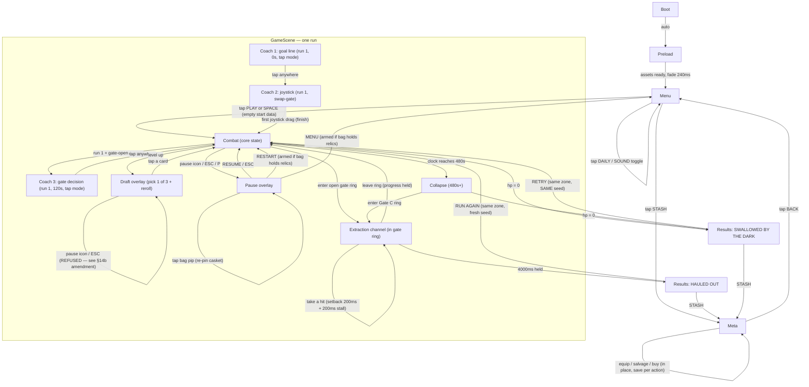

# Duskhaul

One-sentence pitch: you carve through an escalating horde of grimdark horrors
with auto-firing cursed weapons, stuffing your bag with relics and shards, and
must choose one of three timed extraction gates to escape with the haul — die,
and everything you carry (minus the casket) rots where you fell.

- Slug: `2026-08-29-duskhaul`
- Original pitch: `Let's create a new game hybrid between survivor genre like vampire survivors and extraction shooter. Art style: grimdark fantasy, dirty look, pixel art, good animations, no procedural art except for UI. Progression should happen in-between runs and inside run the goal is to loot as much as possible and extract through one of the extraction points. Multiple zone styles, for example (but not limited to) — castles, outlands, desert, winter mountains, etc. Make game fun and exciting to play like Escape from Duckov.`
- English prompt: `A hybrid of a Vampire Survivors-style horde survivor and an extraction shooter: fight through swarming horrors, loot as much as you can carry, and escape through an extraction gate before you die. Grimdark fantasy, dirty pixel-art look, meta progression between runs, and multiple zones — castles, outlands, desert, winter mountains.`
- Family: `A` real-time arena
- Subgenre: survivor-like with extraction-run resolution (playbook §1 core loop + §11 banking tension)
- Session shape: 480s run frame; the run ends ONLY by extraction or death; past 480s the Collapse makes death inevitable within ~60s
- Director: `RunDirector` (`core/run.ts`, implements `SessionDirector` from `core/session.ts`)
- Input profile: `joystick` (drag/axis move, auto-attack) + tap for cards/overlays
- Camera: `follow-arena`
- Meta shape: `shop` (stash + gear slots + permanent upgrade tree, funded only by extracted loot)
- Slice: `src/slices/arena/`
- Frame: portrait 720x1280, SAFE top 140 / bottom 220 / side 40
- Built from: `template/` (Phaser 4 + Vite + TS)
- Peak entity budget: 300 live sprites at 60fps (Climax phase near Gate C)

## 1. Fantasy, tone, references

You are the Duskhauler — a grave-robbing revenant who dives into cursed
provinces after nightfall to strip them of relics before the dark swallows the
land (and you) whole. The register is grimdark and dirty: rusted iron, wet
stone, guttering torches, bone-mud, a world already lost that you are merely
looting. Feel reference: `Vampire Survivors` (movement-only skill expression,
screen-filling power fantasy). Systems reference: `Escape from Duckov`
(raid → loot → extract → stash → upgrade → raid, with a secure-slot mercy
valve). Deliberate difference: where survivors end on a timer or boss, Duskhaul
NEVER hands you the ending — every run resolves only through a gate you chose
to walk to or a death you failed to outrun, so greed itself is the difficulty
dial.

**Naming lexicon:** `dusk, haul, grave, gloam, wretch, husk, rot, bone, ash,
thorn, dirge, pyre, shroud, marrow, rust, widow, sorrow, bleak, dread, gilt`.
Every named entity in §5 draws from this set.

## 1b. Genre dossier (market & mechanics research — live pass, 2026-08-29)

**References** (4):

| Title | Why it is the benchmark | What we take / reject |
| --- | --- | --- |
| Vampire Survivors | The survivor-genre king: 6 weapon slots, evolutions via maxed weapon + catalyst + boss chest, movement-only input | Take: auto-attack kit, level-up pick-1-of-3, evolution as the mid-run power spike. Reject: 30-min runs (browser scope is 480s) and the 6+6 slot economy (compressed to **3** weapon slots — AMENDED from 4 on measurement, §7 `weapon.slots`) |
| Escape from Duckov | The fun bar named in the pitch; single-player extraction loop with stash, base upgrades, and dog-bag insurance | Take: raid→stash→upgrade cycle, secure-slot insurance ("casket"), lose-carried-loot-on-death. Reject: manual aiming/ammo economy (survivor auto-fire replaces it), base building (out of browser scope) |
| Halls of Torment | Proof the survivor loop and per-run item extraction fuse: gear found in-run must be sent up the Well (1 use/run) to keep it | Take: relics-as-extractable-gear, limited banking capacity as the tension source. Reject: quest-gated unlock of the mechanic (Duskhaul's gates work from run 1) |
| Escape from Tarkov / Dark and Darker | Extraction-genre conventions: guaranteed vs conditional extracts, extraction channel timers, portals opening on a schedule, shrinking endgame | Take: multiple gates with open/close windows, hold-to-extract channel, late-run collapse pressure. Reject: PvP, netcode, ammo/insurance economy in currency |

**Staples checklist** (11 rows; every `adopt`/`adapt` row reappears in §5 and §16):

| Staple | Reference implementation | This game |
| --- | --- | --- |
| Auto-attack weapon kit + level-up draft | VS: 6 weapons, XP orbs, pick-1-of-3 per level | adapt — **3** weapon slots (AMENDED from 4 on measurement, §7 `weapon.slots`), 6 weapons, pick-1-of-3 with 1 free reroll (§5.3) |
| Weapon evolution matrix | VS: max weapon + passive catalyst + boss chest; 20MTD: pick at level 20 | adapt — 20MTD's simpler rule: weapon at max rank (**4**, AMENDED from 5 on measurement, §7 `weapon.maxRank`) + the tagged stat card owned → next draft offers the evolution (§5.3 evolution table) |
| Elite/boss taxonomy with telegraphs | VS/Halls: timed elites, boss at run end | adopt — elites at 150s/270s/390s, the Gate Warden at 420s guarding Gate C (§5.2, §5.4) |
| Loot rarity tiers + drop tables | Tarkov: location-tier loot tables; Duckov: value-density looting | adopt — 4 relic tiers (Tarnished/Burnished/Gilded/Dread), zone-biased drop tables (§5.5, §5.7) |
| Bag capacity pressure | Duckov encumbrance; Tarkov grid inventory | adapt — 8 relic slots (shards weightless); overflow forces drop-lowest choice; +2/stack meta (§9) |
| Secure container / insurance | Duckov dog bag; Tarkov secure container | adapt — Gravekeeper's Casket: 1 pinned relic survives death, +1 slot meta upgrade (§5.6, §10) |
| Multiple extraction points, open/close schedule | Tarkov: guaranteed + conditional extracts; DaD: portals spawn over time | adopt — 3 gates per zone: Early 120-210s, Mid 240-360s, Last opens 420s (§2A, §5.7) |
| Hold-to-extract channel, interruptible | Tarkov: extract timer in zone; playbook §11 `channelMs` | adopt — 4000ms channel, world-space progress ring; hits apply a 200ms setback + 200ms stall and a contested accrual rate, never a reset (§2A, §7, §18.24) |
| Death penalty: lose carried loot | Duckov/Tarkov: full carried loss, gear fear | adapt — lose carried shards + relics except casket; equipped (banked) gear is never lost — Duckov-fun over Tarkov-punishment (§2A, §18) |
| Stash + gear loadout meta | Duckov stash + upgrades; Halls Wellkeeper purchase | adopt — stash holds banked relics; 3 gear slots equip them as permanent run modifiers; shard-funded upgrade tree (§10) |
| Closing endgame pressure (no idle overtime) | DaD shrinking play area; Tarkov raid timer MIA penalty | adopt — the Collapse at 480s: a Gate-C-centred dusk-fire ring that closes on the player (22→90 px/s), a 10→60 hp/s fire ramp, elite injection every 6s, and unbounded threat growth (§2A, §18.25) |
| Zone/map variety with exclusive spawns | Tarkov maps with distinct loot/threat profiles | adopt — 4 zones, each with 2 exclusive enemies, a hazard, and a loot bias (§5.7) |

**Numbers table** (browser-scaled):

| Number | Value here | Source signal |
| --- | --- | --- |
| Run length | 480s frame + ≤60s Collapse | VS 30 min / Brotato 25 min compressed to family A's 480s reference |
| Weapon slots | **3** | VS 6, scaled to a 480s draft cadence (~13 picks); AMENDED from 4 on measurement — see §7 `weapon.slots` |
| Weapon max rank | **4** (3 boosts) | 20MTD-style max-rank evolution gate; AMENDED from 5 on measurement — see §7 `weapon.maxRank` |
| Weapons at launch | 6 (+6 evolutions) | 20MTD's 13, halved for browser scope |
| Upgrade card pool | 26 | VS-style pool ≥4x the 3 choices offered (§5.3) |
| Enemy roster | 12 shared + 8 zone-exclusive + 3 elites + 1 Warden (4 zone skins) | VS launch breadth scaled; playbook floor 5 |
| Extraction gates per zone | 3 | Tarkov 4-7 per map, scaled to one arena |
| Extraction channel | 4000ms | Tarkov few-seconds-to-minutes band; playbook §11 default |
| Relic tiers | 4 | Tarkov/DaD rarity convention; playbook §11 loot tiers |
| Bag capacity | 8 relic slots | Duckov encumbrance pressure, binding by mid-run (§6 worked math) |
| Secure slots | 1 (max 2 via meta) | Duckov dog bag / Tarkov secure container |
| Zones at launch | 4 | pitch requirement (castle, outlands, desert, winter mountains) |

**Differentiation:** the run has no scripted ending. Survivors resolve on a
timer or boss; extraction shooters resolve on a walk to a door. Duskhaul makes
the door schedule the difficulty curve: leaving at the Early Gate is trivial
and poor, the Last Gate is guarded by the Warden and shadowed by the Collapse.
Greed — not a director script — decides how hard the run gets, and the game
stays fun because every gate window is a real, priced decision the HUD makes
legible (gate compass + countdown chips).

**Derived content floors** (`max(playbook minimum, dossier floor)`):
enemies **12** shared (+8 zone-exclusive, +3 elites, +1 Warden), weapons **6**,
upgrade cards **26** total (≥20 non-evolution), relic defs **16**, meta
upgrades **12**, zones **4**, extraction gates **3 per zone**, waves **18**
timeline entries.

## 2. Session architecture — 2A Timed run beat sheet (family A)

`RunDirector` drives `WaveSpec[]` + `RunPhase[]`; the gate schedule and
Collapse are scripted `EventSpec[]` entries the director emits via `onEvent`.

| Phase | Window | Threat | Player power | Player experience |
| --- | --- | --- | --- | --- |
| Grace | 0-30s | x1.0 — 1 archetype, sparse | 1 starting weapon | learn move + auto-fire, first shards, first shard cache at 30s |
| Early | 30-120s | x1.3 — 2-3 archetypes | 2-3 upgrades | **first relic at 35s**, then one per 26s; Gate A's compass chip lights at 60s; Gate A opens 120s |
| Mid | 120-240s | x1.7 — +elite at 150s | 4-6 upgrades | Gate A closes 210s: first real leave-or-loot decision. Bag binds (8/8) at ~217s |
| Late | 240-360s | x2.3 — +elite at 270s, density climbs | 7-9 upgrades, first evolution | Mid Gate open 240-360s; Dread Shrine unlocks 300s; **composition ramp from 285s** |
| Climax | 360-480s | x3.2 — +elite at 390s, Warden at 420s | 10-13 upgrades | Last Gate opens 420s under the Warden's guard |
| Collapse | 480s+ | x3.2 + 0.4 per 10s, uncapped | full build | dusk-fire ring closes on Gate C; elite injection every 6s; extract or die |

**Cold-open rule (the greybox's first 119s had no extraction-layer event at
all; see §18.28):** the extraction layer must be legible before it matters.
First relic at `TUNING.loot.firstRelicS` 35s; first shard cache at 30s
(`TUNING.loot.cacheEveryS`); and the gate compass previews a gate
`TUNING.gate.previewS` **60s** ahead (was 30s), so Gate A's "OPENS 1:00" chip is
on screen from 60s. Payoff cadence from t=30s onward is then ≤30s, inside §13's
band, instead of a 120s dead open.

**Density-saturation rule (the live pool pegs `maxAlive` 220 from t=283s and
the picture then stops changing for 226s; see §18.30):** from
`TUNING.wave.compositionFromS` 285s, escalation switches from COUNT to
COMPOSITION. Every `TUNING.wave.eliteSwapEveryS` 20s the next scheduled trash
spawn is **upgraded to an elite instead** (it consumes that spawn's budget, so
the live count is unchanged and no cull API is needed), up to
`TUNING.wave.eliteShareMax` 0.25 of the live pool — 285s → 480s = 9 upgrades,
so ~9 elites among 220 by the Warden beat. At 480s the Collapse takes over the
same mechanism at a 6s cadence with no share ceiling
(`TUNING.collapse.eliteEveryS`, `collapse.stopTrashDrip`). One design, two
cadences — it fixes the flat minute-5-to-8.5 stretch and the invisible Collapse
with the same lever, and it costs no spawn-cap headroom.

**Gate schedule (all zones, positions per §5.7):**

| Gate | Opens | Closes | Guard | Expected haul on leave |
| --- | --- | --- | --- | --- |
| Gate A — Wicket of Ash (near spawn) | 120s | 210s | none | ~90-140 shards, 1-2 relics |
| Gate B — Dirge Door (mid arena) | 240s | 360s | elite pack spawns at 250s within 300px | ~260-380 shards, 3-5 relics |
| Gate C — Bleak Arch (far corner) | 420s | never (Collapse instead) | the Gate Warden (420s) | ~500-700 shards, 6-8 relics incl. Dread odds |

**Extraction (channel rule v2 — the greybox rule was unplayable; see §18.24):**
stand inside the gate ring (`TUNING.gate.radius` 120px) → the channel accrues
toward `TUNING.extract.channelMs` (4000ms). Leaving the ring pauses accrual and
holds the value. A hit does **not** reset progress. Instead, per hit:

1. subtract `TUNING.extract.hitSetbackMs` (200ms) of **accrued** channel time,
   clamped at 0 — a flat rollback, never a reset and never a percentage of
   current progress (a percentage decays to a plateau, which is exactly the
   measured failure);
2. freeze accrual for `TUNING.extract.hitStallMs` (200ms).

Accrual rate while channelling is `1.0` when no enemy is inside the ring, and
otherwise `max(TUNING.extract.minRate, TUNING.extract.contestedRate -
TUNING.extract.eliteContestPenalty * elitesInRing)` = `max(0.55, 0.70 - 0.10 *
n)`. No new enemy spawns within `TUNING.extract.suppressRadius` (400px) of an
**open** gate — existing enemies still path in freely, so the intended play
pattern is *clear the ring, then hold it*, not *out-tank an infinite faucet*.

**Completability invariant (law; the integrator must never break it):**
`(TUNING.player.invulnMs - TUNING.extract.hitStallMs) * TUNING.extract.minRate
> TUNING.extract.hitSetbackMs`. At `invulnMs` 700: `500 * 0.55 = 275 > 200`.
Progress is therefore strictly monotone-positive under **any** contact — the
channel is always finishable, only ever slower.

Worked worst cases (hits arrive at most one per `invulnMs` = 700ms):

| Situation | Rate | Net progress per 700ms cycle | Time to extract |
| --- | --- | --- | --- |
| Ring clear, no hits | 1.00 | — | **4.0s** |
| Trash in ring, unbroken contact | 0.70 | `500*0.70 - 200 = +150ms` | **18.7s** |
| Gate C, Warden in ring | 0.60 | `500*0.60 - 200 = +100ms` | **28.0s** |
| Warden + an elite (rate floor) | 0.55 | `500*0.55 - 200 = +75ms` | **37.3s** |

Gate C under the Warden is therefore hard but possible: 28s of unbroken boss
contact is not a realistic ask, so the real play is stagger/kite the Warden into
2-4s clear windows and finish in 6-10s. Channel completion ends the run with
`outcome {won: true, reason: 'extracted'}`.

**The Collapse (480s+) — ring rule v2 (the greybox ring never reached the
player; see §18.25):** at 480s a dusk-fire ring ignites **centred on Gate C**
(`TUNING.collapse.centerGate` `'c'`) with
`start = clamp(dist(player, gateC) + TUNING.collapse.startPad, minStart,
maxStart)` = `clamp(d + 240, 700, 1200)` — derived from where the player
actually is, never from a corner-to-corner arena span. It then closes:
`radius(t) = clamp(start - (ringSpeedPxPerS*t + ringAccel*t²/2), minRadius,
start)` with `ringSpeedPxPerS` 22 px/s, `ringAccel` 0.8 px/s², speed capped at
`ringSpeedMax` 90 px/s, and it stops and **holds** at `minRadius` 140px — just
outside the 120px gate ring, so Gate C stays standable and extraction stays
possible to the last frame. From a typical start of 1000px the ring is fully
closed at ~26s; from `maxStart` 1200px at ~31s.

Standing in the fire deals `TUNING.collapse.fireDps` 10 hp/s, bypassing
i-frames, ramping `+fireDpsStep` 4 hp/s every 10s to `fireDpsMax` 60.

**Overtime escalation is deliberately not more spawns** — `maxAlive` is already
saturated from ~283s, so extra spawn pressure is invisible. The three visible
escalations are: (1) the ring speed ramp, (2) the fire dps ramp, (3) **elite
injection against a stopped trash faucet** — at ignition the trash drip STOPS
entirely (`TUNING.collapse.stopTrashDrip` 1; the old `spawnFloorMs` drip is
exactly what pinned `maxAlive` and made the ramp invisible), and every
`TUNING.collapse.eliteEveryS` 6s one elite spawns at the ring edge. Live count
therefore falls as the player clears trash, headroom appears, and the roster
hardens while staying under the cap. Threat multiplier still grows
`+TUNING.collapse.threatStep` 0.4 every 10s with no ceiling (the §2.5 fairness
cap is deliberately lifted here, logged in §18).

Time-to-death, idle bot at spawn (800, 800): the ring edge reaches it ~9s in,
then `0.2T² + 10T = maxHp` gives death ~13s later — **~22s past 480s**, inside
the §19 ≤90s acceptance line. A competent, built player holding the Gate C
pocket dies to the elite stack at the stated **~45-60s** of overtime. There is
no timer win: the run still ends only by Gate C extraction or death.

**Run end → meta hand-off:**
- Extracted: carried shards convert 1:1 to stash shards; carried relics land
  in the stash (equip or salvage); results screen shows haul value, kills,
  level, gate used, survival time.
- Died: carried shards and relics are lost; the casket-pinned relic survives
  into the stash; with the Rot Tithe meta upgrade 25% of carried shard value
  survives too. Results screen shows what was lost (explicit "LOST TO THE
  DARK" list — the gear-fear beat, capped at 8 rows).

## 3. Controls

| Input | Effect | Template hook |
| --- | --- | --- |
| Drag anywhere | virtual joystick; player moves at up to 270 px/s | `Joystick` (`ui/joystick.ts`), `Controls.onDrag` |
| Keyboard WASD/arrows | identical movement | `controls.axisX/axisY` in `update` |
| Tap a card | pick 1 of 3 on level-up; tap reroll chip for the free reroll | `showUpgradeCards` `onPick` |
| Tap pause icon (top-right, 88px) | pause overlay | `showPauseOverlay` |
| ESC / P | pause toggle (keyboard parity) | `Controls` key hook |
| Standing in a gate ring | extraction channel starts automatically — no extra input verb | `systems/extraction.ts` (NEW, §4) |

- No manual attack, no aim: weapons auto-fire from `StatBlock` cooldowns —
  movement is the whole skill expression.
- Joystick dead zone 12px; virtual stick zone is the bottom 300px band with no
  visible chrome; nothing else interactive lives under y=1060.
- Overlays (`cards`, pause, results) pause the whole scene via
  `director.pause()` plus scene-level tween/physics pause; the field stays
  visible dimmed to 15% under the panel.
- Banned: tilt, multi-touch, double-tap, two-thumb layouts.

## 4. Systems map

| System | Module | Responsibility | Notes |
| --- | --- | --- | --- |
| Session driver | `core/run.ts` (`RunDirector` via `core/session.ts`) | phases, wave timeline, gate/collapse `EventSpec[]`, outcome | `progress` = elapsed/480 clamped to 1 during Collapse |
| Family slice | `src/slices/arena/game.ts` | integrator scene: wiring, spawn loop, player | keep the `BEGIN/END replaceable gameplay` seam |
| Stats & modifiers | `core/stats.ts` | player + weapon `StatBlock` fed by card/gear `Modifier[]` | keys in §7 |
| Damage & health | `core/damage.ts` | `Health` (i-frames **700ms**, §7 authoritative), `rollDamage` crits, `applyDot` | Collapse fire bypasses i-frames (direct `Health` drain) |
| Extraction channel invariant | `core/damage.ts` x `systems/extraction.ts` | `player.invulnMs` is load-bearing for the channel, not just for survivability | `(invulnMs - extract.hitStallMs) * extract.minRate > extract.hitSetbackMs`. At 700: `500*0.55 = 275 > 200` and the channel is completable under continuous contact. At 400 it is `110 < 200` and the channel becomes UNCOMPLETABLE — the measured blocker, silently reintroduced. Never lower `invulnMs` without re-deriving this |
| Pooling | `core/pool.ts` + `core/spritePool.ts` | enemies (8 pools), projectiles (5), shards, relic pickups, particles | mandatory at this density |
| Broad-phase | `core/spatial.ts` | targeting + projectile overlap + pickup radius | cell size 96px |
| Zone arenas | `NEW: src/systems/zone.ts — applies a ZoneDef (backdrop art key, hazard behaviour, spawn-table bias, gate positions) to the arena at run start` | one arena per zone, no mid-run zone change | consumes `data/zones.ts` |
| Extraction | `NEW: src/systems/extraction.ts — gate state machine (closed/open/closing/spent), channel progress with interrupt-on-hit, Collapse ring` | emits `gate-open`/`gate-close`/`collapse` events | headless-safe, sim ticks it |
| Bag & banking | `NEW: src/systems/bag.ts — carried shards/relics, capacity, casket pin, drop-lowest overflow, death/extract settlement` | pure TS, no Phaser | sim ticks it |
| Loot defs | `NEW: src/data/relics.ts — RELICS table + rollRelic(rng, zone, tier bias)` | 16 relic defs, 4 tiers | |
| Zone defs | `NEW: src/data/zones.ts — ZONES table (§5.7): hazard params, exclusive spawns, loot bias, gate coords` | 4 zones | |
| Enemies | `src/data/enemies.ts` | 12 shared + 8 exclusive + elites + Warden, `scaleEnemy` | extends template archetypes |
| Weapons | `src/data/weapons.ts` | 6 weapons + 6 evolutions; patterns in `systems/combat.ts` | template ships bolt/orbit/nova/rail |
| Upgrade cards | `src/data/upgrades.ts` | 26-card pool, `rollUpgradeChoices`, evolution gating | template roller reused |
| Wave timeline | `src/data/waves.ts` | 18 entries + elite/Warden/chest/shrine events | |
| Meta save | `core/progression.ts` | shards, upgrades, unlocks (zones/gear), collections unused | schema §10 |
| Choice UI | `ui/cards.ts` | pick-1-of-3 with reroll | |
| Bars | `ui/bars.ts` | HP, XP, extraction ring fill | |
| Gate compass | `NEW: src/ui/gateCompass.ts — screen-edge arrows toward each gate with state colour + countdown chip` | ≤3 arrows, only while a gate is open/opening ≤30s | |
| Bag HUD | `NEW: src/ui/bagPips.ts — 8 relic pips + casket pip + shard counter` | top-right cluster | |
| Meta shop | `src/scenes/meta.ts` | stash (relics: equip/salvage), gear slots, upgrade tree | template shop rows extended with a stash row group |
| Zone select | `src/scenes/menu.ts` | 4 zone cards with lock state + zone brief | menu-level, not a new scene |

## 5. Entities and content tables

### 5.0 Content volume floor (family A, dossier-raised)

| Atom | Floor (gate) | Shipped |
| --- | --- | --- |
| Enemy archetypes (shared) | 12 | 12 |
| Zone-exclusive enemies | 8 (2 per zone) | 8 |
| Elites | 3 | 3 |
| Boss (Gate Warden, zone-skinned) | 1 | 1 (4 skins) |
| Weapons | 6 | 6 (+6 evolutions) |
| Upgrade cards | 20 | 26 |
| Relic defs | 16 | 16 |
| Meta upgrades | 12 | 12 |
| Zones | 4 | 4 |
| Wave timeline entries | 18 | 18 |

### 5.1 Player

| Stat | Base | Unit | Notes |
| --- | --- | --- | --- |
| `maxHp` | 100 | hp | `Health`; i-frames **700ms** (`TUNING.player.invulnMs`, §7 authoritative — an earlier 400 here was stale and breaks the §2A channel invariant) |
| `moveSpeed` | 270 | px/s | joystick max throttle |
| `damageMul` | 1.0 | multiplier | weapon damage scalar |
| `cooldownMul` | 1.0 | multiplier | lower = faster fire |
| `area` | 1.0 | multiplier | AoE radius scalar |
| `critChance` | 0.05 | 0-1 | |
| `critMul` | 2.0 | multiplier | |
| `pickupRadius` | 90 | px | shard/relic magnet |
| `bagSlots` | 8 | relic slots | +2 per Marrow Sack stack |
| `casketSlots` | 1 | secure slots | +1 with Widow's Casket |

### 5.2 Enemy roster (shared, all zones)

Behaviours map to `data/enemies.ts` archetypes; `Texture` keys are art-slot
names the game-art pass fills (`NEW` = new manifest entry). Value = shards.

| id | Flavor name | Flavor desc | Texture | Size px | Key stats | Behaviour | Value | Tint | First seen |
| --- | --- | --- | --- | --- | --- | --- | --- | --- | --- |
| husk | Grave Husk | A dried corpse that shuffles toward warm blood | NEW `enemy-husk` | 40 | hp 18, dmg 6, spd 80 | chase | 1 | none (art) | 0s |
| wretch | Gloam Wretch | A hunched scavenger that sprints in ragged bursts | NEW `enemy-wretch` | 36 | hp 12, dmg 5, spd 150 | chase (fast) | 1 | none | 30s |
| ratking | Rot Ratking | A knot of graveyard rats moving as one | NEW `enemy-ratking` | 32 | hp 8, dmg 4, spd 120 | swarm (packs of 6) | 1 | none | 45s |
| bonecaster | Bonecaster | A robed skeleton lobbing marrow darts | NEW `enemy-bonecaster` | 44 | hp 24, dmg 8, spd 60, range 320 | ranged | 3 | none | 90s |
| thornhound | Thornhound | A briar-wrapped hound that circles before lunging | NEW `enemy-thornhound` | 46 | hp 30, dmg 10, spd 130 | orbit-then-charge | 3 | none | 120s |
| paleknight | Pale Knight | Rusted plate animated by spite; slow, wide blade | NEW `enemy-paleknight` | 56 | hp 90, dmg 14, spd 55 | tank | 5 | none | 150s |
| shroudmoth | Shroudmoth | A moth of grave-silk that drifts through walls | NEW `enemy-shroudmoth` | 38 | hp 16, dmg 7, spd 100 | drift (ignores props) | 2 | none | 180s |
| pyreling | Pyreling | A candle-flame spirit that bursts on death | NEW `enemy-pyreling` | 34 | hp 14, dmg 12 (burst, r=80) | chase + death-burst | 2 | none | 210s |
| marrowworm | Marrowworm | A segmented burrower that splits when cut | NEW `enemy-marrowworm` | 48 | hp 40, dmg 9, spd 70 | split (2x half-HP) | 4 | none | 240s |
| dirgebell | Dirgebell | A floating bell that hastens nearby dead | NEW `enemy-dirgebell` | 42 | hp 35, dmg 0, aura +25% spd r=200 | healer/support aura | 5 | none | 270s |
| gildedghoul | Gilded Ghoul | A ghoul crusted in stolen gold; flees when hurt | NEW `enemy-gildedghoul` | 44 | hp 50, dmg 6, spd 160 | flee (loot piñata) | 15 + 1 relic roll | none | 200s |
| ashwraith | Ashwraith | A cinder ghost that blinks 200px every 3s | NEW `enemy-ashwraith` | 40 | hp 22, dmg 9, spd 90 | teleport-chase | 3 | none | 300s |

### 5.2b Elites and the Gate Warden

| id | Flavor name | Flavor desc | Texture | Size px | Key stats | Behaviour | Value | First seen |
| --- | --- | --- | --- | --- | --- | --- | --- |
| elite_reaper | Sorrow Reaper | A scythe-wielding elite with a telegraphed sweep | NEW `elite-reaper` | 72 | hp 6x grunt-at-phase, dmg 18 | telegraphed arc sweep (900ms windup) | 25 + relic roll (tier≥2) | 150s |
| elite_matron | Widow Matron | A bloated spider-queen trailing web slicks | NEW `elite-matron` | 80 | hp 6x, dmg 14, slick slows 40% | web zones + chase | 25 + relic roll | 270s |
| elite_herald | Dread Herald | A banner-bearer that rallies a spawn surge | NEW `elite-herald` | 68 | hp 6x, dmg 12, +50% spawn while alive | rally + chase | 25 + relic roll | 390s |
| warden | Gate Warden | The dusk's jailer; guards the Bleak Arch in every zone (4 zone skins) | NEW `boss-warden` | 120 | hp 40x grunt-at-phase, dmg 22 | 3-phase (`TUNING.boss`): volley → summon+shield → enrage ring | 120 + guaranteed Dread relic roll | 420s |

### 5.3 Weapons, upgrade cards, evolutions

**Weapons** (**3** slots; each ranks **1-4** via its boost card — both AMENDED
DOWN on measurement (4 slots → 3, rank 5 → 4); §7 `weapon.slots` /
`weapon.maxRank` are authoritative and carry the measured numbers. Retuning
back to 4 slots / rank 5 from this line re-blows the lane spread 0.40 → 0.75
and drops deep-lane extraction 45% → 20%. Template patterns in
`systems/combat.ts`, two `NEW` patterns):

| id | Flavor name | Flavor desc | Pattern | Base dmg | Cooldown ms | Evolution (at rank **4** = max rank, AMENDED from 5 on measurement, + tagged stat card owned) |
| --- | --- | --- | --- | --- | --- | --- |
| bolt | Rustspike | A nail of grave-iron flung at the nearest horror | template `bolt` | 8 | 900 | **Coffin Nail** (pierce 3, dmg 20) — needs a Might card |
| orbit | Bone Halo | Femurs circling the hauler in a slow wheel | template `orbit` | 6/tick | continuous | **Marrow Wheel** (2x radius, +2 bones) — needs an Area card |
| nova | Ash Ring | A burst of cinders in all directions | template `nova` | 10 | 1600 | **Pyre Shroud** (leaves a 3s burn field, 4 dps) — needs a Haste card |
| rail | Widow's Lance | A piercing beam through the thickest column of dead | template `rail` | 24 | 2200 | **Sorrow Piercer** (dmg 60, +30% crit) — needs a Crit card |
| scythe | Gloam Scythe | A sweeping arc that reaps everything ahead | NEW pattern `arc` (140° frontal sweep, r=140) | 14 | 1200 | **Dirge Reaper** (360° sweep, +50% dmg) — needs a Might card |
| hex | Thorn Hex | A curse that leaps between up to 4 horrors | NEW pattern `chain` (4 jumps, 200px) | 9 | 1400 | **Rot Chorus** (6 jumps, applies 3s DoT 3 dps) — needs a Greed card |

**Upgrade card pool** (26 = 6 weapon-unlocks + 6 weapon-boosts + 6 evolutions
+ 8 stat/effect cards; pick 1 of 3 per level-up, 1 free reroll per draft,
rarity weights common 60 / rare 30 / epic 10; evolutions surface only when
their gate condition holds — no dead drafts, §8):

| id | Flavor name | Flavor desc | Rarity | Effect | Stack limit | Synergy tag |
| --- | --- | --- | --- | --- | --- | --- |
| w_unlock_* (6) | weapon names above | adds the weapon at rank 1 | common | new weapon | **3** slots (AMENDED from 4 on measurement, §7 `weapon.slots`) | per-weapon |
| w_boost_* (6) | Whetted (weapon name) pattern, e.g. Whetted Rustspike | +1 rank: +25% dmg or +1 projectile per rank | common | rank +1 | **3** (= `weapons.maxBoosts`; AMENDED from 4 on measurement, §7 `weapon.maxRank`) | per-weapon |
| w_evo_* (6) | evolution names above | replaces the rank-**4** (max-rank) weapon — AMENDED from rank-5 on measurement, §7 | epic | evolution | 1 | per-weapon |
| stat_might | Grave Might | Marrow-deep strength for every blow | common | `damageMul +12%` | 5 | offense |
| stat_haste | Dirge Tempo | The dead march faster to your drum | common | `cooldownMul -8%` | 5 | offense |
| stat_area | Ashen Reach | Your curses spread like windblown ash | common | `area +15%` | 5 | area |
| stat_crit | Dread Edge | Sometimes the blade remembers hatred | rare | `critChance +6%` | 4 | burst |
| stat_vital | Husk Hide | Leathered skin that forgets pain | common | `maxHp +20` | 4 | sustain |
| stat_swift | Gloam Stride | Feet that never quite touch the mud | rare | `moveSpeed +8%` | 3 | mobility |
| stat_greed | Gilt Hunger | Shards leap to a hungrier hand | rare | `pickupRadius +30px`, shards +10% | 3 | loot |
| fx_lastgasp | Last Gasp | Once per run, refuse the grave | epic | revive at 30% HP, 2s i-frames | 1 | sustain (`effect` card via `core/effects.ts`) |

The literal card ids for weapon rows are `w_unlock_bolt` … `w_evo_hex`
(enumerated in `data/upgrades.ts`); each carries the flavor name shown in the
weapons table.

### 5.4 Wave timeline (`data/waves.ts`, 18 entries + events)

| at (s) | Spawn | Count / everyMs | Label |
| --- | --- | --- | --- |
| 0 | husk | 4, everyMs 1400 | grace trickle |
| 30 | husk+wretch | everyMs 1200 | first pressure |
| 45 | ratking pack | 6-pack every 20s | swarm teach |
| 90 | bonecaster x2 | +ranged lane | ranged teach |
| 120 | wretch ring | ring of 12 | Gate A opens (event) |
| 150 | elite_reaper | 1 | elite 1 (event) |
| 180 | shroudmoth | everyMs 900 | prop-ignoring pressure |
| 200 | gildedghoul | 1 per 60s | loot piñata |
| 210 | thornhound x4 | arc | Gate A closes (event) |
| 240 | paleknight x3 + line | everyMs 800 | Gate B opens (event) |
| 250 | elite pack | reaper + 8 husks at Gate B | gate guard (event) |
| 270 | elite_matron | 1 | elite 2 (event) |
| 300 | marrowworm x4 | cluster | Dread Shrine unlocks (event) |
| 330 | pyreling | everyMs 700 | burst pressure |
| 360 | dirgebell x2 + horde | everyMs 500 | Gate B closes (event) |
| 390 | elite_herald | 1 | elite 3 (event) |
| 420 | warden | 1 at Gate C | Warden + Gate C opens (event) |
| 480 | all archetypes | everyMs 100 floor | Collapse (event) |

Chest events (guaranteed relic roll, tier bias +1): 165s and 345s. Dread
Shrine (300s): a marked location holding one guaranteed Gilded-or-Dread relic
inside a 2.5x density pocket (radius 260px) — the vault analogue.

### 5.5 Relic table (`data/relics.ts`, 16 defs)

Relics are both loot value and gear: banked relics can be equipped (3 gear
slots: Blade charm / Shroud / Trinket) or salvaged for shards. `Gear effect`
applies as a permanent `Modifier` while equipped.

| id | Flavor name | Flavor desc | Tier | Salvage | Gear slot | Gear effect |
| --- | --- | --- | --- | --- | --- | --- |
| r_toothcharm | Rat-Tooth Charm | A pauper's luck, strung on gut | 1 Tarnished | 10 | Trinket | shards +5% |
| r_rustbuckle | Rust Buckle | A soldier's belt, long outlived | 1 Tarnished | 10 | Shroud | maxHp +5 |
| r_waxseal | Grave Waxseal | A parish seal pressed in black wax | 1 Tarnished | 10 | Blade | damageMul +3% |
| r_bonedice | Bone Dice | Carved from a cheater's knuckles | 1 Tarnished | 10 | Trinket | critChance +2% |
| r_thornring | Thornband | An iron ring that bites its wearer | 2 Burnished | 30 | Blade | damageMul +6% |
| r_ashlocket | Ash Locket | Holds a pinch of someone loved | 2 Burnished | 30 | Shroud | maxHp +12 |
| r_gloamboot | Gloam Spur | A rider's spur that hums at dusk | 2 Burnished | 30 | Trinket | moveSpeed +5% |
| r_dirgepipe | Dirge Pipe | Plays itself when the dead draw near | 2 Burnished | 30 | Trinket | pickupRadius +25px |
| r_marrowidol | Marrow Idol | A fetish of boiled bone and wire | 3 Gilded | 80 | Blade | cooldownMul -6% |
| r_widowveil | Widow's Veil | Grief woven fine enough to stop teeth | 3 Gilded | 80 | Shroud | maxHp +20, i-frames +100ms |
| r_giltskull | Gilt Skull | A tax collector, repurposed | 3 Gilded | 80 | Trinket | shards +15% |
| r_pyreheart | Pyreheart | Still warm; nobody asks whose | 3 Gilded | 80 | Blade | area +10% |
| r_dreadcrown | Dread Crown | The Warden's circlet of black iron | 4 Dread | 200 | Blade | damageMul +12%, critMul +0.3 |
| r_sorrowplate | Sorrowplate | Armor quenched in a widow's well | 4 Dread | 200 | Shroud | maxHp +30, contact dmg -20% |
| r_gravekey | Gravekey | Opens doors the living never should | 4 Dread | 200 | Trinket | extraction channel -800ms |
| r_duskmirror | Duskmirror | Shows the arena; the arena looks back | 4 Dread | 200 | Trinket | gate windows +20s |

Drop rule: `rollRelic(rng, zone, bias)` — base tier weights 60/27/10/3
(t1/t2/t3/t4), shifted by source (+1 tier bias from chests/elites, +2 from the
Shrine/Warden) and by zone bias (§5.7). Duplicates salvage automatically at
pickup for their salvage value if the same relic is already banked and equipped.

### 5.6 Loot atoms and banking rules

| Atom | Carried as | On extract | On death |
| --- | --- | --- | --- |
| Shards (currency) | weightless counter | bank 1:1 to stash | lost (25% kept with Rot Tithe meta) |
| Relics | 8 bag slots | all land in stash | lost, except a manually pinned casket relic |
| Casket pin | 1 secure slot, **starts EMPTY — manual pin only** (tap a bag pip on the pause overlay to pin; tap again to unpin, tap another to move the pin) | banked | banked |
| XP / levels / weapons | run-scoped | discarded | discarded |
| Shard caches | picked up by walking over them | banked with shards | lost with shards |

**Casket rule v2 (the auto-pin inverted its own fear; see §18.26):** the casket
is never filled automatically. If the player never pins, **nothing survives
death** — that is the correct default, and it is what makes pinning a decision
about what you value rather than a free insurance policy on your best item. The
pause-overlay bag row is the pinning surface (§14.5); the HUD bag pips mark the
pinned slot. Death with an empty casket shows the LOST list only (§14.5 edge
cases, already specified).

Overflow: picking a 9th relic auto-drops the lowest-tier carried relic
(floating toast `DROPPED: (relic name)` — the name renders from the relic
table, and the drop persists on the ground `TUNING.bag.dropLingerS` 10s for
regret-pickup). The casket-pinned relic is never the auto-drop.

**Relic drip v2 (capacity must bind inside the Gate B window; see §18.27):**
first relic at `TUNING.loot.firstRelicS` **35s**, then one per
`TUNING.loot.relicDripS` **26s** (was 55s), plus `TUNING.loot.eliteRelics`
**2** relics from every elite kill, `TUNING.loot.bossRelics` **3** from the Gate
Warden, and the 4 event guarantees. Relic COUNT is TUNING's alone — the elite
rows' `params.relicRolls` is superseded and deleted, while
`params.relicTierBias` stays, because bias is per-source (elite +1, Warden +2)
and count is not. Worked: by 300s
a deep run has seen `1 + (300-35)/26 ≈ 11` drip relics plus ~4 from the two
elites at 150s/270s ≈ **15 relic opportunities against 8 slots**, so the first
overflow decision lands at roughly `35 + 7*26 = 217s` — inside the Gate B
window (240-360s), where the leave-or-loot decision actually is. This is what
satisfies the §19 gate (capacity binds before 400s in ≥60% of deep runs), which
the old 55s drip could not: it first filled the bag at 497s of a 509s run.

**Shard caches (`TUNING.loot.cacheEveryS` 30):** every 30s a shard cache worth
`TUNING.loot.cacheValue` 18 shards spawns `TUNING.loot.cacheMinDist` 500 to
`TUNING.loot.cacheMaxDist` 700 px from the player and lingers
`TUNING.loot.cacheLingerS` 45s. It is collected by walking over it — the one
income source that is not kill-driven (§6 branch math).

### 5.7 Zone table (`data/zones.ts`)

Threat base multiplies every phase multiplier; loot bias shifts relic tier
weights; gates give (x, y) in a 1600x1600 arena, spawn at (800, 800).

| id | Flavor name | Unlock | Threat base | Hazard | Exclusive enemies | Loot bias | Gate A / B / C |
| --- | --- | --- | --- | --- | --- | --- | --- |
| castle | Bleakspire Keep | start | x1.0 | Cursed braziers: 6 fixed points pulse 8 dmg in r=110 every 5s (2s telegraph glow) | Chapel Ghast (hp 28, dmg 9, spd 95, lunges from prop shadows); Rust Gargoyle (hp 60, dmg 12, perches then dives every 6s) | +5% t2 | (420,300) / (1200,900) / (1450,1450) |
| outlands | Ashen Outlands | 300 shards | x1.15 | Bonestorm wind: every 45s a 6s gust pushes 90 px/s left-to-right and spawns 3 drifting ash-dot zones (3 dps) | Carrion Kite (hp 20, dmg 8, spd 170, swoops); Sloughed Giant (hp 140, dmg 16, spd 45, ground-slam r=130) | +8% t2, +4% t3 | (350,1250) / (900,400) / (1500,200) |
| desert | Sorrow Dunes | 800 shards | x1.3 | Sinking sand: 5 shifting pits (r=140) slow 35% and block projectiles' first 40px; midday scorch 380-420s: 2 hp/s outside shade props | Dune Leech (hp 26, dmg 10, burrows, surfaces at player every 7s); Gilt Scarab (hp 45, dmg 6, spd 140, drops 3 shards per hit taken) | +10% t3 | (500,500) / (1300,1300) / (200,1500) |
| winter | Widow's Crown | 1600 shards | x1.5 | Freezing gale: 30% slow outside torch radii (5 torches); ice sheets (4 patches, r=160) make movement slide with 0.92 friction | Frost Widow (hp 70, dmg 14, lays slowing web r=120); Hollow Yeti (hp 180, dmg 20, spd 60, enrages below 30% hp: spd 110) | +6% t3, +6% t4 | (800,250) / (250,800) / (1500,1500) |

Zone-exclusive enemies enter the local spawn table from 60s (light) and 240s
(heavy) and use the shared behaviour verbs (chase/orbit/charge/ranged/tank)
with the stats above. Each zone is a separate run arena with its own backdrop
art (§11); no mid-run zone travel.

### 5.8 Claimability ledger

One row per authored payout: where the number lives, the PLAYER ACTION that
claims it, the named measurement proving that action is reachable, and the file
that reads it. A payout with no proof is not shipped dark — it is cut and
logged in §17 with the proof needed to reinstate it. Sim quotes are from
`npm run sim -- --runs 20 --seed balance` (120 runs over the three §8 lanes),
2026-08-30; cert quotes from `cert-report.json`.

| Payout (authored key / id) | Where defined | Claim condition (a player action) | Reachability proof | Read by |
| --- | --- | --- | --- | --- |
| Kill shards (`value` per archetype) | `data/enemies.ts` §5.2/5.2b | kill an enemy, then walk inside `player.pickupRadius` of the drop | sim: "every one of the 16 spawned archetypes is engaged by the ceiling bot in a median run"; "avoidant income floor: courier shards/s Early 2.47 / Mid 1.84 (must clear 1.0/s)" | `slices/arena/game.ts:933,980` → `systems/bag.ts addShards`; `ui/bagPips.ts` |
| XP orbs (`xp.orbValue` 3, `curveBase` 12, `curveGrowth` 1.28) | `config.ts` §7 | walk over an orb; each level opens a draft | sim: "median firstUpgradeS = 10.5 (<= 50)" | `systems/combat.ts:888` → `objects/player.ts:97 addXp`; draft in `slices/arena/game.ts` |
| Shard caches (`loot.cacheEveryS` 30, `cacheValue` 18, `cacheMinDist/MaxDist`, `cacheLingerS` 45) | `config.ts` §7 | walk onto the cache marker before `cacheLingerS` expires | sim: "avoidant income floor: courier shards/s Early 2.47 / Mid 1.84" — the non-kill income source is the gate that proves it | `slices/arena/game.ts:1294,1328-1329` |
| Ambient relic drip (`loot.firstRelicS` 35, `relicDripS` 26) | `config.ts` §7 | walk over the relic pickup; accept the drop-lowest swap once the bag is full | sim: "deep lane hit bag capacity before 400s in 100% of runs (>= 60%)" | `slices/arena/game.ts:1334-1346` |
| Elite / Warden relics (`loot.eliteRelics` 2, `eliteTierBias`, `bossTierBias`) | `config.ts` §7 | kill an elite (150/270/390s) or the Warden (420s), then collect | sim: "live enemies at the 420s Warden beat: max 98, median 42"; "every one of the 16 spawned archetypes is engaged" | `slices/arena/game.ts:937-938 dropRelics` |
| Per-enemy relic rolls (`params.relicRolls`, `relicTierBias` — Gilded Ghoul) | `data/enemies.ts:248` | kill the Gilded Ghoul (spawns 1 per 60s from 200s), then collect | sim: same archetype-engagement gate — the ghoul is one of the 16 | `slices/arena/game.ts:941` |
| Timed chests (`chest.at` 165/345, `chest.relics`, `chest.tierBias`) | `config.ts` §7, `data/waves.ts:254-255` | walk into the chest marker when the timeline beat fires | sim: "every run ended by extraction or death, never by a clock: 120/120" — both beats sit inside the measured run span | `slices/arena/game.ts:1155` |
| Dread Shrine relic (`shrine.atS` 300, `densityMul` 2.5, `radiusPx`) | `config.ts` §7 | from 300s, walk into the marked pocket and survive its density bubble | sim: "late-game pressure rises: damage taken/s Late 0.13 -> Climax 1.71 across the 19 runs that spanned both bands" — 19 runs were alive inside the shrine window | `slices/arena/game.ts:1218-1240 tickShrine` |
| Extraction haul (banking on `extracted`) | `systems/bag.ts settle`, §5.6 | hold a gate ring for the effective `channelMs` | sim: "all 12 zone/gate pairs reachable from spawn at base moveSpeed inside their window"; "clean channel at Gate A completed in 4.0s"; "haul is monotone in greed: A 263 < B 561 < C 1610 shards" | `slices/arena/game.ts:1750`; `scenes/gameover.ts` |
| Casket pin (`bag.casketSlots` 1, `bag.autoPinHighest` false) | `config.ts` §7, §5.6 | tap a bag pip on the pause overlay to pin (tap again to unpin) | §14b tap-depth: pause is 1 tap from combat; sim: "death costs relics: 100% of relic-carrying deaths lost something (>= 80%)" — the pin is the only exception path | `systems/bag.ts pinCasket`; `ui/bagPips.ts:196`; pause overlay §14.5 |
| Rot Tithe death-keep (`meta.deathKeepPct` 25, `PERKS.tithePct`) | `config.ts` §7, `core/progression.ts:476` | buy `m_tithe` (flat 300) in the shop, then die carrying shards | resolves at run start into `RunLoadout.deathKeepPct` and is passed to settlement on the death path | `core/progression.ts:524-527` → `slices/arena/game.ts:1750 bag.settle(…, loadout.deathKeepPct)` |
| Relic salvage (`salvage` per tier, §5.5) | `data/relics.ts salvageFor` | tap SALVAGE on a stash row in Meta (Dread arms first) | §14b tap-depth: run end → STASH is 1 tap; every banked relic renders a salvage button | `core/progression.ts salvageFromStash`; `scenes/meta.ts:628` |
| Equipped gear effects (3 gear slots, 16 relic `gear` blocks + 3 rider kinds) | `data/relics.ts`, §5.5 | tap a GEAR cell in Meta to cycle a banked relic into the slot | every `gear` entry is pushed as a `gear:<id>` modifier and the 3 rider kinds land in named `RunLoadout` fields; boot-time `validateUpgradeStats` asserts each key is in the frozen §16.1 union | `core/progression.ts:538-561`; `slices/arena/game.ts:514-534` |
| 7 stat meta rows (`m_vitality`, `m_haste`, `m_might`, `m_greed`, `m_magnet`, `m_bag`, `m_extract`) | `data/upgrades.ts:400-468 META_UPGRADES`, §10 | buy a level in the shop UPGRADES group | `metaModifiers()` walks `META_UPGRADES`; sim: "every upgrade-card modifier targets a stat the run model reads"; `bagSlots` and `channelMs` are consumed as deltas, not dropped | `core/progression.ts:451-459`; `slices/arena/game.ts:521,533-534` |
| 5 perk meta rows (`m_reroll`, `m_casket`, `m_tithe`, `m_ward`, `m_revive`) | `core/progression.ts:470-481 PERKS`, §10 | buy the row in the shop UPGRADES group | each perk has exactly one `RunLoadout` field and one consumer: rerolls → draft, casket slots → `resolveBagCapacity`, keep% → settlement, gate window → `game.ts:530`, revive → `game.ts:466-470` | `core/progression.ts:516-533`; the five sites above |
| `fx_lastgasp` / effect id `last-gasp` (`effects.lastGasp` 0.3 / 2000ms) | `data/upgrades.ts:194-204`, `config.ts:272` | pick the epic Last Gasp card in a draft, then take a lethal blow | the hook IS registered (`EFFECT_HOOKS['last-gasp']`) and both damage routes consult the same charge — `Health.apply` and the hazard/Collapse drains that bypass i-frames | `core/effects.ts:64-70`; applied `slices/arena/game.ts:1535`; consumed `systems/combat.ts:960-969 consumeLastGasp` |
| 6 weapon evolutions (`w_evo_*`) | `data/weapons.ts`, `data/upgrades.ts`, §5.3 | take all 3 boosts on the weapon and its tagged stat card, then pick the evolution card | `evolutionEligible` is derived from `taken` alone so scene and sim agree; `sim/kits/content.selftest.ts:411-420` asserts the gate in both directions; sim: widows-lance lane extracts 50% with the evolution in its plan | `data/upgrades.ts:233-243`; `systems/combat.ts:263-271` |
| Zone unlocks (`zone.unlockShards` 0/300/800/1600) | `config.ts` §7, `data/zones.ts`, §5.7 | tap a locked zone card's price with enough stash shards | §14b tap-depth: change zone → run is 2 taps; lock state is computed from the same predicate in both surfaces | `scenes/menu.ts:71,323,347`; `scenes/meta.ts:266` |
| `elite.gateGuardAdds` (threat, not a payout — listed because it was filed as read-by-nothing) | `config.ts:255` | none: it sizes the Gate B guard pack that gates the payouts above | read on the Gate B beat and again for the absorb count; the "asserted by the contract check, read by nothing" report was mined mid-build and is stale | `slices/arena/game.ts:881,884` |

**CUT for want of a reachability proof — `extract.collapseHaulBonus` (0.5).**
The key is NOT dead code and has NOT been deleted: it is defined at
`config.ts:407` and genuinely read by the settlement path at
`slices/arena/game.ts:1758-1762`, which multiplies the banked shards by it
whenever a run is won at or after `collapse.atS`. What has never happened is
the condition. Measured 2026-08-30: the sim reports `[FAIL] no run reached the
Collapse — overtime escalation unmeasurable` (0 of 20 deep runs), and
`cert-report.json` still carries the `arena:unreachable` major — the driver got
within 377px of Gate A against a 70px requirement (an earlier report said
419px, so it moved and is still nowhere near). A 50% haul premium behind a
condition no run has ever met is a reward the spec promises and no player can
collect, so it is CUT FROM SPEC (§17) while remaining in the build.
**Reinstatement requires BOTH:** a sim run that reaches the Collapse at all,
and a cert walk that reaches a gate by real navigation rather than by
`placeAtGate`. The underlying defect — the player cannot reach the extraction
content — is a balance matter for the playtest, not a spec matter; the spec's
only job here is to stop advertising the premium.

## 6. Progression math (family A)

**XP curve:** `xpNeeded(L) = 12 * 1.28^(L-1)` (playbook default). Worked:
L1=12, L5≈32 (cum ≈98, ~60s), L8≈70 (cum ≈250, ~150s), L12≈180 (cum ≈760,
~280s), L16≈439 (cum ≈1850, ~400s), L18≈719 (cum ≈3000, ~470s). Target levels:
~5 at 120s, ~9 at 240s, ~13 at 360s, ~16-18 at 480s → 12-14 draft events per
full run (§3.3 band), fewer on an early extract (Gate A run ≈ 5 drafts —
priced into its lower haul).

**Threat curve (phase-stepped §2.3 x zone base):**
`threatMult(t) = phaseStep(t) * zoneBase`. Worked for grunt husk (hp 18,
dmg 6), castle x1.0: 60s → hp 23 (x1.3); 180s → hp 31 (x1.7); 300s → hp 41
(x2.3); 480s → hp 58 (x3.2); Collapse 540s → hp 68 (x3.8). Winter x1.5:
480s → hp 86. Damage scales at half-rate: `dmg = base * (1 + (mult-1)/2)`.
Spawn interval: `max(floorMs, 1400 * 0.985^(t/1s))`; floor 140ms (100ms in
Collapse).

**Power vs threat:** target `powerRatio` ≈1.15 in Early, dips to 0.95 at each
elite entrance, ≈1.1 through Late, 0.9 at the Warden. Power-fantasy window:
20s after the first evolution (~300-340s), ratio ≈1.4 — the screen-clear beat
the video hook films.

**Loot EV — the aggressive branch (why each gate is priced right):** shard
income ≈ 0.9/s at Early, 1.6/s Mid, 2.4/s Late, 3.2/s Climax (kill rate x value
mix). **These numbers describe the killing line and only the killing line.**
Measured against the greybox: the aggressive line hit 0.94-1.29 in Early and
2.71-3.68 in Mid/Late (on spec), while the avoidant line collapsed to 0.79-1.30
across the same phases — a 2.8-3.4x fork, not a curve (§18.29).

**The avoidant branch and its floor.** Income being kill-driven means a player
who kites past everything banks almost nothing *and* accumulates the enemy wall
that then locks him out of the gate — a double punishment the design does not
intend. Shard caches (§5.6) are the correction: 18 shards every 30s, spawning
500-700px away, so the mobile line collects ~90% of them (≈0.54/s) and the
horde-glued killing line ~40% (≈0.24/s). Resulting bands: avoidant Mid/Late
**1.33-1.84/s**, aggressive **2.95-3.92/s** — a 2.2x fork the avoidant player
can live inside, with the killing line still clearly the richer route (§8's
variety proof depends on that ordering holding). The greed premium is untouched
and stays as measured: +327 at Gate A vs +680 at Gate B = 2.08x for two extra
minutes, bracketed by the predicted 90-140 / 260-380 hauls. Death rate rises
from ~5% (Gate A leave) to ~45% (Warden attempt) for a mid-skill player.

**Bag pressure:** per the §5.6 drip v2 math, ~15 relic opportunities against 8
slots by 300s; the bag binds at ~217s, inside the Gate B window.

## 7. Balance table → `TUNING` (`src/config.ts`)

| Key | Value | Unit | Note |
| --- | --- | --- | --- |
| `player.moveSpeed` | 270 | px/s | |
| `player.maxHp` | 100 | hp | |
| `player.invulnMs` | 700 | ms | contact i-frames — **authoritative**. `config.ts` ships 700 and §5.1 quotes 700; the 400 that once sat in §5.1 was the stale copy and is corrected (§18a). The §2A channel invariant is computed against this value |
| `player.pickupRadius` | 90 | px | |
| `xp.curveBase` | 12 | xp | §6 |
| `xp.curveGrowth` | 1.28 | mult/level | |
| `xp.orbValue` | 3 | xp | |
| `weapon.slots` (`weapons.maxSlots`) | **3** | count | AMENDED from 4 on measurement. A 4th slot dilutes the draft across more weapons, so in a 480s run no weapon reaches evolution power: deep-lane extraction fell 45% → 20% and the lane spread blew out 0.40 → 0.75. §8's three routes each use 1-2 weapons, so 3 slots does not constrain the variety proof. MIRRORED (all in sync, retune together or not at all): §1b references row, §1b staples row, §1b numbers row, §5.3 preamble, §5.3 `w_unlock_*` stack limit, §8 no-dead-draft rules |
| `weapon.maxRank` (`weapons.maxBoosts` + 1) | **4** (3 boosts) | rank | AMENDED from 5 on measurement. A 4th boost delays every evolution by one draft, which the burst route depends on landing before the Warden: Widow's Lance extraction fell 50% → 25% and spread went 0.40 → 0.60. `WEAPON_MAX_RANK` and `evolutionEligible` both DERIVE from `maxBoosts`, so the evolution gate moves with it and no evolution card is stranded — the curve is 4 steps instead of 5, which is a flavour change, not lost content. MIRRORED (all in sync, retune together or not at all): §1b staples row, §1b numbers row, §5.3 preamble, §5.3 weapons-table Evolution header, §5.3 `w_boost_*` stack limit, §5.3 `w_evo_*` effect |
| `enemy.spawnMsStart` | 1400 | ms | |
| `enemy.spawnMsFloor` | 140 | ms | 100 in Collapse |
| `enemy.spawnDecay` | 0.985 | /s | |
| `phase.multipliers` | 1.0/1.3/1.7/2.3/3.2 | mult | at 0/30/120/240/360s |
| `elite.hpMul` | 6 | mult | vs phase grunt |
| `boss.hpMul` | 40 | mult | Warden |
| `gate.a.window` | 120-210 | s | |
| `gate.b.window` | 240-360 | s | |
| `gate.c.open` | 420 | s | never closes |
| `gate.radius` | 120 | px | channel ring |
| `gate.previewS` | 60 | s | compass previews a gate this far ahead (was 30) — kills the 2-minute cold open (§18.28) |
| `extract.channelMs` | 4000 | ms | base channel; NOT reset by hits |
| `extract.hitSetbackMs` | 200 | ms | flat rollback of accrued progress per hit, clamped at 0 |
| `extract.hitStallMs` | 200 | ms | accrual frozen this long after a hit |
| `extract.contestedRate` | 0.70 | mult | accrual rate while ≥1 enemy is inside `gate.radius` |
| `extract.eliteContestPenalty` | 0.10 | mult/elite | subtracted from the rate per elite/boss in the ring |
| `extract.minRate` | 0.55 | mult | hard floor; invariant `(player.invulnMs - extract.hitStallMs) * minRate > hitSetbackMs` |
| `extract.suppressRadius` | 400 | px | no NEW spawn this close to a gate in state `open` **or** `closing` (`closed`/`spent` do not suppress, or the ring would refill during the 15s commit window); existing enemies still path in, and Collapse elite injection honours it too |
| `extract.contestedInferMs` | 1000 | ms | headless fallback: with no enemies-in-ring count, contest is inferred from "hit within this window" |
| `extract.gateWindowBonusS` | 0 | s | added to every gate's `closesS` inside `ExtractionSystem` (Duskmirror sets +20) so scene and sim agree |
| `extract.channelMsDelta` | 0 | ms | added to `channelMs` in one place (Gravekey sets -800) |
| `extract.channelMsFloor` | 1200 | ms | effective channel = `max(floor, channelMs + delta)` |
| `collapse.atS` | 480 | s | shipped spelling — the greybox already referenced `atS`, kept over the PRD's earlier `collapse.at` |
| `collapse.centerGate` | `'c'` | gate id | ring is centred on Gate C, not the arena centre |
| `collapse.startPad` | 240 | px | start radius = `dist(player, gateC) + startPad` at ignition |
| `collapse.minStart` | 700 | px | clamp lo on the start radius |
| `collapse.maxStart` | 1200 | px | clamp hi (replaces the measured 2340px corner span) |
| `collapse.minRadius` | 140 | px | ring stops and holds here — Gate C (r=120) stays standable |
| `collapse.ringSpeedPxPerS` | 22 | px/s | initial shrink rate (was 60). Shipped spelling — kept over the PRD's earlier `collapse.ringSpeed` |
| `collapse.ringAccel` | 0.8 | px/s² | shrink-rate ramp (escalation 1 of 3) |
| `collapse.ringSpeedMax` | 90 | px/s | cap on the instantaneous shrink rate |
| `collapse.fireDps` | 10 | hp/s | bypasses i-frames |
| `collapse.fireDpsStep` | 4 | hp/s per 10s | fire damage ramp (escalation 2 of 3) |
| `collapse.fireDpsMax` | 60 | hp/s | cap |
| `collapse.eliteEveryS` | 6 | s | inject one elite at the ring edge (escalation 3 of 3) |
| `collapse.stopTrashDrip` | 1 | bool | at ignition the trash drip stops entirely; only elites spawn. Replaces a cull-based rule — no `CombatSystem` cull API exists and nobody owns `systems/combat.ts` |
| `collapse.threatStep` | 0.4 | mult/10s | uncapped |
| `wave.compositionFromS` | 285 | s | live-pool density saturates at `maxAlive` here; composition ramp starts (§18.30) |
| `wave.eliteSwapEveryS` | 20 | s | from `compositionFromS`, the next scheduled trash spawn is upgraded to an elite this often (consumes that spawn's budget; no cull needed) |
| `wave.eliteShareMax` | 0.25 | fraction | ceiling on the elite share of the live pool before the Collapse |
| `bag.slots` | 8 | relics | |
| `bag.casketSlots` | 1 | relics | |
| `bag.dropLingerS` | 10 | s | regret pickup |
| `bag.autoPinHighest` | false | bool | **false is law** — the casket starts empty and `pinCasket` is the only way in (§5.6) |
| `loot.tierWeights` | 60/27/10/3 | % | t1-t4 base |
| `loot.salvage` | 10/30/80/200 | shards | per tier |
| `loot.firstRelicS` | 35 | s | first relic drop (was implicitly 120) |
| `loot.relicDripS` | 26 | s | relic drip interval (was 55) |
| `loot.eliteRelics` | 2 | relics | dropped per elite kill — **the single authority**; `data/enemies.ts` `params.relicRolls` is superseded and deleted |
| `loot.bossRelics` | 3 | relics | dropped by the Gate Warden (its `params.relicRolls` is likewise superseded) |
| `loot.cacheEveryS` | 30 | s | shard-cache spawn interval — the non-kill income source (§6) |
| `loot.cacheValue` | 18 | shards | per cache |
| `loot.cacheMinDist` | 500 | px | cache spawns at least this far from the player |
| `loot.cacheMaxDist` | 700 | px | and at most this far |
| `loot.cacheLingerS` | 45 | s | cache lifetime before it fades |
| `shrine.at` | 300 | s | Dread Shrine |
| `shrine.densityMul` | 2.5 | mult | pocket r=260 |
| `chest.at` | 165/345 | s | tier bias +1 |
| `meta.deathKeepPct` | 25 | % | with Rot Tithe only |
| `draft.rerollCost` | 0 | first free | further disabled |
| `zone.threatBase` | 1.0/1.15/1.3/1.5 | mult | castle/outlands/desert/winter |
| `zone.unlockShards` | 0/300/800/1600 | shards | |

## 8. Variety proof

| Route | What enables it | Playstyle | Why it is not dominated |
| --- | --- | --- | --- |
| Ash Reaper (area-clear deep run) | Bone Halo + Ash Ring → Pyre Shroud, Ashen Reach x5, Grave Might | full-clock greed, kills the Warden, extracts Gate C | highest haul EV but ~45% death rate; loses everything above the casket pin on a bad Warden phase |
| Gloam Courier (loot-and-leave) | Gloam Stride, Gilt Hunger x3, Dirge Pipe/Gravekey gear, Rustspike only | farms density pockets, extracts Gate A/B every run, low variance | never sees t4 relics (Warden/Shrine gated); per-run haul ~40% of a deep run — safe but slow to fund the tree |
| Widow's Lance (burst duelist) | Widow's Lance → Sorrow Piercer, Dread Edge x4, Grave Might | thin the horde, delete elites/Warden fast, extract right after the kill | weak vs swarm density in Collapse; a missed evolution roll (~20% of runs) leaves it underpowered at 420s |

No-dead-draft rules: 1 free reroll per draft; a card at stack limit leaves the
pool; weapon-unlock cards stop appearing at **3** slots (AMENDED from 4 on
measurement, §7 `weapon.slots`); evolution cards appear only when their gate
holds and are guaranteed within the next 2 drafts once eligible; at least one
non-weapon stat card in every 3-choice hand.

## 9. Economy

- **In-run:** shards from kills (§6 income curve), chests, the Gilded Ghoul
  (15) and Gilt Scarab. No in-run sinks (rerolls are free-once) — shards exist
  to be risked, not spent, which keeps the extract decision pure.
- **Meta currency:** stash shards = extracted shards + salvage. Expected
  per-session income: safe route ~120, mid ~320, deep ~600.
- **Meta costs:** `cost(level) = base * growth^level` per §4.3 (table in §10).
  Grind check: Marrow Sack L1 (70) ≈ 1 safe run; the full 12-entry tree to
  useful depth (~3400 shards) ≈ 8-12 sessions; zone ladder 300/800/1600 lands
  Outlands ≈ session 2, Desert ≈ session 4-5, Winter ≈ session 7-9.
- **Inflation control:** salvage values fixed; gear effects additive and
  capped by slot count (3); shard bonuses multiplicative but bounded
  (+5%/+15% gear, +10%/stack greed card x3).

## 10. Meta progression and save schema

```ts
interface MetaSave {
  version: 1;
  currency: number;                       // stash shards
  unlocks: string[];                      // 'zone:outlands' | 'zone:desert' | 'zone:winter'
  upgrades: Record<string, number>;       // meta upgrade stacks (ids below)
  stash: string[];                        // banked relic ids (dupes allowed)
  gear: { blade: string | null; shroud: string | null; trinket: string | null };
  stats: { sessions: number; extracts: number; deaths: number;
           bestHaul: number; wardenKills: number };
}
```

(Implemented as the template `MetaSave` v2 plus `stash`/`gear` fields via one
version bump + migration that defaults them empty.)

**Meta upgrade tree** (12 entries, `scenes/meta.ts` rows; effects fold in via
`metaModifiers()` at run start):

| id | Flavor name | Effect / stack | Max | Cost formula |
| --- | --- | --- | --- | --- |
| m_vitality | Husk Vigor | +10 maxHp | 5 | `50 * 1.35^n` |
| m_haste | Gloam Pace | +4% moveSpeed | 5 | `60 * 1.4^n` |
| m_might | Marrow Might | +6% damageMul | 5 | `70 * 1.4^n` |
| m_greed | Gilt Sense | +8% shards | 5 | `55 * 1.35^n` |
| m_magnet | Grave Pull | +20px pickupRadius | 4 | `40 * 1.3^n` |
| m_reroll | Second Dirge | +1 free reroll per run | 2 | `80 * 1.5^n` |
| m_bag | Marrow Sack | +2 bag slots | 2 | `70 * 1.4^n` |
| m_casket | Widow's Casket | +1 casket secure slot | 1 | flat 400 |
| m_extract | Bleak Haste | -500ms channel (floor 2000) | 3 | `65 * 1.35^n` |
| m_tithe | Rot Tithe | keep 25% shards on death | 1 | flat 300 |
| m_ward | Gate Ward | gate windows +15s | 2 | `90 * 1.45^n` |
| m_revive | Last Rite | revive once at 30% HP | 1 | flat 500 |

Unlock pacing: first purchase in session 1; Widow's Casket ≈ session 4; full
tree ≈ session 12-15. Zone unlocks are shard-purchased (§5.7) and stored in
`unlocks`. Migration rule: bump `version`, add one `migrate` step defaulting
new fields.

## 11. Art direction (input to `game-art`; pitch clause is law)

**Hard rule from the pitch: NO procedural art for gameplay — every actor,
pickup, gate, hazard and backdrop is generated pixel art. Procedural
primitives (`ui/primitives.ts`, `core/textures.ts`) are permitted ONLY for UI
chrome: panels, pills, buttons, bars, the joystick region and text.** The
`ArtSlot` fallback path stays in code for crash-safety but shipping with a
visible fallback in gameplay is a release defect.

- **Style:** gritty pixel art (`sprite-forge.style.v1` profile `gritty pixel`),
  dirty and desaturated, heavy black outlines, wet-surface highlights, chunky
  16px-grid readable silhouettes rendered to 2x cells.
- **Palette — AUTHORED, sampled from the locked vision anchors
  (`art/refs/vision-1.png`, `art/refs/vision-2.png`); art-director contract,
  ui-engineer codes it verbatim into `PALETTE`/`CSS` in `src/config.ts`.**
  Every ink/text role is measured against `bgTop #141b2e` with WCAG relative
  luminance; ≥4.5:1 required for text, ≥3:1 for graphical roles.

| Role | Hex | Sampled from (anchor) | vs `bgTop` | vs `panelFill` | Use |
| --- | --- | --- | --- | --- | --- |
| `bgDeep` | `#03060f` | night sky above the keep merlons, vision-1 top band | — | — | gradient top / letterbox |
| `bgTop` | `#141b2e` | dominant sky tone (25.9% of the top band), vision-1 | — | — | **the contrast reference for all text** |
| `bgBottom` | `#2c3848` | wet lit flagstone, vision-1 courtyard floor | 1.44 | — | gradient bottom (lighter than top — the anchor's lit courtyard under a dark sky; deliberate inversion of the template gradient) |
| `ink` | `#eae1bf` | bone-pile highlight, vision-1 lower-left ossuary | **13.07** | 12.34 | all primary text |
| `inkSoft` | `#a5a38b` | casket skull mid-tone bone, vision-1 | **6.70** | 6.32 | secondary text, stat rows, LOST list |
| `primary` | `#9bdf9f` | hero silhouette rim light, vision-2 hood edge | **10.97** | 10.36 | player-coded UI, HP fill, primary CTA fill |
| `secondary` | `#ad6eef` | rune-ring violet, vision-1 sigil circle | **5.10** | 4.82 | arcane / gate / extraction UI, XP fill |
| `accent` | `#f3ca67` | gilt cup rim highlight, vision-2 hoard | **10.97** | 10.36 | shards, relic value, reward emphasis |
| `good` | `#9bdf9f` | same sample as `primary` (the anchor codes ally and positive with one hue) | **10.97** | 10.36 | positive feedback |
| `bad` | `#ff4739` | revenant eye core, vision-1 horde silhouette | **5.07** | 4.78 | damage text, danger labels |
| `warn` | `#f7a446` | torch flame core, vision-1 wall sconce | **8.45** | 7.97 | timers, closing-gate chips, COLLAPSE label |

  **Two text restrictions, measured:** `secondary #ad6eef` (3.54:1) and `bad
  #ff4739` (3.52:1) FAIL against `bgBottom #2c3848` and against lit backdrop
  art. They may render as text only on `bgTop`, on `panelFill`, or over a
  scrim band (§14 chrome spec) — otherwise they appear as a *fill* carrying a
  deep-ink `#03040b` label (6.09:1 and 6.05:1 respectively).

- **Colour code — ART-LOCKED LITERALS. These are gameplay identity, not
  palette roles: ui-engineer must NOT palette-swap or re-theme them, and they
  are written as literals in the slice tuning, never as `PALETTE` references.**

| Meaning | Literal | Sampled from | vs `bgTop` |
| --- | --- | --- | --- |
| Threat glow / telegraph | `#c0392b` | banner rust + eye bloom, vision-1 | 3.15 (graphical) |
| Reward gilt shimmer | `#d9a24b` | hoard mid-gilt, vision-2 | 7.52 (graphical) |
| Arcane / gate-open violet fill | `#8546dd` | violet flame wisp, vision-1 | 3.20 (graphical) |
| Gate closed (cooled) | `#7e7376` | torch-lit stone edge, vision-1 | 3.75 (graphical) |
| Hazard telegraph amber | `#e8c547` | torch flame inner core, vision-1 | 10.20 (graphical) |
| Player / ally rim | `#8a9a5b` | cloak-lit gloam green, vision-2 | 5.59 (graphical) |
| Relic tier 1 Tarnished | `#a5a38b` | casket skull bone, vision-1 | 6.70 |
| Relic tier 2 Burnished | `#835d2f` | hoard bronze in shadow, vision-2 | 2.91 — below 3:1, so **every tier swatch/pip carries a 2px `#7e7376` ring (3.54:1 vs `panelFill`)**; the ring meets the swatch's contrast obligation and the fill is identity-only |
| Relic tier 3 Gilded | `#f3ca67` | gilt cup rim, vision-2 | 10.97 |
| Relic tier 4 Dread | `#ad6eef` | rune-ring violet, vision-1 | 5.10 |

  Tier NAMES always render in `ink`/`inkSoft` on the tier-coloured pill, never
  as tier-coloured text. Threat = `#c0392b` glows/telegraphs; reward =
  `#d9a24b` shimmer on shards/relics/chests; extraction = `#8546dd` gate light
  cooling to `#7e7376` on close; player/ally = `#8a9a5b` rim; hazard
  telegraphs = `#e8c547`.
- **Animated actors — named cycle list ("good animations" clause):**
  - Hero (Duskhauler): idle (4f breathing sway), run (6f), hurt (2f flash
    knockback), channel (4f kneeling rite loop), death (6f collapse), extract
    (6f dissolve into violet light).
  - Every enemy: idle/move (4f) + death (4f crumble); attackers (bonecaster,
    thornhound, elites, Warden) add attack/windup (4f telegraphed).
  - Warden: idle (4f), sweep (6f), summon (4f), enrage (4f), death (8f) — per
    zone skin recolour + silhouette swap on shoulders/crown.
  - Pickups: shard glint (4f), relic hover-bob (4f, tier-coloured aura), chest
    open (4f), casket pin sparkle (2f).
  - Gates: closed (static), opening (6f grind), open loop (4f violet flame),
    closing warning (4f flicker, last 30s).
  - Collapse ring: 4f rolling dusk-fire edge, tileable.
- **Zone backdrop briefs (4, each a full-arena tiled floor + border set +
  2 parallax-free prop sheets):**
  1. Bleakspire Keep — cracked flagstones, moss seams, fallen banners, coffin
     alcoves, brazier props; blue-grey stone under torch amber.
  2. Ashen Outlands — grey mudflats, half-buried ribcages, dead brambles,
     leaning gibbets; ochre dust haze.
  3. Sorrow Dunes — bone-white sand, sunken statue heads, dry wells, shade
     canopies; bleached gold with hard violet shadows.
  4. Widow's Crown — blue snowfields, frozen corpses in the ice, torch rings,
     shattered shrine walls; cold cyan with warm torch pools.
- **Motion identity:** (1) everything dead shambles with a 2px vertical
  stutter; (2) loot glints on a 1.2s cycle; (3) gate light "breathes" at 0.8s.
- **Typography:** template `TEXT` presets; headers letter-spaced uppercase.

## 12. Audio

Template `sfx()` vocabulary only, plus two new voices.

| Event | sfx | Params | Voice cap |
| --- | --- | --- | --- |
| Enemy hit | `hit` | volume 0.5 | 6/s |
| Enemy death | `die` | volume 0.4 | 4/s |
| Shard pickup | `pickup` | volume 0.35 | 6/s |
| Relic pickup | `combo` | volume 0.6 | 1/s |
| Level up / draft open | `levelup` | volume 0.7 | per event |
| Card pick | `ui` | default | per tap |
| Player hurt | `hit` | pitch -30%, volume 0.7 | 2/s |
| Gate opens | NEW voice `gate` — square, freq 110→220, attack 0.02, decay 0.9, gain 0.5 | | per event |
| Channel tick | `tap` | rising pitch per 25% | 4 per channel |
| Extraction complete | `sfxArp` | major arp, volume 0.8 | per event |
| Collapse starts | NEW voice `collapse` — noise 0.7, freq 60→30, attack 0.1, decay 1.6, gain 0.6 | | once |
| Warden phase change | `whoosh` | volume 0.8 | 3/run |

Music: `startMusic('run')`, `setMusicIntensity(phaseIndex/5)`,
`setMusicLayer('boss', on)` while the Warden lives and during Collapse.

## 13. Juice table

| Event | Visual | Values | Sound | Cap |
| --- | --- | --- | --- | --- |
| Enemy death | `burst` + shard fling | 6 particles | `die` | 4/s, no burst above 200 entities |
| Enemy hit | white `flash` on sprite + `floatText` dmg | 80ms | `hit` | 12 floatTexts/s scene-wide (aggregate above) |
| Player hurt | `shake` + red `flash` + `hitstop` | 0.012/180ms, 120ms, 60ms | `hit` low | 1 shake/s |
| Level up | `flash` + card `enterFromBottom` | accent/160ms | `levelup` | per event |
| Evolution pick | full-screen `flash` + `burst` 24 + `hitstop` 90ms | | `sfxArp` | 1/draft |
| Relic pickup | tier-coloured `pop` + `floatText` name | 200ms | `combo` | 1/s |
| Bag overflow drop | grey `pop` + toast | 300ms | `tap` low | 1/s |
| Gate opens | `flash` violet edge + compass arrow `pop` | 200ms | `gate` | per event |
| Gate closing ≤30s | compass chip pulses `warn` | 0.8s cycle | `tap` | 1/5s |
| Channel progress | world-space ring fills; screen edges vignette violet | per 25% `tap` pitch-up | `tap` | |
| Channel interrupted | ring shatters `burst` 10 + `shake` 0.008 | | `hit` | per event |
| Extraction complete | dissolve anim + `flash` + `countTo` haul tally | 700ms, skippable | `sfxArp` | per run |
| Collapse starts | screen-wide `shake` 0.02/400ms + ring ignition | | `collapse` | once |
| Warden spawn | `shake` + banner text + boss bar slides in | 0.015/300ms | `whoosh` | once |
| Death | desaturate + `hitstop` 120ms + LOST list | | `die` | once |

**Feel budgets** (this game's instantiation of `template/AGENTS.md` §Quality
budgets):

| Budget | Value | Note |
| --- | --- | --- |
| Input acknowledgment | ≤100ms | joystick response + card press repaint |
| Core-loop animation | 120-400ms | pickups/hits/pops; extraction tally ceremony 700ms with tap-to-skip |
| Scene transition | ≤400ms | fade between menu/game/gameover/meta |
| Retry to playable | ≤2s | gameover RETRY → same zone, same seed |
| Payoff cadence | ≤20s | shard trickle + relic/draft/gate beats; longest dry stretch is the 30s Grace |
| Peak-fps beat | 60fps at the 420s Warden spawn (Warden + ~180 horde + ~80 projectiles + ring FX near Gate C) | measured there, not the menu |

## 14. UI and HUD (AUTHORED CONTRACT — art-director owns; ui-engineer implements verbatim)

**Status: authored after the vision lock. This section is no longer a
designer draft. Every coordinate, size, fill, alpha, radius and contrast
figure below is the contract; code never invents a palette or layout value,
and a disagreement routes back to the art-director rather than into an ad-hoc
constant.** Colours resolve through the §11 authored palette table.

All coordinates in the 720x1280 frame. SAFE bands, confirmed: **top 140**
(HUD-reserved, playfield begins at y=140), **bottom 220** (y 1060-1280,
Game scene only — the virtual joystick region), **side 40** (usable x range
is 40-680 inclusive). All tap targets ≥88x88.

### 14.0 Shell-corner exclusion (hard constraint)

The site shell owns the top-left **315x75** rectangle (x 0-315, y 0-75). No
scene may place interactive or informational content there. Two draft
elements violated it and are **moved**:

| Element | Draft | Overlap | Authored |
| --- | --- | --- | --- |
| HP bar | (40, 56) 260x24 → spans x 40-300, y 56-80 | 24px of the bar's height sat inside the shell corner | moved down to **(40, 84) 300x28** — top edge 9px clear of y=75 |
| Run clock + phase | text 200x30 centred on (360, 34) → spans x 260-460, y 19-49 | left 55px of the block sat inside the shell corner | moved right, **left-aligned at (336, 16), 240x40** — 21px clear of x=315 |

All other draft elements (shard counter, bag pips, XP bar, pause button) were
already clear on x or y and keep their band, re-flowed below.

### 14.1 HUD (top band y 0-140; 6 widgets ≤ the 7-widget ceiling)

Band A is the only strip that may sit above y=75, and only right of x=315.

| Element | Position (x, y) | Size | Band | Driven by |
| --- | --- | --- | --- | --- |
| Run clock + phase label | 336, 16 (left-aligned) | 240x40 text | A | `RunDirector.elapsedMs`; turns `warn #f7a446` and reads COLLAPSE during Collapse |
| Pause button | 592, 0 | 88x88 hit area, icon 40px centred (636, 44) | A | `showPauseOverlay` |
| HP bar (`Bar`) | 40, 84 | 300x28 | B | `Health`; fill `primary #9bdf9f`, lerps to `bad #ff4739` below 30% |
| Bag pips + casket pip (`bagPips.ts`) | 360, 88 | 9 pips at 16px, 4px gaps = 176x16 | B | bag state; pips tier-tinted (§11 art-locked literals), each with the 2px `#7e7376` ring; display-only, not tappable |
| Shard counter | 680, 82 (right-aligned) | 130x32 | B | `systems/bag.ts`; numerals `accent #f3ca67` (10.97:1) |
| XP bar (`Bar`) | 40, 124 | 640x12 | C | XP state; fill `secondary #ad6eef` |

Geometry check: band A occupies x 336-680 / y 0-88 (corner-clear); band B
x 40-680 / y 82-116, with a 20px gap between the HP bar's right edge (340) and
the pip row (360), and a 14px gap between the pip row's right edge (536) and
the shard counter's left edge (550, right-aligned to 680 at 130 wide); band C
is y 124-136, inside the 140 line.

**Visual hierarchy at arm's length (largest mass and highest chroma first):**

1. **HP bar** — widest single element, leftmost, `primary` fill on a near-black
   housing. If the player reads one thing, it is this.
2. **Gate state** — the transient screen-edge compass (§14.2); violet at full
   chroma, and the only element that animates on entry, so it steals the eye
   exactly when it matters.
3. **Bag** — pips + shard count, right cluster; the "how much am I risking"
   read.
4. **Run clock / phase label** — glanced, not tracked; escalates to `warn` only
   when it becomes urgent.
5. **XP bar** — ambient, thinnest, bottom of the band; never competes.

### 14.2 Gate compass (transient, not a permanent widget)

Screen-edge arrows (48px sprites, ≤3) pointing at gates open or opening within
30s, each with a countdown chip (60x24) showing seconds left. Violet
`#8546dd` = open, `#e8c547` amber pulse = closing ≤30s, cooling to `#7e7376`
and fading out on close. Arrows are clamped to the ring x 40-680 / y 200-1000
so an arrow can never sit under the HUD band, under the shell corner, or
behind the joystick thumb.

### 14.3 Playfield band y 140-1060, and the reserved juice bands

Camera-follow arena. World-space UI: gate rings (r=120, `#8546dd` circles),
channel ring around the player (r=60, 8px stroke `#8546dd`), Shrine marker,
Collapse ring. Bottom 220px (y 1060-1280): virtual joystick region, **no
persistent chrome** — the dynamic joystick ring renders at `#7e7376` alpha
0.35 only while a touch is active.

Generated art fills this band, so juice gets its own reserved bands and never
lands on chrome or on another floater:

| Band | Rect | Owns | Rule |
| --- | --- | --- | --- |
| Banner | x 40-680, y 300-400 | Warden spawn, COLLAPSE ignition, phase titles | one at a time, queued; scrimmed (§14.4) |
| Floater | x 40-680, y 200-880 | damage numbers, relic names, XP pops | world-space positions are CLAMPED into this rect, so a floater never renders under the HUD band, over the toast/coach bands, or behind the thumb |
| Toast | x 160-560, y 900-960 (400x48) | bag-overflow drop, "bag full" | one at a time; own panel, so no scrim |
| Coach card | x 40-680, y 980-1050 (640x70) | first-run hints, gate tutorial | sits above the joystick band; own panel; auto-dismiss |

### 14.4 CHROME SPEC (authored; every value measured)

Chrome is geometry drawn with `ui/primitives.ts`, never a generated PNG.

**Panels.** Fill `#19212e` (sampled: keep wall stone in dusk shadow, 7.3% of
the anchor) at alpha 0.92; stroke 2px `#7e7376` at alpha 0.70 (3.54:1 against
the fill — the torch-lit stone edge read); corner radius 12 (16 for
full-width panels ≥600 wide); one 1px top-edge inner highlight `#7e7376` at
alpha 0.25. Body text `ink #eae1bf` = 12.34:1, secondary `inkSoft #a5a38b` =
6.32:1.

**Bar housings.** Fill `#03040b` at alpha 0.85, stroke 2px `#7e7376` at alpha
0.60, radius 6. Fills: HP `#9bdf9f` → `#ff4739` below 30%; XP `#ad6eef`;
channel `#8546dd`. Numerals inside a bar sit on the housing, so they use
`ink` and keep the armour (the fill colour moves under them).

**Buttons.**

| State | Fill | Stroke | Label | Measured |
| --- | --- | --- | --- | --- |
| idle | `#19212e` @0.95 | 2px `#7e7376` @0.80, radius 12 | `ink #eae1bf` | 12.34:1 |
| pressed | `#2c3848` @1.00, whole button offset +2px y | 2px `#eae1bf` @0.50 | `ink #eae1bf` | 9.07:1 |
| disabled | `#303e41` @0.55, no offset | none | `ink #eae1bf` | 8.47:1 at full alpha; WCAG exempts disabled controls, and `inkSoft` here would land at 4.34:1 — so disabled labels use `ink`, never `inkSoft` |
| primary CTA (PLAY / RUN AGAIN / RETRY / EXTRACT) | `#9bdf9f` @0.92 | 2px `#03040b` | deep ink `#03040b` | 13.11:1 |
| destructive (SALVAGE) | `#ff4739` @0.92 | 2px `#03040b` | deep ink `#03040b` | 6.05:1 |

**Text armour (the `TEXT` presets in `src/config.ts`).** Stroke colour
`#03040b` — the darkest tone in the anchors (the gate-arch interior shadow);
thickness `round(fontSize / 12)` clamped to 2-6px; plus a soft shadow
`#03040b` at alpha 0.70, offset (0, 3), blur 6.

> **Armour-strip rule:** a label that sits on its own pill, panel or disc
> **strips the armour entirely** — no stroke, no shadow. The panel already
> supplies a measured ≥4.5:1 backing, and doubled armour at 24-32px turns
> chunky pixel type to mush. Armour applies to floaters, banners, HUD
> numerals, world-space labels and anything drawn directly over the arena.

**Scrim for text-over-art bands.** The game ships generated backdrops, so any
text band over the arena gets a `#03040b` veil at **alpha 0.80** (rounded
rect, radius 12, 16px padding). One value, no per-zone branching — the scrim
call must not need to know which zone is loaded.

The floor is set by the LIGHTEST backdrop the art can produce, not the
brightest warm accent. Two of the four zones are light-value sets (§11: Sorrow
Dunes bone-white sand, Widow's Crown snowfields), and bone-white `#eae1bf` has
a relative luminance of 0.751 against the torch core `#f7a446`'s 0.468 — the
crest, not the flame, is the worst case. Measured at 0.80:

| Backdrop under the band | `ink #eae1bf` | `inkSoft #a5a38b` |
| --- | --- | --- |
| lit flagstone `#2c3848` (castle/outlands) | 14.71:1 | 7.54:1 |
| torch flame core `#f7a446` | 11.36:1 | 5.82:1 |
| bone-white crest `#eae1bf` (desert/winter) | 10.05:1 | 5.15:1 |
| pure white (absolute worst case) | 9.18:1 | 4.71:1 |

Alpha 0.72 is explicitly REJECTED and must not be reinstated: it holds for the
dark and warm zones (`ink` 9.29:1, `inkSoft` 4.76:1 over the torch core) but
drops `inkSoft` to **3.92:1** over a bone-white crest and 3.45:1 over pure
white. The banner and coach bands use the scrim; the toast band has its own
panel and does not.

**Channel vignette.** Screen-edge `#8546dd` at alpha 0.30 during extraction
channelling — graphical only, and it must not tint the HUD band (mask y>140).

### 14.5 Overlays and screens

**Level-up draft (`ui/cards.ts`):** full-screen overlay, field dimmed to 15%;
3 cards 640x130 stacked at y 620 / 770 / 920 (20px gaps, inside the 620-1060
band); reroll chip 200x60 at (260, 548). Session paused. Cards carry their own
panels, so the 15% dim is not a scrim and no card text takes armour. Tap
targets ≥88px everywhere.

**Pause overlay:** Resume / Restart / Menu / Mute rows (full-width 640x96,
x=40, from y 480, 16px gaps) + bag readout row showing carried relics; tap a
relic pip here to re-pin the casket (88px targets — pause-overlay pips are the
only tappable pips in the game).

**Results — extracted variant:** "HAULED OUT" header y 300; haul tally
(`countTo`) y 380-560: shards, relic rows with tier colours; stats row
(time, kills, level, gate) y 620; buttons y 900: RUN AGAIN (full-width 640x96)
/ STASH 640x96 y 1012. **Died variant:** "SWALLOWED BY THE DARK" header;
LOST list (`inkSoft` rows, max 8) y 380-620; casket-saved row highlighted
`accent #f3ca67`; same buttons, primary RETRY (same zone, same seed). Results
is a panelled screen over a dimmed field, so the header takes armour and the
rows do not.

**Meta stash/shop (`scenes/meta.ts`):** drag-scrolled rows in three groups:
GEAR (3 slots as 200x200 cells, tap cycles banked relics of that slot),
STASH (banked relic rows with SALVAGE button 160x88), UPGRADES (12 tree rows:
name, effect, stack pips, cost button ≥88px). Shard total pinned top-right at
(680, 24) right-aligned — right of the shell corner, so it stays.

**Zone select (menu):** 4 cards 640x150 stacked from y 420 (16px gaps):
name, threat base, loot bias line; locked cards show shard price + a lock
glyph; tap selects, PLAY 640x110 at y 1060 launches. The bottom-220
reservation is Game-scene only, so the menu's PLAY button may occupy it.
Menu titling stays below y=200, keeping the shell corner clear.

## 14b. Flow map (definitive — the flow map is law)

Screens: Boot, Preload, Menu (zone select lives here), Meta, Game, Results
(one scene, two variants). Overlays inside Game: Draft, Pause, and three run-1
coach beats — exactly ONE of them may own the screen at a time (see the
amendment below). In-run states that change what inputs mean: Channel and
Collapse. Every node below ships, and nothing ships that is not below.



Graph invariants: Collapse is Combat with the ring live — it inherits every
Combat overlay edge (Draft, Pause, coach never fires there). No node is a dead
end: Results exits via RUN AGAIN/RETRY or STASH → BACK; Menu is reachable from
any in-run state in ≤2 taps via Pause.

**§14b AMENDMENT — `PauseDraft` is REVERSED and the node is retired.** This map
originally specified `Draft --(pause icon / ESC)--> PauseDraft`, i.e. pausing on
top of a live draft was a designed state. It shipped, and the pre-handoff critic
filed it as a BLOCKER: two overlays both claiming the screen drew PAUSED /
RESUME / RESTART / MENU over "CHOOSE AN UPGRADE" with the card titles and
flavour text bleeding through between the buttons, reachable in one tap from a
state the player enters ~13 times a run. It was recoverable — RESUME returned to
the draft with the clock still frozen — but only after the player had looked at
unreadable text soup.

The rule that wins is `template/AGENTS.md`'s modal-ownership row: exactly ONE
overlay may own the screen. So the pause affordance is now DEAFENED and dimmed
while a draft (or a coach beat) is live, and the tap simply does not register.
The draft is not a state the player needs rescuing from: it is modal, the
director is already stopped, and picking a card takes one tap.

Note the coach-beat guards are NOT symmetric with this and that is deliberate —
a coach beat can still begin underneath a pause overlay, because the beat is
driven by run events rather than by player input.

**FTUE coach beats** (`ui/coach.ts`, once ever per save, flag written on
show):

| id | Fires | Mode | Copy (one line) | Spotlight |
| --- | --- | --- | --- | --- |
| `tut:goal` | run 1, 0s, before the director ticks | `tap` | "Loot the dark. Reach a gate before it keeps you." | run clock + shard counter band |
| `tut:stick` | immediately after `tut:goal` | `swap-gate` (finish on first drag) | "Drag anywhere to move — your weapons fire themselves." | bottom joystick band |
| `tut:gate` | run 1, on the 120s `gate-open` event (director pauses for it) | `tap` | "A gate is open. Extract to keep your haul — or stay greedy." | Gate A compass arrow + countdown chip |

The director is held during `tut:goal`/`tut:stick` and paused during
`tut:gate`, so a slow reader is never killed by a tutorial. Beats never
re-appear (reload mid-run included — the flag is already written).

**Tap-depth table** (budget: boot → core action ≤2, retry ≤1, every screen
exitable):

| Journey | Taps | Path |
| --- | --- | --- |
| Boot → in a run | 1 | PLAY (zone pre-selected to last played; run 1 = castle) |
| Death → retrying | 1 | RETRY (same zone, same seed) |
| Extracted → next run | 1 | RUN AGAIN (same zone, fresh seed) |
| Run end → stash/shop | 1 | STASH |
| Stash → next run | 2 | BACK → PLAY |
| Change zone → run | 2 | zone card → PLAY |
| In-run → menu | 2 | pause → MENU (3 when the bag holds relics: MENU arms first) |
| Results → menu | 2 | STASH → BACK |
| Toggle daily seed → run | 2 | DAILY → PLAY |

**Abandon rule (settlement can never be dodged or duped):** `GameScene`
journals an in-flight marker (zone, seed, casket contents, shard checkpoint)
to storage at run start; relic/casket mutations refresh it immediately, the
shard count at most once per second. Every settlement clears the marker;
boot finding a stale marker resolves it as a death settlement (casket +
Rot Tithe honoured) before the menu renders. Extraction/death settlement
itself writes BEFORE the results scene renders (§16.2).

**Interruption matrix** (every cell defined; "death settlement" = the abandon
rule above):

| State \ Interrupt | Pause tap / ESC / P | Browser back / tab close | Reload | Tab hidden → visible |
| --- | --- | --- | --- | --- |
| Mid-combat | pause overlay; director + tweens + physics paused, field dim 15% | death settlement on next boot | same; menu then shows the settled stash | loop sleeps (`main.ts`); on wake the pause overlay is up (auto-pause) — no ambush frame |
| Mid-channel | pause; channel progress frozen at its value, ring keeps its fill | death settlement | same | loop sleep + auto-pause; progress frozen exactly |
| Draft open | pause tap / ESC / P is REFUSED — the affordance is deafened and dimmed while the draft owns the screen (§14b amendment); the draft stays up with the SAME 3 cards + reroll state | death settlement | same | draft already halts the run; on wake the draft is still up, no extra overlay |
| Results tally | tap anywhere skips `countTo` to final values; pause disabled (nothing runs) | settlement committed at outcome — nothing lost | reload lands on Menu; stash already holds the haul | tally sleeps, finishes on wake |
| Meta purchase / equip / salvage | n/a (inert scene) | each action saved synchronously before its feedback plays | safe: last committed action persisted | inert; nothing to protect |
| Collapse | pause works; clock, ring radius and threat step resume exactly | death settlement | same | loop sleep + auto-pause; Collapse state is a pure function of elapsed time, resumes exactly |

**Edge-state inventory** (every empty/zero/maxed/last state has a designed
face):

| Surface / moment | Designed behaviour |
| --- | --- |
| Meta GEAR cells, empty stash | ghost cell "NO RELIC BANKED"; tap pulses the STASH group hint |
| Meta STASH, empty | one-line hint: "Relics you extract land here." |
| Meta UPGRADES, zero shards | cost buttons disabled at 40% alpha; prices stay legible (state honesty — never hide the goal) |
| Upgrade row at max | button replaced by MAX tag; row stays listed |
| Full tree + all zones unlocked | shop header swaps to "THE DARK REMEMBERS YOU" |
| Menu, all zones unlocked | locks and prices vanish; cards are pure selectors |
| Menu, locked zone tapped | card shakes, price pulses `warn`; no modal, no navigation |
| Bag full at pickup (9th relic) | auto-drop lowest tier, toast "DROPPED: (name)", drop lingers 10s for regret pickup; the casket-pinned relic is never the auto-drop |
| Extract with zero relics carried | results shows the shard tally only; the relic block collapses (no empty frame) |
| Death with empty casket | LOST list only; no SAVED row; footer hint "Pin a relic to the casket from pause." |
| Death with empty bag AND casket | "SWALLOWED BY THE DARK" + "It took nothing you hadn't already lost." — no empty list chrome |
| Gate missed entirely (e.g. 211s, Gate A just shut) | A's arrow flashes grey CLOSED for 2s and drops; Gate B's arrow is ALREADY up (compass previews gates opening ≤30s, B opens 240s) with an amber "OPENS 0:29" chip — the player always has a next-gate promise; the schedule (§2A) plus the 30s preview leaves no arrowless window after 90s |
| Run 1, player never moves | `tut:stick` swap-gate holds with the director not yet ticking; waiting is safe forever |
| Daily mode ON at run end | RETRY and RUN AGAIN both replay the daily seed (it is the day's seed by definition); the toggle state persists and shows on the menu |

**Confirmation policy** (protect minutes, never taps):

- SALVAGE on a Gilded/Dread relic: two-tap arm — button arms for 3s
  ("SURE? TAP AGAIN"), second tap commits. Tarnished/Burnished salvage never
  confirms.
- Pause RESTART / MENU while the bag holds ≥1 relic: same 3s arm pattern,
  label "HAUL IS FORFEIT — TAP AGAIN". Revision of the first pass (which
  never confirmed): shards are seconds of play but a carried Dread relic is
  minutes plus a Warden kill — that meets the "abandoning a paid attempt"
  bar. Empty-bag restarts stay instant.
- NEVER confirms: card picks, the reroll, meta purchases, equips (reversible
  in place), zone select, RETRY / RUN AGAIN, casket re-pin, leaving a channel
  ring (walking out IS the cancel).
- No confirm ever stacks: arming is idempotent and decays silently after 3s.

## 15. Performance plan

- Peak counts (Warden beat, 420s): 180 enemies + 80 projectiles + 30 shards +
  8 relic pickups + particles ≈ 300 live sprites; Collapse caps enemies at 200
  and culls the oldest offscreen first.
- Pools: 8 enemy `SpritePool`s (sized 48 each; ratking 64), 5 projectile pools
  (sized per weapon max-concurrent + 25% headroom), shard pool 128, relic
  pickup pool 16, particle budget per `juice` caps.
- `SpatialHash` cell 96px (≈1.5x the 60px common query radius); queries:
  nearest-enemy targeting, projectile overlap, pickup radius, gate-ring test.
- Per-frame prohibitions: no Graphics redraws (channel ring is a pre-rendered
  arc sprite scaled by mask steps of 4%), no new tweens in `update`, no text
  churn (HUD via diffed `HudModel`), no allocation in the spawn loop.
- Verification: `?debug` shows fps + live entity counts; the sim's Warden-beat
  lane asserts the 300 cap is never exceeded.

## 16. Build plan (parallel workstreams)

| Workstream | Owns files | Delivers | Depends on contract |
| --- | --- | --- | --- |
| W1 Combat core & zones | `src/slices/arena/game.ts`, `src/systems/zone.ts`, `src/objects/relic.ts` | player/spawn/weapon wiring inside the slice seam, zone hazards, relic pickup object | §16.1 |
| W2 Extraction & banking | `src/systems/extraction.ts`, `src/systems/bag.ts` | gate state machine, channel, Collapse ring, bag/casket/settlement (all headless-safe) | §16.1 |
| W3 Content data | `src/data/enemies.ts`, `src/data/weapons.ts`, `src/data/upgrades.ts`, `src/data/waves.ts`, `src/data/zones.ts`, `src/data/relics.ts` | every §5 table as typed records + roll functions | §16.1 |
| W4 UI & meta | `src/ui/gateCompass.ts`, `src/ui/bagPips.ts`, `src/scenes/meta.ts`, `src/scenes/menu.ts`, `src/scenes/gameover.ts` | HUD additions, both results variants, stash/gear/upgrade shop, zone select | §16.1 |
| W5 Sim & verification | `src/sim/bots.ts`, `src/sim/cli.ts` | 3 route bots (§8) incl. gate-decision policies, Warden-beat entity-cap lane, gate/collapse assertions | §16.1 |
| W6 Integration & balance | `src/config.ts`, `src/core/keys.ts`, `src/scenes/game.ts`, `src/core/progression.ts` (schema bump) | TUNING, event/scene keys, save migration, final wiring + balance pass | all |

`src/data/art.ts` is **generated** (`scripts/gen-art-registry.mjs`) — owned by
nobody; art lands via the `game-art` pipeline and `art/manifest.json`.

### 16.1 Interface contracts (frozen; integrator is the only editor of the drift surface)

```ts
// core/session.ts — fixed and shared, verbatim
export interface SessionDirector {
  update(deltaMs: number): void;
  readonly elapsedMs: number;
  readonly ended: boolean;
  readonly outcome: { won: boolean; reason: string } | null;
  readonly progress: number; // 0..1
  pause(): void;
  resume(): void;
}

// data/enemies.ts (W3) — consumed by W1 spawn loop and W5 bots
export interface EnemyDef {
  id: string; texture: string; size: number;
  stats: { maxHp: number; damage: number; moveSpeed: number; xp: number; shards: number };
  behaviour: 'chase' | 'swarm' | 'ranged' | 'orbit-charge' | 'tank' | 'drift'
           | 'burst' | 'split' | 'aura' | 'flee' | 'teleport' | 'elite' | 'boss';
  zone?: 'castle' | 'outlands' | 'desert' | 'winter'; // absent = shared roster
  firstSeenS: number;
}

// data/relics.ts (W3) — consumed by W2 bag and W4 stash UI
export type RelicTier = 1 | 2 | 3 | 4;
export interface RelicDef {
  id: string; name: string; desc: string; tier: RelicTier;
  salvage: number; slot: 'blade' | 'shroud' | 'trinket';
  gear: { stat: StatKey; add?: number; mul?: number }[];
}
export function rollRelic(rng: Rng, zoneId: string, tierBias: number): RelicDef;

// data/zones.ts (W3) — consumed by W1 zone system and W4 zone select
export interface ZoneDef {
  id: 'castle' | 'outlands' | 'desert' | 'winter';
  name: string; threatBase: number; unlockShards: number;
  lootBias: Partial<Record<RelicTier, number>>;
  gates: [GateSpec, GateSpec, GateSpec];
  hazard: { kind: 'braziers' | 'bonestorm' | 'sinksand' | 'gale'; params: Record<string, number> };
  backdropKey: string;
}

// systems/extraction.ts (W2) — consumed by W1 scene, W4 compass, W5 sim
export interface GateSpec { id: 'a' | 'b' | 'c'; x: number; y: number; opensS: number; closesS: number | null; }
export type GateState = 'closed' | 'open' | 'closing' | 'spent';
export class ExtractionSystem {
  constructor(gates: GateSpec[], tuning: { channelMs: number; radius: number; collapseAtS: number });
  update(deltaMs: number, playerX: number, playerY: number, tookHit: boolean): void;
  gateState(id: 'a' | 'b' | 'c'): GateState;
  readonly channelProgress: number;            // 0..1, active gate only
  readonly collapse: { active: boolean; ringRadius: number } | null;
  readonly extracted: boolean;                 // channel completed
  onEvent(cb: (e: 'gate-open' | 'gate-close' | 'collapse' | 'extracted', id?: string) => void): void;
}

// systems/bag.ts (W2) — consumed by W1 pickups, W4 HUD/results, W5 sim
export class Bag {
  constructor(slots: number, casketSlots: number);
  addShards(n: number): void;
  addRelic(def: RelicDef): { accepted: boolean; dropped: RelicDef | null };
  pinCasket(relicId: string): boolean;
  settle(outcome: 'extracted' | 'died', keepPct: number):
    { shards: number; relics: RelicDef[]; lost: RelicDef[] };
  readonly shards: number;
  readonly relics: readonly RelicDef[];
  readonly casket: readonly RelicDef[];
}

// W1 → W3 spawn contract
export type SpawnFn = (id: string, x: number, y: number, difficultyMul: number) => void;
```

**Frozen drift surface (§12.2):** the §7 `TUNING` key list; `StatKey` union =
`maxHp | moveSpeed | damageMul | cooldownMul | area | critChance | critMul |
pickupRadius | shardsMul | channelMs | bagSlots`; event names `gate-open`,
`gate-close`, `collapse`, `extracted`; content id sets = §5.2/5.2b enemy ids,
§5.3 weapon + card ids, §5.5 relic ids, §5.7 zone ids, §10 meta ids. Only W6
edits `src/config.ts` / `core/keys.ts`; every other workstream requests
additions through the integrator.

Integration order: contracts → W1+W2+W3+W5 in parallel (W4 against contract
stubs) → W6 wires `GameScene` + save migration → balance pass driven by the
arena sim lanes (§19).

### 16.2 Integrator checklist

- [ ] `npm run build` clean (tsc + vite).
- [ ] Full loop: menu → zone select → run → draft → gate channel →
  extracted AND died results → stash/shop → retry.
- [ ] All numbers in `TUNING`; no inline balance values.
- [ ] Save round-trips and migrates (stash/gear fields).
- [ ] 60fps at the Warden beat (`?debug` readout).
- [ ] Every §13 juice row observed once in a real session.
- [ ] Death settlement writes BEFORE the results scene renders (reload-safe).

## 17. Cut list (not now)

1. Base building / hideout upgrades (Duckov's shelter) — a second full scene
   and economy; the stash + tree carries the meta hook alone.
2. Ammo/durability economy — survivor auto-fire replaces it; adding scarcity
   input contradicts the movement-only verb.
3. In-run merchants or reroll shops — shards must stay pure stake money.
4. PvP ghosts / rival extractors AI — netcode-scale scope; the Collapse
   supplies endgame pressure instead.
5. Quest/contract board ("bring back 3 Gilded relics") — retention surface
   for a post-launch pass; needs its own UI and validation.
6. Mid-run zone portals (red-headstone deeper travel) — one arena per run
   keeps the gate schedule legible; logged as the v2 depth hook.
7. Daily-modifier runs beyond the template daily seed — seed already ships;
   bespoke mutators are post-launch.
8. The Collapse haul premium (`extract.collapseHaulBonus` 0.5) — CUT FROM SPEC
   on 2026-08-30, not from the build: the key stays at `config.ts:407` and the
   settlement path at `slices/arena/game.ts:1758-1762` still reads it. Cut
   because its claim condition has never occurred — sim `[FAIL] no run reached
   the Collapse` (0 of 20 deep runs) and cert's standing `arena:unreachable`
   major (377px closest approach to Gate A against a 70px requirement; an
   earlier report said 419px). Reinstate ONLY on both proofs: a sim run that
   reaches the Collapse, and a cert walk that reaches a gate by real
   navigation rather than `placeAtGate`. See §5.8.

## 18. Assumptions (auto mode — every axis, `axis → value — rationale`)

### 18a. Amendment log (numbers changed after a measurement)

Every row is a number this PRD once stated and measurement disproved. The last
column is the load-bearing one: an amendment that lands in one section and not
the others leaves the superseded number live somewhere, and the next retune
reads the stale copy. Rule: change a measured number and update every quoting
section in the SAME pass, then add the row here.

| Key | Old → new | Measured what, where | Sections updated in the same pass |
| --- | --- | --- | --- |
| `weapons.maxSlots` (§7 `weapon.slots`) | 4 → **3** | a 4th slot dilutes the draft so no weapon reaches evolution power in 480s: deep-lane extraction 45% → 20%, lane spread 0.40 → 0.75 (arena sim, 20 runs/lane) | §1b references row, §1b staples row, §1b numbers row, §5.3 preamble, §5.3 `w_unlock_*` stack limit, §7, §8 no-dead-draft rules |
| `weapons.maxBoosts` (§7 `weapon.maxRank`) | 4 boosts / rank 5 → **3 boosts / rank 4** | a 4th boost delays every evolution by one draft, which the burst route needs before the Warden: Widow's Lance extraction 50% → 25%, spread 0.40 → 0.60 (arena sim) | §1b staples row, §1b numbers row, §5.3 preamble, §5.3 weapons-table Evolution header, §5.3 `w_boost_*` stack limit, §5.3 `w_evo_*` effect, §7 |
| `player.invulnMs` | 400 → **700** | at 400 the channel law `(invulnMs - hitStallMs) * minRate > hitSetbackMs` reads `110 < 200` and the extraction channel is arithmetically UNCOMPLETABLE under contact; at 700 it reads `275 > 200` | §2A invariant + worked cases, §3.2 damage/channel rows, §5.1 `maxHp` note, §7, §18.24 |
| `extract` channel rule | "any hit zeroes progress" → **setback 200ms + stall 200ms + contested rate** (`contestedRate` 0.70, `eliteContestPenalty` 0.10, `minRate` 0.55, `suppressRadius` 400) | the reset rule caps analytic progress under contact at 17.5%; the greybox plateaued at 0.13-0.22 across 115 continuous seconds inside Gate B's ring, so Gates B and C were unusable by the greedy player they exist for | §2A, §5.6, §7 `extract.*`, §14b Channel edges, §18.24, §19 |
| `bag.autoPinHighest` | true → **false** (casket starts empty, manual pin only) | auto-pinning the highest-tier carried relic means what you lose on death is by definition your worst loot; 3 of 5 measured runs produced a death that cost zero relics | §5.6 casket row, §7 (`false is law`), §14.5 pause overlay, §14b interruption matrix, §18.26 |
| `loot.relicDripS` / `loot.firstRelicS` | 55s drip → **26s**, first relic → **35s** | at 55s the bag first hit 8/8 at t=497s of a 509s run, so the drop-lowest overflow decision could not occur before ~440s and capacity was a footnote instead of mid-run tension | §5.6 drip math, §6 bag-pressure line, §7 `loot.*`, §18.27, §19 capacity gate |
| `gate.previewS` | 30 → **60** | the first extraction-layer event of any run was Gate A opening at 120.0s, with nothing between t=0 and t=119 against §13's ≤20s payoff cadence | §2A, §7, §18.28 |
| `collapse` geometry | static corner-to-corner ring (2340px) → **Gate-C-centred ring derived from player distance** (`ringSpeedPxPerS` 22, `ringAccel` 0.8, `ringSpeedMax` 90, `fireDpsMax` 60, `eliteEveryS` 6) | the old ring never reached the player in 29s of overtime while `maxAlive` 220 was already saturated from t=283s, so the threat ramp bought nothing visible | §2A Collapse, §3.3 Collapse band, §7 `collapse.*`, §14b Collapse edges, §18.25 |
| `wave.compositionFromS` | absent → **285** (with `eliteSwapEveryS` 20, `eliteShareMax` 0.25) | the live pool pegged `maxAlive` 220 at t=283s and stayed flat to t=509s — 226 seconds of unchanging density, with player hp still RISING at 470s | §3.3 Late band, §5.4, §7 `wave.*`, §18.30 |
| §14b `PauseDraft` node | designed state → **retired** (pause affordance deafened while a draft or coach beat owns the screen) | two overlays both claiming the screen drew PAUSED/RESUME/RESTART/MENU over "CHOOSE AN UPGRADE" with card text bleeding between the buttons, one tap from a state entered ~13 times a run | §14b node inventory, §14b graph edge, §14b amendment, §14b interruption matrix |
| `extract.collapseHaulBonus` | 0.5 → **CUT FROM SPEC** (key and reader remain in the build) | claim condition never occurred: sim `[FAIL] no run reached the Collapse` (0 of 20 deep runs) and cert's standing `arena:unreachable` major, 377px closest approach to Gate A against 70px (earlier report 419px) | §5.8 claimability ledger, §17 cut list entry 8 |

### 18b. Resolved axes

1. family → **A real-time arena** — locked by the orchestrator; the pitch's
   second-to-second loop is real-time avoidance of an escalating horde.
2. subgenre → **survivor-like + extraction-run resolution** — pitch names
   both; playbook §1 supplies the loop, §11 the banking tension; the fusion is
   the §1b differentiation axis.
3. fantasy → **grimdark grave-robbing revenant, four cursed provinces** —
   pitch's own words ("grimdark fantasy, dirty look") used verbatim.
4. session_architecture → **480s timed-run frame, gates-only resolution** —
   family A row adapted: no timer win; extraction or death only; the Collapse
   (480s+, +0.4 threat/10s, Gate-C-centred ring at 22→90 px/s, 10→60 hp/s fire,
   elite injection every 6s) makes overtime self-terminating in ~45-60s
   (revised in item 25). The §2.5 threat ceiling is lifted only inside
   Collapse — it is an ending, not a difficulty band.
5. verbs → **joystick drag/axis + auto-attack; tap only in UI** — family A
   input row; extraction channel is positional (stand in ring), adding no
   second verb.
6. art_direction → **gritty pixel profile, custom grimdark palette (§11)** —
   pitch demands pixel art + no procedural gameplay art; horror/dark cluster
   maps to gritty pixel; palette hexes tuned darker than the cluster default
   to hit "dirty".
7. meta → **shop (stash + gear + upgrade tree)** — family A default meta shape
   extended with the extraction genre's stash/gear loop; funded ONLY by
   extracted loot (pitch: progression between runs).
8. roster → **comfortable column+ (12 shared enemies, 26 cards)** — survivor
   systems weight L in the playbook selection table; dossier floors raise it.
9. power → **level-up cards + loot/equipment lite** — survivor default plus
   relic gear slots; full inventory UI avoided (gear = 3 tap-cycle slots).
10. economy → **in-session + meta, one currency (shards)** — §4 worked
    formulas; relics are the second value axis instead of a second currency.
11. scaling → **phase-stepped x zone base** — §2.3 default; zone base
    multiplier gives the four zones a difficulty ladder without new curves.
12. ui_density → **HUD + bottom bar profile, 6 widgets** — family A row;
    gate compass is transient so the ceiling holds.
13. finale → **extraction choice** — Q12's explicit extraction-subgenre rule.
14. juice_level → **balanced** — family A rule with §9 spam caps.
15. content_curve → **n/a** — level-count question is for level families;
    family A uses the phase table.
16. session_length → **480s frame** — family default; early extraction makes
    real sessions 210-540s, all inside the 300-600s window.
17. hub scene → **no new hub** — stash lives in the existing `meta.ts` scene;
    zone select lives in the menu.
18. generated vs authored → **authored zone arenas + seeded spawn/loot rolls**
    — extraction subgenre's room-graph mandate replaced by four hand-placed
    gate layouts because the arena is open-field (survivor spine wins); all
    randomness through seeded `Rng`.
19. inventory → **bag pips + casket, no grid inventory UI** — capacity
    pressure preserved (8 slots, drop-lowest overflow) at a fraction of the
    UI cost.
20. multiple characters → **no — one Duskhauler** — variety comes from
    weapons, relics and zones.
21. death penalty → **lose carried; casket pin survives; optional 25% shard
    tithe** — Duckov's insurance mercy over Tarkov's total loss; equipped
    (already-banked) gear is never lost, because re-grinding starting gear in
    a browser session is churn, not tension.
22. gate count/schedule → **3 gates, 120-210 / 240-360 / 420+** — Tarkov
    guaranteed-vs-conditional convention mapped onto the family phase table so
    each gate lands at a decision beat.
23. dossier → **live research, 4 searches, 2026-08-29** — references: Vampire
    Survivors, Escape from Duckov, Halls of Torment, Tarkov/Dark and Darker.

**Greybox-playtest revisions (verdict FUN, 5 logged runs, 2026-08-29). Every
item below replaces a spec rule that measurement disproved.**

24. extraction channel → **flat setback + stall + contested rate, never a
    reset** (`extract.hitSetbackMs` 200, `hitStallMs` 200, `contestedRate`
    0.70, `eliteContestPenalty` 0.10, `minRate` 0.55, `suppressRadius` 400) —
    MEASURED: the old "any hit zeroes progress" rule is arithmetically
    uncompletable. With `invulnMs` 700 against `channelMs` 4000 the analytic
    ceiling under contact is 17.5%, and the playtest plateaued at 0.13-0.22
    across 115 continuous seconds inside Gate B's ring — Gates B and C were
    unusable by exactly the greedy player they exist for, breaking the game's
    differentiation axis. Rejected alternatives: a percentage-of-current
    setback (decays to a fixed-point plateau — the same failure), and a pure
    stall (punishes nothing). NEW WORST CASE: 18.7s at Gate B under unbroken
    contact, 28.0s at Gate C with the Warden in the ring, 37.3s at the rate
    floor, 4.0s with the ring clear. Guaranteed by the law
    `(player.invulnMs - extract.hitStallMs) * extract.minRate >
    extract.hitSetbackMs` (700 → `500*0.55 = 275 > 200`), which makes progress
    strictly monotone-positive under any contact. NOTE for the integrator: 700
    is the only live value — `config.ts`, §2A, §3.2, §5.1 and §7 all quote it,
    and §5.1's earlier 400 is corrected (§18a). At 400 the invariant reads
    `110 < 200` and the channel becomes uncompletable, so it may not be
    lowered without re-deriving every number in this item.
25. Collapse geometry → **Gate-C-centred ring derived from player distance,
    with a speed ramp and elite injection** (`collapse.centerGate` 'c',
    `startPad` 240, `minStart` 700, `maxStart` 1200, `minRadius` 140,
    `ringSpeedPxPerS` 22, `ringAccel` 0.8, `ringSpeedMax` 90, `fireDpsStep` 4,
    `fireDpsMax` 60, `eliteEveryS` 6, `stopTrashDrip` 1) — MEASURED: the old
    ring started at a corner-to-corner 2340px and never reached the player in
    29s of overtime, while `maxAlive` 220 was already saturated from t=283s, so
    the threat ramp bought nothing visible. The Collapse read as "nothing
    happened". Escalation is deliberately NOT more spawns (there is no cap
    headroom to spend): ring speed ramp, fire dps ramp, and elite injection
    against a stopped trash drip. NEW EXPECTED: ring fully closed at ~26s from
    a typical 1000px start; idle bot takes fire at ~9s and dies at **~22s past
    480s** (§19 allows ≤90s); a built player holding the Gate C pocket dies to
    the elite stack at ~45-60s. `minRadius` 140 > `gate.radius` 120 so
    extraction stays possible to the last frame — the run still ends only by
    extraction or death.
26. casket → **manual pin only, starts empty** (`bag.autoPinHighest` false) —
    MEASURED: auto-pinning the highest-tier carried relic meant what you lose
    on death is by definition your worst loot; in 3 of 5 runs the only relic
    carried was auto-casketed and the death screen read "BANKED 0sh 1rl / LOST
    448sh 0rl" — a death that cost zero relics, with shards carrying 100% of
    the stake. Duckov's dog bag is a CHOICE about what you value; the auto-pin
    deleted both the choice and the fear. If the player never pins, nothing
    survives — that is the correct default.
27. relic drip → **35s first, 26s interval, 2 per elite**
    (`loot.firstRelicS` 35, `relicDripS` 26, `eliteRelics` 2) — MEASURED: at
    55s the bag first hit 8/8 at t=497s of a 509s run, so the drop-lowest
    overflow decision could not occur before ~440s and capacity was a footnote,
    not the mid-run tension §1b calls a staple; it could not satisfy §19's own
    "binds before 400s in ≥60% of deep runs" gate. NEW EXPECTED: first overflow
    at ~217s, inside the Gate B window; ~15 relic opportunities against 8 slots
    by 300s.
28. cold open → **first relic 35s, first cache 30s, 60s gate preview**
    (`loot.firstRelicS` 35, `loot.cacheEveryS` 30, `gate.previewS` 60, raised
    from 30) — MEASURED: the first extraction-layer event of any run was Gate A
    opening at 120.0s; nothing between t=0 and t=119, against §13's ≤20s payoff
    cadence. The game the player came for did not start until minute two. Fix
    needs no new system.
29. income curve → **the §6 numbers describe the aggressive branch; shard
    caches floor the avoidant one** (`loot.cacheEveryS` 30, `cacheValue` 18,
    `cacheMinDist` 500, `cacheMaxDist` 700, `cacheLingerS` 45) — MEASURED:
    income is a fork, not a curve. Grace 0.55-0.59/s; Early 0.94-1.29/s; then
    Mid/Late split by playstyle — the killing line hit 2.71 and 3.68 (on spec)
    while the avoidant line collapsed to 0.79-1.30 in the same phases. Because
    income is kill-driven, the kiting player banked almost nothing AND
    accumulated the enemy wall that then locked him out of the gate — a double
    punishment the spec never described. Both corrections are taken: §6 now
    states the branch explicitly, and caches add a non-kill source that favours
    the mobile line by construction (they spawn 500-700px away). NEW EXPECTED
    Mid/Late bands: avoidant 1.33-1.84/s, aggressive 2.95-3.92/s — a 2.2x fork
    instead of 3.4x, with the killing line still richer so §8's route ordering
    holds. The greed premium is NOT retuned: measured +327 at Gate A vs +680 at
    Gate B = 2.08x, bracketed by the predicted 90-140 / 260-380 hauls.
30. mid-run density → **composition ramp from 285s** (`wave.compositionFromS`
    285, `eliteSwapEveryS` 20, `eliteShareMax` 0.25) — MEASURED: the live pool
    pegged `maxAlive` 220 at t=283s and stayed flat to t=509s — 226 seconds of
    unchanging density, with player hp still RISING at 470s. Minute 5 to 8.5 is
    where a veteran quits because the picture stops changing. Same lever as
    item 25 at a slower cadence, so one design fixes the flat stretch and the
    invisible Collapse and neither needs spawn-cap headroom.

## 19. Acceptance criteria

- [ ] `npm run verify` passes: typecheck + `npm run sim -- --family arena`
  gates + `node scripts/gen-art-registry.mjs --check` + every
  `src/sim/kits/*.selftest.ts`.
- [ ] Arena sim gate (`src/sim/cli.ts` + `src/sim/bots.ts`,
  `--runs 20 --lane all --strict`): all three §8 route lanes run —
  Ash Reaper (deep, Gate C), Gloam Courier (early, Gate A/B), Widow's Lance
  (burst, Gate C post-Warden); win-rate spread across lanes ≤ 0.35; courier
  lane extraction rate ≥ 0.85; deep lane extraction rate 0.35-0.65;
  `firstUpgradeS` ≤ 50; every lane logs a gate decision (no lane ends by
  timer — there is no timer end).
- [ ] Extraction assertions in the sim: every gate reachable from spawn in
  every zone within its open window at base `moveSpeed`; channel completable
  at Gate A with zero hits taken by the courier bot; Collapse kills an idle
  bot in ≤ 90s past 480s (no immortal overtime).
- [ ] Bag binds: deep-lane bot hits bag capacity before 400s in ≥ 60% of runs.
- [ ] Browser-bot loop with a screenshot at each state: menu → zone select →
  run → draft → pause → gate channel → extracted result → died result → retry.
- [ ] Both endings reachable: an extraction and a death, each settling loot
  per §5.6 and visibly changing the stash next session.
- [ ] Joystick + WASD parity for movement; all overlay interaction by tap.
- [ ] Content tables meet §5.0 shipped column; every entry carries a flavor
  name + one-line description.
- [ ] §8 variety holds: 3 named routes, spread ≤ 0.35, none dominated.
- [ ] Meta save persists, migrates from template v2, and equipped gear
  changes the next run's starting `StatBlock`.
- [ ] 60fps at the Warden beat (300 entities); zero unpooled hot spawns.
- [ ] Every §13 juice row fires its visual and sound in a real session.
- [ ] Nothing interactive under the bottom 220px except the chromeless
  joystick zone.
- [ ] No procedural gameplay art visible in a shipped run — every actor,
  pickup, gate and backdrop resolves a generated `ArtSlot` (UI chrome
  exempt per §11).
- Advisory: a muted 30s clip should read as loot-greed → gate-decision →
  escape-or-death without any caption.

## 20. Store listing

| Field | Value | Where it lives |
| --- | --- | --- |
| Title | `Duskhaul` | `game.json.title` |
| Genre | `Survivor extraction roguelite` | `game.json.genre` |
| Description | `Carve through the horde, stuff your bag with cursed relics, and reach an extraction gate before the dark swallows you.` | `game.json.description` |
| Prompt | the header's English prompt line, verbatim | `game.json.prompt` |
| Cover | `public/cover.png` (600x800) from the `game-art` cover step — required for release; the scaffold's `cover.svg` gradient is draft-only | `game.json.cover` |
| Social image | `shots/og.png` (1200x630) | `games/2026-08-29-duskhaul/shots/` |
| Screenshots | ≥3 from the browser loop: zone select, mid-horde with gate compass, extraction channel under pressure (results is the 4th) | `game.json.screenshots` + `shots/` |
| Status | `draft` now; flips to `released` only after `node scripts/release-check.mjs 2026-08-29-duskhaul` passes | `game.json.status` |

- [ ] All four text fields written and English (verified in `game.json`).
- [ ] `cover.png` present and referenced before release; ≥3 real screenshots.
- [ ] `node scripts/release-check.mjs 2026-08-29-duskhaul` passes, then
  `status: "released"`.
