# Outpost Aurelia

One-sentence pitch: you land a colony on the alien world Aurelia, snap self-running extractors and factories onto a Lit Grid that powers, heats and ships everything with zero belts, and hold that grid through ten ever-colder nights of noise-drawn fauna swarms until you choose the moment to charge the Beacon Spire and call the Ark — every Landing differs by site, deposit purity, fog layout and the ten Dawn Directives you draft.

- Slug: `2026-09-26-outpost-aurelia`
- Original pitch: `Let's create a new mobile game. Genre is resource automation survival city builder. Example games to take inspiration from are township, they are billions, frostpunk, factorio and satisfactory. Work thoroughly on PRD before jumping into implementation, deeply research listed games and come up with the fun game loop where user works towards survival of their city. UI and game world interaction should not be tedious on mobile. Art style is sleek polished retro sci-fi world, but not pixel art. Muted colors, hard outlines. Game setting is an alien world humans are colonizing. Don't stop before the game is production-ready quality.`
- English prompt: `Let's create a new mobile game. Genre is resource automation survival city builder. Example games to take inspiration from are township, they are billions, frostpunk, factorio and satisfactory. Work thoroughly on PRD before jumping into implementation, deeply research listed games and come up with the fun game loop where user works towards survival of their city. UI and game world interaction should not be tedious on mobile. Art style is sleek polished retro sci-fi world, but not pixel art. Muted colors, hard outlines. Game setting is an alien world humans are colonizing.` (identical to `game.json.prompt`; the last sentence of the pitch is a build instruction, not store copy)
- Family: `A` real-time arena
- Subgenre: base builder / defend-the-core (`genre-playbooks.md` §7) + production-chain automation layer + environmental survival layer (§6 survival-crafting numbers)
- Session shape: one Landing = 10 sols, 632 s nominal at 1× to the Long Night, 702 s hard cap (median win target 600-660 s); ×2 speed halves wall-clock
- Director: `ColonyDirector` (NEW, `src/slices/colony/model/director.ts`) implementing `SessionDirector` (`core/session.ts`) and composing the template `RunDirector` (`core/run.ts`) for the sol phase clock and the authored dusk swarm timeline
- Input profile: `tap` (place / select / ship) + `drag` (pan); secondary: double-tap zoom stops, optional pinch, full keyboard parity; no avatar, no joystick
- Camera: `static-board` extended to a pannable colony map (3/4 top-down orthographic square grid, 64 px tiles at zoom 1.0)
- Meta shape: `shop` (Orbital Ark tech tree, Data currency) + meta-kit layers: planet saga-map with stars per site, Severity rungs, daily Landing streak, Landing Kit start-choice
- Slice: `src/slices/colony/` (authored slice; replaces the scaffold's `src/slices/arena/`), sim family `colony` (`src/sim/families/colony.ts`)
- Frame: portrait 720x1280, SAFE top 140 / bottom 220 / side 40
- Built from: `template/` (Phaser 4 + Vite + TS)
- Peak entity budget: 300 live sprites at 60 fps (Chorus peak: 180 fauna + 60 projectiles + 40 drones + 20 fx sprites; ≤ 160 static building images are culled by chunk and counted separately)

## 1. Fantasy, tone, references

You are the Landing Director of Ark-ship *Aurelia Venture*, dropping a Lander Core onto a world of glass steppes, rime basins, ember mires and nacre coasts. Days are short and golden; nights fall hard and colder every sol, and the native chitin fauna rise toward whatever hums and glows. The register is quiet competence under pressure — 1970s mission-control calm, sodium-amber floodlights against violet dusk, a colony that visibly shrinks into its light when the power runs short. Feel reference: **Frostpunk** (the heat dome and the dread of the thermometer). Systems reference: **They Are Billions** (power-grid-gated building, telegraphed swarms, breach cascades) with **Factorio**'s pollution→attack coupling and **Satisfactory**'s node purity. Deliberately different: **one spatial system — the Lit Grid — is power network, heat dome, logistics network and fog-of-war reveal at once**, so every expansion tap is also a night-time liability, and there are no belts, no workers to assign, no hauling.

**Naming lexicon:** `aurel, lumen, rime, ember, vent, relay, pylon, halo, dusk, sol, ark, chorus, chitin, nacre, glass, hearth, prism, cryo, spire, beacon, lander, sail`. Every §5 flavor name draws from it.

## 1b. Genre dossier (market & mechanics research — Step 0c)

Live research pass run 2026-09-26: 15 `web_search` calls across 9 titles; sources cited per row.

**References:**

| Title | Why it is the benchmark | What we take / reject |
| --- | --- | --- |
| They Are Billions (Numantian, 2019) | Colony-vs-horde king. Buildings must sit inside the Command Center / Tesla Tower energy grid; a lost Tesla de-powers everything it fed in a cascade ([Buildings](https://they-are-billions.fandom.com/wiki/Buildings), [Tesla Tower](https://they-are-billions.fandom.com/wiki/Tesla_Tower)); noise attracts infected and attacks on walls create noise cascades ([Noise](https://they-are-billions.fandom.com/wiki/Noise)); survival waves announced 8 h ahead, the final wave 24 h ahead from all directions ([Swarms](https://they-are-billions.fandom.com/wiki/Swarms)); 80-day map waves on days 11/19/28/35/40/46/52/59/65, final 73 ([Steam](https://steamcommunity.com/app/644930/discussions/0/1692659135907057042)); mayor draft 1-of-2 at 30/200/600/1200 pop ([Mayors](https://theyarebillions-archive.fandom.com/wiki/Mayors)) | Take: grid-gated placement, relay cascade, telegraphed direction, final all-sides wave, milestone draft. Reject: 60+ minute runs, unit micro, one mistake ending a 2-hour game |
| Frostpunk 1 & 2 (11 bit) | Heat-dome survival king. Each −10 °C = −1 heat level ([Heat](https://frostpunk.fandom.com/wiki/Heat)); overdrive +1 heat level at +4 %/h stress, explosion at 100 % ([Generator](https://frostpunk.fandom.com/wiki/Generator)); a final 7-day Great Storm ([Great Storm](https://frostpunk.fandom.com/wiki/The_Great_Storm)); Book of Laws with 18 h cooldowns trading Hope/Discontent ([Book of Laws](https://frostpunk.fandom.com/wiki/Book_of_Laws)); FP2: every district pays heat upkeep, deposits deplete, Whiteout stockpile scenario ([Digital Trends](https://www.digitaltrends.com/gaming/frostpunk-2-heat-fuel-guide/), [TheGamer](https://www.thegamer.com/frostpunk-2-prologue-wanderers-scenario-guide/)) | Take: temperature steps, heat upkeep per unit of area, overdrive-with-stress, the climactic final cold, laws-as-draft, people as the stake. Reject: moral text events (browser scope), depletion (10-sol runs too short) |
| Factorio (Wube) | Automation king. Pollution produced drives evolution, absorbed pollution sends attack groups; time factor 4e-6/s, destroy factor 0.002 ([Pollution](https://wiki.factorio.com/Pollution), [Gamers.Wiki](https://gamers.wiki/en/games/factorio/guides/factorio-pollution-and-evolution-what-makes-biters-stronger)); the rocket silo takes 100 parts built from 3 tier-3 goods and is the win ([Rocket silo](https://wiki.factorio.com/Rocket_silo)) | Take: industry noise → attack size and origin, a tier-3 win object, the logistic network's "items just arrive". Reject: belts, inserters, hand-routed ratios |
| Satisfactory (Coffee Stain) | Node purity impure/normal/pure = 0.5/1/2 × base, Mk.1 30/60/120 per min; overclock power exponent 1.321928 ([Miner](https://satisfactory.wiki.gg/wiki/Miner), [Clock speed](https://satisfactory.wiki.gg/wiki/Clock_speed)); Space Elevator phases gate tiers ([Milestones](https://satisfactory.wiki.gg/wiki/Milestones)) | Take: purity ×0.5/×1/×2 verbatim, tiered goods, a delivery project as the finale. Reject: free-form 3D logistics |
| Against the Storm (Eremite) | Roguelite city-builder run structure: 3 seasons per year, Drizzle 4:00, Clearance 4:00, Storm 2:00-4:00; a cornerstone draft each Drizzle; Hostility level per 100 points; runs 30 min-3 h ([Seasons](https://wiki.hoodedhorse.com/Against_the_Storm/Seasons), [The Forest](https://wiki.hoodedhorse.com/Against_the_Storm/The_Forest), [Hostility](https://wiki.hoodedhorse.com/Against_the_Storm/Hostility)) | Take: a seasonal cycle with a hostile phase, one draft per cycle, site modifiers + ascending difficulty, meta citadel. Reject: 30+ minute settlements |
| Township (Playrix) — mobile king | Helicopter board of 5 orders paying coins + XP, trash = 30 min refresh; bread 5 min base, halved at factory L5; population cap from community buildings ([Helicopter](https://township.fandom.com/wiki/Helicopter), [Bakery thread](https://township.fandom.com/f/p/4400000000000087699), [Houses](https://township.fandom.com/wiki/Houses), [Deconstructor of Fun](https://www.deconstructoroffun.com/blog/2020/10/13/how-playrix-township-became-a-billion-dollar-game)) | Take: order board as the production puzzle, 1-tap ship, housing caps growth, readable one-in-one-out chains. Reject: minute-scale timers, wait walls |
| Whiteout Survival / Frozen City — mobile survival risers | Furnace level gates every other building; cold → survivors fall ill → production stops ([BlueStacks](https://www.bluestacks.com/blog/game-guides/white-out-survival/wos-furnace-guide-en.html)); Frozen City: 10.8 M downloads, $11.3 M by 2023-03, generator dial, sickness below freezing, ~30 min starting map, reviewed as slowed by timers and worker assignment ([PocketGamer.biz](https://www.pocketgamer.biz/asia/feature/81212/game-analysis-frozen-city/), [Common Sense Media](https://www.commonsensemedia.org/app-reviews/frozen-city)) | Take: the heat source as the colony's heart and gate; cold → illness → lost labour. Reject: worker-assignment taps and wait timers — the documented tedium |
| Mindustry (Anuke) — mobile automation defense | Waves every 2:20 on Frozen Forest, first wave at 2× the interval, a sector is captured by surviving N waves ([Frozen Forest](https://mindustry-unofficial.fandom.com/wiki/Frozen_Forest/v7), [Survival](https://mindustry-unofficial.fandom.com/wiki/Survival)) | Take: a doubled first build window, wave cadence as the heartbeat. Reject: conveyor routing on touch |

Mobile benchmarks: strategy D1 retention 25.39 % vs 27 % all-mobile, top tier 40-50 % ([Segwise](https://segwise.ai/blog/mobile-gaming-app-user-retention-strategies)); median mobile session 5-6 min, top quartile 8-9 min ([GameAnalytics via gamedevreports](https://gamedevreports.substack.com/p/gameanalytics-mobile-gaming-benchmarks)). A 10.5-min Landing with ×2 speed (≈ 5.3 min) sits inside the top-quartile sitting.

**Staples checklist:**

| Staple | Reference implementation | This game |
| --- | --- | --- |
| Power/heat grid gates placement (the special system) | TAB Command Center + Tesla radius; FP generator heat zones | adapt: one Lit Grid (core r6 + relay r4 discs) gates placement, powers, heats at night, ships goods and reveals fog (§5.2 `relay_pylon`, §7 `field.*`, W1 `model/field.ts`) |
| Grid breach cascade | TAB: a lost Tesla de-powers everything it fed | adopt: a destroyed or leech-latched relay drops its disc; buildings only it covered go dark, turrets stop, dark buildings freeze after 8 s (§5.2 `sapper`, `moth`; W1 `field.ts:shedForBrownout`, W2 `threat/defense.ts`) |
| Heat steps + overdrive | FP: −10 °C = 1 level; overdrive +1 level at +4 %/h stress | adapt: night temp −20 °C at sol 1, −6 °C per sol; upkeep 0.001 kW per lit tile per °C; Core Overdrive ×1.5 core power for 10 s, +34 % stress per use (§7 `temp.*`, `power.overdrive*`, W1 `power.ts`) |
| Industry noise → attack size (pollution) | Factorio pollution → attack groups; TAB noise | adopt: summed building noise sets the night's swarm scale 0.40-1.00 and biases the spawn edge to the loudest quadrant (§5.2 noise column, §7 `noise.*`, W1 `noise.ts`, W2 `swarm.ts`) |
| Telegraphed swarms + final all-sides wave | TAB 8 h warning; final wave from all directions | adopt: 10 s dusk telegraph with edge arrows + counts; the Chorus (Beacon wave) comes from all 4 edges (§5.4, W2 `swarm.ts`, W5 `view/telegraph.ts`) |
| Threat taxonomy with counterplay | TAB runners/harpies/giants; Factorio biters/spitters | adopt: 8 fauna + 2 alphas, each with a named counter (§5.2 fauna, W2) |
| Node purity + extractors snap to deposits | Satisfactory 0.5/1/2 | adopt: impure/normal/pure ×0.5/×1/×2; extractors valid only on their deposit (§5.2 deposits, §7 `production.purityMul`, W1 `production.ts`) |
| Tiered production chains | Factorio/Satisfactory tiers; Township factories | adapt: 3 raw → 3 processed → 1 advanced good; Mk I ratios drill : smelter 2 : 1, borer : terrace 1 : 1, harvester : cutter 1 : 1; no belts — output auto-ships over the grid (§5.2 goods + buildings, W1 `production.ts`, W5 `view/drones.ts`) |
| Cornerstone / law draft per cycle | AtS cornerstone each Drizzle; FP laws | adopt: Dawn Directive pick 1 of 3 each sol (10 per Landing), 36 directives × 6 tags, 20 directive↔building Protocols as evolutions (§5.3, W1 `draft.ts`, W4 `ui/colony/draftOverlay.ts`) |
| Order board (goods → reward) | Township helicopter: 5 orders, trash + refresh | adapt: Orbital Requests board, 3 slots, 1-tap SHIP, 2-sol expiry, Data + in-run bonus (§5.3 requests, W1 `requests.ts`, W4 `ordersSheet.ts`) |
| Housing cap + people as the life bar | Township houses/community cap; FP citizens | adopt: Hab Domes cap colonists, dawn landers bring 2 + morale/25, auto-staffing by priority, deaths cost morale (§5.1, W1 `colonists.ts`) |
| Win object built from tier-3 goods | Factorio rocket (100 parts); Satisfactory Space Elevator | adopt: Beacon Spire built from alloy + prism, charged with 12 Lumen Cells over 60 s; the player picks when to trigger (§5.4 Chorus, W1 `director.ts:triggerBeacon`) |
| Animated actors | TAB hordes; Township animated factories | adopt: fauna walk/attack/death clips; every production building has a 4-frame work loop (§11 asset list, game-art) |
| Seasonal run structure + deadline | AtS seasons; FP final storm; TAB day counter | adopt: 10 sols of day/dusk/night, nights +2 s longer per sol, Long Night deadline 120 s on sol 10 (§2A) |
| Difficulty pacing + mercy | TAB cadence with breathers; Mindustry doubled first interval | adopt: first day 60 s (1.67 × later days), alpha spike sol 5 then breather sol 6, pre-final spike sol 9; mercy: fauna retreat at dawn, dawn auto-mend, Severity rungs (§2A, §6) |
| Site modifiers + ascending difficulty | AtS biomes + Prestige; TAB map difficulty | adopt: 8 sites in 4 biomes with modifiers; Severity rungs 1-5 per site (§5.4, W3 `sites.ts`) |
| Retention: streaks/chapters | Township collections; AtS citadel | adapt: planet saga-map (stars per site-rung) + daily Landing streak (§10, W4 hub) |
| Collections album | meta-kit collections | cut: a codex/album adds a third progress surface with no in-run reader in a 10-min run; stars + Ark already give two tracks |
| Pre-run booster kit | TAB starting units; match-3 boosters | adapt: Landing Kit start-choice (5 kits, 2 open at L1) instead of consumables (§5.3 kits, W4 `landTab.ts`) |
| FTUE shape | Township harvest-first, orders from L3; Mindustry doubled first wave | adopt: 7 coach beats gated by sol; directives from sol 2, requests from sol 3 (§14 FTUE, W4 `ui/colony/coachBeats.ts`) |
| Session payoff moment | Factorio rocket launch; TAB final wave survived | adopt: Beacon launch cinematic 2.4 s, fauna flee, the Ark crosses the sky; tap-to-skip (§13) |

**Numbers table:**

| Number | Source value | This game |
| --- | --- | --- |
| Purity multipliers | Satisfactory 0.5 / 1 / 2 | 0.5 / 1 / 2 |
| Heat step | Frostpunk 1 heat level per −10 °C | upkeep linear in °C: 0.001 kW/tile/°C; night −20 °C (sol 1) → −74 °C (Long Night start), −2 °C per 10 s after |
| Overdrive | FP +1 level, +4 %/h stress, explode at 100 % | ×1.5 core output for 10 s, +34 % stress per use, 3rd use in one sol costs 600 core HP |
| Wave cadence | TAB 80 days: 10 waves, final at 91 % of the run; Mindustry 2:20, first ×2 | 9 nightly swarms + Long Night; Chorus on Beacon trigger; first day 60 s vs 36 s |
| Warning lead | TAB 8 h / final 24 h (0.4 % / 1.25 % of run) | 10 s dusk (1.6 % of run), Chorus 5 s siren |
| Cycle shape | AtS Drizzle 4:00 / Clearance 4:00 / Storm 2:00 (hostile 20 % of a year) | day 36 s (60 s on sol 1) / night 14-30 s (hostile 19 % of sol 1 rising to 45 % of sol 9) |
| Draft cadence | AtS cornerstone once per year (10-12 min); TAB mayor at pop milestones | once per sol (every 52-66 s) |
| Order board | Township 5 slots, 30 min refresh | 3 slots, dawn refresh, 2-sol expiry |
| Production timer | Township bread 5 min, halved at L5 | 1-4 s cycles; Mk III = ×2 rate |
| Win object | Factorio 100 rocket parts from 3 tier-3 goods | Beacon: 100 alloy + 20 prism to build, 12 Lumen Cells to charge |
| Run length | AtS 30 min-3 h; Frozen City 30 min start map | 632 s nominal, 702 s cap at 1× |
| Session benchmark | mobile median 5-6 min, top quartile 8-9 min | 10.5 min at 1×, 5.3 min at ×2 |

**Differentiation:** the Lit Grid. In TAB the grid only gates placement; in Frostpunk the dome only heats; in Factorio the logistic network only moves items. Here one disc-union does all four jobs, so the most common action — extending the grid toward a pure deposit — is at once the economy's best move, the night's biggest bill (+≈ 50 lit tiles ≈ +2.6 kW at sol 5, +4.2 kW at sol 9) and a longer perimeter. It stays fun rather than merely different because the cost is visible and reversible: during a brownout the dome contracts from the outermost relay inward, and the player pins which relays stay lit (1 tap), so shrinking is a decision, not a punishment.

**Derived content floors** (`max(playbook §7/§6 minimum, dossier floor, brief floor)`):

| Atom | Playbook min / target | Dossier / brief floor | This PRD |
| --- | --- | --- | --- |
| Building types | 5 / 8-12 | brief ≥ 14 over 6 categories | 20 (+ 17 Apex variants) |
| Fauna types | 5 / 8-10 | brief ≥ 8 incl. 2 alphas | 10 (8 + 2 alphas) |
| Waves | 5 / 6-10 | TAB 10 waves per map | 9 nightly swarms + Long Night drip + Chorus = 11 |
| Resource types | 1 / 2-3 (survival §6: 4 / 6-10) | 3 tiers | 7 goods + power + colonists |
| Draft atoms | 12 / 24 | brief ≥ 30 directives | 36 directives + 20 protocols |
| Evolution pairs | taste floor 20, 6 open at L1 | — | 20 protocols, 6 open at L1 |
| Sites | TD "second map" | brief ≥ 6 sites, ≥ 3 biomes | 8 sites, 4 biomes, 5 rungs each |
| Meta nodes | §11.5 tabbed hub | brief ≥ 30 | 36 Ark nodes + endless Refit |
| Order templates | Township board | brief ≥ 10 | 14 |
| Bosses | 1 / 3 | brief 2 alphas | 2 |

## 1c. Taste budgets

| Axis | Budget (number) | Measured by |
| --- | --- | --- |
| world-scale `[taste choice]` | Default **Frontier**: 72 × 96 tiles × 64 px = 4608 × 6144 px = **30.7 screens** (arena-survival floor ≥ 30); the Lander Core spawns at map centre (36, 48); deposit purity, relic value and swarm spawn distance rise with distance from the core (pure deposits ≥ 14 tiles out, none within 8). Alternatives offered: **Expanse** 90 × 120 = 48 screens (+25 % Data); **Continent** 120 × 160 = 85 screens (windowed flow field). Nothing below 30 screens is offered | `src/sim/kits/colonyMap.selftest.ts` (area, centred spawn, purity-by-distance monotone over 200 seeds) + cert `composition` |
| readability | At zoom 1.0: Glass Skitter **64 px = 8.9 %** of 720 (floor 58 px); alphas 176/256 px; the "hero" is the Lander Core 192 px (26.7 %), 2×2 buildings 128 px (17.8 %). Zoom floor 0.7 clamps to **0.9** while any fauna is within 8 tiles of the field so skitters stay ≥ 58 px. Baked outlines via `core/outline.ts`: fauna oxblood `#3a1712` 3/4/5 px (trash/elite/alpha), buildings + props ink `#141519` 3 px, drones `#10302f` 2 px (user art law replaces the neon red/green default — §18). Floor value band L* 22-34; rust `#c8553d` and sage `#8fb573` reserved for hostile/ally UI and outline accents, kept out of floors and props | cert `actorSize` (`budget:actor-size`) + `figure-ground.py` |
| density | A POI (Relic Site or deposit cluster) every **2-3 screens** (nearest-POI median 1,200-2,200 px), 12-16 relics per Frontier map; props **≥ 3** kinds per screen, **≥ 40** kinds per biome (16 shared + 24 biome-specific), same kind **≥ 900 px** apart, overlap **0**, gap **≥ 60 px**; props block building tiles; clearings: radius 5 around the core and 1 tile around every deposit/vent/relic; decals **≤ 3 per screen p95**, alpha **≤ 0.45** | `colonyMap.selftest.ts` + cert `composition` (scene exposes `composition()`) |
| build-variety | Draft atom = Dawn Directive: **17 open at L1 ≥ 1.5 × 10 picks (15)**; **≥ 50** distinct 10-directive loadouts at L1 over 500 seeded Landings; every directive **≥ 10 %** pick share at the last rung (all 36 unlocked) under the variety bot; drafts 1-3 guarantee one card of a tag the colony does not own; **20** directive↔building Protocols (evolutions), **6** open at L1; start-choice = Landing Kit (5, 2 open at L1); synergy marked on draft cards ("Pairs with your Hab Domes → Warren Dome", `EVOLUTION READY`) | `src/sim/kits/draft.selftest.ts` |
| meta-pacing | First Ark node (ring 0, 60 Data) affordable after run 1 at skilled income; **50 %** of the 36-node tree (rings 0-2 = 6,210 Data) at runs **25-35**; **100 %** (21,210 Data) at runs **80-120**, priced off a modelled skilled income of 170 Data/run and re-priced off MEASURED income (214 Data/run, Balance2 round 6) before freeze; endless sink = **Ark Refit** `900 × 1.18^n`, uncapped, plus Severity rungs | `src/sim/kits/ark.selftest.ts` fed by `npm run sim -- --family colony` Data payouts |
| audio `[taste choice]` | Every gameplay event → a voice (§12, 31 events); peak **≥ 5 sfx requests/s with ≥ 20 fauna within 900 px** of camera centre, **≤ 18/s** total; SFX −20 LUFS, music 0.5 × SFX, `duck: true` (−6 dB) on dusk siren, alpha arrival, Beacon launch; generated samples (game-art Step 1d); signature sounds offered as options: dusk siren (3), dawn lander touchdown (3), Beacon launch (3) | cert `audioRate` (`budget:audio-rate`) + game-art Step 1d log |
| difficulty-live `[taste choice]` | Novice live-bot on Halcyon Flats rung 1 reaches the sol 5 night (first alpha) in **≥ 50 %** of runs with median colonist survival **≤ 70 %**; veteran: the Chorus is contested on rung 2 (core HP min **≤ 50 %** or **≥ 3** colonist deaths during it); then ship **one step harder** (swarm ceilings +15 %) than the step where both targets are met. Alternatives offered: Gentle (ceilings −20 %), Standard (default), Harsh (ceilings +30 %, nights +4 s) | `scripts/live-bot.mjs` with `--policy novice` and `--policy veteran` + sim-vs-live parity (first-turret time, night-1 losses, Landing length within ±25 %) |

## 2. Session architecture — 2A Timed run beat sheet (family A)

`ColonyDirector` owns the clock; each sol = day (its last 10 s are dusk) + night. Phases are `RunPhase` entries (`sol{n}-day`, `sol{n}-night`) carrying the sol's `difficultyMul`. The template's 480 s bands stretch by `ratio = 632 / 480 = 1.32` (§18).

**Sol clock (seconds at 1×):**

| Sol | Day window (dusk = last 10 s) | Night window | Night temp | difficultyMul |
| --- | --- | --- | --- | --- |
| 1 | 0-60 | 60-74 (14 s) | −20 °C | 1.00 |
| 2 | 74-110 | 110-126 (16 s) | −26 °C | 1.10 |
| 3 | 126-162 | 162-180 (18 s) | −32 °C | 1.25 |
| 4 | 180-216 | 216-236 (20 s) | −38 °C | 1.40 |
| 5 | 236-272 | 272-294 (22 s) | −44 °C | 1.60 |
| 6 | 294-330 | 330-354 (24 s) | −50 °C | 1.80 |
| 7 | 354-390 | 390-416 (26 s) | −56 °C | 2.05 |
| 8 | 416-452 | 452-480 (28 s) | −62 °C | 2.30 |
| 9 | 480-516 | 516-546 (30 s) | −68 °C | 2.40 |
| 10 | 546-582 | Long Night 582-702 (deadline 120 s) | −74 °C, −2 °C per 10 s | 2.70 |

**Beat sheet (the 10-sol Landing):**

| Phase | Window | Threat | Player power | Player experience |
| --- | --- | --- | --- | --- |
| Sol 1 — Touchdown | 0-74 s | night 1: ≤ 12 Glass Skitters, 1 edge, spawned 10 tiles out so they reach the colony before dawn | 6 colonists, Fe 60, alloy 30, rations 36, core 8 kW, r6 field; unlocks drill, borer, farm, vent tap, sun sail, relay, hab, pulse, barricade | learn tap-deposit → build, one placement every ≤ 10 s (§2A.1); the first dusk pauses on a coach mark; 2 Pulse Turrets pop skitters; with 0 turrets the swarm kills 1-2 outer extractors |
| Sol 2 — First Dawn | 74-126 s | 20 skitters + 4 Acid Lobbers, 1 edge | first Dawn Directive; unlock smelter, charge bank, silo; the dawn wave (4, into the core's berths) staffs the first smelter | first draft, first alloy; lobbers teach "turrets are targets" (a gun on the telegraphed edge answers them); night upkeep 2.3 → 3.0 kW teaches "night costs power"; a reasonable colony still ends night 2 at +1.2 kW (§2A.1) |
| Sol 3 — Orders | 126-180 s | 20 skitters + 4 Acid Lobbers + 1 Carapace Ram (debut, alone) | request board opens; unlock harvester, prism cutter, arc coil | first order shipped for Data; the lone ram tests the edge's gun; relay B to the ice + vent pair feeds terrace #2 and vent #2 (a second inner ice lens also feeds it, §5.2); a sprawling colony sits at +0.1 kW (§2A.1) |
| Sol 4 — Frontier | 180-236 s | 24 skitters + 5 lobbers + 3 Carapace Rams, 2 edges | relays toward pure deposits; unlock commons, flak mortar | expansion vs heat: sprawl −1.4 kW before its one Charge Bank answers it (§2A.1); two-edge defence |
| Sol 5 — Matron | 236-294 s | 20 skitters + 6 Lumen Moths + 4 lobbers + **Hive Matron** | defence ≈ 330 dps | spike: first alpha; moths hunt relays; trophy +1 reroll, +40 Data |
| Sol 6 — Breather + Spire | 294-354 s | 24 skitters + 8 moths + 4 Tunnel Grubs + 3 rams + 2 Dusk Howlers | unlock Lumen Foundry + Beacon Spire; power-fantasy window after the Matron | build the Spire; first protocols usually ready |
| Sol 7 — Leeches | 354-416 s | 28 skitters + 6 Static Leeches + 6 lobbers + 4 Spore Bloats + 3 rams, 3 edges | Mk III affordable; Spire Rush may trigger at day start | cascade threat: leeches black out relays |
| Sol 8 — Window | 416-480 s | 32 skitters + 10 moths + 6 grubs + 4 rams + 4 leeches + 3 howlers, 3 edges | typical Spire Rush trigger | the trigger decision: charge now in daylight or build one more night |
| Sol 9 — Deep Cold | 480-546 s | 36 skitters + 10 moths + 6 bloats + 3 rams + 6 lobbers + Hive Matron, 3 edges | full build; 20-30 colonists | pre-final spike: 0.084 kW per tile; pin relays, shed the sprawl |
| Sol 10 + Long Night — Chorus | 546-702 s | Long Night drip from 4 edges; Chorus (60 skitters, 8 rams, 12 moths, 8 leeches, **Chorus Titan**) on trigger | Beacon charging 60 s at 5 kW, overdrive, walls | win: Beacon launches, fauna flee, the Ark arrives; loss: core falls, colonists gone, or 120 s of Long Night |

**How the Landing ends:**

| Ending | Trigger | What happens |
| --- | --- | --- |
| Win `beacon` | charge reaches 100 % with the Beacon Spire and Lander Core standing | 2.4 s launch cinematic, all fauna flee, results with stars + Data |
| Loss `core-lost` | Lander Core HP 0 | core implodes (1.2 s), results |
| Loss `colony-lost` | colonists 0 | the last dome window goes dark (1.2 s), results |
| Loss `frozen` | Long Night elapsed ≥ 120 s without a completed charge | frost wipes in from the edges (1.6 s), results |
| Abandon | pause → ABANDON LANDING → confirm | settles as a loss at the current sol |
| Spire destroyed mid-charge (not an ending) | Beacon Spire HP reaches 0 while charging | the charge aborts; the 12 cells stay spent; the Spire leaves a ruin that can be rebuilt at 60 % cost; BEACON returns once the Spire stands again and 12 cells are stocked. Surviving Chorus fauna stay on the map and the Titan retargets the Lander Core. A re-trigger restarts the 60 s charge and does not summon a second Chorus. The Long Night deadline still applies |

Carried into meta: Data (§9), stars per site-rung, next Severity rung, daily streak.

**Core fun loop:**

- **Second-to-second (0-15 s):** drag to pan, tap a glowing deposit or a dock slot, tap tiles while build mode stays armed, watch amber drone pulses carry goods home along the grid, tap an alert pill to fly the camera to the problem. At night: watch turrets work, tap OVERDRIVE when the power bar dips, pin the relays that must stay lit, tap a ruin ghost to rebuild.
- **Minute-to-minute (one sol, 50-66 s):** dawn payoff (landers, auto-mend, draft pick, new orders) → day (expand toward richer deposits, fill chains, ship an order) → dusk (10 s: which edges, how many; last-second turret) → night (hold supply ≥ demand, keep the dome, defend) → dawn payoff.
- **Run-to-run:** 10 sols, one new element per sol (§2A), the sol 5 alpha spike, the Beacon from sol 6, the trigger decision sol 6-10, the Long Night deadline.
- **Meta:** Data → Orbital Ark (numbers, directives, protocols, kits); stars → sites and biomes; Severity rungs; daily streak.
- **Tension:** expansion reaches ×2 pure deposits, vents and relics but adds lit tiles (night heat), noise (bigger swarms, edge bias) and perimeter; the fix costs power, which costs expansion. Sim-measured: Sprawl browns out in ≥ 60 % of Landings, Bastion in ≤ 40 % of nights (§19).
- **Decision cadence:** ≥ 1 meaningful decision per 10-15 s (sim gate: median gap ≤ 15 s, p90 ≤ 25 s over day windows). Per sol: 1 draft pick + 1-3 ship-or-skip + 3-6 placements + 0-2 upgrades + 1 dusk response + 0-2 night calls (overdrive, pin/shed, rebuild). Sol 1 worked example (§2A.1): skilled longest gap 9 s, novice 10 s.
- **Payoff beats:** building completes (every 5-12 s), drone arrivals (every 1-3 s), order shipped (each sol from sol 3), dawn arrivals (each sol), "swarm repelled" banner (each dawn), protocol evolution (2-4 per Landing), alpha trophy (sols 5, 9), Beacon launch.

### 2A.1 Early-sol economy — worked example (amended from the greybox critic, §18)

Inputs (amended values, §5.1/§5.2/§7): start Fe 60, alloy 30, rations 36, ice 0; 6 colonists = 6 workers; core 8 kW. Sol-1 prices: drill 12 Fe, borer 12 Fe, relay 10 Fe, barricade 10 Fe, sun sail 15 Fe, terrace 20 Fe, hab 20 Fe + 5 alloy, pulse 20 Fe + 5 alloy, vent tap 30 Fe + 10 alloy; Mk II = 1.2 × price. Rates: normal drill 1.0 Fe/s; normal borer 1.0 ice/s; a terrace eats 1.0 ice/s and makes 0.5 rations/s; each colonist eats 0.05 rations/s (6 ⇒ 0.3/s). Loads: extractors and terrace 0.5 kW, hab 0.3, relay 0.2, pulse 0.5, smelter 2, cutter 2, arc 2. Heat: lit tiles × 0.001 kW × |T| (day −4 °C, night per §2A). Map guarantee (§5.2): 2 normal ore + 2 normal ice + 1 normal vent inside r6 (the second ice lens on ≈ 90 % of maps); ring 2 holds 1 normal ore at d 7-9 (relay A) and an ice + vent pair at d 8-10 in another quadrant (relay B). A relay on the field edge adds ≈ 29 new lit tiles (r4 disc 50 − 21 overlapping the r6 disc), so core + 1 relay = 142 tiles, + 2 relays = 171.

**Skilled, sol 1 (0-74 s):**

| t (s) | Placement (cost) | The decision |
| --- | --- | --- |
| 1 | Ferrite Drill A, inner ore (12 Fe) | income first |
| 2 | Drill B, second inner ore (12 Fe) | 2 Fe/s |
| 4 | Rime Borer, inner ice (12 Fe) | start the food chain before the 36 rations run down |
| 5 | Hydro Terrace (20 Fe) | rations net −0.3 → +0.2/s |
| 6 | Relay A toward the ring-2 ore (10 Fe) | Fe now (relay A) or food + power (relay B)? |
| 12 | Drill C on the ring-2 ore (12 Fe) | 3 Fe/s; 6/6 workers staffed |
| 21 | Vent Tap (30 Fe + 10 alloy) | night power now, or a turret first? (coach `vent` fires at 20 s) |
| 28 | Pulse Turret #1 (20 Fe + 5 alloy) | first gun, or a hab first? |
| 35 | Hab Dome #2 (20 Fe + 5 alloy) | 12 beds (6 in the core + 6) ⇒ the sol-2 dawn lands 4 either way and the sol-3 dawn 2; the dome is the sol-3 wave's room |
| 42 | Pulse Turret #2 (20 Fe + 5 alloy) | second gun, or save for a Mk II drill? |
| 50 | dusk: 2 Plate Barricades on the telegraphed edge (20 Fe) | where do they come from? |
| 55 | Drill A → Mk II (14 Fe) | +0.5 Fe/s, or Pulse #3 (affordable: 22 Fe, 5 alloy)? |

Gaps between decisions: 1, 2, 1, 1, 6, 9, 7, 7, 7, 8, 5 s — longest 9 s, median 6 s (greybox: ≈ 40 s).

| t (s) | Fe (net/s) | ice | rations (net/s) | alloy | kW now (supply − demand) | tonight's forecast |
| --- | --- | --- | --- | --- | --- | --- |
| 15 | 12 (+3.0) | 1 | 35.0 (+0.2) | 30 | 8 − 3.6 = +4.4 | +2.2 (no vent yet) |
| 30 | 7 (+3.0) | 1 | 38.0 (+0.2) | 15 | 12 − 4.1 = +7.9 | +5.7 |
| 45 | 12 (+3.0) | 1 | 41.0 (+0.2) | 5 | 12 − 4.9 = +7.1 | +4.9 |
| 60 (nightfall) | 25 (+3.5) | 1 | 44.0 (+0.2) | 5 | night: 12 − 7.1 = +4.9 | — |

Ice stays at 0-2 because the borer's +1.0/s is exactly the terrace's −1.0/s. Night 1: noise 7 (core 1 + 3 drills + borer 1 + vent 2) ⇒ swarmScale 0.40 + 0.60 × 7/12 = 0.75 ⇒ 9 of 12 skitters from 1 edge against 2 pulses (56 dps) and 2 barricades ⇒ 0 buildings lost expected.

**Novice, sol 1 (follows the coach, 1 wasted buy):**

| t (s) | Placement (cost) | The decision |
| --- | --- | --- |
| 3 | Drill A (coach `ore`, 12 Fe) | tap the glowing ore |
| 6 | Borer (coach `dock`, 12 Fe) | what else is on the dock? |
| 9 | Terrace (20 Fe) | food |
| 14 | Drill B on the second glowing ore (12 Fe) | a second ore glows too |
| 22 | Vent Tap (coach `vent`, 30 Fe + 10 alloy) | night power |
| 32 | Sun Sail (15 Fe) | a day-only buy; the Ledger shows it at 0 kW at night |
| 40 | Pulse Turret #1 (20 Fe + 5 alloy) | defence before dusk |
| 50 | dusk coach: a turret exists → RESUME | read the arrow |
| 51 | Pulse #2 from dock slot 1, forced to a turret at dusk (20 Fe + 5 alloy) | last-second turret |

Gaps: 3, 3, 3, 5, 8, 10, 8, 10, 1 s — longest 10 s, median 5 s (greybox: 90 s with nothing affordable). One worker idles (5/6 staffed) so the "Idle crew" pill points at relay A + drill C.

| t (s) | Fe (net/s) | ice | rations (net/s) | alloy | kW now | tonight's forecast |
| --- | --- | --- | --- | --- | --- | --- |
| 15 | 17 (+2.0) | 3 | 33.5 (+0.2) | 30 | 8 − 2.8 = +5.3 | +3.4 |
| 30 | 17 (+2.0) | 3 | 36.5 (+0.2) | 20 | 15 − 2.8 = +12.3 (sail) | +7.4 |
| 45 | 12 (+2.0) | 3 | 39.5 (+0.2) | 15 | 15 − 3.3 = +11.8 | +6.9 |
| 60 (nightfall) | 22 (+2.0) | 3 | 42.5 (+0.2) | 10 | night: 12 − 5.6 = +6.4 | — |

Night 1 for the novice: noise 6 ⇒ scale 0.70 ⇒ 8 skitters against 2 pulses ⇒ 0-1 buildings damaged. The greybox novice with **0 turrets** [modelled, gated in §19]: spawned 10 tiles out (6.7 s transit at 96 px/s) and dripped over 16.8 s from the 50 s dusk, ≈ 7 of 8 skitters reach the colony before the 74 s dawn and chew ≈ 8 s each at 8 dps ⇒ ≈ 450 hp ⇒ 1 outer extractor (360 hp) lost, core untouched. Survivable, and it costs (measured: 83 % of 200 no-turret Landings lose ≥ 1 building on night 1 at 12 skitters).

**Rations balance.** Start 36 rations = 120 s for 6 colonists with no terrace (the first starving dawn is sol 3, 126 s — a two-sol deadline instead of the greybox's 40 s countdown). One terrace (0.5 rations/s) feeds 10 colonists and eats one normal borer. Skilled: terrace at 5 s ⇒ +0.2/s through sol 1 (44 at nightfall); sol 2 dawn brings 4 colonists (10 ⇒ 0.5/s = one terrace, net 0.0, stock ≈ 47); sol 3 dawn brings 4 more (14 ⇒ 0.7/s) as relay B lights the second ice for borer #2 + terrace #2 (1.0/s, net +0.3); 18 colonists at sol 4 eat 0.9/s against 1.0/s. A skilled colony is self-fed from 5 s with 1 terrace and needs its second terrace by sol 3.

**Night power, sols 2-5.** Reasonable build R (Bastion-like; each row adds to the one above) and a sprawling build S = R + 1 extra relay to a pure deposit per sol from sol 3 (each extra relay: +29 tiles, +0.2 kW relay + 0.5 kW drill):

| Night (°C) | Build | Lit tiles | Loads kW | Heat kW | Night supply kW | Margin kW | Answer |
| --- | --- | --- | --- | --- | --- | --- | --- |
| 2 (−26) | R: + smelter, pulse #3, hab #3 | 142 | 7.1 | 3.7 | 12 (core 8 + vent 4) | **+1.2** | none needed |
| 3 (−32) | R: + relay B → borer #2, terrace #2, vent #2; pulse #4 | 171 | 8.8 | 5.5 | 16 | **+1.7** | none needed |
| 3 (−32) | S: R + relay C + pure drill | 200 | 9.5 | 6.4 | 16 | **+0.1** (one more relay or a paused bank tips it) | any one: Charge Bank (30 Fe + 10 alloy, 60 kJ); PIN relays A/B and let relay C shed (−1.7 kW); vent → Mk II (+2 kW, 36 Fe + 12 alloy) |
| 4 (−38) | R: + smelter #2, pulse #5; both vents → Mk II; bank #1 | 171 | 11.3 | 6.5 | 20 | **+2.2** (bank 60 kJ held in reserve) | none needed |
| 4 (−38) | S: R + relays C, D | 229 | 12.7 | 8.7 | 20 | **−1.4**; **+1.6** with R's one bank (3.0 kW over 20 s) | the one bank; without it relay D sheds |
| 5 (−44) | R: + harvester, cutter, arc coil, pulse #6, hab #4; vent A → Mk III; bank #2 | 171 | 16.6 | 7.5 | 22 | −2.1 continuous; **+3.4** with 2 banks (120 kJ / 22 s = 5.45 kW) | banks; overdrive (+4 kW for 10 s) is spare |
| 5 (−44) | S: R + relays C, D, E | 258 | 18.7 | 11.4 | 22 | −8.1; **−2.7** with 2 banks | brownout sheds relays E, D (the Sprawl identity, §19 ≥ 60 %) unless a 3rd vent, Deep Taps, Rime Lining or overdrive |

A Sun Sail gives 0 kW at night: it is the day-side half of the bank answer, needed once day loads approach day supply (R's day surplus at sol 4 is 20 − 12.0 = 8 kW, which refills a bank in 7.5 s, so sails matter from sol 6). Sprawl first dips on night 3 by less than one bank's worth; the paid fixes cost 50-60 Fe-equivalent (alloy = 2 Fe), ≈ 12-15 s of sol-3 income, and pinning is free.

## 3. Controls

| Input | Effect | Template hook |
| --- | --- | --- |
| Drag on map (travel ≥ 12 px, `TAP_SLOP`) | pan camera, inertia 0.92/frame, clamped to map bounds + 2 tiles | `view/camera.ts` pointer handlers |
| Tap map, nothing armed | building → selection card; deposit in the field → context chip "BUILD Ferrite Drill · 12 Fe"; ruin → REBUILD chip; empty → deselect | `view/buildMode.ts:onTap` |
| Tap map, building armed (sticky build mode) | place at the tapped footprint; mode stays armed until DONE / ESC / dock re-tap / unaffordable | `view/buildMode.ts:onTap` → `ColonyState.place` |
| Double-tap map (≤ 280 ms, ≤ 24 px apart) | cycle zoom stop 1.0 → 1.4 → 0.7 → 1.0 around the tap point | `view/camera.ts:onDoubleTap` |
| Pinch (optional, never required) | continuous zoom 0.7-1.4 | `view/camera.ts:onPinch` |
| Tap dock slot 1-4 | arm that building (second tap on the same slot disarms) | `ui/colony/dock.ts` → `GameScene.armBuild` |
| Tap dock slot 5 ALL | open the build sheet; a picked card arms it and is pinned into dock slot 4 | `ui/colony/buildSheet.ts` |
| Tap alert pill | pan to the alert's tile (320 ms ease) and select its building | `ui/colony/alerts.ts` |
| Tap ORBIT | open the orders sheet; SHIP is 1 tap per order | `ui/colony/ordersSheet.ts` |
| Tap OVERDRIVE (tray, night) | Core Overdrive | `ui/colony/tray.ts` → `ColonyState.overdrive` |
| Tap BEACON (tray, when the Spire is ready and 12 cells are stocked) | trigger confirm (1 confirm tap) | `ui/colony/tray.ts` → `confirmDialog` → `ColonyDirector.triggerBeacon` |
| Keyboard WASD / arrows | pan 720 px/s | `view/camera.ts:update` |
| Keyboard `+` / `-` | zoom stop up / down | `view/camera.ts` |
| Keyboard 1-4 / 5 | dock slot / build sheet | `ui/colony/dock.ts` |
| Keyboard Enter | place the armed building at the screen-centre tile (a centre reticle shows while armed) | `view/buildMode.ts` |
| Keyboard Space / F / O / V / B | pause / speed ×1↔×2 / orders / overdrive / beacon | `slices/colony/game.ts:bindKeys` |
| Keyboard Tab | cycle alerts | `ui/colony/alerts.ts` |
| Keyboard 1-3 / 4 / R (draft open) | pick card / protocol card / reroll | `ui/colony/draftOverlay.ts` |
| ESC | close the top overlay → else disarm build mode → else open pause, in that order; ignored while the draft, a pausing coach beat or a ceremony owns the screen (§14b matrix) | `slices/colony/game.ts:onEsc` |

- **Tap budgets (brief law: ≤ 2 taps intent → placed):** docked building 2 taps (slot, tile); extractor on a deposit 2 taps (deposit, BUILD chip); undocked building 3 taps the first time (ALL, card, tile), then it is docked (2 taps); every further copy in sticky mode 1 tap; upgrade 2 taps (building, UPGRADE); upgrade all of a type 3 taps (building, UPGRADE ALL, confirm when the total exceeds 100 Fe-equivalent); ship an order 2 taps (ORBIT, SHIP); pause 1; speed 1; directive 1 (the draft opens itself); rebuild a ruin 2 taps (ruin, REBUILD).
- **Hit areas:** every building's tap area is inflated to ≥ 88 × 88 screen px (1×1 buildings are 64 px at zoom 1.0); nearest centre wins on overlap. UI targets ≥ 88 px.
- **Dead zones:** map taps are accepted only in y 276-968; the status, banner, tray and controls bands own the rest. A pan drag may start anywhere in 276-968.
- **Overlays:** draft, pause, results and the Beacon confirm pause the director (`ColonyDirector.pause()`); the build sheet, orders sheet and selection card do NOT pause (they cover ≤ 40 % of the frame; the colony keeps running) except the first-ever opening of each, which pauses for its coach beat. The first dusk of the first Landing pauses on a coach mark; later dusks drop ×2 to ×1 for the 10 s telegraph unless the player re-taps ×2. Hiding or blurring the page while the director runs opens Pause; stacking and interruption rules are §14b.
- **Banned:** tilt, required multi-touch (pinch is optional), two-thumb actions, hold-to-confirm, drag-to-place.

## 4. Systems map

| System | Module | Responsibility | Notes |
| --- | --- | --- | --- |
| Session driver | `core/session.ts` + NEW: `src/slices/colony/model/director.ts` — `ColonyDirector implements SessionDirector`, composing `RunDirector` | sol clock, dusk/dawn events, swarm scheduling, Beacon trigger, outcome | `RunDirector` gets 20 `RunPhase`s + 9 dusk `WaveSpec`s, no `durationSeconds` (its timed-win `ended` is never read) |
| Family slice | NEW: `src/slices/colony/` | GameScene + model + threat + view | `src/scenes/game.ts` re-export repointed |
| Colony model | NEW: `model/state.ts` — `ColonyState` | grid occupancy, stocks, buildings, place/upgrade/demolish/pause/pin/rebuild, dawn mend | headless, no Phaser |
| Lit Grid | NEW: `model/field.ts` | disc union, lit tiles, night upkeep, brownout shedding, darkness/freeze timers, relic claims, fog-reveal set | recomputed on grid change only |
| Power | NEW: `model/power.ts` | supply/demand solve per 0.25 s, banks, overdrive + stress, Beacon draw | |
| Production | NEW: `model/production.ts` | recipe cycles, purity, Mk multipliers, storage caps, delivery events for drones | |
| Colonists | NEW: `model/colonists.ts` | staffing by priority, rations, cold deaths, morale, dawn arrivals | |
| Noise | NEW: `model/noise.ts` | noise sum, swarm scale, loudest quadrant | |
| Draft | NEW: `model/draft.ts` | directive draw (1 of 3, tag rules, reroll), protocol readiness, unlocked pool | `core/rng.ts` |
| Requests | NEW: `model/requests.ts` | orbital board, expiry, ship, bonus grants, night/alpha conditions | |
| Modifiers | NEW: `model/modifiers.ts` over `core/stats.ts` | directive/protocol/Ark modifiers → effective stats | `Modifier`, `applyModifiers` |
| Settlement | NEW: `model/score.ts` | Data, stars, rung unlock → `LandingResult`; writes `core/progression.ts` | |
| Site terrain | NEW: `threat/terrain.ts` | seeded site map: deposits by purity-distance, vents, cliffs, props, relics | not `systems/mapgen.ts` (reads arena-only TUNING) |
| Navigation | `core/grid.ts` `NavGrid` via NEW `threat/nav.ts` | terrain-only flow field to the core; buildings passable and attacked when entered | `buildFlowFieldWindow` radius 40 for large maps |
| Fauna | NEW: `threat/fauna.ts` + `core/pool.ts` | pooled fauna data, 10 behaviours, damage to buildings, death hooks | headless |
| Swarms | NEW: `threat/swarm.ts` | night plan (counts × scale, edges), drip, Chorus plan, dawn retreat | |
| Defense | NEW: `threat/defense.ts` + `core/spatial.ts` + `core/damage.ts` | turret targeting/fire, chain, splash, air, relay sentries | `SpatialHash` cell 192 px |
| Placement input | NEW: `view/buildMode.ts` (template `systems/placement.ts` NOT used) | sticky build mode, 1/2/3-tile footprints, valid-tile glow, best-tile hint, context chips | the template system rejects path-sealing placements (TAB wall rings must close) and snaps 1×1 only |
| Camera | NEW: `view/camera.ts` | pan, inertia, zoom stops, alert pan, swarm zoom floor | |
| Rendering | NEW: `view/mapView.ts`, `view/fog.ts`, `view/drones.ts`, `view/telegraph.ts`, `view/fx.ts` | terrain chunks, y-sorted buildings, field glow, fog RenderTexture, drones, dusk arrows, juice | `core/juice.ts`, `core/outline.ts`, `core/anim.ts` |
| Meta save | `core/progression.ts` | Data (`currency`), unlocks, upgrades (refit level), stars, streak, stats | §10 |
| Daily | `core/daily.ts` | daily Landing seed + best | `sessionSeed()`, `saveDailyBest()` |
| Choice UI | NEW: `ui/colony/draftOverlay.ts` on `ui/primitives.ts` + `ui/widgets.ts` | 3 (+1 protocol) cards, tag chips, synergy line, reroll | `ui/cards.ts` is typed to `UpgradeDef`; not reused |
| HUD | NEW: `ui/colony/hud.ts`, `alerts.ts`, `dock.ts`, `tray.ts`, `card.ts`, `buildSheet.ts`, `ordersSheet.ts` | §14 widgets | `ui/bars.ts` `Bar` for power/charge/stress |
| Sheets | `ui/sheet.ts` `openSheet`, `confirmDialog`, `actionToast` | build/orders sheets, confirms, demolish undo toast | |
| Coach | `ui/coach.ts` via NEW `ui/colony/coachBeats.ts` | 7 FTUE beats | `tut:<id>` flags |
| Progress beats | `ui/progressFx.ts` | `playEvolution` (protocol), `playRankUp` (Mk up), `playAcquire` (unlock, relic) | |
| Hub | NEW: `src/scenes/hub/*` on `ui/tabBar.ts`, `ui/scrollView.ts`, `ui/sagaMap.ts` | LAND (planet map, rung, kit, LAUNCH, DAILY), ARK (tree), LOG (records); on entry settles a pending `colony:activeLanding` checkpoint and auto-starts the first-ever Landing (§14b laws 6-7) | first boot → Landing 0 taps, later boots 1 tap |
| Results | `src/scenes/gameover.ts` (rewritten by W4) | renders `LandingResult` | |
| Audio | `core/audio.ts`, `data/audio.ts` | §12 voices | |

## 5. Entities and content tables

### 5.0 Content volume floor — family A

Family A minimum: enemy archetypes 4/8 · upgrades 12/24 · bosses 1/3 · waves 6/16 · evolution pairs 20 with 6 open at L1. This PRD: fauna 10 (8 + 2 alphas), directives 36 + protocols 20, bosses 2, swarm events 11, protocols 20 (6 open), buildings 20, sites 8, Ark nodes 36, orders 14, kits 5 — every row ≥ the §1b derived floors.

### 5.1 Colony spec (replaces the avatar table)

| Stat | Base | Unit | Notes |
| --- | --- | --- | --- |
| Map (Frontier) | 72 × 96 | tiles | 64 px tiles; core 3×3 at (35-37, 47-49) |
| Core max HP | 3000 | hp | `core-lost` at 0; Ark `bul_core` +20 % |
| Core power | 8 | kW | day and night |
| Core field radius | 6 | tiles | disc ≈ 113 tiles |
| Core storage | 200 | per good | Cargo Silo +150 each |
| Start colonists | 6 | people | 1 Hab Dome (6 beds) pre-placed beside the core; the Lander Core berths 6 more (12 beds at t = 0 ⇒ 6 free beds, so the sol-2 dawn lands a full wave that staffs the first smelter and one hab carries the crew to 12) |
| Start stock | Fe 60, alloy 30, rations 36 | units | Landing Kit adds on top; 36 rations = 120 s for 6 colonists; alloy 30 = vent tap + 2 turrets + 1 hab (§2A.1) |
| Start morale | 50 | 0-100 | Ark `hab_morale` → 65 |
| Ration use | 0.05 | per colonist per s | 1 ration per 20 s; stock 0 ⇒ starving |
| Dawn arrivals | min(free beds, 2 + floor(morale / 25)) | people | from sol 2 |
| Staffing priority | terrace → borer → other extractors → smelter → cutter → commons → foundry | order | paused buildings release their workers; no manual assignment |
| Cold | a Hab Dome dark at night kills 1 resident per 10 s dark | people | Field Medics halves |
| Starving | at dawn with 0 rations: 1 death per 4 colonists, morale −10 | people | |
| Morale | +3 per fed dawn, −15 per death, +10 per night with 0 buildings lost, +4 per commons per dawn (max 3 counted) | points | morale below 20 ⇒ production × 0.75 |
| Dawn mend | every lit damaged building repairs to full, paying 0.5 hp per Fe-value of its cost, automatically | — | no repair taps |
| Seed | daily: `sessionSeed()`; normal: `site.id + rung + Date.now()` | — | `core/rng.ts` |

**Goods:**

| id | Flavor name | Flavor desc | Tier | Source | Icon |
| --- | --- | --- | --- | --- | --- |
| ferrite | Ferrite | Rust-dark ore cracked from the steppe crust | raw | Ferrite Drill on ore | NEW `icon-ferrite` |
| ice | Cryo Ice | Blue-veined rime cut from frozen basins | raw | Rime Borer on ice | NEW `icon-ice` |
| aurelite | Aurelite | Honey-gold crystal that hums at dusk | raw | Aurel Harvester on crystal | NEW `icon-aurelite` |
| rations | Rations | Hydroponic greens pressed into foil bricks | processed | Hydro Terrace | NEW `icon-rations` |
| alloy | Alloy Plate | Smelted ferrite rolled into hull sheet | processed | Alloy Smelter | NEW `icon-alloy` |
| prism | Prism | Aurelite ground into a light-bending lens | processed | Prism Cutter | NEW `icon-prism` |
| cell | Lumen Cell | Alloy-caged prism charged with stored dusk | advanced | Lumen Foundry | NEW `icon-cell` |

### 5.2 Primary atom tables

**Deposits** (2×2 patches; the extractor footprint must cover the patch exactly):

| id | Flavor name | Flavor desc | Texture | Size px | Key stats | Behaviour/effect | Value | Tint | First seen |
| --- | --- | --- | --- | --- | --- | --- | --- | --- | --- |
| ore | Ferrite Seam | A rust-red scar of iron-rich crust | NEW `dep-ore-{0,1,2}` | 128 | purity × 0.5/1/2 | valid for `ferrite_drill` | rate × purity | `#8a5a44` | sol 1 |
| ice | Rime Lens | A frozen pool with blue fracture lines | NEW `dep-ice-{0,1,2}` | 128 | purity × 0.5/1/2 | valid for `rime_borer` | rate × purity | `#8fb0c4` | sol 1 |
| crystal | Aurel Geode | Gold crystal teeth breaking the soil | NEW `dep-crystal-{0,1,2}` | 128 | purity × 0.5/1/2 | valid for `aurel_harvester` | rate × purity | `#d9b45a` | seen sol 1, buildable sol 3 |
| vent | Ember Vent | A steaming fissure breathing planet heat | NEW `dep-vent-{0,1,2}` | 128 | purity × 0.5/1/2 | valid for `vent_tap` | kW × purity | `#b86a45` | sol 1 |

Distribution per Frontier map: 10 ore, 8 ice, 6 crystal, 5 vents. Purity by core distance d (tiles): d ≤ 8 → normal 80 % / impure 20 %, with guaranteed normal deposits of 2 ore + 1 ice + 1 vent inside r6 (the vent in a diagonal quadrant, every tile ≥ 1.5 tiles off both core axes — the N/E/S/W lanes the edge swarms funnel along), a second normal ice lens inside r6, and on rung 1 one normal crystal inside r6 (both lit at t = 0 on 720/720 probed maps: 8 sites × 3 sizes × 30 seeds; they are placed right after the inner four, off-axis where they fit, may sit 3 tiles from another patch instead of 4, and draw from their own seeded streams; the crystal is buildable from sol 3), plus a ring-2 guarantee: 1 normal ore at d 7-9 and a normal ice + vent pair at d 8-10 in a different quadrant (the first relay chooses Fe or food + power, §2A.1), plus a ring-3 guarantee: 1 normal crystal at d 10-14, preferring the ring-2 ore's side (§18); 8-14 → impure 30 / normal 60 / pure 10; ≥ 14 → impure 10 / normal 50 / pure 40. Deposits outside the field show as silhouettes once within 8 tiles of it; Deep Survey / Surveyor Crate ping pure ones at landing.

**Relic Sites** (POIs, 12-16 per Frontier map, claimed automatically when the Lit Grid first covers the tile):

| id | Flavor name | Flavor desc | Texture | Size px | Key stats | Behaviour/effect | Value | Tint | First seen |
| --- | --- | --- | --- | --- | --- | --- | --- | --- | --- |
| relic_cache | Probe Wreck | A pre-colony survey probe, cargo intact | NEW `relic-probe` | 128 | d ≥ 8, 5 per map | claim on lit | +60 Fe, +15 alloy | `#6f9fa6` | sol 1 |
| relic_monolith | Chorus Stone | A glassy monolith that sings at night | NEW `relic-monolith` | 128 | d ≥ 12, 3 per map | claim on lit | +1 draft reroll | `#6b5b7b` | sol 2 |
| relic_archive | Signal Buoy | A beacon from a lost Ark, still transmitting | NEW `relic-buoy` | 128 | d ≥ 14, 3 per map | claim on lit | +15 Data (banked at settlement) | `#d9c27a` | sol 3 |
| relic_geode | Hollow Geode | A split geode lined with ready-cut prisms | NEW `relic-geode` | 128 | d ≥ 16, 2 per map | claim on lit | +12 prism | `#d9b45a` | sol 4 |

**Buildings** (20 types, Mk I stats. Mk II: cost × 1.2, rate/damage × 1.5, hp × 1.4. Mk III: cost × 2.0, × 2.0, hp × 1.9. Noise × 1.25 per Mk above I):

| id | Flavor name | Flavor desc | Texture | Size px | Key stats | Behaviour/effect | Value | Tint | First seen |
| --- | --- | --- | --- | --- | --- | --- | --- | --- | --- |
| lander_core | Lander Core | The ship that became the town square | NEW `bld-core` | 192 (3×3) | hp 3000, 8 kW, r6, storage 200, 6 beds, noise 1 | field source, storage, arrivals pad (6 beds, never dark) | pre-placed | `#e0a458` | 0 s |
| ferrite_drill | Ferrite Drill | A piston rig hammering the seam | NEW `bld-drill-mk{1-3}` | 128 | 12 Fe; 1 worker, 0.5 kW, noise 1, hp 360 | extract: 1 Fe / 1 s × purity | 1.0 Fe/s | `#8a5a44` | sol 1 |
| rime_borer | Rime Borer | A heated screw that sips the ice | NEW `bld-borer-mk{1-3}` | 128 | 12 Fe; 1 worker, 0.5 kW, noise 1, hp 360 | extract: 1 ice / 1 s × purity | 1.0 ice/s (feeds 1 terrace) | `#8fb0c4` | sol 1 |
| aurel_harvester | Aurel Harvester | Singing saws that coax crystal loose | NEW `bld-harvester-mk{1-3}` | 128 | 30 Fe + 10 alloy; 1 worker, 0.5 kW, noise 1, hp 360 | extract: 1 aurelite / 2 s × purity | 0.5 Au/s | `#d9b45a` | sol 3 |
| vent_tap | Vent Tap | A turbine capping a breathing fissure | NEW `bld-venttap-mk{1-3}` | 128 | 30 Fe + 10 alloy; 0 workers, noise 2, hp 450 | power: +4 kW × purity, day and night | 4 kW | `#b86a45` | sol 1 |
| sun_sail | Sun Sail | Gold foil petals tracking a pale sun | NEW `bld-sail-mk{1-3}` | 128 | 15 Fe; 0 workers, noise 0, hp 160 | power: +4 kW by day, 0 at night | 4 kW | `#d9c27a` | sol 1 |
| charge_bank | Charge Bank | Racked cells that drink the daylight | NEW `bld-bank-mk{1-3}` | 128 | 30 Fe + 10 alloy; noise 0, hp 200 | power: stores 60 kJ, discharges ≤ 6 kW | 60 kJ | `#6f9fa6` | sol 2 |
| hydro_terrace | Hydro Terrace | Stacked green trays under amber lamps | NEW `bld-farm-mk{1-3}` | 128 | 20 Fe; 2 workers, 0.5 kW, noise 0, hp 200 | process: 2 ice → 1 rations / 2 s | 0.5 rations/s (feeds 10; eats 1.0 ice/s) | `#8fb573` | sol 1 |
| alloy_smelter | Alloy Smelter | A squat crucible glowing ember-orange | NEW `bld-smelter-mk{1-3}` | 128 | 30 Fe; 1 worker, 2 kW, noise 2, hp 260 | process: 2 Fe → 1 alloy / 1 s | 1.0 alloy/s (eats 2 Fe/s = two normal drills) | `#c7783f` | sol 2 |
| prism_cutter | Prism Cutter | Water-jets grinding crystal into lenses | NEW `bld-cutter-mk{1-3}` | 128 | 20 Fe + 12 alloy; 2 workers, 2 kW, noise 2, hp 240 | process: 1 aurelite → 1 prism / 2 s | 0.5 prism/s (eats one normal harvester's 0.5 Au/s) | `#b6a6d6` | sol 3 |
| lumen_foundry | Lumen Foundry | A clean-room dome sealing dusk in cells | NEW `bld-foundry-mk{1-3}` | 128 | 30 alloy + 5 prism; 2 workers, 3 kW, noise 3, hp 300 | advanced: 2 alloy + 1 prism → 1 cell / 4 s | 0.25 cell/s | `#e0a458` | sol 6 |
| relay_pylon | Relay Pylon | A lamp-mast that carries the grid onward | NEW `bld-relay-mk{1-3}` | 64 (1×1) | 10 Fe; 0.2 kW, noise 0, hp 300 | logistics: extends the field r4; must stand inside the field | r4 disc (≈ 50 tiles; ≈ 29 new from the field edge) | `#e0a458` | sol 1 |
| cargo_silo | Cargo Silo | Ribbed tanks where drones set down | NEW `bld-silo-mk{1-3}` | 128 | 30 Fe; noise 0, hp 260 | logistics: +150 storage per good | +150 | `#6f9fa6` | sol 2 |
| hab_dome | Hab Dome | A pressurised bubble of warm windows | NEW `bld-hab-mk{1-3}` | 128 | 20 Fe + 5 alloy; 0.3 kW, noise 0, hp 330 | housing: 6 beds; dark at night ⇒ cold deaths | 6 beds | `#efe6d4` | sol 1 |
| hearth_commons | Hearth Commons | Mess hall and music under one lamp | NEW `bld-commons-mk{1-3}` | 128 | 40 alloy; 1 worker, 0.5 kW, noise 0, hp 220 | housing: +4 morale per dawn (max 3 count) | +4 morale | `#e0a458` | sol 4 |
| pulse_turret | Pulse Turret | A twin-barrel emitter spitting amber bolts | NEW `bld-pulse-mk{1-3}` | 64 (1×1) | 20 Fe + 5 alloy; 0.5 kW, noise 0.5 while firing, hp 220 | defense: range 5.5 tiles, 14 dmg / 0.5 s, air × 0.5 | 28 dps | `#e0a458` | sol 1 |
| arc_coil | Arc Coil | A copper coil whose lightning leaps between targets | NEW `bld-arc-mk{1-3}` | 128 | 40 alloy + 5 prism; 2 kW, noise 1 while firing, hp 300 | defense: range 3.5, 22 dmg chaining to 3 / 0.9 s, hits air | ≤ 73 dps | `#7d93b8` | sol 3 |
| flak_mortar | Flak Mortar | A stubby tube lobbing glass-shrapnel shells | NEW `bld-flak-mk{1-3}` | 128 | 50 alloy + 10 prism; 1.5 kW, noise 1.5 while firing, hp 280 | defense: range 2-7, 30 splash r1.2 / 1.6 s, air × 1.5 | ≈ 56 dps into a pack of 3 | `#a79f8f` | sol 4 |
| plate_barricade | Plate Barricade | Riveted hull plate stood on end | NEW `bld-wall-mk{1-3}` | 64 (1×1) | 10 Fe; 0 kW, hp 400 | defense: fauna must chew through (flow field passes it) | 400 hp | `#5a5f6b` | sol 1 |
| beacon_spire | Beacon Spire | A needle of prisms that sings to orbit | NEW `bld-beacon` + `bld-beacon-charging` | 192 (3×3) | 100 alloy + 20 prism; hp 2400, max 1 | beacon: consumes 12 cells + 5 kW for 60 s ⇒ win | the win | `#e0a458` | sol 6 |

Apex (protocol) variants reuse their building row with a Mk IV sprite `bld-<id>-apex` (17 sprites: hab, pulse, wall, smelter, relay, venttap, bank, sail, arc, flak, cutter, foundry, harvester, commons, beacon, silo, and a drill/borer/harvester "silent" badge overlay).

**Fauna** (`difficultyMul` scales hp; damage × (1 + (mul − 1) / 2)):

| id | Flavor name | Flavor desc | Texture | Size px | Key stats | Behaviour/effect | Value | Tint | First seen |
| --- | --- | --- | --- | --- | --- | --- | --- | --- | --- |
| skitter | Glass Skitter | A hand-sized chitin runner with lens eyes | NEW `fauna-skitter` | 64 | hp 30, 8 dps, 96 px/s | chew: follows the flow field to the core, attacks the first building it enters; counter Pulse | Chitin Salvage +1 Fe | `#6b5b7b` | night 1 |
| spitter | Acid Lobber | A bloated sac that arcs acid at towers | NEW `fauna-spitter` | 72 | hp 45, 10 dmg / 1.5 s, range 3 tiles, 64 px/s | shell: stops at range of the nearest turret and shells it; counter Flak (range 7) | 0 | `#a8c070` | night 2 |
| brute | Carapace Ram | A plated beetle the size of a rover | NEW `fauna-brute` | 112 | hp 380, 30 dps, × 3 vs walls, 40 px/s | ram: wall-breaker; counter Arc chains + layered walls | 0 | `#4f4560` | night 3 (one, alone) |
| moth | Lumen Moth | A pale flier drawn to lamplight | NEW `fauna-moth` | 72 | hp 40, 6 dps, 110 px/s, flying | lamp: ignores walls, targets the nearest relay; counter Flak/Arc (Pulse × 0.5) | 0 | `#cfd6a0` | night 5 |
| burrower | Tunnel Grub | A blind digger that surfaces inside the walls | NEW `fauna-grub` | 72 | hp 90, 12 dps, 60 px/s | burrow: untargetable for its first 4 tiles inside the field, surfaces beside the first building; counter interior Pulse | 0 | `#7a5a4a` | night 6 |
| sapper | Static Leech | A flat parasite that drinks current | NEW `fauna-leech` | 64 | hp 70, 0 dps, 70 px/s | latch: the relay it holds goes dark and banks lose 1 kJ/s; counter Arc, Halo Pylons | 0 | `#5f8f8a` | night 7 |
| bloater | Spore Bloat | A drifting gas-sac carrying a skitter brood | NEW `fauna-bloat` | 96 | hp 120, 4 dps, 45 px/s | burst: on death 40 dmg r1.5 tiles to buildings + 4 skitters; counter Flak at range | 0 | `#9aa86a` | night 7 |
| howler | Dusk Howler | A long-necked caller that rallies the swarm | NEW `fauna-howler` | 88 | hp 160, 0 dps, 55 px/s | rally: aura r3 +30 % speed, +20 % dmg; keeps 5 tiles from turrets; counter Flak range 7 | 0 | `#8a6fa0` | night 6 |
| matron | Hive Matron | A crowned brood-queen dragging her nest | NEW `fauna-matron` | 176 | hp 2000, 45 dps, 48 px/s, alpha | brood: spawns 3 skitters / 6 s; emerges first at dusk + 3 s; counter focused fire behind walls | trophy +1 reroll, +40 Data | `#6b3b5b` | night 5 |
| titan | Chorus Titan | A choir-throated colossus that hunts song | NEW `fauna-titan` | 256 | hp 8000, stomp 60 dmg r2 / 5 s, 26 px/s, alpha | titan: beelines to the Beacon Spire; walls take × 2 | Chorus only | `#3f2f4f` | Chorus |

### 5.3 Directives, protocols, kits, orders

**Dawn Directives** (36; pick 1 of 3 at every dawn from sol 2, plus a landing pick at t = 0 on every Landing after the first; each directive at most once per Landing):

| id | Flavor name | Flavor desc | Rarity | Effect (modifiers) | Stack limit | Synergy tag |
| --- | --- | --- | --- | --- | --- | --- |
| hearth_insulate | Rime Lining | Foam the hulls so the dark bites slower | standard | `field.heatUpkeep mul −0.20` | 1 | hearth |
| hearth_overdrive | Core Overdrive+ | Rewire the core's safety governors | standard | `power.overdriveSec mul +1.0`, `power.overdriveStress mul −0.5` | 1 | hearth |
| hearth_battery | Charge Discipline | Every spare watt goes into the racks | standard | `bank.capacity mul +0.5` | 1 | hearth |
| hearth_vents | Deep Taps | Sink the turbines another hundred metres | prime | `venttap.kw mul +0.35` | 1 | hearth |
| hearth_sunward | Sunward Sails | Angle the petals to the last light | standard | `sail.kw mul +0.4`, `sail.nightShare add 0.25` | 1 | hearth |
| hearth_dimming | Graceful Dimming | Fade the lamps before they fail | prime | `field.shedIntervalSec mul +1.0`, `field.freezeAfterSec mul +1.0` | 1 | hearth |
| forge_quota | Double Shift | Crews stay on the line past sundown | standard | `process.rate mul +0.25`, `morale.perDawn add −5` | 1 | forge |
| forge_parts | Standard Parts | One bolt pattern for every machine | standard | `upgrade.cost mul −0.40` | 1 | forge |
| forge_assay | Assay Crews | Crews that find the good seam in bad rock | standard | `purity.impureFloor add 1` (impure counts as normal) | 1 | forge |
| forge_pour | Hot Pour | Tap the crucible before it settles | prime | `smelter.rate mul +0.25`, `smelter.noise add 1` | 1 | forge |
| forge_lens | Lens Grinders | Finer grit, faster lenses | standard | `cutter.rate mul +0.30` | 1 | forge |
| forge_cell | Cell Line | A second sealing arm on every foundry | prime | `foundry.cycleSec mul −0.25` | 1 | forge |
| bul_plate | Plated Barricades | Double the rivets, double the patience | standard | `wall.hp mul +0.6` | 1 | bulwark |
| bul_pulse | Pulse Capacitors | Bigger caps, harder bolts | standard | `pulse.damage mul +0.3` | 1 | bulwark |
| bul_arc | Arc Tuning | Let the lightning wander further | prime | `arc.chain add 2` | 1 | bulwark |
| bul_flak | Airburst Fuse | Shells that open in the moths' path | standard | `flak.splash mul +0.4`, `flak.airMul add 0.5` | 1 | bulwark |
| bul_mend | Night Mend | Repair drones fly while the lamps are lit | prime | `building.nightRegenPct add 1` (per s, lit only) | 1 | bulwark |
| bul_salvage | Chitin Salvage | Every carcass is plate stock | standard | `kill.ferrite add 1` | 1 | bulwark |
| fr_relay | Long Relays | Taller masts, wider light | standard | `relay.radius add 1` | 1 | frontier |
| fr_survey | Deep Survey | Orbital passes map the far seams | prime | `fog.revealTiles add 4`, pings every pure deposit | 1 | frontier |
| fr_prefab | Prefab Frames | Snap-together masts and domes | standard | `relay.cost mul −0.4`, `hab.cost mul −0.4` | 1 | frontier |
| fr_muffle | Muffled Drills | Damp the rigs, keep the dark quiet | standard | `extract.noise mul −0.5` | 1 | frontier |
| fr_sentry | Pylon Sentries | A spark gun on every mast | prime | `relay.sentryDps add 8` (range 2.5 tiles) | 1 | frontier |
| fr_claim | Stake Claims | The first rig on rich ground is on the Ark | prime | `extract.pureFirstFree add 1` (first extractor on each pure deposit costs 0) | 1 | frontier |
| kin_hatch | Open Hatch | Wake more sleepers each dawn | standard | `arrivals add 2` | 1 | kin |
| kin_lean | Lean Rations | Smaller bricks, longer stores | standard | `rations.use mul −0.25`, `morale.perDawn add −3` | 1 | kin |
| kin_songs | Hearth Songs | Music carries further than heat | standard | `commons.morale mul +1.0` | 1 | kin |
| kin_medics | Field Medics | Warm blankets and fast sledges | standard | `cold.deathRate mul −0.5` | 1 | kin |
| kin_rota | Auto-Rota | Crews rotate so machines never idle | prime | `process.workers add −1` (min 1) | 1 | kin |
| kin_pact | Kinship Pact | No one sleeps alone on Aurelia | prime | `morale.floor add 30` | 1 | kin |
| orb_manifest | Priority Manifest | Orbit pays more for rush freight | standard | `request.data mul +0.5` | 1 | orbit |
| orb_pods | Supply Pods | Every shipment comes back with cargo | standard | `request.bonusFe add 30`, `request.bonusAlloy add 10` | 1 | orbit |
| orb_resonant | Resonant Spire | Tune the Spire to the Ark's hull note | prime | `beacon.chargeSec mul −0.27` (60 → 44 s) | 1 | orbit |
| orb_band | Wide Band | A fourth channel to orbit | standard | `request.slots add 1` | 1 | orbit |
| orb_decoy | Decoy Beacons | Scatter false songs across the steppe | prime | `chorus.scale mul −0.25` | 1 | orbit |
| orb_window | Launch Window | Orbit lines up a sol early | prime | `beacon.unlockSol add −1`, `beacon.cost mul −0.2` | 1 | orbit |

Pool size 36 (≥ 4 × 3 choices; the L1 pool of 17 is also ≥ 12). Choices per draft: 3 (4 with Ark `cmd_fourth`). Rarity weights: standard 70 / prime 30. Rules: the 3 cards span ≥ 2 tags; an owned directive is never re-offered; drafts 1-3 of a Landing include ≥ 1 card from a tag the colony owns nothing in; 1 free reroll per Landing (+1 `cmd_ballots`, + Chorus Stone relics, + Matron trophy, + orders). Open at L1 (17): hearth_insulate, hearth_overdrive, hearth_battery, forge_quota, forge_parts, forge_assay, bul_plate, bul_pulse, bul_salvage, fr_relay, fr_prefab, fr_muffle, kin_hatch, kin_lean, kin_medics, orb_manifest, orb_pods. The other 19 unlock through Ark ring-1/2 charters (§10).

**Protocols** (20 directive↔building evolutions; offered as a free 4th card marked `EVOLUTION READY` at the next dawn once both conditions hold; until then the directive's card and the building's selection card show "Pairs with your N/M Building → Apex"):

| id | Flavor name | Flavor desc | Rarity | Effect (modifiers) | Stack limit | Synergy tag |
| --- | --- | --- | --- | --- | --- | --- |
| p_warren | Warren Dome | Rime Lining + 4 Hab Domes: domes that hold their own heat | apex, L1 | hab beds 6 → 8; tiles within 2 of a hab stay lit in brownout | 1 | hearth |
| p_lattice | Pulse Lattice | Pulse Capacitors + 6 Pulse Turrets: turrets sharing one sight-grid | apex, L1 | a pulse with another pulse within 3 tiles fires at +1 target | 1 | bulwark |
| p_bastion | Bastion Plate | Plated Barricades + 12 Barricades: walls that bite back | apex, L1 | walls reflect 20 % of melee damage | 1 | bulwark |
| p_crucible | Crucible Array | Standard Parts + 3 Smelters: a smelter line that never cools | apex, L1 | smelter rate × 2.5 (replaces the Mk multiplier) | 1 | forge |
| p_halo | Halo Pylons | Long Relays + 5 Relays: masts ringed in warning light | apex, L1 | relay radius +1, immune to Static Leech latch | 1 | frontier |
| p_plaza | Arrival Plaza | Open Hatch + 5 Hab Domes: a landing pad in the square | apex, L1 | arrivals +3, arrivals staff the same dawn | 1 | kin |
| p_magma | Magma Well | Deep Taps + 3 Vent Taps: turbines sunk into the melt | apex | vent kW × 2, vent noise +3 | 1 | hearth |
| p_vault | Capacitor Vault | Charge Discipline + 4 Charge Banks: racks wired as one | apex | bank discharge uncapped; surplus heals turrets 2 hp/s | 1 | hearth |
| p_aurora | Aurora Sails | Sunward Sails + 6 Sun Sails: petals that drink the aurora | apex | sails produce 50 % at night | 1 | hearth |
| p_storm | Storm Coil | Arc Tuning + 3 Arc Coils: lightning that locks joints | apex | arc hits stun 0.6 s | 1 | bulwark |
| p_sky | Skyshatter | Airburst Fuse + 3 Flak Mortars: shells that bloom thrice | apex | flak shells split into 3 | 1 | bulwark |
| p_living | Living Wall | Night Mend + 8 Barricades: walls that regrow from rubble | apex | destroyed walls rebuild free at dawn | 1 | bulwark |
| p_slag | Slag Furnace | Hot Pour + 4 Smelters: waste heat warms the block | apex | lit tiles within 2 of a smelter cost 0 upkeep | 1 | forge |
| p_focus | Focus Array | Lens Grinders + 3 Prism Cutters: lenses cut by lenses | apex | cutter rate × 2 | 1 | forge |
| p_lumen | Lumen Forge | Cell Line + 2 Foundries: two cells sealed per breath | apex | foundry outputs 2 cells per cycle | 1 | forge |
| p_silent | Silent Bore | Muffled Drills + 8 extractors: rigs that make no sound | apex | extractor noise 0 | 1 | frontier |
| p_geode | Geode Rig | Assay Crews + 4 Aurel Harvesters: saws tuned to the crystal | apex | harvester rate × 2 | 1 | frontier |
| p_infirm | Infirmary | Field Medics + 2 Hearth Commons: the commons becomes a ward | apex | colonist deaths −75 % (cold and attack) | 1 | kin |
| p_choir | Choir Spire | Resonant Spire + Beacon Spire: the Spire sings back | apex | while charging, 200 dmg to fauna within 6 tiles every 8 s | 1 | orbit |
| p_exchange | Orbital Exchange | Priority Manifest + 3 Cargo Silos: freight ships itself | apex | orders auto-ship from stock at dawn, Data +25 % | 1 | orbit |

Open at L1 (6): p_warren, p_lattice, p_bastion, p_crucible, p_halo, p_plaza. The other 14 unlock through Ark rings 3-4 by complexity (§10). Each ready protocol triggers the §13 evolution cinematic and swaps the building sprites to their Apex art.

**Landing Kits** (start-choice, one per Landing, picked on the LAND tab):

| id | Flavor name | Flavor desc | Rarity | Effect (modifiers) | Stack limit | Synergy tag |
| --- | --- | --- | --- | --- | --- | --- |
| kit_engineer | Engineer Crate | Extra rig parts packed by the dock crew | L1 | 1 free Ferrite Drill on the nearest ore + 40 Fe | 1 | forge |
| kit_warden | Warden Crate | Two sentry turrets bolted to the lander | L1 | 2 Pulse Turrets pre-placed on the loudest-quadrant side | 1 | bulwark |
| kit_settler | Settler Crate | Four more sleepers and a dome to wake them in | Ark `hab_kit` | +4 colonists, +1 Hab Dome | 1 | kin |
| kit_surveyor | Surveyor Crate | A drone that maps the far seams | Ark `sur_kit` | fog reveal +3, every pure deposit pinged | 1 | frontier |
| kit_tinker | Tinker Crate | Spare ballots and a box of standard parts | Ark `cmd_kit` | +1 reroll, first 3 Mk II upgrades free | 1 | orbit |

**Orbital Request templates** (board of 3 from sol 3, refilled at dawn, each expires after 2 sols; SHIP is one tap and deducts stock; condition orders auto-complete):

| id | Flavor name | Flavor desc | Rarity | Effect (modifiers) | Stack limit | Synergy tag |
| --- | --- | --- | --- | --- | --- | --- |
| rq_samples | Survey Samples | Orbit wants raw aurelite for the labs | sols 3-5 | 20 aurelite → 10 Data + ping 1 pure deposit | 1 per board | frontier |
| rq_plating | Hull Plating | The shuttle bay needs patching | sols 3-10 | 30 alloy → 14 Data + 2 colonists | 1 per board | kin |
| rq_cryo | Cryo Stock | Coolant for the sleeper pods | sols 3-7 | 40 ice → 10 Data + 40 Fe | 1 per board | forge |
| rq_rations | Ration Crates | The crew in orbit are eating foil | sols 3-10 | 30 rations → 12 Data + morale +10 | 1 per board | kin |
| rq_lens | Lens Order | Replacement optics for the Ark telescope | sols 4-10 | 12 prism → 16 Data + a free Arc Coil | 1 per board | bulwark |
| rq_cellsample | Cell Sample | Proof the foundry works | sols 6-10 | 4 cells → 20 Data + 1 reroll | 1 per board | orbit |
| rq_tithe | Ore Tithe | Ballast for the return burn | sols 3-6 | 120 Fe → 8 Data + 1 Mk II token | 1 per board | forge |
| rq_mixed | Mixed Freight | A full pallet for the next drop | sols 5-10 | 20 alloy + 10 prism → 22 Data + 3 colonists | 1 per board | kin |
| rq_deepcore | Deep Core | Mixed cores for the geology deck | sols 4-9 | 60 Fe + 20 aurelite + 10 alloy → 18 Data + banks refilled | 1 per board | hearth |
| rq_array | Prism Array | A new orbital mirror | sols 6-10 | 20 prism → 26 Data + 2 free Relay Pylons | 1 per board | frontier |
| rq_lumen | Lumen Batch | Power for the Ark's own engines | sols 7-10 | 10 cells → 34 Data + Beacon charge −10 s | 1 per board | orbit |
| rq_census | Colony Census | Orbit wants proof of life | sols 5-10 | 20 colonists alive at dawn → 16 Data + 2 colonists | 1 per board | kin |
| rq_watch | Night Watch | Hold one night without a scratch | sols 3-9 | 0 buildings lost in the next night → 18 Data + 2 free Pulse Turrets | 1 per board | bulwark |
| rq_trophy | Trophy Chitin | Bring down a brood queen | sols 5 and 9 | kill a Hive Matron while listed → 30 Data + 1 reroll | 1 per board | bulwark |

### 5.4 Session content — `data/colony/swarms.ts`, `data/colony/sites.ts`

Authored ceilings; spawned count = round(ceiling × swarmScale), `swarmScale = 0.40 + 0.60 × min(1, noise / (8 + 4 × sol))`; alphas are never scaled. Each swarm emerges at dusk start, 10 tiles beyond the field edge (6.7 s of skitter travel, so night 1's drip reaches the colony before dawn), from the telegraphed edges (the first edge is always the loudest quadrant, extra edges are seeded random), drips over the first 70 % of dusk + night, and retreats at dawn. `at` = the `WaveSpec.at` handed to `RunDirector` (dusk start).

| at (s) | Label | Spawns (ceiling) | Edges |
| --- | --- | --- | --- |
| 50 | Night 1 | skitter 12 | 1 |
| 100 | Night 2 | skitter 20, spitter 4 | 1 |
| 152 | Night 3 | skitter 20, spitter 4, brute 1 | 1 |
| 206 | Night 4 | skitter 24, spitter 5, brute 3 | 2 |
| 262 | Night 5 — **alpha** | skitter 20, moth 6, spitter 4, matron 1 | 2 |
| 320 | Night 6 | skitter 24, moth 8, burrower 4, brute 3, howler 2 | 2 |
| 380 | Night 7 | skitter 28, sapper 6, spitter 6, bloater 4, brute 3 | 3 |
| 442 | Night 8 | skitter 32, moth 10, burrower 6, brute 4, sapper 4, howler 3 | 3 |
| 506 | Night 9 — **alpha** | skitter 36, moth 10, bloater 6, brute 3, spitter 6, matron 1 | 3 |
| 572 | Long Night drip | skitter 1 per 0.8 s + brute 1 per 12 s, until the Landing ends | 4 |
| on trigger | **Chorus** | skitter 60 over 60 s, brute 8, moth 12, sapper 8, titan 1 at +20 s (× 0.75 with Decoy Beacons) | 4 |

**Sites** (4 biomes; Severity rung r = 1-5: fauna hp +10 % per rung above 1, night temp −8 °C per rung above 1, +1 edge per night from rung 4, Data × (1 + 0.15 × (r − 1))):

| id | Flavor name | Flavor desc | Texture | Size px | Key stats | Behaviour/effect | Value | Tint | First seen |
| --- | --- | --- | --- | --- | --- | --- | --- | --- | --- |
| halcyon | Halcyon Flats | Glass Steppe: mild plains, the Ark's first choice | NEW `site-halcyon` | 600×360 | temp +0 °C, standard deposits | FTUE site | Data × 1.00 | `#c9b48a` | 0 ★ |
| prism_reach | Prism Reach | Glass Steppe: crystal forests under violet skies | NEW `site-prism` | 600×360 | crystal deposits × 1.5, moth ceilings +50 % | favours forge/orbit | × 1.05 | `#b6a6d6` | 2 ★ |
| rimewater | Rimewater | Rime Basin: frozen lakes over pure ice | NEW `site-rimewater` | 600×360 | temp −10 °C, ice purity +1 tier | favours hearth | × 1.10 | `#8fb0c4` | 4 ★ |
| cinder_fen | Cinder Fen | Ember Mire: steaming marsh riddled with vents | NEW `site-cinder` | 600×360 | vents × 2, noise × 1.25, bloater ceilings × 2 from night 5 | cheap power, big swarms | × 1.10 | `#b86a45` | 6 ★ |
| frostcrown | Frostcrown | Rime Basin: a caldera rim at the edge of habitability | NEW `site-frostcrown` | 600×360 | temp −18 °C, 2 vents only, brute ceilings × 1.5 | heat crisis | × 1.20 | `#7d93b8` | 9 ★ |
| sulfur_hollow | Sulfur Hollow | Ember Mire: yellow sinks where grubs nest | NEW `site-sulfur` | 600×360 | ore purity +1 tier, burrowers from night 4, sapper ceilings × 1.5 | interior defence | × 1.20 | `#c9b04a` | 12 ★ |
| nacre_shelf | Nacre Shelf | Nacre Coast: pearl cliffs cut by narrow passes | NEW `site-nacre` | 600×360 | 3-5 cliff chokepoints, an extra Matron on night 4 | wall play | × 1.25 | `#d9d0c0` | 15 ★ |
| aurora_rift | Aurora Rift | Nacre Coast: the rift where the Chorus is born | NEW `site-aurora` | 600×360 | temp −12 °C, all fauna from night 3, Chorus × 1.25 | finale site | × 1.50 | `#6b5b7b` | 20 ★ + Ark `sur_charts` |

Daily Landing: site + rung + one site modifier seeded by `sessionSeed()` in daily mode; best Data per day kept by `saveDailyBest`; streak via `MetaSave.streak`.

### 5.5 Claimability ledger

| Authored value | Where it is defined | Claim condition (what the player must do) | Reachability proof | Read by (file:symbol) |
| --- | --- | --- | --- | --- |
| `relic_cache` +60 Fe +15 alloy | §5.2 relics | extend the Lit Grid over a Probe Wreck (d ≥ 8) | sim lane `sprawl` claims ≥ 1 in ≥ 90 % of Landings | `model/field.ts:claimRelics` |
| `relic_monolith` +1 reroll | §5.2 relics | light a Chorus Stone (d ≥ 12) | lane `sprawl` in ≥ 60 % of Landings | `model/field.ts:claimRelics` → `model/draft.ts:addReroll` |
| `relic_archive` +15 Data | §5.2 relics | light a Signal Buoy (d ≥ 14) | lane `sprawl` in ≥ 50 % | `model/score.ts:settleLanding` |
| `relic_geode` +12 prism | §5.2 relics | light a Hollow Geode (d ≥ 16) | lane `sprawl` in ≥ 40 % | `model/field.ts:claimRelics` |
| Matron trophy +1 reroll, +40 Data | §5.2 fauna | kill the Hive Matron on night 5 or 9 | lanes `bastion` + `spire` kill the night-5 Matron in ≥ 70 % | `threat/fauna.ts:onDeath` → `model/score.ts:settleLanding` |
| Chitin Salvage +1 Fe per kill | §5.3 `bul_salvage` | draft it, then kill fauna | variety bot drafts it in ≥ 10 % of Landings | `threat/fauna.ts:onDeath` |
| 14 order rewards (Data + bonus) | §5.3 orders | tap ORBIT → SHIP with the goods in stock (condition orders: meet the condition) | each template completed ≥ 1 × across 200 sim Landings (per-template counter in the sim report) | `model/requests.ts:ship`, `resolveNight`, `onAlphaKilled`, `onDawn` |
| 20 Protocol effects | §5.3 protocols | own the directive, reach the building count, pick the `EVOLUTION READY` card | variety bot evolves every protocol ≥ 1 × over 500 last-rung Landings; the 6 L1 ones at L1 | `model/draft.ts:protocolReady` → `model/modifiers.ts:applyProtocol` |
| 5 Landing Kit effects | §5.3 kits | pick the kit on LAND, launch | cert picks both L1 kits; `ark.selftest.ts` unlocks the other 3 | `model/state.ts:createColony` |
| Beacon win + `dataWin` 60 | §2A, §9 | build the Spire (sol ≥ 6), stock 12 cells, tap BEACON → confirm, survive 60 s | lane win-rate bands (§19) | `model/director.ts:triggerBeacon` → `model/score.ts:settleLanding` |
| Stars ★ / ★★ / ★★★ | §9 | win; win with ≥ 75 % of colonists alive; win with the launch before the Long Night | lane `spire` reaches ★★★ in ≥ 30 % of its wins | `model/score.ts:starsFor` → `core/progression.ts:recordStars` |
| Site unlocks by stars | §5.4 sites | accumulate the star gate | cert unlocks Prism Reach after 2 ★; `ark.selftest.ts` star-pacing model | `scenes/hub/landTab.ts:siteUnlocked` |
| Severity rung unlock | §5.4 sites | win the site at rung r − 1 | lane wins on rung 1 ⇒ rung 2 granted | `model/score.ts:settleLanding` (`grantUnlock`) |
| 36 Ark node effects | §10 | buy on the ARK tab | `ark.selftest.ts` buys every node inside the pacing band | `model/modifiers.ts:arkModifiers`, `model/draft.ts:unlockedPool`, `scenes/hub/landTab.ts` |
| Ark Refit (endless) | §9, §10 | buy on ARK after any ring-5 node | `ark.selftest.ts` asserts an uncapped, strictly rising price | `model/modifiers.ts:arkModifiers` |
| Daily best + streak | §5.4 | launch the DAILY Landing | cert launches daily once | `scenes/hub/landTab.ts:launchDaily` → `core/daily.ts:saveDailyBest` |
| `fx_evolution` | §13 | pick an `EVOLUTION READY` card | cert seeds building counts, screenshots the cinematic | `ui/colony/draftOverlay.ts` → `ui/progressFx.ts:playEvolution` |
| `fx_launch` | §13 | complete a Beacon charge | cert win session | `view/fx.ts:beaconLaunch` |

## 6. Progression math (family A)

**In-run power** is not XP: it is (a) buildings the income affords, (b) one Dawn Directive per sol (10 per Landing — with 2-4 protocol cards this is 12-14 choice events, inside §3.3's 10-14), (c) Mk upgrades, (d) protocols. The "level curve" is the reference Bastion colony below (sim lane `bastion` median, re-measured at build).

**Threat curve:** phase-stepped `difficultyMul` (§2A: 1.00 → 2.70; ceiling rule ≤ 3.2 holds). Worked fauna values:

| t (s) | Phase | Skitter hp / dps | Carapace Ram hp / dps | Drip spacing |
| --- | --- | --- | --- | --- |
| 60 | night 1 (× 1.00) | 30 / 8.0 | — | 11 skitters over 16.8 s ⇒ 1.5 s |
| 180 | sol 4 dawn → night 4 (× 1.40) | 42 / 9.6 | 532 / 36 | 32 fauna over 21 s ⇒ 0.66 s |
| 300 | sol 6 day → night 6 (× 1.80) | 54 / 11.2 | 684 / 42 | 41 fauna over 23.8 s ⇒ 0.58 s |
| 480 | sol 9 day → night 9 (× 2.40) | 72 / 13.6 | 912 / 51 | 62 fauna over 28 s ⇒ 0.45 s |

**Power vs threat** (`ratio = defenceDps × (night + dusk) × 0.35 engagement efficiency / night HP pool`; Bastion reference at swarmScale 0.6, alphas unscaled):

| Night | HP pool | Reference defence dps | Ratio | Intent |
| --- | --- | --- | --- | --- |
| 1 | 198 | 56 (2 pulse) | 2.4 | learn — and it bites: 0 turrets ⇒ 1-2 extractors lost (§2A.1) |
| 2 | 515 | 84 | 1.5 | build-up; lobbers from night 2 |
| 3 | 870 (ram 475) | 157 (+ arc) | 1.8 | build-up; the ram debuts alone |
| 4 | 1,751 | 240 | 1.4 | first pressure |
| 5 | 4,179 (Matron 3,200) | 330 | 0.88 raw; > 1 once walls soak the Matron | **spike** |
| 6 | 3,089 | 420 | 1.6 | **power-fantasy window** (24 s night after the Matron trophy) |
| 7 | 3,875 | 520 | 1.7 | escalation |
| 8 | 5,768 | 640 | 1.5 | escalation |
| 9 | 10,000 (Matron 4,800) | 760 | 1.06 | **pre-final spike** — walls + overdrive carry it |
| Chorus | 37,480 over 60 s (× 2.70) | 900 | 0.50 | survive-not-clear: the Spire must stand for 60 s |

**Night heat upkeep** `kW = litTiles × 0.001 × |T|`: core disc (113 tiles) = 2.3 kW night 1, 5.0 kW night 5, 7.7 kW night 9; a 350-tile sprawl = 7.0 / 15.4 / 23.8 kW; Long Night end (−98 °C) 11.1 / 34.3 kW. Supplies: core 8 kW, Vent Tap 4 kW (normal, Mk I) → 8 kW (Mk III), Sun Sail 4 kW by day, Charge Bank 60 kJ = 6 kW for 10 s. Sols 2-5 margins for a reasonable and a sprawling build: §2A.1; sols 6-10 and the Beacon's 5 kW: §18 (Balance2 rounds 4 and 6).

**Economy growth** (Bastion reference, gross Fe mined per minute of each sol, measured over 20 `bastion` Landings, Balance2 round 5): sol 1: 217 · sol 3: 371 · sol 5: 399 · sol 7: 384 · sol 9: 307 (was modelled 180 / 240 / 330 / 450 / 600: the bot plateaus at 3-4 drills and turns later Fe into alloy upgrades, so the late figure is lower and early figures are higher). Against sol-1 prices of 10-30 Fe that is a placement every 4-10 s (§2A.1), and a placement or upgrade every 5-12 s of day from sol 3. Live skilled human (critic build3): 111-115 Fe/min on sols 2-5, because outer producers died every night — the attrition fix is in §18.

## 7. Balance table → `TUNING`

All keys live under `TUNING.colony` in `src/config.ts` (integrator-owned). Per-building, per-fauna, per-directive numbers live in `src/data/colony/*.ts` (content). Path shorthand: `model/` = `src/slices/colony/model/`, `threat/` = `src/slices/colony/threat/`, `view/` = `src/slices/colony/view/`.

| Key | Value | Unit | Read by (file:symbol) | Note |
| --- | --- | --- | --- | --- |
| `colony.sol.firstDaySec` | 60 | s | `model/director.ts:buildSolTable` | doubled first window (Mindustry) |
| `colony.sol.daySec` | 36 | s | `model/director.ts:buildSolTable` | sols 2-10 |
| `colony.sol.duskSec` | 10 | s | `model/director.ts:buildSolTable` | telegraph + emergence, inside the day |
| `colony.sol.nightBaseSec` | 12 | s | `model/director.ts:buildSolTable` | night = base + perSol × sol |
| `colony.sol.nightPerSolSec` | 2 | s | `model/director.ts:buildSolTable` | |
| `colony.sol.count` | 10 | sols | `model/director.ts:buildSolTable` | |
| `colony.sol.longNightDeadlineSec` | 120 | s | `model/director.ts:update` | `frozen` loss |
| `colony.sol.difficultyBySol` | [1.0, 1.1, 1.25, 1.4, 1.6, 1.8, 2.05, 2.3, 2.4, 2.7] | × | `model/director.ts:buildPhases` | ≤ 3.2 ceiling |
| `colony.temp.nightBaseC` | −20 | °C | `model/field.ts:nightTempC` | |
| `colony.temp.perSolC` | −6 | °C per sol | `model/field.ts:nightTempC` | |
| `colony.temp.longNightStepC` | −2 | °C per 10 s | `model/field.ts:nightTempC` | |
| `colony.field.heatKwPerTilePerDeg` | 0.001 | kW | `model/field.ts:nightUpkeepKw` | per lit tile per °C below 0 |
| `colony.field.coreRadius` | 6 | tiles | `model/field.ts:computeField` | |
| `colony.field.relayRadius` | 4 | tiles | `model/field.ts:computeField` | |
| `colony.field.shedIntervalSec` | 2 | s | `model/field.ts:shedForBrownout` | outermost unpinned relay first |
| `colony.field.freezeAfterSec` | 8 | s | `model/field.ts:tickDarkness` | dark at night ⇒ −20 % hp once |
| `colony.field.fogRevealTiles` | 3 | tiles | `view/fog.ts:rebuild` | beyond the lit edge |
| `colony.field.pingRadiusTiles` | 8 | tiles | `model/field.ts:revealedDeposits` | deposit silhouettes |
| `colony.power.coreKw` | 8 | kW | `model/power.ts:solvePower` | amended 6 → 8 (§18) |
| `colony.power.tickSec` | 0.25 | s | `model/power.ts:solvePower` | model tick for power/production/colonists |
| `colony.power.overdriveMul` | 1.5 | × | `model/power.ts:overdrive` | core output |
| `colony.power.overdriveSec` | 10 | s | `model/power.ts:overdrive` | |
| `colony.power.overdriveStress` | 0.34 | 0-1 per use | `model/power.ts:overdrive` | |
| `colony.power.stressDecayPerDawn` | 0.34 | 0-1 | `model/power.ts:onDawn` | |
| `colony.power.stressBreakDamage` | 600 | core hp | `model/power.ts:overdrive` | when stress reaches 1 |
| `colony.production.purityMul` | [0.5, 1, 2] | × | `model/production.ts:rateOf` | Satisfactory |
| `colony.production.mkRateMul` | [1, 1.5, 2] | × | `model/production.ts:rateOf` | |
| `colony.production.mkCostMul` | [1, 1.2, 2.0] | × | `model/state.ts:upgradeCost` | |
| `colony.production.mkHpMul` | [1, 1.4, 1.9] | × | `model/state.ts:upgrade` | |
| `colony.production.coreStorage` | 200 | units | `model/production.ts:capOf` | |
| `colony.production.siloStorage` | 150 | units | `model/production.ts:capOf` | |
| `colony.production.lowMoraleMul` | 0.75 | × | `model/production.ts:rateOf` | morale below 20 |
| `colony.production.lowMoraleAt` | 20 | morale | `model/production.ts:rateOf` | |
| `colony.production.reserve` | ferrite 25, alloy 10, others 0 | units | `model/production.ts:startBlock` | floor of the want-based reserve: processors never draw an input below max(floor, the player's wanted build cost) (critic build1 Fe soft-lock) |
| `colony.production.wantHoldSec` | 30 | s | `model/state.ts:setWant` | how long an armed / cost-denied build holds processor inputs |
| `colony.colonists.start` | 6 | people | `model/state.ts:createColony` | |
| `colony.colonists.startMorale` | 50 | points | `model/state.ts:createColony` | |
| `colony.colonists.rationPerSec` | 0.05 | per person | `model/colonists.ts:tickColonists` | |
| `colony.colonists.arrivalsBase` | 2 | people | `model/colonists.ts:dawnArrivals` | |
| `colony.colonists.arrivalsPerMorale` | 25 | morale per +1 | `model/colonists.ts:dawnArrivals` | |
| `colony.colonists.coldDeathEverySec` | 10 | s | `model/colonists.ts:tickColonists` | per dark Hab Dome at night |
| `colony.colonists.starveDeathPer` | 4 | colonists | `model/colonists.ts:onDawn` | 1 death per 4 when rations are 0 |
| `colony.colonists.moraleDeath` | −15 | points | `model/colonists.ts:onDeath` | |
| `colony.colonists.moraleFedDawn` | 3 | points | `model/colonists.ts:onDawn` | |
| `colony.colonists.moraleCleanNight` | 10 | points | `model/colonists.ts:onDawn` | 0 buildings lost |
| `colony.colonists.moraleStarve` | −10 | points | `model/colonists.ts:onDawn` | |
| `colony.colonists.commonsCountMax` | 3 | buildings | `model/colonists.ts:onDawn` | |
| `colony.start.ferrite` | 60 | Fe | `model/state.ts:createColony` | Landing Kit adds on top |
| `colony.start.alloy` | 30 | alloy | `model/state.ts:createColony` | vent tap + 2 turrets + 1 hab (§2A.1) |
| `colony.start.rations` | 36 | rations | `model/state.ts:createColony` | 120 s for 6 colonists |
| `colony.hud.rateWindowSec` | 5 | s | `model/state.ts:view` | rolling window for `ColonyView.rates` (ResourceStrip ±r/s) |
| `colony.noise.capBase` | 8 | noise | `model/noise.ts:swarmScale` | |
| `colony.noise.capPerSol` | 4 | noise | `model/noise.ts:swarmScale` | |
| `colony.noise.scaleFloor` | 0.4 | × | `model/noise.ts:swarmScale` | |
| `colony.swarm.spawnBeyondFieldTiles` | 10 | tiles | `threat/swarm.ts:spawnPoint` | amended 16 → 10 (§18): night-1 drip reaches the colony before dawn |
| `colony.swarm.dripShare` | 0.7 | of dusk + night | `threat/swarm.ts:planNight` | |
| `colony.swarm.chorusSec` | 60 | s | `threat/swarm.ts:planChorus` | |
| `colony.swarm.titanDelaySec` | 20 | s | `threat/swarm.ts:planChorus` | |
| `colony.swarm.longNightSkitterEverySec` | 0.8 | s | `threat/swarm.ts:planLongNight` | |
| `colony.swarm.longNightBruteEverySec` | 12 | s | `threat/swarm.ts:planLongNight` | |
| `colony.swarm.retreatDespawnSec` | 6 | s | `threat/fauna.ts:tick` | dawn retreat clears the field within this many seconds, even behind the draft modal |
| `colony.fauna.dmgScaleShare` | 0.5 | × of (mul − 1) | `threat/fauna.ts:spawn` | damage scales half as fast as hp |
| `colony.mend.dawnFeEfficiency` | 0.5 | hp per Fe-value | `model/state.ts:dawnMend` | automatic |
| `colony.mend.maxStockShare` | 0.5 | × Fe stock | `model/state.ts:dawnMend` | dawn mend never spends more than half the Fe in stock (critic build2) |
| `colony.mend.rebuildCostRatio` | 0.6 | × build cost | `model/state.ts:rebuild` | ruin ghost |
| `colony.beacon.unlockSol` | 6 | sol | `model/state.ts:canPlace` | Launch Window −1 |
| `colony.beacon.cellsToCharge` | 12 | cells | `model/director.ts:triggerBeacon` | |
| `colony.beacon.chargeSec` | 60 | s | `model/director.ts:update` | |
| `colony.beacon.chargeKw` | 5 | kW | `model/power.ts:solvePower` | while charging |
| `colony.requests.slots` | 3 | slots | `model/requests.ts:RequestBoard` | |
| `colony.requests.expirySols` | 2 | sols | `model/requests.ts:onDawn` | |
| `colony.requests.firstSol` | 3 | sol | `model/requests.ts:onDawn` | |
| `colony.draft.choices` | 3 | cards | `model/draft.ts:drawDirectives` | |
| `colony.draft.freeRerolls` | 1 | per Landing | `model/draft.ts:createDraftState` | |
| `colony.draft.newTagDrafts` | 3 | drafts | `model/draft.ts:drawDirectives` | new-piece guarantee |
| `colony.draft.primeWeight` | 0.3 | 0-1 | `model/draft.ts:drawDirectives` | |
| `colony.meta.dataBase` | 30 | Data | `model/score.ts:settleLanding` | |
| `colony.meta.dataPerSol` | 8 | Data | `model/score.ts:settleLanding` | per sol survived |
| `colony.meta.dataWin` | 60 | Data | `model/score.ts:settleLanding` | |
| `colony.meta.dataMatron` | 40 | Data | `model/score.ts:settleLanding` | per Matron killed |
| `colony.meta.severityDataStep` | 0.15 | × per rung | `model/score.ts:settleLanding` | |
| `colony.meta.starColonistShare` | 0.75 | 0-1 | `model/score.ts:starsFor` | ★★ |
| `colony.meta.refitBase` | 900 | Data | `src/data/colony/ark.ts:refitCost` | endless sink |
| `colony.meta.refitGrowth` | 1.18 | × | `src/data/colony/ark.ts:refitCost` | |
| `colony.camera.zoomStops` | [0.7, 1.0, 1.4] | × | `view/camera.ts:onDoubleTap` | |
| `colony.camera.swarmZoomFloor` | 0.9 | × | `view/camera.ts:update` | fauna within 8 tiles of the field |
| `colony.camera.panInertia` | 0.92 | per frame | `view/camera.ts:update` | |
| `colony.camera.alertPanMs` | 320 | ms | `view/camera.ts:panTo` | |
| `colony.input.hitMinPx` | 88 | px | `view/buildMode.ts:hitTest` | |
| `colony.input.doubleTapMs` | 280 | ms | `view/camera.ts:onDoubleTap` | |
| `colony.drones.maxInFlight` | 40 | sprites | `view/drones.ts:spawn` | batched above |
| `colony.drones.flightMs` | 900 | ms | `view/drones.ts:spawn` | cosmetic; goods are credited at cycle end |
| `colony.speed.fastMul` | 2 | × | `src/slices/colony/game.ts:update` | |

Any value amended after a measurement is logged in §18's amendment table and changed in every section that quotes it in the same pass.

## 8. Variety proof

| Route | What enables it | Playstyle | Why it is not dominated |
| --- | --- | --- | --- |
| **Bastion** (turtle) | Rime Lining, Pulse Capacitors, Plated Barricades → Pulse Lattice / Bastion Plate; 2-3 relays; vent taps + banks; Muffled Drills keeps swarmScale ≈ 0.45 | compact ≈ 200-tile dome, double wall ring, Beacon triggered at sol 10 dusk | 0-1 pure deposits ⇒ 1 foundry and slow cells: the charge often starts inside the Long Night (frozen-loss risk, sim target 15-30 % of its losses); never ★★★ |
| **Sprawl** (frontier extraction) | Long Relays → Halo Pylons, Deep Survey, Stake Claims, Muffled Drills → Silent Bore, Priority Manifest; 7-10 relays to pure deposits + relics | 350-450 lit tiles, × 2 deposits, heavy orders; highest Data per Landing | night upkeep 18-29 kW on nights 5-9 ⇒ brownout cascades; leeches and moths hunt its thin relays; needs Deep Taps or Sunward Sails; loses more colonists (★★ harder) |
| **Spire Rush** (tech-rush) | Launch Window, Cell Line → Lumen Forge, Resonant Spire → Choir Spire, Standard Parts → Crucible Array | 2-3 foundries by sol 6, Beacon triggered sol 7-8 in daylight | the Chorus meets 520-640 dps instead of 900 — it leans on Choir Spire + walls; thin on turrets at the night-5 Matron; best ★★★ rate, lowest Data (fewer sols) |
| **Kin Boom** (population) | Open Hatch → Arrival Plaza, Hearth Songs, Auto-Rota, Lean Rations | 35-45 colonists, every processor Mk III and staffed | 3 × ration demand and many domes to keep lit; one dark night kills 3-6 colonists and the morale crash reverses the snowball |

**Base layout examples** (15 × 7 tiles around the core `CCC`; `R` relay, `P` pulse, `A` arc, `F` flak, `W` barricade, `H` hab, `D` drill, `B` borer, `T` terrace, `S` smelter, `V` vent tap, `K` bank, `X` foundry, `Y` beacon, `L` sail, `.` lit ground, `~` dark):

```text
BASTION (sol 9)       SPRAWL (sol 7)                SPIRE RUSH (sol 7)
WWWWWWWWWWWWWWW       ~~R~~~~~~~~~~R~~~ D(pure)     ~~~~~~~~~~~~~~~
WP.H.H..T.B.PW        ~.D.......L.L..R..D(pure)     ~WWPW...PWWW~~~
W.KK.CCC.VV..W        R..T.B.H.CCC.H....R~~ relic   ~P.X.X.CCC.S.P~
WA.S.CCC.D..AW        ~..T.B.H.CCC.V.P..D(pure)     ~W.YYY.CCC.S.W~
W.H..CCC..T..W        ~.S.S..P.CCC.K.....~          ~A.YYY.V.D.H.A~
WP..F.....F.PW        ~..R..........R..P.~          ~W.YYY.K.B.T.W~
WWWWWWWWWWWWWWW       ~~~~D(pure)~~~R~~~~          ~~PWWW.F.WWWP~~
```

**No-dead-option guarantees:** ≥ 2 tags per draw; no owned directive re-offered; drafts 1-3 guarantee a new tag; a free reroll; a protocol never displaces one of the 3 choices (it is a 4th card); the smallest legal pool is 17 directives at L1 against at most 10 picks, so ≥ 7 legal cards always remain and a draw is never short (`draft.selftest.ts` asserts it over 500 seeds). Build side: the dock always shows the 4 most relevant affordable buildings; at dusk slot 1 is forced to the cheapest affordable turret; an extractor context chip only appears on a deposit inside the field.

## 9. Economy

- **In-run currencies:** the 7 goods (§5.1) + power (kW, stored only in banks). Sources: extractors (0.25-4.0 per s each by purity and Mk: drill and borer 0.5-4.0, harvester 0.25-2.0), processors, relics, order bonuses, Chitin Salvage. Sinks: building costs (10-150 per good), Mk upgrades (× 1.2 / × 2.0 of build cost), rations 0.05 per colonist per s (fed by terraces that eat 2 ice per ration), orders, the Beacon (100 alloy + 20 prism + 12 cells), dawn mend, ruin rebuild (60 %). Reference income: Fe-equivalent 180/min on sol 1 → 600/min on sol 9 (§6); sol-1 stocks at 15/30/45/60 s, the rations balance and sols 2-5 night margins are worked in §2A.1. Storage caps (core 200, + 150 per silo) make silos a real choice for order stockpiles and cell banking.
- **Meta currency Data** per Landing: `Data = round((30 + 8 × solsSurvived + 60 × won + orderData + relicData + 40 × matronsKilled) × (1 + 0.15 × (rung − 1)) × site.dataMul × arkDataMul)`. Modelled skilled income 170 per Landing (win ≈ 30 + 80 + 60 + 45 orders = 215; loss around sol 6 ≈ 98; 60 % wins). **Prices are provisional until measured:** `ark.selftest.ts` reads the per-Landing Data the skilled sim lanes actually settle (20-Landing cycle, deaths included) and fails if the first node, 50 % or 100 % fall outside the §1c bands; the integrator then re-solves ring prices and logs the change in §18.
- **Ark ring prices** (6 nodes per ring): ring 0 = 60 · ring 1 = 250 · ring 2 = 725 · ring 3 = 775 · ring 4 = 825 · ring 5 = 900 ⇒ rings 0-2 = 6,210 Data (28 Landings at the measured 214), whole tree = 21,210 (97 Landings). A ring-r node requires one ring r − 1 node of the same branch.
- **Endless sink:** Ark Refit — +2 % Data and +1 % production per level, `cost(n) = 900 × 1.18^n`, uncapped; plus Severity rungs (Data × up to 1.6) and the daily Landing.
- **Stars:** ★ win · ★★ win with ≥ 75 % of every colonist who lived this Landing still alive · ★★★ win with the Beacon launched before the Long Night starts (t ≤ 582 s). Recorded per `siteId:rung`; site gates in §5.4.
- **Inflation control:** order Data is capped by board size × 2-sol expiry (≈ 12 orders per Landing max); the daily Landing pays the same formula, once per day; Refit growth 1.18; no Data from kills except alphas.

## 10. Meta progression and save schema

Uses the template `MetaSave` (`core/progression.ts`) with no schema change:

```ts
// Fields colony code reads/writes; the rest keep template defaults and have no colony reader.
interface ColonyMetaUse {
  currency: number;                 // Data
  unlocks: string[];                // ark node ids, 'kit:<id>', 'rung:<siteId>:<r>'
  upgrades: Record<string, number>; // 'refit' → endless level
  stars: Record<string, number>;    // '<siteId>:<rung>' → 0..3
  streak: StreakSave;               // daily Landing
  stats: { sessions: number; wins: number; bestScore: number; bestTimeMs: number }; // bestScore = best Data
}
// Plus core/storage.ts keys: 'colony:lastSite', 'colony:lastRung', 'colony:lastKit', 'colony:activeLanding' (reload checkpoint, §14b law 6).
```

**Orbital Ark tree** (36 nodes: 6 branches × 6 rings; prices §9):

| id | Flavor name | Flavor desc | Rarity | Effect (modifiers) | Stack limit | Synergy tag |
| --- | --- | --- | --- | --- | --- | --- |
| hab_bunks | Bunk Racks | Fold-down berths along the dome walls | ring 0 | hab beds +1 | 1 | kin |
| hab_kit | Settler Charter | Pack four more sleepers per Landing | ring 1 | unlock `kit_settler` | 1 | kin |
| hab_charter | Kin Charter | Rules for living close | ring 2 | unlock Hearth Songs, Auto-Rota, Kinship Pact | 1 | kin |
| hab_morale | Homeworld Letters | Recorded voices from home | ring 3 | start morale 65 | 1 | kin |
| hab_proto | Plaza Plans | Blueprints for a ward | ring 4 | unlock protocol p_infirm | 1 | kin |
| hab_wave | Second Wave | Wake the next deck early | ring 5 | arrivals +1 | 1 | kin |
| forge_bay | Cargo Bay | More ore in the landing hold | ring 0 | start Fe +30 | 1 | forge |
| forge_charter | Forge Charter | Shift patterns for the line | ring 1 | unlock Hot Pour, Lens Grinders, Cell Line | 1 | forge |
| forge_dies | Tooling Dies | Pre-cut parts for upgrades | ring 2 | Mk upgrade cost −15 % | 1 | forge |
| forge_notes | Crucible Notes | The smelter crews' notebooks | ring 3 | unlock p_slag, p_focus | 1 | forge |
| forge_theory | Lumen Theory | How to seal dusk in glass | ring 4 | unlock p_lumen, p_geode | 1 | forge |
| forge_lathes | Precision Lathes | Tighter tolerances everywhere | ring 5 | processors +10 % rate | 1 | forge |
| grid_coils | Core Coils | Rewound core windings | ring 0 | core +1 kW | 1 | hearth |
| grid_charter | Hearth Charter | Laws of light and heat | ring 1 | unlock Deep Taps, Sunward Sails, Graceful Dimming | 1 | hearth |
| grid_emitter | Wide Emitter | A taller core mast | ring 2 | core field radius +1 | 1 | hearth |
| grid_vents | Vent Schematics | Turbine and rack plans | ring 3 | unlock p_magma, p_vault | 1 | hearth |
| grid_sails | Sail Schematics | Aurora petals and silent rigs | ring 4 | unlock p_aurora, p_silent | 1 | hearth |
| grid_aerogel | Aerogel Hulls | Lighter, warmer skins | ring 5 | heat upkeep −10 % | 1 | hearth |
| bul_core | Hardened Core | Armour the lander's belly | ring 0 | core hp +20 % | 1 | bulwark |
| bul_charter | Bulwark Charter | Doctrine for the long night | ring 1 | unlock Arc Tuning, Airburst Fuse, Night Mend | 1 | bulwark |
| bul_drill | Warden Drill | Faster turret assembly | ring 2 | Pulse Turret cost −20 % | 1 | bulwark |
| bul_siege | Siege Notes | Coil and mortar field reports | ring 3 | unlock p_storm, p_sky | 1 | bulwark |
| bul_codex | Wall Codex | Walls that remember their shape | ring 4 | unlock p_living | 1 | bulwark |
| bul_overwatch | Overwatch | Rangefinders on every barrel | ring 5 | turret range +8 % | 1 | bulwark |
| sur_scan | Orbital Scan | Clearer passes over the site | ring 0 | fog reveal +2 tiles | 1 | frontier |
| sur_kit | Surveyor Charter | A mapping drone in the hold | ring 1 | unlock `kit_surveyor` | 1 | frontier |
| sur_charter | Frontier Charter | Rights to the far seams | ring 2 | unlock Deep Survey, Pylon Sentries, Stake Claims | 1 | frontier |
| sur_samplers | Core Samplers | Probes that find the rich ground | ring 3 | +1 guaranteed pure deposit per site | 1 | frontier |
| sur_printing | Relay Printing | Print masts on site | ring 4 | relay cost −20 % | 1 | frontier |
| sur_charts | Deep Space Charts | The rift's coordinates | ring 5 | unlock site Aurora Rift (with 20 ★) | 1 | frontier |
| cmd_ballots | Spare Ballots | Room to reconsider | ring 0 | +1 reroll per Landing | 1 | orbit |
| cmd_charter | Orbit Charter | Orbit's standing orders | ring 1 | unlock Resonant Spire, Wide Band, Decoy Beacons, Launch Window | 1 | orbit |
| cmd_kit | Tinker Charter | Standard parts and ballots | ring 2 | unlock `kit_tinker` | 1 | orbit |
| cmd_choir | Choir Notes | What the Spire sings back | ring 3 | unlock p_choir, p_exchange | 1 | orbit |
| cmd_uplink | Telemetry Uplink | Better compression, more Data | ring 4 | Data +10 % | 1 | orbit |
| cmd_fourth | Fourth Option | The council drafts wider | ring 5 | drafts show 4 cards | 1 | orbit |

Unlock accounting: directives 17 at L1 + 19 via charters (forge 3, hearth 3, bulwark 3, frontier 3, kin 3, orbit 4) = 36; protocols 6 at L1 + 14 via rings 3-4 = 20; kits 2 at L1 + 3 via charters = 5. Readers: modifiers → `model/modifiers.ts:arkModifiers`; directive/protocol unlocks → `model/draft.ts:unlockedPool`; kit/site unlocks → `scenes/hub/landTab.ts`.

- **Unlock pacing:** inside the §1c meta-pacing bands at measured skilled income (`ark.selftest.ts`).
- **Meta surface (tabbed hub on `ui/tabBar.ts`):** LAND — planet saga-map of 8 sites with stars (`ui/sagaMap.ts` pattern), rung chips, kit chips, LAUNCH, DAILY; ARK — the 6-branch tree on `ui/scrollView.ts`, ring prices, Refit row, UNDO toast; LOG — lifetime stats, best Data per site, streak. First-ever boot → Landing 1 auto-starts (0 taps, §14b law 7); every later boot → Landing = 1 tap (LAUNCH on the default LAND tab).
- **Migration:** the template `MIGRATIONS` chain; colony adds no schema fields and needs no version bump; a renamed id ships a `MIGRATIONS[n]` remap.

## 11. Art direction

- **Style law:** sleek polished retro sci-fi — 1970s NASA / Syd Mead / Moebius paperback covers; clean painted shapes with soft gradient shading, **not pixel art**; muted palette; hard dark outlines (3 px ink at zoom 1.0 on 2×2 buildings). Humans = warm amber, cream and teal tech with rounded pressure-hull forms and panel lines; Aurelia = violet, ochre and nacre organic crystal forms; fauna = chitin with pale lime/lens bioluminescent accents.
- **Interface direction (art-director Step 1c, supersedes the palette and biome hexes below where they differ):** `art/interface-direction.md` — measured on the locked anchors: `primary` `#e2b450`, `bad` text `#de6a4f` (the `#c8553d` below fails 4.5:1 as text; it survives only as `badFill` `#8f3a28`), `bgDeep` `#1a1418`, `bgTop` `#2b2230`, `bgBottom` `#1f181f`; biome grounds steppe `#4d361b`, rime `#3e4652`, ember `#4e4038`, nacre `#4a4644` (L* 18-32). Style lock `art/style.json` (`aurelia-retro-nasa`); bulk plan `art/generation-plan.md` (Mk II reuses the Mk I sprite + rank pips; fauna death sheets and selection ring cut in favour of runtime fx).
- **Projection: 3/4 top-down orthographic on a square grid** (buildings show a front face ≈ 30 % of their height; footprints are axis-aligned squares). Why: tap → tile is `floor((worldX − originX) / 64)`, the same arithmetic as the template `PlacementSystem.pointerToCell`, so every tap resolves without diamond hit-testing; a 720 px portrait width shows 11.25 square tiles vs ≈ 5.6 isometric diamonds of 128 px, so 1×1 footprints stay 64 px; y-sorted depth (`y + footprint px`) has no isometric draw-order ambiguity; one sprite per building (no rotated variants) keeps 20 × 3 tiers coherent. Isometric is rejected on tap precision and art cost.
- **Palette (`PALETTE` keys):** bgDeep `#1a1418` (ink, outlines) · bgTop `#2b2230` · bgBottom `#1f181f` · ink `#efe6d4` (paper white) · inkSoft `#a79f8f` · primary `#e2b450` (sodium amber: Lit Grid, colony tech) · secondary `#6f9fa6` (muted teal: panels, drones) · accent `#d9c27a` (brass: rewards, Data) · good `#8fb573` (sage: ally/OK) · bad `#de6a4f` (rust text; fill `badFill` `#8f3a28`) · NEW `cold` `#7d93b8` (frost, night temp) · NEW `night` `#2c2640` (night grade overlay, alpha 0.55). Biome ground (L* 18-32): Glass Steppe `#4d361b`, Rime Basin `#3e4652`, Ember Mire `#4e4038`, Nacre Coast `#4a4644`.
- **Colour code:** danger = `bad` rust + oxblood fauna outlines; reward = `accent` brass; neutral = `inkSoft`; colony/player = `primary` amber (field edge 3 px `#e0a458` at alpha 0.6, lit ground +12 % lightness); cold/brownout = `cold` frost overlay creeping 8 px/s from dark edges.
- **Shape language:** colony = circles, domes, capsules and chamfered rectangles (template `ui/primitives.ts` panels/pills for chrome); fauna = triangles, spikes, segmented arcs; deposits = cracked polygons. New `core/textures.ts` primitives: `fieldEdge` (1 px ring dashed arc, drawn once into a RenderTexture) and `reticle` (64 px square bracket) — both `Graphics` drawn once at boot.
- **Motion identity:** (1) the Lit Grid breathing — field edge alpha 0.6 → 0.9 over 2 s at night; (2) amber drone pulses sliding along relay chains; (3) buildings unfold on placement (scale-Y 0.2 → 1.0, 220 ms, back-ease) and dim on darkness (tint to `night` over 400 ms).
- **Typography:** template `TEXT` presets; `FONT.display` for numerals and banners; body 26-32 px; HUD numerals 26 px bold.
- **Outlines (§1c):** buildings/props `#141519` 3 px baked into the art; fauna baked through `core/outline.ts` `OutlineEntry` with colour `#3a1712` at 3/4/5 px (trash/elite/alpha) and `bossGlow` `#3a0000` on alphas; drones `#10302f` 2 px.

**Asset list (hand-off to `game-art`):**

| Group | Assets | Count |
| --- | --- | --- |
| Buildings | 18 types × Mk I/II/III + Lander Core + Beacon Spire (idle + charging); every production/turret sprite has idle + 4-frame work loop | 57 |
| Apex variants | Mk IV sprites for protocol buildings + 1 "silent" extractor badge | 17 |
| Building states | construction scaffold, ruin ghost, frost overlay, selection ring — each at 1×1 / 2×2 / 3×3; damage-crack decals × 3 | 15 |
| Deposits | ore / ice / crystal / vent × impure / normal / pure | 12 |
| Relics | Probe Wreck, Chorus Stone, Signal Buoy, Hollow Geode | 4 |
| Terrain | 4 biomes × 3 floor variants (64 px, feather-blended) + 6 cliff/rock blockers per biome | 36 |
| Props | 16 shared + 24 per biome (crystal clumps, alien flora, boulders, crash debris, bones) | 112 |
| Fauna | 10 sheets: walk 6f, attack 4f, death 5f; Matron brood 4f; Titan stomp 6f | 10 |
| Colony motion | drone 4f, lander shuttle 6f, Ark silhouette | 3 |
| FX | pulse bolt, arc segment, flak shell + burst, acid glob, leech sparks, bloat burst, frost creep, field-edge glow, brownout flicker, Beacon beam + launch flare, dusk arrow, build dust, upgrade shine, relic burst | 15 |
| UI icons (96 px) | 7 goods, power, colonists, morale, temperature, 6 tags, 20 buildings, 36 directives (tag frame + glyph), 20 protocols, 5 kits, 8 alert kinds, 6 Ark branches | 111 |
| Hub | Aurelia planet map 720 × 900, 8 site postcards 600 × 360, Ark ship silhouette | 10 |
| Cover | `public/cover.png` 600 × 800: the lit colony dome at dusk, fauna eyes at the fog edge, the Beacon Spire rising | 1 |

## 12. Audio

| Event | Voice | Sample prompt (≤ 12 words) | Synth fallback (wave, freq, freqEnd, attack, decay, gain, noise) | Cap | Signature? |
| --- | --- | --- | --- | --- | --- |
| Building placed | `place` | heavy metal module clunking onto gravel, pneumatic hiss | square, 180, 90, 2, 120, 0.5, 0.2 | 6/s | no |
| Building completes | `build` | bright retro servo chime with a soft latch | triangle, 520, 880, 4, 180, 0.4, 0 | 4/s | no |
| Mk upgrade | `upgrade` | rising synth whoosh ending in a warm bell | sine, 440, 1320, 8, 260, 0.45, 0 | 2/s | no |
| Demolish | `demolish` | metal panels collapsing into dust | noise, 300, 60, 2, 300, 0.5, 0.8 | 2/s | no |
| Invalid tap | `deny` | soft low double buzz from a vintage console | square, 140, 120, 2, 90, 0.3, 0 | 3/s | no |
| Drone delivery | `drone` | tiny electric chirp of a delivery drone | sine, 1200, 1600, 2, 60, 0.15, 0 | 4/s | no |
| Order shipped | `ship` | shuttle thrusters igniting and fading upward | noise, 200, 1200, 10, 700, 0.5, 0.6 | 1/s | no |
| Dawn | `dawn` | warm analog synth pad swelling like sunrise | sine, 220, 330, 400, 1200, 0.4, 0 | 1/sol | no |
| Lander arrivals | `lander` | retro rocket descent with a landing-gear thump | noise, 900, 120, 20, 1400, 0.5, 0.5 | 1/sol | **yes** (3 options) |
| Dusk telegraph | `dusk` | distant colony siren rising over wind | saw, 300, 600, 200, 1800, 0.45, 0.1 | 1/sol | **yes** (3 options) |
| Nightfall | `night` | cold wind gust with a metallic creak | noise, 500, 150, 300, 1500, 0.35, 0.9 | 1/sol | no |
| Draft open | `draft` | three teletype clicks and a soft tone | square, 660, 660, 2, 80, 0.3, 0 | 1/sol | no |
| Directive picked | `pick` | stamp press on paper, brass click | square, 300, 150, 1, 140, 0.45, 0.3 | 1/sol | no |
| Protocol evolution | `evolve` | ascending choir chord through tape delay | sine, 330, 990, 30, 900, 0.5, 0 | 1/event | no |
| Pulse fire | `pulse` | short laser zap with a warm analog tail | square, 900, 300, 1, 90, 0.25, 0 | 8/s | no |
| Arc fire | `arc` | electric arc snapping between copper rods | noise, 2000, 800, 1, 160, 0.3, 0.7 | 5/s | no |
| Flak fire | `flak` | hollow mortar thump then glass shrapnel | noise, 120, 60, 2, 220, 0.45, 0.6 | 4/s | no |
| Fauna hit | `hit` | wet crunch into glassy chitin | square, 260, 110, 2, 70, 0.3, 0.4 | 8/s | no |
| Fauna death | `die` | small insect shriek cut off by a crack | saw, 800, 200, 2, 180, 0.3, 0.3 | 6/s | no |
| Building damaged | `hurt` | metal plate denting under claws | noise, 400, 200, 1, 120, 0.35, 0.6 | 4/s | no |
| Building destroyed | `wreck` | structure collapsing with electrical pops | noise, 250, 50, 5, 600, 0.5, 0.9 | 2/s | no |
| Relay dark | `brownout` | power-down whine and a heavy relay clack | saw, 400, 60, 2, 500, 0.45, 0.1 | 2/s | no |
| Leech latch | `leech` | wet suction with an electric buzz | square, 90, 70, 5, 300, 0.3, 0.5 | 2/s | no |
| Moths inbound | `moth` | papery wings fluttering around a lamp | noise, 3000, 2000, 20, 400, 0.2, 1.0 | 2/s | no |
| Alpha arrives | `alpha` | deep alien bellow echoing across a basin | saw, 60, 40, 100, 1600, 0.6, 0.3 | 1/event | no |
| Overdrive | `overdrive` | turbine spinning up to a strained roar | saw, 120, 480, 50, 900, 0.5, 0.2 | 1/10 s | no |
| Relic claimed | `relic` | crystal resonance with a data-chirp arpeggio | sine, 880, 1760, 5, 500, 0.4, 0 | 1/s | no |
| Colonist death | `loss` | single low cello note fading | sine, 110, 98, 40, 1400, 0.4, 0 | 1/2 s | no |
| Beacon trigger | `charge` | rising organ drone with pulsing electricity | saw, 110, 220, 500, 3000, 0.5, 0.1 | 1/Landing | no |
| Beacon launch | `launch` | massive light-beam eruption and a triumphant brass swell | noise, 60, 2000, 30, 2400, 0.6, 0.4 | 1/Landing | **yes** (3 options) |
| Landing lost | `fail` | colony lights clicking off one by one in wind | square, 200, 60, 10, 1600, 0.4, 0.5 | 1/Landing | no |

Floor: ≥ 5 sfx requests/s with ≥ 20 fauna within 900 px — 4 pulse turrets firing (8/s cap) + hits (8/s cap) exceed it. Music: day ambient loop (90 BPM) and night tension loop (110 BPM), 1.5 s crossfade at dusk/dawn; `duck: true` on `dusk`, `alpha`, `launch`.

## 13. Juice table

| Event | Visual | Values | Sound | Cap |
| --- | --- | --- | --- | --- |
| Building placed | unfold scale-Y + dust `burst` | 0.2 → 1.0 in 220 ms back-ease, 8 particles | `place` | 6/s |
| Building completes first cycle | `pop` + amber `flash` on the footprint | scale 1.12, 120 ms | `build` | 4/s |
| Production cycle | work-loop frame + `floatText` good icon "+1" | 12 px rise over 500 ms | — (drone covers it) | 12 floatTexts/s scene-wide |
| Drone delivery | amber drone slides from building to nearest storage | 900 ms, ≤ 40 in flight, batched above | `drone` | 4/s |
| Invalid placement | ghost tint `bad` + 6 px horizontal shake | 160 ms | `deny` | 3/s |
| Mk upgrade | `playRankUp` beat + shine sweep | ≈ 0.5 s | `upgrade` | 2/s |
| Relic claimed | `playAcquire`: icon flies to the resource strip | 0.6 s | `relic` | 1/s |
| Dawn | night grade fades 800 ms; lander shuttle arcs to the core; "+N colonists" `floatText` | 1.4 s, tap-to-skip | `dawn` + `lander` | 1/sol |
| Draft deal | cards deal with 60 ms stagger; tag chips | 120-400 ms | `draft` / `pick` | 1/sol |
| **Synergy visibility** | directive card: brass rim + line "Pairs with your 3/4 Hab Domes → Warren Dome"; building card: same line; when ready, a 4th card `EVOLUTION READY` with pulsing brass rim | rim alpha 0.6 → 1.0 over 900 ms | `draft` | per draft |
| **Progression beat: protocol evolution** | `ui/progressFx.ts:playEvolution` — Building icon → Apex icon, time dilated 0.25 ×, tap-to-skip, reduce-motion = 300 ms crossfade; matching sprites swap to Apex | ≈ 2 s | `evolve` | queued, 1 at a time |
| **Progression beat: building unlocked (each sol)** | `playAcquire` of the new building icon into the dock | 0.6 s | `build` | 1/sol |
| **Progression beat: Mk rank-up** | `playRankUp` pips over the building | ≈ 0.5 s | `upgrade` | 2/s |
| Order shipped | shuttle launches from the core; Data `floatText` in brass | 700 ms | `ship` | 1/s |
| Dusk telegraph | 1-4 edge arrows with fauna counts pulsing `bad`; 8 % vignette | 10 s | `dusk` | 1/sol |
| Nightfall | `night` grade 0.55 over 600 ms; lit ground brightens 12 % | 600 ms | `night` | 1/sol |
| Turret fire | 2-frame muzzle flash + projectile | pulse bolt 900 px/s | `pulse` / `arc` / `flak` | per voice cap |
| Fauna hit | white tint flash | 60 ms | `hit` | 8/s |
| Fauna death | `burst` of 6 chitin shards, corpse fades | 400 ms, no `hitstop` | `die` | 6/s |
| Building damaged | crack decal at 66 % / 33 % hp + 3 px sprite shake | 120 ms | `hurt` | 4/s |
| Building destroyed | `burst` 16 + ruin ghost left behind | 400 ms | `wreck` | 2/s |
| Brownout shed | relay flickers 3 ×, darkens; field edge contracts; frost creeps over dark buildings | 400 ms + 8 px/s | `brownout` | 2/s |
| Leech latch | sparks on the relay; alert pill "Leech!" | loop while latched | `leech` | 2/s |
| Moths inbound | pale motes stream toward the nearest relay | while alive | `moth` | 2/s |
| Overdrive | core vents flare amber, `shake` 0.004 / 300 ms, stress bar fills | 300 ms | `overdrive` | 1/10 s |
| Alpha arrives | banner "HIVE MATRON" / "CHORUS TITAN", camera pans 320 ms, `shake` 0.008 / 400 ms | 1.2 s | `alpha` | 1/event; no shake above 150 fauna |
| Colonist death | a dome window blinks out; alert pill | 400 ms | `loss` | 1/2 s |
| Beacon trigger | Spire beam rises; charge ring `Bar` around it; 5 s Chorus siren | 60 s | `charge` | 1/Landing |
| **Beacon launch (payoff)** | beam to sky, white flash 0.3 alpha 200 ms, every fauna flees outward, the Ark silhouette crosses the sky; tap-to-skip | 2.4 s | `launch` | 1/Landing |
| Landing lost | lights click off building by building from the edges | 1.2-1.6 s | `fail` | 1/Landing |

**Feel budgets:**

| Budget | Value | Note |
| --- | --- | --- |
| Input acknowledgment | ≤ 100 ms | ghost, selection ring or button press state on the first frame after pointer-up |
| Core-loop animation | 120-400 ms | placement 220 ms, draft deal 60 ms stagger, turret flash 2 frames; ceremonies over 700 ms (evolution, dawn, launch) get tap-to-skip |
| Scene transition | ≤ 400 ms | Hub ↔ Game ↔ GameOver fades of 300 ms |
| Retry to playable | ≤ 2 s | results RETRY → new Landing accepting taps (site generation ≤ 400 ms) |
| Payoff cadence | ≤ 20 s | longest stretch without a payoff beat (completion, delivery burst, order, dawn, repelled banner) — measured by the sim |
| Peak-fps beat | 60 fps at the Chorus (180 fauna + Titan + Beacon charge fx) | cert heavy beats `chorus` and `night9` |

## 14. UI and HUD (pixel plan; art-director revises after vision lock)

**Band-ownership table:**

| Band | y-range | Owner widget | Occupancy | If a new widget wants this band |
| --- | --- | --- | --- | --- |
| Status | 0-184 | host-shell zone x 0-315 × y 0-75 (the host's `← Games` / prompt pills; nothing of ours drawn or tappable there); `ResourceStrip` (power chip x 331-488 × y 4-92, goods grid x 40-680 × y 96-184) + `TimeControls` (x 496-680 × y 4-92) | full | (b) merge as a chip inside `ResourceStrip` (max 8 goods chips) |
| Banner | 188-276 | `SolBanner` (sol dial, phase timer, temperature, colonists/morale, ORBIT button) | full | (b) merge as a line in `SolBanner`, or (c) replace its text for ≤ 3 s |
| Alert rail | 284-372 | `AlertRail` (≤ 2 pills) | transient | (c) overlay only; a third alert queues |
| Playfield | 276-968 | colony map; `BuildingCard`, sheets and draft as transient overlays | full | (c) transient overlay with a stated dismissal |
| Tray | 968-1060 | `ContextStrip` (build strip / power bar + OVERDRIVE or BEACON) | full | replace the strip contents, never overlap |
| Controls | 1060-1280 | `BuildDock` (5 slots spanning the full width) | 120 px targets | full-width only |

**HUD widgets** (≤ 7 at once: ResourceStrip, TimeControls, SolBanner, AlertRail, ContextStrip, BuildDock + 1 transient overlay):

- `ResourceStrip` (one widget, two parts; never inside the host-shell zone x 0-315 × y 0-75): **power chip** x 331, y 4, 157 × 88 — line 1 net kW now ("⚡ +4.9 kW", rust `#de6a4f` when negative), line 2 tonight's forecast at the current build ("night +2.2", from `ColonyView.kwNightForecast`); **goods grid** x 40, y 100, 640 × 80 — 2 rows × 4 chips of 154 × 36 (gap 8): row 1 Fe, ice, aurelite, rations; row 2 alloy, prism, cells, storage cap (`▣ 200`, amber when any good is ≥ 90 % of its cap). Raw-good chips (Fe, ice, aurelite) and the rations chip read `icon · stock · ±r/s`, r = net rate (production − consumption) from `ColonyView.rates`, a 5 s rolling mean (`colony.hud.rateWindowSec`) to 1 decimal, rate text rust when r ≤ 0.0 (the visible stall); processed goods (alloy, prism, cells) show stock only. Stock 20 px bold, rate 16 px; a good not yet unlocked sits at 0.35 alpha. Tapping the power chip or the goods grid (hit rect 640 × 88 at y 96-184) opens the Ledger sheet.
- `TimeControls`: pause x 496, y 4, 88 × 88 (label `II`); speed x 592, y 4, 88 × 88 (`×1` / `×2`).
- `SolBanner` x 40, y 188, 640 × 88: sol dial 80 × 80 (ring = sol progress, amber by day, violet by night); text x 136-570: line 1 "SOL 3 · DAY 0:24", line 2 "Tonight −32 °C · 14/18 colonists · ♥ 62"; ORBIT button x 584, y 188, 96 × 88 with a count badge.
- `AlertRail`: pills 312 × 88 at (40, 284) and (368, 284): icon + one line ("Relay dark", "Hab cold", "Leech!", "Order ready", "Idle crew", "Starving", "Core hit", "Alpha"); tap pans; auto-dismiss 6 s or on resolve.
- `ContextStrip` x 40, y 972, 640 × 84: build mode = icon 64 + name + cost + "tap tiles · N valid" + DONE 160 × 84 at x 520; day idle = power `Bar` 440 × 28 (supply vs demand, tonight's forecast tick) + BEACON 160 × 84 when ready; night = power bar + OVERDRIVE 160 × 84 with 3 stress pips; night with `canSkipNight` = SKIP TO DAWN 160 × 84 replaces OVERDRIVE (1 tap, no confirm).
- `BuildDock` y 1072: 5 slots 120 × 120 at x 40, 170, 300, 430, 560 (gap 10): icon + cost; slot 5 = ALL; slot 1 forced to the cheapest affordable turret at dusk; unaffordable slots at 0.45 alpha.

**Overlays (scrim or panel decided here):**

| Overlay (§14b node) | Type | Rect | Pauses director | Dismiss |
| --- | --- | --- | --- | --- |
| `BuildingCard` (`BuildingCard`) | panel | x 40, y 700, 640 × 260 (camera eases the building to y ≈ 460) | no | tap elsewhere on the map, ESC, or an action |
| Build sheet (`BuildSheet`) | panel (`openSheet` height 520, y 760-1280) | category chips + 3-column cards 196 × 180; locked cards say "Sol N" | no (first opening pauses for its coach beat) | pick a card (arms it), ESC, scrim tap |
| Orders sheet (`OrdersSheet`) | panel (`openSheet` height 560) | 3-4 rows 640 × 150, SHIP 160 × 88 | no (first opening pauses) | ESC, close |
| Ledger sheet (`Ledger`) | panel (`openSheet` height 520) | 7 goods + power rows 640 × 56 | no | ESC, close |
| Upgrade-all confirm (`UpgradeAllConfirm`) | panel (`confirmDialog`) | template dialog; body = type, count, total cost | yes | CONFIRM / CANCEL, ESC = cancel |
| Draft (`Draft`) | scrim 0.72 over the live map | 3 cards 200 × 420 at x 40 / 260 / 480, y 360; protocol card 640 × 140 at y 800; reroll 240 × 88 at (240, 960) | yes | pick a card (no skip) |
| Evolution (`Evolution`) | scrim (`playEvolution`, §13) | full frame | yes (continues the draft's pause) | 2 s or tap-to-skip |
| Coach, pausing (`CoachDusk`) | scrim with a cut-out (`ui/coach.ts`) | target rect + copy | yes | beat completion (§14 FTUE) |
| Beacon confirm (`BeaconConfirm`) | panel (`confirmDialog`) | template dialog | yes | CHARGE / CANCEL, ESC = cancel |
| Pause (`Pause`) | panel (`showPauseOverlay`) | RESUME, SETTINGS, ABANDON LANDING (confirm); no RESTART (a restart must settle — use ABANDON → RETRY) | yes | RESUME, ESC |
| Settings (`Settings`, `HubSettings`) | panel (`openSettingsSheet`) | template sheet | yes (in-game, under Pause) | close, ESC, scrim |
| Abandon confirm (`AbandonConfirm`) | panel (`confirmDialog`) | template dialog | yes (under Pause) | CONFIRM / CANCEL, ESC = cancel |
| Terminal ceremony (`Ceremony`) | scrim over the map (§13 launch / Landing lost) | full frame | yes (director ended) | ends itself or tap-to-skip |
| Results (`GameOver` scene) | panel | headline (LAUNCHED / CORE LOST / COLONY LOST / FROZEN / ABANDONED), sols, colonists saved/lost, Data rows, stars; RETRY and HUB 300 × 100 at y 1100 | — | RETRY, HUB |

`BuildingCard` contents: title, Mk pips, staffed x/y, status line, 3 buttons 200 × 88: UPGRADE / PAUSE (PIN LIT on relays) / DEMOLISH (3 s UNDO toast); second row: UPGRADE ALL 300 × 72 and, on turrets, RANGE 300 × 72.

**Hub:** `TabBar` bottom 160 px (LAND / ARK / LOG; ARK carries a badge dot while any node is affordable). LAND = planet map with 8 site nodes ≥ 96 px, the selected site's card (rung chips 88 × 88, kit chips 120 × 88), LAUNCH 640 × 120 at y 960, DAILY 300 × 88 at (380, 850). Settings gear 88 × 88 at (592, 40) on every tab (top-right; the shell owns the top-left 315 × 75). First-ever boot skips the hub (§14b law 7).

**FTUE coach beats** (`ui/colony/coachBeats.ts`, stored as `tut:<id>`):

| id | Gate | Copy | Completes when |
| --- | --- | --- | --- |
| `ore` | first Landing, t = 0 | "Tap the glowing ore to drill it." | first Ferrite Drill placed |
| `dock` | after `ore` | "Build from the dock — tap it, then tap tiles. It stays armed." | a second building placed |
| `feed` | after `dock`, while no Hydro Terrace stands (UiDev: new beat, non-pausing, same owner rules as `ore`/`dock`/`vent`) | "Feed the crew — ice → terrace." (points at the inner ice lens, then the terrace dock slot) | a Hydro Terrace placed |
| `vent` | t ≥ 20 s | "Nights cost power. Cap the Ember Vent." | Vent Tap placed |
| `dusk` | first dusk (pauses) | "They come from the arrow. Place a turret, then resume." | a Pulse Turret exists and the player taps RESUME; when no turret is affordable the copy reads "Save Fe for a turret — resume." and RESUME alone completes it (no paused-coach deadlock) |
| `draft` | first draft (sol 2) | "Pick a directive — it shapes the whole Landing." | card picked |
| `grid` | sol 4 dawn | "Relays reach richer ground — but the dark is paid in power." | first relay placed |

Validation: every rect here was arithmetic-checked against the band table (no overlaps; all inside side margin 40; every target ≥ 88 px except the 84 px tray buttons, whose hit areas extend 2 px up and down into the 92 px tray band). None is pixel-validated yet — no build exists — so all rects are `[unvalidated]` until the art-director re-author overlays them on the first running build (§19).

## 14b. Flow map (ux-flow-designer owns; "the flow map is law")

Authored by ux-flow-designer 2026-09-26 at design time (no build exists; every edge is a spec, to be re-measured against the live build at flow audit). Scene ids: `Boot`, `Preload`, `Hub`, `Game`, `GameOver` (`src/main.ts`, W5). Overlays are named exactly as §14's overlay table; a node here with no §14 row is a defect.

**Laws this map enforces.**

1. **Exactly one named overlay owns the screen.** Owner priority, highest first: `Ceremony` (terminal) > `Pause` (incl. its `Settings` / `AbandonConfirm` children) > `BeaconConfirm` / `UpgradeAllConfirm` > `Draft` (incl. `Evolution`) > `CoachDusk` > sheets (`BuildSheet`, `OrdersSheet`, `Ledger`) > `BuildingCard`. A higher owner arriving closes every lower non-pausing overlay (sheet, card — never restored; they hold no unsaved state) and holds a lower pausing one (Draft, CoachDusk) underneath, hidden, until it closes. Pause never opens over Draft/BeaconConfirm (those already pause the director; see matrix), so no two pausing overlays are ever visible together.
2. **Build mode is a mode, not an overlay.** It survives every overlay (sheets, card, draft, pause) and is cleared only by DONE, ESC with nothing open, re-tapping its dock slot, the armed building becoming unaffordable, ALL, or scene exit. Map taps are refused while any overlay owns the screen.
3. **Non-pausing coach hints** (`ore`, `dock`, `feed`, `vent`, `grid`) are not owners: they hide while any overlay owns the screen and re-show when it closes. `dusk` and each sheet's first-opening beat are pausing owners (`CoachDusk`). A beat's `tut:<id>` flag is written when it COMPLETES (§14 "Completes when"); a shown-but-uncompleted beat re-shows at its gate on the next Landing; a completed beat never re-appears.
4. **The colony never runs unseen.** Any hide/blur of the page while the director is running opens `Pause` first (see matrix) — a player returning from another app lands on RESUME, never mid-night.
5. **Terminal order is fixed** (every ending, including ABANDON): (1) `ColonyDirector` sets `outcome`, input off, director frozen → (2) `settleLanding` computes the `LandingResult`, (3) banks Data / stars / rung / stats / daily best + streak in ONE `core/progression.ts` save, (4) clears the `colony:activeLanding` checkpoint — steps 2-4 synchronous in one call → (5) terminal ceremony (launch 2.4 s / loss 1.2-1.6 s, tap-to-skip) → (6) 300 ms fade → `GameOver` renders the result (display only; it never banks). Nothing is awarded after step 4; nothing is cleared before step 3.
6. **Reload mid-Landing is settled, not resumed** (§17: no mid-Landing save exists). `game.ts` writes `colony:activeLanding` via `checkpointLanding` (§16.1) at Landing start, at every dawn, and on every Data-bearing event (order shipped, relic claimed, alpha killed). On the next boot `Hub` calls `settlePendingLanding()` BEFORE rendering: if a checkpoint exists it is banked as `abandoned` at the checkpointed sol (loss Data, no stars), cleared, and `GameOver` shows it with the headline ABANDONED and the line "Signal lost — settled at sol N". A reload therefore can never dodge a loss or duplicate a payout.
7. **First-ever boot skips the hub** (`stats.sessions === 0` and no checkpoint): `Hub` starts `Game` on Halcyon Flats rung 1, default kit, no landing pick (§5.3), in the same frame — the hub has nothing to offer a player with 0 Data and one site. Every later boot lands on `Hub` with the LAND tab selected.

**Scene / overlay graph:**

```mermaid
flowchart TD
  Boot -->|textures built| Preload
  Preload -->|assets loaded| HubEntry
  HubEntry{"checkpoint or first boot?"}
  HubEntry -->|checkpoint found: settle as abandoned| GameOver
  HubEntry -->|first-ever boot: auto-start| Game
  HubEntry -->|otherwise| HubLand
  HubLand -->|tap ARK tab| HubArk
  HubLand -->|tap LOG tab| HubLog
  HubArk -->|tap LAND tab / ESC| HubLand
  HubArk -->|tap LOG tab| HubLog
  HubLog -->|tap LAND tab / ESC| HubLand
  HubLog -->|tap ARK tab| HubArk
  HubArk -->|tap node: buy + UNDO toast| HubArk
  HubLand -->|tap site / rung / kit| HubLand
  HubLand -->|tap locked site/rung/kit: reason toast| HubLand
  HubLand -->|locked-kit toast: tap GO| HubArk
  HubLand -->|tap gear| HubSettings
  HubArk -->|tap gear| HubSettings
  HubLog -->|tap gear| HubSettings
  HubSettings -->|close / scrim / ESC| HubLand
  HubSettings -->|RESET SAVE| ResetConfirm
  ResetConfirm -->|CONFIRM: wipe, reboot / CANCEL| HubSettings
  HubLand -->|tap LAUNCH or DAILY| Game
  Game -->|landing pick at t=0, Landing 2+| Draft
  Game -->|tap dock slot 1-4 / BUILD chip| BuildMode
  BuildMode -->|tap valid tile: place, stays armed| BuildMode
  BuildMode -->|DONE / ESC / re-tap slot / unaffordable| Game
  Game -->|tap lit deposit| DepositChip
  DepositChip -->|tap BUILD chip: place extractor| Game
  DepositChip -->|tap elsewhere / ESC| Game
  Game -->|tap ALL| BuildSheet
  BuildSheet -->|pick card: arms + docks it| BuildMode
  BuildSheet -->|close / scrim / ESC| Game
  Game -->|tap building| BuildingCard
  BuildingCard -->|UPGRADE / PAUSE / PIN / DEMOLISH + UNDO toast| Game
  BuildingCard -->|UPGRADE ALL over 100 Fe-eq| UpgradeAllConfirm
  UpgradeAllConfirm -->|CONFIRM / CANCEL / ESC| Game
  BuildingCard -->|tap map elsewhere / ESC| Game
  Game -->|tap ORBIT, sol 3+| OrdersSheet
  OrdersSheet -->|SHIP stays open / close / ESC| Game
  Game -->|tap ResourceStrip| Ledger
  Ledger -->|close / scrim / ESC| Game
  Game -->|tap alert pill: pan + select| BuildingCard
  Game -->|first dusk of first Landing| CoachDusk
  CoachDusk -->|turret exists + RESUME, or RESUME when no turret is affordable| Game
  Game -->|dawn, sol 2+, after dawn fx| Draft
  Draft -->|pick directive| Game
  Draft -->|pick EVOLUTION READY| Evolution
  Evolution -->|2 s or tap-to-skip| Game
  Game -->|tap BEACON| BeaconConfirm
  BeaconConfirm -->|CHARGE| Game
  BeaconConfirm -->|CANCEL / ESC| Game
  Game -->|tap II / Space / ESC with nothing open / page hidden or blurred| Pause
  Pause -->|RESUME / ESC| Game
  Pause -->|SETTINGS| Settings
  Settings -->|close / ESC| Pause
  Pause -->|ABANDON LANDING| AbandonConfirm
  AbandonConfirm -->|CANCEL / ESC| Pause
  AbandonConfirm -->|CONFIRM: settle abandoned| Ceremony
  Game -->|win: charge 100 pct| Ceremony
  Game -->|loss: core-lost / colony-lost / frozen| Ceremony
  Ceremony -->|ceremony ends or tap-to-skip, fade 300 ms| GameOver
  GameOver -->|tap RETRY| Game
  GameOver -->|tap HUB / ESC| HubLand
```



`HubEntry` is a routing decision inside `scenes/hub` `create()`, not a drawn screen. The site shell's back-link and closing the tab from any state are the "reload" column of the matrix.

*Flow audit 2026-09-27 (ux-flow-designer, measured against the built bundle in headless Chrome, `?mute=1`; report `review/flow-audit.md`):* added the `DepositChip` node (the §3 deposit → BUILD chip path, 2 taps, measured), the locked-kit toast's GO → `HubArk` edge (toast and GO button seen live; GO not tapped in the audit) and the Settings `RESET SAVE` → `ResetConfirm` child (button seen live; the confirm edge is the confirmation-policy row below, not tapped in the audit). All three were live but unmapped. Three live deviations are GAME defects, not map changes, and the map is kept: the first-Landing `dock` hint swallows the first ALL tap (law 3 says hints are not owners), the landing-pick Draft ignores the first card tap (map: 1 tap), and an armed building stays armed after its cost becomes unaffordable (map: auto-disarm).

**Tap-depth table** (taps counted from the first frame that accepts input; ceremonies are skippable but never require a tap):

| Path | Taps | Route | Note |
| --- | --- | --- | --- |
| First-ever boot → first placed building | **2** | (auto-start) → tap glowing deposit → BUILD chip | the `ore` beat points at the nearest in-field deposit; camera opens on it |
| Returning boot → Landing running | 1 | LAUNCH (LAND tab is default) | DAILY is also 1 |
| Returning boot → first placed building | 4 | LAUNCH → landing pick → dock slot → tile | the landing pick is a decision, not tedium; flagged, kept |
| Place a docked building | 2 | dock slot → tile | |
| Each further copy | 1 | tile (sticky mode) | |
| Place an undocked building | 3, then 2 | ALL → card → tile; it is now docked | |
| Extractor on a deposit | 2 | deposit → BUILD chip | |
| Upgrade / pause / pin / demolish | 2 | building → button | via an alert pill also 2 (pill → button) |
| Undo demolish | 1 | UNDO on the 3 s toast | |
| Upgrade all of a type | 2 (3 above 100 Fe-eq) | building → UPGRADE ALL (→ CONFIRM) | |
| Rebuild a ruin | 2 | ruin → REBUILD chip | |
| Ship an order | 2 (+1 per extra order) | ORBIT → SHIP; sheet stays open for the next SHIP | |
| Read rates (Ledger) and back | 2 | ResourceStrip → close/scrim | |
| Overdrive | 1 | OVERDRIVE | |
| Beacon | 2 | BEACON → CHARGE | the confirm is the one deliberate extra tap |
| Draft pick / reroll | 1 / 1 | card / REROLL | the draft opens itself |
| Pause / resume / speed | 1 / 1 / 1 | II / RESUME / ×2 | |
| In-game settings and back | 3 | II → SETTINGS → close (then RESUME = 4 to play) | |
| Abandon | 3 | II → ABANDON LANDING → CONFIRM | |
| Loss/win → retry (playable ≤ 2 s) | 1 | RETRY | ceremony + results need no tap |
| Results → Hub | 1 | HUB | |
| Results → ARK purchase | 3 | HUB → ARK tab → node | ARK tab shows a badge dot when a node is affordable |
| ARK → next Landing | 2 | LAND tab → LAUNCH | every tab ↔ every tab = 1 |
| Hub → settings and back | 2 | gear → close | |
| Hub → change site / rung / kit | 1 each | node / chip | selection persists in `colony:last*` |

Avoidable-tap flags: none open. Considered and rejected: a LAUNCH button on every hub tab (breaks one-job-per-tab; saves 1 tap only on the ARK → Landing path); auto-opening ARK after results (the play tab is the boot default; the badge carries the signal).

**Interruption matrix** (columns: *Hide* = tab/app backgrounded, `visibilitychange` hidden; *Blur* = window loses focus while visible; *Pause input* = II button, Space, or ESC; *Reload* = reload, tab close, shell back-link; "resume" = the state on return is exactly the state left):

| State | Hide | Blur | Pause input | Reload |
| --- | --- | --- | --- | --- |
| `Preload` | loop sleeps; resumes loading | nothing | ignored | reloads cleanly (nothing to settle) |
| `Hub` any tab, idle | loop sleeps; resume | nothing | ESC: ARK/LOG → LAND; LAND → nothing | Hub again; selection kept |
| `Hub` ARK, UNDO toast live | toast timer frozen with the loop; resume | nothing | ESC closes the toast (purchase stands) → LAND | purchase stands (saved on tap); toast gone |
| `HubSettings` | resume | nothing | ESC closes | Hub; settings already saved per change |
| `Game` day/dusk/night, nothing open | open `Pause`, then loop sleeps | open `Pause` | opens `Pause` | settled as abandoned at the last checkpoint on next boot |
| `BuildMode` armed | close nothing, open `Pause`; armed kept | same as Hide | ESC disarms (II / Space open `Pause`, armed kept) | settled next boot |
| `BuildingCard` / `BuildSheet` / `OrdersSheet` / `Ledger` | close it, open `Pause` | same | ESC closes it; II / Space close it and open `Pause` | settled next boot |
| Demolish UNDO toast live (3 s) | toast timer frozen; `Pause` opens | same | `Pause` opens; toast frozen under it, resumes after | demolish stands; settled next boot |
| Ship / placement / rank-up animation | animation frozen; `Pause` opens | same | `Pause`; the action was applied on tap, animation resumes | action already in model; settled next boot |
| Dawn ceremony (1.4 s) | `Pause`; ceremony resumes after | same | `Pause` | the dawn checkpoint was written before the ceremony |
| `CoachDusk` (pausing) | stays; loop sleeps | nothing | ESC ignored; II disabled (already paused) | beat uncompleted → re-shows next Landing's first dusk |
| Non-pausing coach hint | as the underlying state (hint hides under `Pause`) | same | as underlying | flag unset → re-shows at its gate |
| `Draft` | stays (director already paused) | nothing | ESC ignored (no skip); II / Space disabled, dimmed | settled at the dawn checkpoint (pick lost) |
| `Evolution` ceremony | frozen; resumes | nothing | ignored (tap-to-skip only) | pick already applied in model; settled at checkpoint |
| `BeaconConfirm` | stays | nothing | ESC = CANCEL; II disabled | nothing triggered; settled next boot |
| Beacon charging (60 s) | `Pause`; charge frozen | same | `Pause` | charge lost; settled next boot at the checkpoint |
| `Pause` | stays | nothing | RESUME / ESC resume | settled next boot |
| `Settings` (in-game) | stays | nothing | ESC → back to `Pause` | settled next boot |
| `AbandonConfirm` | stays | nothing | ESC = CANCEL → `Pause` | settled next boot (same payout as CONFIRM) |
| Terminal `Ceremony` | frozen; resumes, then `GameOver` | nothing | ignored (tap-to-skip only) | already banked + checkpoint cleared (law 5) → next boot = Hub; Data visible on LAND |
| `GameOver` | resume | nothing | ESC = HUB | Hub (already banked) |
| RETRY / LAUNCH transition (≤ 400 ms site gen) | resumes generation | nothing | ignored until the scene accepts input | checkpoint is written in `create()`; reload before it → nothing to settle |

Wake rule: returning from Hide never advances simulated time by the hidden wall-clock span (the loop slept; `delta` is clamped to one frame on wake).

**Edge-state inventory:**

| Surface | State | Designed behaviour |
| --- | --- | --- |
| Boot | save unreadable / corrupt | template `MIGRATIONS` fallback to a fresh save → first-boot path (auto-start Landing 1) |
| Hub LAND | first visit after Landing 1 | one site open; locked sites show "Needs N ★"; LAUNCH preselected on Halcyon rung 1 |
| Hub LAND | tap a locked site / rung | toast "Needs N ★" / "Win rung r−1"; selection unchanged — LAUNCH is never dead |
| Hub LAND | tap a locked kit | toast "Unlock on ARK" with GO → ARK tab scrolled to the charter node |
| Hub LAND | all sites, all rungs ★★★ | rung 5 chip shows ★★★; DAILY and Refit remain the goals |
| Hub LAND | DAILY already played today | button "DAILY · best N"; replay allowed, labelled "practice — no Data" (§9 once per day) |
| Hub ARK | 0 Data / nothing affordable | nodes dimmed with their `◆N` cost (ring-2+ nodes also show a lock icon); header "Next: 60 Data — land again"; no badge *(flow audit 2026-09-27: measured copy is the cost chip, not "need N Data")* |
| Hub ARK | node gated by ring | lock icon + "Needs a ring r−1 node in this branch"; tap → toast, no purchase |
| Hub ARK | whole tree bought | Refit row stays live (endless, uncapped); header shows Refit level |
| Hub ARK | UNDO after leaving the tab | toast dies on tab change; purchase stands |
| Hub LOG | no Landings yet (reached only via reload-settle of Landing 1) | "No Landings logged" + the settled one appears immediately after |
| Game | first Landing, t = 0 | no landing pick; `ore` hint on the nearest in-field deposit, camera centred on it |
| Dock | slot unaffordable | 0.45 alpha; tap shakes it and the ContextStrip shows "Need 12 alloy" 1.5 s; does not arm |
| Dock | armed building becomes unaffordable mid-mode | auto-disarm, strip shows the missing good 1.5 s |
| Build mode | 0 valid tiles | strip "0 valid · extend the field with a Relay"; mode stays armed; DONE visible |
| Build mode | extractor, no matching deposit lit | same strip copy naming the deposit kind |
| Build sheet | locked card | "Sol N" label, dimmed; tap → no-op with a 1 s shake (never arms) |
| Build sheet | everything unlocked, all docked | sheet still opens (read-only browsing) |
| ORBIT | sols 1-2 | button dimmed with "Sol 3", `disableInteractive` |
| Orders sheet | board empty (all shipped/expired) | "Next drop at dawn"; close only |
| Orders sheet | goods short | SHIP dimmed with the missing amount on the row |
| Orders sheet | order expires while open | row fades out with "Expired"; no SHIP lands on a dead order |
| Storage | a good at cap | its ResourceStrip chip shows a full tick in amber; Ledger row reads "FULL · wasting N/min" |
| BuildingCard | Lander Core | no DEMOLISH / PAUSE; UPGRADE only if the core has Mk levels, else stats only |
| BuildingCard | Beacon Spire while charging | DEMOLISH hidden |
| BuildingCard | building destroyed while the card is open | card closes; the ruin is tappable (REBUILD) |
| UNDO toast | tile reused before UNDO | UNDO button removed from the toast (cannot restore onto an occupied tile) |
| Draft | reroll count 0 | REROLL dimmed with "0 left" |
| Draft | pool smaller than 3 | shows the remaining cards; 0 cards → no draft that dawn |
| Draft | colonists 0 / core 0 on the dawn tick | outcome is checked before the draft opens: the ending wins, no draft |
| Tray | BEACON not ready | hidden; the Spire's card shows "Needs 12 cells (N/12)" |
| Tray | Spire destroyed while charging | per §2A endings row "Spire destroyed mid-charge": charge aborts (12 cells stay spent), tray returns to the power bar, the Spire ruin is REBUILD-able at 60 % (`colony.mend.rebuildCostRatio`); surviving Chorus fauna stay on the map and the Titan retargets the Lander Core; BEACON returns once the Spire stands again with 12 cells in stock — re-trigger restarts the 60 s charge and summons no second Chorus; the Long Night 120 s deadline still applies |
| Tray | OVERDRIVE at 3 stress pips | dimmed with its cooldown; tap → no-op |
| Alert rail | 3rd alert | queues; Tab/pill cycles |
| Game | colonists all dead / core lost while a sheet or card is open | law 5: sheet/card closed by `Ceremony` |
| GameOver | reload-settled result | headline ABANDONED + "Signal lost — settled at sol N"; RETRY replays the same site/rung/kit |
| GameOver | RETRY on a daily already paid | Landing runs as practice (no Data), labelled on the results |

**Confirmation policy.** Confirm only what is expensive AND irreversible in one tap; everything else is instant, with an undo toast where it destroys player work:

| Action | Policy |
| --- | --- |
| ABANDON LANDING | confirm (`confirmDialog`, CONFIRM / CANCEL) — ends the Landing |
| BEACON trigger | confirm — spends 12 cells and starts the Chorus |
| UPGRADE ALL above 100 Fe-equivalent | confirm with the total cost; ≤ 100 is instant |
| DEMOLISH | never confirms; 3 s UNDO toast (full restore) |
| ARK purchase / Refit | never confirms; UNDO toast until the tab changes (full refund) |
| Place, upgrade, pause, pin, rebuild, SHIP, overdrive, draft pick, reroll, speed, pause | never confirm, never toast — the button shows the exact cost |
| RETRY / HUB / LAUNCH / DAILY | never confirm |
| Settings changes | apply live, never confirm; "Reset progress" (template `openSettingsSheet` `onReset`) confirms |

## 15. Performance plan

- **Peak counts (Chorus):** fauna 180 (pooled via `core/pool.ts`: skitter 120, moth 24, brute 16, 12 each for the others, alphas 2), projectiles 60 (pool 96), drones 40 (pool 48), floatTexts ≤ 12/s, particles ≤ 200 across 4 emitters, tweens ≤ 60, building images ≤ 160 (created on place, not pooled), props ≤ 180 visible via chunk culling (8 × 8-tile chunks; off-camera chunks `setVisible(false)`).
- **Spatial:** `SpatialHash` cell 192 px (turret ranges 224-448 px ⇒ ≤ 9 cells per query); one hash for fauna rebuilt per frame; buildings indexed by tile in a flat array (O(1) lookup).
- **Nav:** `NavGrid` 72 × 96 over terrain only; the flow field to the core is built once per Landing (buildings are passable), `buildFlowFieldWindow` radius 40 for Continent; fauna attack the building in their next cell; moths steer straight; burrowers go straight to their surfacing target.
- **Model tick:** power, production and colonists at 4 Hz (`colony.power.tickSec`), fauna + defense per frame; field recomputed only on grid change (≤ 1 per 250 ms).
- **Per-frame prohibitions:** no `Graphics.clear()` redraw of field or fog (fog is a RenderTexture redrawn on field change); no new Text objects in `update` (HUD text changes only when its value changes); no allocation in fauna/defense loops (preallocated scratch).
- **Verification:** `?debug` shows fps, fauna, drones, lit tiles, kW supply/demand; cert heavy beats `chorus` and `night9`.

## 16. Build plan (parallel workstreams)

| Workstream | Owns files | Delivers | Consumed by (file:call-site) | Depends on contract |
| --- | --- | --- | --- | --- |
| Seam (Greybox; frozen after the contract wave) | `src/slices/colony/contracts.ts`, `src/slices/colony/data/types.ts`, `src/sim/colony/types.ts` | `ColonyView`, `ColonyEvent`, `ThreatPort`/`CreateThreat`, `NightPlan`, `LandingSetup`, `LandingResult` (+ settle/checkpoint signatures), `BuildingInst`, `PlaceCheck`, `AlertKind`, `ColonyFx`, `ColonyDirectorApi`, UI host API (`ColonyUiHost` + every UI module signature); content types, id unions, `COLONY_STATS`; `LanePolicy`, `LandingTrace`, `RunLanding` | every workstream (type imports) | §16.1 |
| W1 Model (ModelDev) | `src/slices/colony/model/**` | `ColonyState`, Lit Grid, power, production, colonists, noise, draft, requests, modifiers, settlement, `ColonyDirector` | `src/slices/colony/game.ts:create/update` (W5); `src/sim/colony/runLanding.ts` (W6); `ColonyView` read by `src/ui/colony/*` through `ColonyUiHost` (W4) | §16.1 |
| W2 Threat (ThreatDev) | `src/slices/colony/threat/**` | site terrain generator, nav, fauna sim (10 behaviours), swarm planner, turret defense, `createThreat(state, rng)` | `model/director.ts` constructor via `ThreatPort` (W1, passed by W5/W6); `view/mapView.ts` (W5); `colonyMap.selftest.ts` (W6) | §16.1 |
| W3 Content & tuning (ContentDev) | `src/slices/colony/data/**` except `types.ts`, `src/slices/colony/content.ts` (aggregator re-exports), `src/slices/colony/tuning.ts` (values; key SET frozen by the seam, new keys only via the orchestrator) | goods, buildings, fauna, swarms, directives, protocols, kits, orders, sites, Ark (+ `refitCost`), relics; every §7 value | W1 (`state.ts`, `draft.ts`, `requests.ts`, `modifiers.ts`, `score.ts`), W2 (`fauna.ts`, `swarm.ts`, `terrain.ts`), W4 (cards, sheets, hub), W5 (`view/*`) | §16.1 |
| W4 UI & meta (UiDev) | `src/ui/colony/**` (HUD/card/draft move here from `view/`), `src/scenes/hub/**`, `src/scenes/gameover.ts`, `src/scenes/menu.ts`, `src/scenes/meta.ts`, `src/data/metaCatalog.ts` | ResourceStrip, TimeControls, SolBanner, AlertRail, ContextStrip, BuildDock, BuildingCard, build/orders/ledger sheets, draft overlay, coach beats, results, Hub (LAND / ARK / LOG) | `src/slices/colony/game.ts:create` + `onColonyEvent` via `ColonyUiHost` (W5); `src/main.ts` scene list (W5) | §16.1 UI host API |
| W5 View & integration (ViewDev) | `src/slices/colony/game.ts`, `src/slices/colony/view/**`, `src/scenes/game.ts`, `src/scenes/boot.ts`, `src/scenes/preload.ts`, `src/main.ts`, `src/config.ts`, `src/core/keys.ts`, `src/core/textures.ts`, `src/data/art.ts` (only via `node scripts/gen-art-registry.mjs`); deletes `src/slices/arena/**`, arena-only `src/objects/**`, `src/systems/{arena,combat}.ts` and arena-only `src/data/*` rows once unimported | GameScene wiring (implements `ColonyUiHost`), camera, build mode, map/fog/drones/telegraph/fx rendering, `window.__GAME__` probe hooks | the player; `scripts/cert-driver.mjs` colony adapter via `window.__GAME__` (W6) | all |
| W6 Sim & cert (SimDev) | `src/sim/families/colony.ts`, `src/sim/colony/**` except `types.ts`, `src/sim/family.ts`, `src/sim/wiring.ts`, `src/sim/kits/{colonyMap,draft,ark}.selftest.ts`; repo `scripts/cert-driver.mjs` (only the colony adapter section and the `adapters` export line) | lanes `bastion`, `sprawl`, `spire`, `kin`, `novice`, `variety`; gates §19; selftests; cert adapter | `src/sim/cli.ts:runFamily` dynamic import (template); `verify.sh` selftest + sim stages; `runCert` via `adapters.colony` | §16.1 |
| Audio (AudioDev) | `public/assets/audio/**`, `src/data/audio.ts`, `src/core/audio.ts`, `src/core/music.ts` | §12 voices | W5 `view/fx.ts`, W4 `ui/colony/*` taps | §12 |

Workstream sizing follows the dossier: the Lit Grid (grid-gated placement + cascade + heat) is W1's core; the threat taxonomy with counterplay is all of W2; the directive/protocol matrix is W3 content + W1 `draft.ts` + W4 draft overlay; the order board spans W1 `requests.ts` + W4 `ordersSheet.ts`.

### 16.1 Interface contracts (real TypeScript)

```ts
// core/session.ts (template, frozen) — ColonyDirector implements it verbatim.
export interface SessionOutcome { won: boolean; reason: string } // 'beacon' | 'core-lost' | 'colony-lost' | 'frozen' | 'abandoned'
export interface SessionDirector {
  update(deltaMs: number): void;
  readonly elapsedSeconds: number;
  readonly isPaused: boolean;
  pause(): void;
  resume(): void;
  readonly ended: boolean;
  readonly outcome: SessionOutcome | null;
  readonly progress: number | null; // (sol - 1 + solShare) / 10; 1.0 at launch
}

// src/slices/colony/data/types.ts (seam) — frozen at the contract wave; `GoodId` = (typeof GOOD_IDS)[number], adds `Edge` = 0|1|2|3 and `RelicDef`
export type GoodId = 'ferrite' | 'ice' | 'aurelite' | 'rations' | 'alloy' | 'prism' | 'cell';
export type TagId = 'hearth' | 'forge' | 'bulwark' | 'frontier' | 'kin' | 'orbit';
export type DepositKind = 'ore' | 'ice' | 'crystal' | 'vent';
export type Purity = 0 | 1 | 2; // impure, normal, pure → TUNING.colony.production.purityMul
export type BuildingId = 'lander_core' | 'ferrite_drill' | 'rime_borer' | 'aurel_harvester' | 'vent_tap'
  | 'sun_sail' | 'charge_bank' | 'hydro_terrace' | 'alloy_smelter' | 'prism_cutter' | 'lumen_foundry'
  | 'relay_pylon' | 'cargo_silo' | 'hab_dome' | 'hearth_commons' | 'pulse_turret' | 'arc_coil'
  | 'flak_mortar' | 'plate_barricade' | 'beacon_spire';
export type FaunaId = 'skitter' | 'spitter' | 'brute' | 'moth' | 'burrower' | 'sapper' | 'bloater' | 'howler' | 'matron' | 'titan';
export type RelicId = 'relic_cache' | 'relic_monolith' | 'relic_archive' | 'relic_geode';
export type Stock = Partial<Record<GoodId, number>>;
export interface Recipe { inputs: Stock; outputs: Stock; cycleSec: number }
export interface TurretSpec { rangeTiles: number; minRangeTiles: number; damage: number; cooldownSec: number;
  chain: number; splashTiles: number; hitsAir: boolean; airMul: number }
export interface BuildingDef { id: BuildingId; name: string; desc: string;
  category: 'core' | 'extract' | 'process' | 'power' | 'logistics' | 'housing' | 'defense' | 'beacon';
  footprint: 1 | 2 | 3; cost: Stock; workers: number; kw: number; noise: number; hp: number; unlockSol: number;
  deposit: DepositKind | null; recipe: Recipe | null; kwOut: number; dayOnly: boolean; storeKj: number;
  beds: number; storage: number; fieldRadius: number; turret: TurretSpec | null; artKey: string; iconKey: string }
export interface FaunaDef { id: FaunaId; name: string; desc: string; hp: number; dps: number; speedPx: number;
  flying: boolean; wallMul: number; rangeTiles: number; sizePx: number; rank: 'trash' | 'elite' | 'alpha'; artKey: string;
  behaviour: 'chew' | 'shell' | 'ram' | 'lamp' | 'burrow' | 'latch' | 'burst' | 'rally' | 'brood' | 'titan' }
export interface SwarmNight { sol: number; atSec: number; edges: 1 | 2 | 3 | 4; label: string;
  spawns: ReadonlyArray<{ id: FaunaId; count: number }>; alpha: FaunaId | null }
export type ColonyStat = (typeof COLONY_STATS)[number]; // COLONY_STATS: the complete readonly tuple in slices/colony/data/types.ts (74 stats: every directive, protocol and Ark effect)
export interface Effect { stat: ColonyStat; add?: number; mul?: number }
export interface DirectiveDef { id: string; name: string; desc: string; tag: TagId; rarity: 'standard' | 'prime';
  openAtL1: boolean; effects: readonly Effect[]; iconKey: string }
export interface ProtocolDef { id: string; name: string; desc: string; directive: string;
  building: BuildingId | 'extractors'; count: number; openAtL1: boolean; effects: readonly Effect[]; apexArtKey: string }
export type OrderNeed = { goods: Stock } | { colonists: number } | { cleanNight: true } | { killAlpha: 'matron' };
export interface OrderBonus { fe?: number; alloy?: number; colonists?: number; morale?: number; rerolls?: number;
  mk2Tokens?: number; freeBuild?: { id: BuildingId; count: number }; beaconSecs?: number; refillBanks?: boolean; pingPure?: number }
export interface OrderTemplate { id: string; name: string; desc: string; solMin: number; solMax: number;
  need: OrderNeed; data: number; bonus: OrderBonus }
export interface SiteDef { id: string; name: string; desc: string; biome: 'steppe' | 'rime' | 'mire' | 'nacre';
  starsToUnlock: number; requiresNode: string | null; tempOffsetC: number; dataMul: number;
  depositMul: Partial<Record<DepositKind, number>>; purityShift: Partial<Record<DepositKind, number>>;
  ceilingMul: Partial<Record<FaunaId, number>>; noiseMul: number; extraMatronSol: number | null; chokepoints: boolean }
export interface ArkNode { id: string; name: string; desc: string; branch: 'hab' | 'forge' | 'grid' | 'bul' | 'sur' | 'cmd';
  ring: 0 | 1 | 2 | 3 | 4 | 5; cost: number; effects: readonly Effect[]; unlocks: readonly string[] }
export interface LandingKit { id: string; name: string; desc: string; openAtL1: boolean; unlockNode: string | null }

// src/slices/colony/threat/terrain.ts (W2)
export interface Deposit { kind: DepositKind; purity: Purity; col: number; row: number }
export interface Relic { id: RelicId; col: number; row: number; claimed: boolean }
export interface SiteMap { cols: number; rows: number; blocked: Uint8Array; biome: SiteDef['biome'];
  deposits: Deposit[]; relics: Relic[]; props: Array<{ id: string; col: number; row: number }>;
  core: { col: number; row: number } }
export function generateSite(site: SiteDef, rung: number, seed: string, size: 'frontier' | 'expanse' | 'continent'): SiteMap;

// src/slices/colony/contracts.ts (seam) — types; ColonyState/createColony live in model/state.ts (W1)
export interface BuildingInst { uid: number; def: BuildingId; col: number; row: number; mk: 1 | 2 | 3 | 4;
  hp: number; lit: boolean; darkSec: number; staffed: number; paused: boolean; pinned: boolean; cycle: number;
  maxHp: number; shed: boolean; frozen: boolean; working: boolean; purity: Purity; fireCd: number; coldSec: number }
export type PlaceCheck = { ok: true; cost: Stock } | { ok: false; why: 'dark' | 'blocked' | 'deposit' | 'locked' | 'afford' | 'bounds' | 'unique' };
export interface LandingSetup { site: SiteDef; rung: number; kit: LandingKit; seed: string; size: 'frontier' | 'expanse' | 'continent';
  ark: readonly string[]; refit: number; daily: boolean; ftue: boolean }
export declare class ColonyState {
  readonly map: SiteMap; readonly stock: Record<GoodId, number>; colonists: number; morale: number;
  readonly buildings: ReadonlyMap<number, BuildingInst>;
  canPlace(def: BuildingId, col: number, row: number): PlaceCheck;
  place(def: BuildingId, col: number, row: number): BuildingInst | null;
  upgrade(uid: number): boolean; upgradeAll(def: BuildingId): number;
  demolish(uid: number): Stock; undoDemolish(): boolean; rebuild(col: number, row: number): BuildingInst | null;
  setPaused(uid: number, paused: boolean): void; setPinned(uid: number, pinned: boolean): void;
  overdrive(): boolean; shipOrder(slot: number): boolean;
  view(): ColonyView;
}
export function createColony(setup: LandingSetup): ColonyState;
export type AlertKind = 'dark' | 'cold' | 'leech' | 'order' | 'starve' | 'alpha' | 'core' | 'idle';
export interface ColonyView { sol: number; phase: 'day' | 'dusk' | 'night' | 'long-night'; phaseLeftSec: number; tempC: number;
  stock: Record<GoodId, number>; caps: Record<GoodId, number>; rates: Record<GoodId, number>; kwSupply: number; kwDemand: number; kwNightForecast: number; bankKj: number; bankCapKj: number;
  colonists: number; beds: number; morale: number; stress: number; litTiles: number; noise: number;
  beaconState: 'locked' | 'unbuilt' | 'ready' | 'charging' | 'launched'; beaconCharge: number; cellsNeeded: number;
  alerts: ReadonlyArray<{ kind: AlertKind; col: number; row: number; uid: number | null }>;
  board: ReadonlyArray<{ slot: number; templateId: string; expiresSol: number; shippable: boolean }>;
  staffing: { needed: number; staffed: number; idle: number; unstaffed: readonly number[] };
  tonight: { edges: readonly Edge[]; totalFauna: number } | null; // set at dusk START, null by day
  ruins: ReadonlyArray<{ def: BuildingId; col: number; row: number; mk: 1 | 2 | 3 | 4 }>; canUndoDemolish: boolean;
  dockSuggest: readonly BuildingId[] }

// src/slices/colony/contracts.ts (seam) — ColonyDirector itself lives in model/director.ts (W1)
export interface NightPlan { edges: ReadonlyArray<0 | 1 | 2 | 3>; counts: ReadonlyArray<{ id: FaunaId; count: number }>; totalFauna: number }
export type CreateThreat = (state: ColonyState, rng: Rng) => ThreatPort; // threat/index.ts:createThreat (W2); spawns 10 tiles past the LIT edge, so it needs the state
export interface ThreatPort { // implemented by threat/index.ts:createThreat (W2)
  planNight(night: SwarmNight, scale: number, loudest: 0 | 1 | 2 | 3, rng: Rng): NightPlan;
  planLongNight(): NightPlan;
  planChorus(scaleMul: number): NightPlan;
  spawn(id: FaunaId, edge: 0 | 1 | 2 | 3, difficultyMul: number): void;
  retreat(): void;
  tick(dtSec: number, state: ColonyState): void; // fauna move/attack + turret fire + death hooks
  readonly liveCount: number;
}
export type ColonyEvent =
  | { type: 'dawn'; sol: number; arrivals: number; deaths: number; mended: number }
  | { type: 'draft'; sol: number; cards: readonly string[]; protocol: string | null; rerolls: number }
  | { type: 'dusk'; sol: number; plan: NightPlan }
  | { type: 'nightfall'; sol: number; tempC: number }
  | { type: 'brownout'; uid: number }
  | { type: 'relic'; id: RelicId; col: number; row: number }
  | { type: 'unlock'; building: BuildingId }
  | { type: 'alpha'; id: FaunaId }
  | { type: 'evolved'; protocol: string }
  | { type: 'beacon'; state: ColonyView['beaconState'] }
  | { type: 'placed'; building: BuildingId; uid: number } // coach beats ore/dock/vent/dusk/grid
  | { type: 'destroyed'; building: BuildingId; col: number; row: number }
  | { type: 'deaths'; count: number; reason: 'cold' | 'starve' }
  | { type: 'orders'; sol: number }
  | { type: 'shipped'; slot: number; templateId: string; data: number }
  | { type: 'ended'; result: LandingResult };
export declare class ColonyDirector implements SessionDirector {
  constructor(state: ColonyState, threat: ThreatPort, host: RunDirectorHost, rng: Rng);
  on(listener: (e: ColonyEvent) => void): () => void;
  pick(directiveOrProtocolId: string): void;
  reroll(): boolean;
  triggerBeacon(): boolean;
  abandon(): void;
  checkpoint(): void; // checkpointLanding(state, elapsed); W5 calls on hide/blur and each dawn
  readonly sol: number; readonly remainingSeconds: number;
  // + every SessionDirector member
}

// src/slices/colony/contracts.ts (seam) — run-end payload, identical on both sides of the scene boundary; the functions live in model/score.ts (W1)
export interface LandingResult { won: boolean; reason: string; siteId: string; rung: number;
  solsSurvived: number; timeSec: number; colonistsSaved: number; colonistsLost: number;
  data: { base: number; sols: number; win: number; orders: number; relics: number; trophies: number; mul: number; total: number };
  stars: 0 | 1 | 2 | 3; newStars: number; unlockedRung: number | null; directives: readonly string[]; protocols: readonly string[] }
export function settleLanding(state: ColonyState, outcome: SessionOutcome, elapsedSec: number): LandingResult; // banks Data/stars/rung/stats/daily via core/progression.ts in one save, THEN clears 'colony:activeLanding' (§14b law 5)
export function checkpointLanding(state: ColonyState, elapsedSec: number): void; // writes 'colony:activeLanding' = the unbanked LandingResult settleLanding would produce for { won: false, reason: 'abandoned' } (§14b law 6)
export function settlePendingLanding(): LandingResult | null; // banks a stored checkpoint (same save path), clears the key, returns it; null when none
export function starsFor(state: ColonyState, outcome: SessionOutcome, elapsedSec: number): 0 | 1 | 2 | 3;

// src/slices/colony/model/draft.ts (W1)
export function unlockedPool(ark: readonly string[]): { directives: readonly DirectiveDef[]; protocols: readonly ProtocolDef[] };
export function drawDirectives(pool: readonly DirectiveDef[], owned: readonly string[], draftIndex: number, rng: Rng, choices: number): readonly DirectiveDef[];
export function protocolReady(state: ColonyState, owned: readonly string[], pool: readonly ProtocolDef[]): ProtocolDef | null;

// src/slices/colony/model/modifiers.ts (W1)
export function arkModifiers(ark: readonly string[], refit: number): Modifier[];
export function colonyStat(state: ColonyState, stat: ColonyStat, base: number): number;

// src/slices/colony/data/ark.ts (W3)
export function refitCost(level: number): number; // TUNING.colony.meta.refitBase * refitGrowth ** level

// src/sim/colony/types.ts (seam) — shapes; runLanding is implemented in src/sim/colony/runLanding.ts (W6)
export interface LanePolicy { id: 'bastion' | 'sprawl' | 'spire' | 'kin' | 'novice' | 'variety';
  onDay(state: ColonyState, view: ColonyView, rng: Rng): void; pick(cards: readonly string[], protocol: string | null): string;
  triggerWhen(view: ColonyView): boolean }
export function runLanding(setup: LandingSetup, lane: LanePolicy): { result: LandingResult; trace: LandingTrace };
export interface LandingTrace { actionsAtSec: number[]; payoffsAtSec: number[]; brownoutNights: number; nightsLost: number[]; ordersDone: string[]; relics: RelicId[] }
```

**Frozen file map (contract wave, §18):** content types → `src/slices/colony/data/types.ts`; seam types + UI host API → `src/slices/colony/contracts.ts` (`ColonyUiHost { scene, view(), armed, speed, paused, arm, disarm, pick, reroll, ship, overdrive, triggerBeacon, upgrade, upgradeAll, setPaused, setPinned, demolish, undoDemolish, rebuild, panTo, setSpeed, togglePause, openSheet('build'|'orders'|'ledger'), select }`; every UI module is `new X(host)` returning `{ update(view), destroy() }`, sheets `openX(host): OverlayHandle`, `showDraft(host, draftEvent)`, `new CoachBeats(host)` with `onEvent(e)` + `active`); sim shapes → `src/sim/colony/types.ts`; numbers → `COLONY_TUNING` in `src/slices/colony/tuning.ts` (NOT `TUNING.colony` in `src/config.ts`; every `colony.x.y` in §7 reads as `COLONY_TUNING.x.y`); content rows → `src/slices/colony/data/*.ts` aggregated by `src/slices/colony/content.ts` (every `src/data/colony/*` path above reads as `src/slices/colony/data/*`).

**Producer → consumer edge table:**

| Frozen entry | Producer file (owner) | Consumer call-site (owner) | Wiring proof |
| --- | --- | --- | --- |
| `SessionDirector` impl | `model/director.ts:ColonyDirector` (W1) | `src/slices/colony/game.ts:update` → `director.update(delta × speed)` (W5); `src/sim/colony/runLanding.ts` (W6) | one instance drives HUD and sim; `?debug` shows `elapsedSeconds` |
| `ColonyEvent` stream | `model/director.ts:on` (W1) | `game.ts:onColonyEvent` → `ui/colony/draftOverlay.ts:showDraft`, `alerts.ts:push`, `coachBeats.ts:onEvent`, `view/fx.ts:play` (W5 → W4) | exhaustive `switch` with a `never` default |
| `ThreatPort` | `threat/index.ts:createThreat` (W2) | `ColonyDirector` constructor arg, created in `game.ts:create` (W5) and `runLanding.ts` (W6) | typecheck + sim lanes run 9 nights |
| `generateSite` / `SiteMap` | `threat/terrain.ts` (W2) | `model/state.ts:createColony` (W1); `view/mapView.ts:build` (W5); `colonyMap.selftest.ts` (W6) | the map is drawn from the same `SiteMap` the model validates |
| `ColonyView` | `model/state.ts:view` (W1) | `ui/colony/hud.ts:update`, `dock.ts:refresh`, `tray.ts:update`, `ordersSheet.ts:render`, `alerts.ts:sync` (W4), called from `game.ts:update` (W5) | every field is rendered by ≥ 1 §14 widget |
| `canPlace` / `place` | `model/state.ts` (W1) | `view/buildMode.ts:onTap` (W5); `sim/colony/bots.ts:placeBest` (W6) | a real tap places in the browser loop |
| `LandingResult` | `model/score.ts:settleLanding` (W1) | `game.ts:finish` → `scene.start('GameOver', result)` (W5) → `scenes/gameover.ts:init(result: LandingResult)` (W4) | all 16 fields rendered or used by RETRY/HUB |
| Reload checkpoint | `model/score.ts:checkpointLanding` / `settlePendingLanding` (W1) | `game.ts:create`, dawn + Data-bearing `ColonyEvent`s → `checkpointLanding` (W5); `scenes/hub/*:create` → `settlePendingLanding()` → `scene.start('GameOver', result)` before rendering (W4) | browser: reload mid-sol 3 → next boot shows ABANDONED at sol 3, Data banked once |
| Draft API | `model/draft.ts` (W1) | `model/director.ts:onDawn` (W1) emits `draft`; `ui/colony/draftOverlay.ts` calls `director.pick/reroll` via `game.ts` (W4/W5); `sim/kits/draft.selftest.ts` (W6) | 500-seed variety selftest |
| Content ids + defs | `src/data/colony/*.ts` (W3) | `model/*`, `threat/*` (W1/W2); `ui/colony/*`, `scenes/hub/*` (W4) | `w1-contract-check.mjs` id sets |
| `COLONY_STATS` | `data/colony/stats.ts` (W3) | `model/modifiers.ts:colonyStat` (W1) — each stat read by ≥ 1 model function | `draft.selftest.ts`: every directive/protocol/Ark effect stat is listed and read |
| Ark catalog + `refitCost` | `data/colony/ark.ts` (W3) | `scenes/hub/arkTab.ts` rows (W4); `model/modifiers.ts:arkModifiers` (W1); `sim/kits/ark.selftest.ts` (W6) | every node rendered, buyable and applied |
| Sites | `data/colony/sites.ts` (W3) | `scenes/hub/landTab.ts:siteUnlocked` (W4); `threat/terrain.ts:generateSite` (W2) | cert launches Halcyon and Prism Reach |
| Kits | `data/colony/kits.ts` (W3) | `scenes/hub/landTab.ts` kit chips (W4); `model/state.ts:createColony` (W1) | cert picks both L1 kits |
| Voices | `src/data/audio.ts` (W3) | `view/fx.ts:sfx` (W5), `ui/colony/*` taps (W4) | cert `audioRate` |
| Coach beats | `ui/colony/coachBeats.ts:onEvent` (W4) | `game.ts:onColonyEvent` + `create` (W5) | cert FTUE walk sees all 6 ids |
| Hub scene | `scenes/hub/hubScene.ts:HubScene` (W4) | `src/main.ts` scene list + boot target (W5); `scenes/gameover.ts` HUB button (W4) | boot lands on Hub |
| `TUNING.colony.*` | `src/config.ts` (W5) | every reader in §7 `Read by` | `consumer-edge-check.mjs` TUNING readers |
| Colony sim family | `src/sim/families/colony.ts` default `FamilySim` (W6) | `src/sim/cli.ts:runFamily` dynamic import; `src/sim/family.ts` `SIM_FAMILY = 'colony'` (W6) | `npm run sim` routes to colony with no flag |
| Wiring selftest | `src/sim/wiring.ts` (W6) | `src/sim/kits/wiring.selftest.ts` (template) | every kit/Ark/protocol field has a runtime reader |
| Cert adapter | `scripts/cert-driver.mjs:colonyAdapter` (W6) | `adapters.colony` → `runCert({ familyAdapter: adapters[family] })` | a cert run completes every phase; `bootScenes: ['Hub']`; `heavyBeats: ['chorus', 'night9']` |
| Probe hooks | `game.ts:exposeProbe` → `window.__GAME__` scene fields `colony`, `director`, `composition()` (W5) | `colonyAdapter.page.state/invariants/installProbe` (W6) | invariants: every `BuildingInst` has a sprite; lit flags match field tiles |

**Drift surface (integrator-only edits):** the §7 key list, `COLONY_STATS`, event names in `core/keys.ts`, the content id sets. `src/data/art.ts` stays generated by `scripts/gen-art-registry.mjs`.

Integration order: W3 `types.ts` + `stats.ts` land first (hour 0) → W1, W2, W3 (rest), W4 in parallel → W5 wires GameScene + Hub → W6 lanes run → balance pass (Ark re-price from measured Data; §18 amendment rows).

### 16.2 Integrator checklist

- [ ] `npm run build` clean (tsc + vite).
- [ ] Full loop: fresh save → boot auto-starts Landing 1 (no hub) → sol 1 builds → first dusk (coach) → night → dawn draft → orders → Spire → BEACON → win → results → HUB → ARK purchase → LAUNCH; and a loss (core lost) → RETRY → playable ≤ 2 s; and reload mid-Landing → next boot shows ABANDONED results (§14b).
- [ ] Every number in `TUNING.colony` or `src/data/colony/*`; no inline balance values.
- [ ] Save round-trips: Data, stars, unlocks, refit survive a reload.
- [ ] 60 fps at the Chorus with `?debug`.
- [ ] Every §13 row observed once in a real session.
- [ ] Arena slice, menu scene and arena-only objects/systems removed; `consumer-edge-check` green.

## 17. Cut list (not now)

- Conveyor belts, pipes, inserters and manual hauling — the brief's "no belts, no hauling" law; the Lit Grid replaces them.
- Per-building worker assignment — the documented Frozen City tedium; auto-staffing by priority only.
- Resource depletion (Frostpunk 2) — a 10-sol Landing is too short for depletion to create decisions; it would only add a failure the player cannot see coming.
- Moral text events and law dilemmas with story cards — writing/branching cost beyond browser scope; Directives carry the choice.
- Collections album / codex — a third progress surface with no in-run reader (§1b cut row).
- Player-controlled units or heroes (TAB rangers, Whiteout heroes) — contradicts the no-micro law and the avatar-free camera.
- Multiplayer, alliances, player trading — outside the pipeline's scope.
- Real-money shop, energy timers, speed-ups — games are free; monetisation research is read only as reward pacing.
- Mid-Landing save/resume across reloads — a reload settles the Landing as `abandoned` (ux-flow-designer specifies the flow); serializing 300 live entities is deferred.
- Continent as the default map size — offered only as a taste choice until the windowed flow field is profiled on it.

## 18. Assumptions and amendments

- family → A real-time arena, subgenre base builder / defend-the-core + automation + environmental survival — orchestrator classification (brief), not re-derived.
- hybrid pattern I → not used — the pitch names a loop (build, automate, survive).
- mode → `auto`, zero `ask` calls — invoked by the orchestrator.
- slice → authored `src/slices/colony/`, sim family `colony`, cert adapter `colony` — the scaffold's arena survivor slice has no base-building verb; handled like family D's authored route.
- session length → 632 s nominal / 702 s cap at 1× (brief "8-11 min"), a stretch past the 480 s family reference by ratio 1.32 — one new element per sol needs ~10 sols; ×2 speed gives 5.3 min.
- director → `ColonyDirector` composing `RunDirector` — `RunDirector.ended` resolves a timed run as a win, which contradicts a Beacon win; composition keeps phases and dusk waves on the template clock.
- camera → 3/4 top-down orthographic square grid — exact tap → tile mapping, 11.25 tiles across the portrait width, no isometric draw-order ambiguity (§11).
- input → tap + drag pan; double-tap zoom stops mandatory, pinch optional — the template bans required multi-touch, the brief asks for pinch; both are satisfied.
- placement → NEW `view/buildMode.ts` instead of `systems/placement.ts` — the template system rejects path-sealing placements and snaps 1×1 only; closed TAB-style wall rings and 2×2/3×3 footprints are core.
- pathing → buildings passable in the flow field; fauna attack the building they enter — TAB behaviour; no flow-field rebuild per placement.
- outlines → dark hue-coded outlines (`#141519` ink, `#3a1712` fauna, `#10302f` drones) instead of the taste-floor neon `#ff2d2d` / `#39ff6a` — the user's art law ("muted colors, hard outlines") overrides; readability rides on 3/4/5 px weight and value contrast, measured by `figure-ground.py`.
- world scale → Frontier 72 × 96 (30.7 screens) default, Expanse and Continent as taste choices — bounded arena-survival floor ≥ 30 screens.
- difficulty → phase-stepped by sol (§2A), Standard default with Gentle / Harsh choices — `design-heuristics.md` §2.3 recommended default.
- roster → 10 fauna, each behaviour with a named counter — genre-playbooks §7 target 8-10 enemy types.
- in-session progression → buildings by sol + one directive per sol + protocols (no XP) — base-builder genres grow through the economy, not a level curve.
- economy → 7 goods in 3 tiers; Mk I ratios drill : smelter 1 : 2, borer : terrace 1 : 1, harvester : cutter 1 : 1 — Township-readable chains, Satisfactory tiers (drill/borer doubled on the greybox measurement, §18 amendment log).
- meta → Orbital Ark 36 nodes + endless Refit on a tabbed hub — §11.5 mid-core default; prices provisional from a modelled 170 Data/Landing until measured.
- UI density → 6 persistent HUD widgets + 1 transient overlay — §7.6 noise ceiling 7.
- finale → the player-triggered Beacon + Chorus, with the Long Night as the hard deadline — Factorio rocket × TAB final wave.
- juice level → full (§13) with reduce-motion honoured on every ceremony — family A default.
- order board → 3 slots, 2-sol expiry — Township's 5 slots compressed for a 10-min run and a 720 px sheet.
- directive cadence → 1 per sol (10 per Landing, 9 on the FTUE Landing) — with protocols this is 12-14 choice events, inside §3.3's 10-14.
- pillar 1 (Lit Grid) → strengthened: heat upkeep is linear in temperature (0.001 kW/tile/°C) instead of a flat per-tile cost, and relays can be pinned — Frostpunk's heat level per −10 °C shows cold must visibly escalate every night; pinning turns a brownout from a punishment into a choice.
- pillar 3 (noise) → strengthened: noise scales swarm size (0.40-1.00) AND biases the first edge toward the loudest quadrant — Factorio couples pollution to attack origin; size alone gave no spatial decision.
- pillar 4 (colonists) → cold deaths tied to dark Hab Domes rather than a global temperature — the cause of death stays on the map where the player can see and fix it.
- pillar 5 (Beacon) → trigger from sol 6 (sol 5 with Launch Window); the Chorus is survive-not-clear for 60 s — makes early triggering a real route (Spire Rush) instead of suicide.
- pillar 6 (directives) → 20 Protocols added as evolutions — the taste floor requires 20 evolution pairs with 6 open at L1.
- pillar 7 (meta) → Relic POIs and Landing Kits added — the density floor needs a POI every 2-3 screens; the build-variety floor needs a start-choice unlock.
- collections → cut (§1b) — no in-run reader.
- dossier → live research (15 searches, 9 titles); not the cached fallback.
- playbook merge-back → deferred to the orchestrator — this assignment forbids edits outside `PRD.md`; findings to merge into `genre-playbooks.md` §7: purity 0.5/1/2, the TAB 80-day wave schedule, noise → edge bias, heat 0.001 kW/tile/°C, 60 s doubled first day.
- audit → `node scripts/audit-check.mjs` could not be executed by this agent (no shell tool in this session); every check was mirrored by hand against `scripts/audit-check.mjs` (§19 records the orchestrator re-run).
- store listing → `game.json` description tightened at release prep ("Land on a hostile alien world, grow self-running production chains on a lit power grid, and hold your colony through ten ever-colder nights of swarming fauna until the Beacon calls the Ark."); 5 screenshots from the final critic/cert runs; cover + og from the art wave.
- balance budget → exceeded on purpose: the skill's 3-iteration loop ended at 0 % skilled wins, so the orchestrator authorised further bounded rounds (standing order so-4) driven by live skilled-human runs; final state: a skilled human wins rung 1 on sol 9 (critic final), sim bastion 79-85 %, sprawl 37-40 %, spire 10-20 %, kin 5-9 % — route spread and spire/kin bands still FAIL in the sim (bot-lane competence; the human spire route won).
- music → synth score (`core/music.ts`): the ElevenLabs key lacks `music_generation` (HTTP 401 on music_v1/v2); all 37 SFX voices ship as generated samples.
- art generation → the art-director agent type lacks `generate_image`; generation ran through an orchestrator-hosted bridge tool (standing order so-1).

**Amendment log:**

| Key | Old → new | Measured | Sections updated in the same pass |
| --- | --- | --- | --- |
| `colony.field.heatKwPerTilePerDeg` | brief's flat "power per tile" → 0.001 kW per lit tile per °C below 0 | research: Frostpunk wiki, 1 heat level per −10 °C (live search 2026-09-26) | §1b, §2A, §6, §7 |
| `colony.sol.firstDaySec` | 36 → 60 | research: Mindustry first wave at 2 × the wave interval | §2A, §7 |
| zoom input | pinch (brief) → double-tap zoom stops mandatory, pinch optional | template §3 bans required multi-touch | §3, §7, §18 |
| §14b flow map | stub → authored graph, tap-depth, interruption matrix, edge states, confirmation policy (ux-flow-designer, design time 2026-09-26, not yet measured on a build) | design-time; to be re-measured at flow audit | §3 ESC row + overlays bullet (overlay-first ESC order; hide/blur → Pause), §4 Hub row + §10 meta surface (first-ever boot auto-starts Landing 1: 0 taps; `colony:activeLanding` key), §14 overlay table (added UpgradeAllConfirm, Evolution, CoachDusk, Settings, AbandonConfirm, Ceremony rows; Pause has no RESTART) + Hub (settings gear, ARK badge), §16.1 (`checkpointLanding`, `settlePendingLanding`; `settleLanding` bank-then-clear order) + edge table, §16.2 full loop |
| UI palette + biome grounds | §11 hexes → `art/interface-direction.md` values (primary `#e2b450`, bad text `#de6a4f`, bg `#1a1418`/`#2b2230`/`#1f181f`, grounds `#4d361b`/`#3e4652`/`#4e4038`/`#4a4644`) | art-director contrast math on the locked anchors (`art/tools/colour.py`): `#c8553d` 3.51:1 on bgTop; PRD grounds L* 34.8-37.7 outside the floor band | §11 (pointer line); §14 widgets read `PALETTE` keys, so no rect changes |
| `ferrite_drill` | cycle 2 s → 1 s (0.5 → 1.0 Fe/s normal); cost 20 → 12 Fe; load 1 → 0.5 kW | greybox critic (`shots/critic/greybox/verdict.md`): 0.5 Fe/s per drill vs 15-30 Fe builds = one decision per 30-60 s; skilled held 0-22 Fe for 8 sols, ≈ 1 placement / 40 s; novice 90 s with nothing affordable (target median gap ≤ 15 s) | §1b numbers (1-8 s cycles) + staples (ratios), §2A, §2A.1, §3 BUILD chip, §5.2, §6 economy growth, §9, §18 economy line |
| `rime_borer` | cycle 2 s → 1 s (1.0 ice/s); cost 20 → 12 Fe; load 1 → 0.5 kW | greybox critic: ice piled to 178 unused while rations sat at 0 from ≈ 40 s through sol 8 | §2A.1, §5.2, §9 |
| `hydro_terrace` | recipe 1 ice → 1 ration / 2 s → 2 ice → 1 ration / 2 s (eats 1.0 ice/s, still 0.5 rations/s); cost 30 → 20 Fe; load 1 → 0.5 kW | greybox critic: terrace works (novice rations 11 → 28) but ice had no sink; food read as a countdown, not a chain | §2A.1, §5.2, §9 |
| `aurel_harvester` load | 1 → 0.5 kW | greybox critic: night margin −0.7 kW at sol 2 → −4.7 at sol 5 with 113-153 lit tiles; one extractor-load rule | §2A.1, §5.2 |
| sol-1 prices | `vent_tap` 40 Fe + 10 alloy → 30 Fe + 10 alloy; `sun_sail` 25 → 15 Fe; `relay_pylon` 15 Fe + 5 alloy → 10 Fe; `hab_dome` 25 Fe + 5 alloy → 20 Fe + 5 alloy; `pulse_turret` 25 Fe + 10 alloy → 20 Fe + 5 alloy | greybox critic: novice stalled at 10 then 7 Fe with the 15 Fe relay unaffordable; Fe starvation removed every counter (sail, relay, turret) | §2A.1, §5.2 |
| `colony.start.alloy`, `colony.start.rations` | alloy 20 → 30; rations 12 → 36 (Fe 60 unchanged) | greybox notes + critic: 12 rations for 6 colonists run out at ≈ 40 s ("Starving" in sol 1); 20 alloy cannot pay vent + 2 turrets (30) | §2A, §2A.1, §5.1, §7 (new `colony.start.*` rows) |
| `colony.power.coreKw` | 6 → 8 kW | greybox critic: skilled night margin +0.4 / −0.7 / −2.7 / −3.9 / −4.7 kW on sols 1-5, 2-3 buildings shed nightly from sol 2 (bite one sol early) | §2A, §2A.1, §5.1, §5.2 core row, §6 heat line, §7 |
| deposit guarantee | 1 normal ore + ice + vent inside r6 → 2 ore + 1 ice + 1 vent inside r6, + ring-2 ore (d 7-9) and ice + vent pair (d 8-10, other quadrant) | greybox critic: skilled never exceeded 8 buildings [INFERENCE: a single inner ore capped sol-1 income at 0.5 Fe/s] | §2A.1, §5.2 distribution |
| swarm ceilings nights 1-4 | skitter 8 → 12; 14 → 18; 16 + spitter 3 → 20 + 4; 18 + 4 + brute 2 → 22 + 5 + 2 | greybox critic: novice with 0 turrets kept the core at 3000/3000 on night 1; skilled core ≥ 94 % sol 2, ≥ 84 % sol 5 | §2A, §2A.1, §5.4, §6 threat + power-vs-threat rows 1-4 |
| `colony.swarm.spawnBeyondFieldTiles` | 16 → 10 tiles | same measurement: 16 tiles = 10.7 s transit, so most of night 1's 16.8 s drip reached the field after the 74 s dawn and retreated | §2A, §2A.1, §5.4 text, §7 |
| `rq_tithe`, `rq_deepcore` Fe asks | 60 → 120 Fe; 30 → 60 Fe | derived from the ×2 drill rate (keeps the order's effort in seconds of income); not separately measured | §5.3 |
| ResourceStrip + top bands | strip x 40, y 36 (under the host pills) → power chip (331, 4) + goods grid (40, 100) with ±r/s on raw goods and rations; Status 0-140 → 0-184, Banner 140-236 → 188-276, Alert rail 244-332 → 284-372, Playfield 236-968 → 276-968; TimeControls y 40 → 4 | greybox critic: host `← Games` / prompt pills cover the Fe and Ice chips (n01-first-frame.png); no Fe/s shown, so the novice could not see the stall | §3 dead zones, §7 (`colony.hud.rateWindowSec`), §14 band table + widgets, §16.1 `ColonyView` (+`rates`, +`kwNightForecast`) |
| FTUE `dusk` completion | "turret exists + RESUME" → also RESUME alone when no turret is affordable | derived: the beat pauses the director (no income), so an unaffordable turret would deadlock it | §14 FTUE, §14b graph edge |
| contract freeze (seam) | §16.1 paths `src/data/colony/*` + `TUNING.colony` in config.ts → `src/slices/colony/{data/*,contracts.ts,tuning.ts}`; `createThreat(map, …)` → `createThreat(state, rng)`; `ColonyView` + `staffing`, `tonight`, `ruins`, `canUndoDemolish` (plus `rates`, `kwNightForecast`); `ColonyEvent` + `placed`, `destroyed`, `deaths`, `orders`, `shipped`; `BuildingInst` + `maxHp`, `shed`, `frozen`, `working`, `purity`, `fireCd`, `coldSec`; director `checkpoint()`, `remainingSeconds`; `COLONY_STATS` completed (74); new tuning keys `input.undoDemolishSec` 3 (§14 UNDO toast) + greybox keys (`map.*`, `temp.dayC`, `temp.longNightStepSec`, `field.freezeHpShare`, `swarm.emergeDelaySec`, `swarm.chorus.*`, `swarm.retreatSpeedMul`, `swarm.matronBrood*`, `fauna.attackReachPx`, `mend.{coreFeValue,alloyFeValue,prismFeValue}`, `draft.firstSol`, `camera.{boundsPadTiles,keyPanPxPerSec}`, `input.doubleTapPx`) | greybox build (the slice is self-contained; `config.ts` stays template-owned by W5 for scaling/palette); critic2 finding 2 (edges must be known at dusk start) | §16, §16.1 (paths, ColonyView, ColonyEvent, ThreatPort, frozen file map) |
| night dead air | nights always run their full length → SKIP TO DAWN in the ContextStrip once tonight's swarm is dead/retreated and nothing is within 8 tiles (`ColonyView.canSkipNight`, `ColonyDirectorApi.skipNight`, `ColonyUiHost.skipNight`); dusk-coach auto-close also disarms sticky build mode | greybox critic 2: Fe piled up through nights 1-2 with no calls to make; a tap where RESUME had been placed bought a second turret | §14 ContextStrip, `src/slices/colony/contracts.ts` (§16.1 frozen file map) |
| integration seam: tuning keys (so-3) | 33 local constants → `COLONY_TUNING` keys, values unchanged: `map.{sizeScale, continentNavWindow, propsPerScreen, propSpacingTiles, propSameKindTiles, propBlockerD2, relicCandidates, ridge.*}`, `swarm.{trickleFromSol, trickleShare, trickleMin, rungExtraEdgeFrom}`, `fauna.{burstDamage, burstBrood, rallySpeedMul, rallyDmgMul, howlerKeepTiles, stompEverySec, leechDrainKjPerSec, rungHpStep, nearFieldTiles, burrowMaxMul}`, `defense.*` (6), `temp.perRungC` −8, `noise.mkMul` 1.25, `production.foundryMinCycleSec` 0.5, `input.upgradeAllConfirmFe` 100 | code review 2026-09-27 (MAJOR): balance numbers the sim loop could not see | §7 (tuning.ts is the table), `threat/*`, `model/{state,noise,production}.ts`, `ui/colony/card.ts` |
| integration seam: `LandingKit.grant` | kit effects keyed by id in `createColony` → `grant: { fe?, colonists?, fogTiles?, rerolls?, mk2Tokens?, pingPure?, place?: { id, count } }` rows in `data/kits.ts`, applied generically (placement rule per building: extractor → nearest matching deposit, Hab → beside the core, turret → busiest side) | code review (MAJOR): a new KITS row silently did nothing | §5.3 kits, §16.1 `LandingKit` |
| integration seam: `SiteDef.chorusMul`, `SiteDef.earlyFauna` | site rules text-only → simulated: Aurora Rift Chorus × 1.25 and every non-alpha fauna from night 3; Sulfur Hollow grubs from night 4 (a fauna a night's row lacks joins at its debut ceiling) | ContentDev request; §5.4 site table | §5.4, `threat/swarm.ts` |
| integration seam: `ColonyUiHost` read side | `ui/colony/bridge.ts` cast to `GameScene` → host members `model` (read-only; replaces the proposed `building(uid)` / `costOf(def)`, since UI reads ~15 model members), `validTileCount`, `depositChip` + `buildDepositChip()`, `tileToScreen`, `duskArrowRect` (rendered bounds of the arrow + label; the dusk spotlight re-cuts when the arrow moves), `holdClock(on)`, `showRange(uid)` (card RANGE) | code review (MAJOR, undeclared seam); UiDev b04 spotlight ≈ 100 px off the arrow | §14 card, §16.1 `ColonyUiHost` |
| integration seam: `ColonyFx.shot.src` | view guessed the weapon from the building under (x0, y0) → `src: 'pulse' \| 'arc' \| 'flak' \| 'sentry' \| 'choir' \| 'acid'`; Acid Lobbers now emit a visible shell every 1.5 s (damage unchanged, continuous) | code review (MINOR) | §13, §16.1 `ColonyFx` |
| integration seam: daily + checkpoint | a replayed daily paid Data again → `LandingResult.practice`: `bank` grants no Data when today's daily is already banked; GameOver and LAND label it; the checkpoint stores the full `LandingSetup` (`settlePendingLanding` returns `{ result, setup }`) so recovery/RETRY replay the same site/rung/kit/daily; `bank` clears the checkpoint key first | code review (MAJOR ×2, MINOR) | §9, §14b laws 5-6, §16.1 settlement types |
| integration seam: headless settle | the sim banked into progression → `new ColonyDirector(state, threat, host, rng, { bank: false })` settles through pure `computeLanding` and never checkpoints; `LaneId` gains `'novice-noturret'` | code review (MINOR); SimDev request | §16.1 `RunLanding`, §19 lanes |
| inner deposit guarantee | tryPlace drew the inner-ring patches from the whole map → samples inside the band's bounding box | 200 seeds × 8 sites: 68/1600 maps lacked a guaranteed inner patch (seed `content-c` no vent) → 0/1600 | §5.2 distribution |
| Hub chrome in SAFE | settings gear at y 40-128 (above `SAFE.top` 140) → right end of the tab band (592, 964); tabs share x 0-592 with Ark-sheet icons; ARK tiles 100 → 200 px wide in two bands of 3 branches so node names hold 22 px | code review (MAJOR); UiDev gap | §14 Hub |
| crystal guarantee (Balance loop, iteration 1) | crystal had no guarantee (nearest crystal 11-30 tiles, median ≈ 17 = a 4-6 relay chain) → +1 normal crystal at d 10-14, preferring the ring-2 ore's side (relay A's route), else anywhere in the band | SimDev-2 traces: prism < 0.1/s averaged over sols 4-8, the far chain shed/razed nightly, 0-4/20 Spires per skilled lane; after: guaranteed patch at d 11.2-13.9 on 4/4 probed seeds; first harvester sol 4-5 (was 5-9); `colonyMap.selftest` OK (pure share 0.00 / 0.02 / 0.40) | §5.2 distribution, `threat/terrain.ts` |
| Beacon-chain throughput (Balance loop, iterations 1-2) | `lumen_foundry` prism 20 → 10; `aurel_harvester` cycle 3 → 2 s (0.33 → 0.5 Au/s normal Mk I); `prism_cutter` cycle 6 → 4 s (0.17 → 0.25 prism/s; one cutter still eats exactly one normal harvester). Beacon (150 alloy + 40 prism + 24 cells) unchanged. Throughput math: bill 84 prism (1 foundry) at 0.17/s = 504 s of uninterrupted cutting → 74 prism at 0.25/s = 296 s, 148 s at Mk III | frozen-bot A/B (SimDev bots 01:03, 20 Landings/lane): Spires built — spire lane 0/20 → 4/20, bastion 0/20 → 0/20; the remaining limiter is the cutter landing at sols 7-10 with aurelite stock 50-349 unconverted (bot alloy management, routed to SimDev) | §5.2 building rows, §9 extractor range |
| Matron engagement (Balance loop, iterations 2-3) | Matron speed 30 → 48 px/s, hp 2600 → 2000, `swarm.matronBroodEverySec` 4 → 6; the director now emerges the night's alpha first at dusk + 3 s (Integrator, `model/director.ts`) | 0 Matron kills in 16/16 probed Landings: at 30 px/s she reached the colony at dusk + 24-43 s against a dusk + 32 s dawn and retreated at ≥ 94 % hp; after: in the field at dusk + 11-23 s, retreats at 55-99 % hp, `rq_trophy` completed ≥ 1× in the batch (was never) | §5.2 fauna row, §6 power-vs-threat rows 5 and 9 |
| Beacon reachability + Chorus survivability (Balance round 2, iterations 1-3; bots frozen) | `alloy_smelter` cycle 2 → 1 s (1.0 alloy/s Mk I); `prism_cutter` 2 Au → 1 prism / 4 s ⇒ 1 Au → 1 prism / 2 s (0.5 prism/s), cost 50 Fe + 12 alloy → 20 Fe + 12 alloy; `lumen_foundry` 40 Fe + 40 alloy + 10 prism → 30 alloy + 5 prism, cycle 8 → 4 s; `beacon_spire` 150 alloy + 40 prism → 100 alloy + 20 prism; `beacon.cellsToCharge` 24 → 12, `chargeSec` 75 → 60, `chargeKw` 20 → 10; `swarm.chorus.brute` 12 → 8; Night 9 brute ceiling 6 → 3; `difficultyBySol[9]` 2.6 → 2.4. Bill now 100 alloy + 20 prism + (≥ 1 foundry) 30 alloy + 5 prism + 12 cells (24 alloy + 12 prism) = 154 alloy + 37 prism | before (20/lane, `balance` seed): 0 Spires charged in any skilled lane; probe traces (throwaway `tmp-balance2.ts`, 10 Landings/lane): the foundry was missing with Fe < 40 in 89 % of sol ≥ 6 day ticks, the cutter missing with Fe < 50 in 90 %, the Spire missing with prism < 40 in 94 % and alloy < 150 in 82 % of its sol ≥ 6 day ticks, aurelite piling to 50-200; charging bastions died at 69-97 % charge at powerRatio 0.42-0.68 (20 kW charge + Long Night heat). Night 9 measured pool 15-17k HP against 420-470 dps (the only night with core damage). After (200 Landings/lane): bastion 29 % wins (0 %), median win 611 s, trigger sol 10; spire 2 %, variety 2 %, sprawl 0 %, kin 0 %; novice 0 %, reaches the Matron 100 %; payoff cadence 97 %; bastion nights 1-4 margin 85 % (86 % before this round). Remaining skilled-lane shortfall is the frozen bot's Fe/alloy ordering (smelters and upgrades drain the stock the chain wants; §19 bands not met) | §2A, §1b, §5.2, §5.3, §5.4, §5.5, §6, §7, §9, §13, §14b |
| `production.reserve` (Main / ModelDev, fix round 3) | new key: processors never start a cycle that would draw an input below ferrite 25 / alloy 10 (others 0); the building card reports `input-reserve` | critic build1: a sol-2 smelter took the novice's Fe 29 → 2 while alloy piled to 76, every dock slot greyed and the 8-Fe ruin could not be rebuilt (soft-lock). With it in (200 Landings/lane, Balance2 round 3): bastion nights 1-4 power margin 94 % (85 % in round 2) | §7 production rows |
| `lander_core.beds` 0 → 4 (Balance2, fix round 3) | the core berths 4 sleepers; beds at t = 0 go 6 → 10, so 4 are free and the sol-2 dawn wave (2 + morale/25 = 4) lands without a second dome; core residents are never dark (no cold deaths). Copy fixed to the round-2 numbers: Beacon Spire "12 cells + 10 kW for 60 s", smelter "2 Fe → 1 alloy / s", Resonant Spire "44 s instead of 60 s" | critic build1: smelter unstaffed with 6 colonists on sols 2-3. Probe (20 Landings/lane, throwaway): novice colonists on sol 2 go 6 → 10, and its smelter's unstaffed share on sols 2-3 goes 79 % → 1 %; bastion unchanged (10 colonists, 2-3 %). 200 Landings/lane (seed `balance`): bastion 30 %, spire 11 %, sprawl 1 %, kin 1 %, variety 2 %; novice 0 %, reaches the Matron 100 %; payoff cadence 95 %; night-1 clean 95 %; nights 1-4 margin 94 %. Tried and REJECTED in the same pass: raising night 2 to 22 skitters + 2 lobbers and night 3 to 24 + 4 (novice night-2/3 losses 0.6/0.9 → 0.75/1.35 buildings, core still 99-100 %) cost bastion 30 → 24 % and spire 11 → 9 %, and turned payoff cadence red (95 → 94 %) at 200 runs; skitter dps 8 → 12 cost bastion 30 → 20 % at 20 runs. Also corrected pre-existing night-2 drift: the PRD said 18 skitters, the data has 20 + 2 lobbers | §2A beat sheet, §2A.1, §5.1, §5.2 core row, §5.4 night 2, §6 row 2, §7 |
| `mend.maxStockShare` (Main / ModelDev, balance round 3) | new key 0.5: dawn mend never spends more than half the Fe in stock; ModelDev also landed a dynamic processor reserve (max(floor, dearest unlocked build cost)), generators that keep producing while dark, and a generator-aware shed order | critic build2 skilled (live, ×2, real taps): dawn mend took Fe 26 → 0 at the sol-7 dawn (core Fe value 600 × 0.5); Fe pinned at the 25 reserve; relays shed first and darkened the vents they carried (−8.8 to −13.7 kW on nights 6-7) | §7 mend rows |
| `temp.perSolC` −8 → −6, `temp.longNightStepC` −4 → −3 (Balance2 round 4) | night temps −20/−26/−32/−38/−44/−50/−56/−62/−68 °C on sols 1-9 (were −20 … −84), Long Night −74 °C, −3 °C per 10 s ⇒ −110 °C at the 120 s deadline (was −92 → −140). Heat kW at 0.001 kW/tile/°C, compact 250 tiles / sprawl 450 tiles: sol 5 11.0/19.8 (was 13.0/23.4), sol 7 14.0/25.2 (17.0/30.6), sol 9 17.0/30.6 (21.0/37.8), Long Night start 18.5/33.3 (23.0/41.4), deadline 27.5/49.5 (35.0/63.0). Competent night supply sols 6-9: core 8 + 2 vents at Mk II-III 12-16 = 20-24 kW, banks 250-470 kJ (8-16 kW over a 26-30 s night). A Beacon charge at the sol-9 night (compact, processors paused, loads ≈ 8 kW): 17 + 8 + 10 = 35 kW demand vs 24 + 15.6 = 39.6 kW, +4.6 (was +0.6) | critic build2 skilled lost on the sol-7 night at −8.8 to −13.7 kW (−60/−68 °C) with the Beacon at 3/12 cells. Sim probe (10 Landings/lane, night minimum margin): bastion sols 5-9 −1.0/+0.3/0.0/0.0/−3.3 → +0.2/0.0/−0.6/0.0/−2.3; sprawl −7.9/−14.2/−20.7/−22.0/−26.7 → −8.4/−12.9/−18.1/−20.3/−19.8 (the lane now lights 509-648 tiles, was 414-588). Long Night still short: bastion minimum −22 kW, 45 % of its Long Night ticks shed while charging. 200 Landings/lane: sprawl first brownout still night 3.0, sprawl browns out 100 %, bastion brownout nights 15 %, nights 1-4 margin 93 % | §1b, §2A sol table + beat rows, §2A.1 margin table, §6 heat line, §7, §14 SolBanner example |
| second inner ice lens (Balance2 round 4, `threat/terrain.ts`) | + 1 normal ice at d 2.8-5 (fallback 2.5-5.4) inside r6, drawn from its own seeded stream (`<seed>:site:<id>:ice2`) after the guaranteed rings, so the rest of the map is unchanged | critic build2 skilled: rations 0 and morale 95 → 25 by sol 6 on one borer + Open Hatch. Fully lit at t = 0 on 648/720 maps (8 sites × 3 sizes × 30 seeds; the rest have no room); `colonyMap.selftest` OK. Night-1 A/B, bastion 200 Landings: 190/200 clean without it, 189/200 with it | §2A.1, §2A beat row 3, §5.2 distribution |
| nights 1-4 ceilings (Balance2 round 4) | night 1 skitter 12 → 11; night 2 spitter 2 → 4; night 3 + 1 brute (the ram debuts alone); night 4 skitter 22 → 24, brute 2 → 3 | critic build2 novice: core 100 %, 10/10 colonists, 1 relay lost on nights 1-4. Sim novice probe (20 Landings, nights 1-4 buildings lost / core minimum): 0.1/1.1/0.8/2.3 at 100/98/98/93 % → 0.1/1.1/0.7/2.4 at 100/97/98/92 %; night-5 core minimum median 58 %. The headless novice fields 2+ pulses on the telegraphed edge, so these gun-answered threats barely move it; the bot does not reproduce the human novice's turret-light build [INFERENCE]. Night 1 at 12 read bastion night-1 clean 189/200 (FAIL); at 11 it reads 193/200 with the no-turret bite unchanged at 169/200 | §2A beat rows 1-4, §2A.1 night-1 lines, §5.2 fauna first-seen, §5.4 rows 1-4, §6 threat + power-vs-threat rows 1-4 |
| `difficultyBySol[10]` 3.0 → 2.7 (Balance2 round 4) | the Long Night drip and the Chorus spawn at × 2.7 (Chorus pool 41,640 → 37,480, ratio 0.45 → 0.50) | 20-run iteration: bastion wins 30 → 35 %, with every green gate unchanged. 200 Landings/lane, final (seed `balance`): bastion 30 %, spire 11 %, sprawl 2 %, kin 1 %, variety 1 %; novice 0 %, reaches the Matron 100 %; median win 611 s; spread 0.29; payoff cadence 99 %; night-1 clean 97 %; frozen losses bastion 25 / spire 44 (the charge outlasts the Long Night deadline while power sheds) | §2A sol table, §6 threat curve + Chorus row, §7 |
| `production.wantHoldSec` 30, `swarm.retreatDespawnSec` 6 (Main / ModelDev, balance round 4) | new keys. The processor reserve becomes want-based: max(`production.reserve` floor, the cost of the build the player armed or was denied for `wantHoldSec`). Dawn retreat despawns every fauna within 6 s, even behind the draft modal. Code in the same pass: relays that carry turrets shed last, and extractors and terraces never shed | critic build3 skilled: a 40 Fe dynamic reserve idled both smelters most days (alloy 13 all of sol 3); 10 fauna still alive into the sol-2 day | §7 production and swarm rows |
| Rung-1 inner crystal (Balance2 round 5, `threat/terrain.ts`) | on rung 1 only, 1 normal crystal at d 2.8-5 (fallback 2.5-5.4) inside r6, drawn from its own seeded stream (`<seed>:site:<id>:crystal1`) after the ice lens; the d 10-14 crystal stays | critic build3 skilled: aurelite 0 all game, so the Beacon was impossible (no reachable crystal). `colonyMap.selftest` OK. Spire-lane first aurelite: median sol 3; bastion's plan builds its harvester on sol 5 by design | §5.2 distribution |
| Producer hp + pulse range (Balance2 round 5) | ferrite_drill / rime_borer / aurel_harvester hp 240 → 360; vent_tap 300 → 450; hab_dome 220 → 330; pulse_turret range 4.5 → 5.5 tiles | critic build3 skilled (×2, real taps, turrets on the telegraphed edges): an outer producer died every night from sol 2 (vent tap built 8×, E drill 5×, hab 3×); Fe income 111-115/min on sols 2-5 (≈ 46 % of §6); LOSS on the sol-10 Long Night. Sim attrition probe (20 Landings, producers destroyed per night, nights 2/3/4/5/6), bastion: 0.70/0.55/0.35/1.25/0.70 → 0.35/0.10/0.30/0.70/0.35 (all buildings: 1.20/1.15/0.80/2.35/1.75 → 0.50/0.55/0.65/2.20/1.05); spire: 0.65/0.45/0.85/1.70/1.55 → 0.15/0.25/0.45/1.25/0.60. Gross Fe mined per minute, bastion sols 2-9: 311-401 before, 312-399 after (the bot already met §6; the human's losses are what the hp answers) | §5.2 building rows, §6 economy line |
| night 1 skitter 11 → 12, `temp.longNightStepC` −3 → −2 (Balance2 round 5) | night 1 restored to 12 (the 5.5-tile pulse covers the night-1 front, so the bite comes back without costing bastion); the Long Night cools 2 °C per 10 s (−74 → −98 °C at the deadline, was −110) | night-1 at 11 with the new producer hp read the no-turret bite at 70 % (20 runs, at the floor); at 12 it reads 83 % over 200, with bastion night-1 clean 99 %. Frozen losses (charge not done by the deadline) were the new top loss for bastion. 200 Landings/lane (seed `balance`): bastion 60 % (was 30 %), spire 24 % (11), sprawl 11 % (2), kin 6 % (1), variety 7 % (1); novice 0 %, reaches the Matron 100 %; median win 610 s; payoff 99 %; nights 1-4 margin 98 %. Route spread 0.53 FAILS (was 0.29): bastion rose ahead of the other lanes. Tried and reverted: `beacon.chargeKw` 10 → 5 (20-run: bastion 65 %, other lanes' frozen counts unchanged, spread 0.60) | §1b, §2A sol table + beat row 1, §2A.1 night-1 lines, §5.4 row 1, §6 heat line, §7 |
| `beacon.chargeKw` 10 → 5, relay hp 180 → 300, sun_sail kW 3 → 4, `lander_core.beds` 4 → 6 (Balance2 round 6) | the launch draws 5 kW for 60 s; relays take 300 hp; a Sun Sail gives +4 kW by day (Mk III 8); the core berths 6 (one hab + core = 12 crew). Rung-1 day supply for a sensible sol-7 colony: core 8 + 2 vents Mk II 12 + 2 sails 8 = 28 kW by day (was 26), with 20 kW at night | critic build4 skilled (×2, real taps): core 100 % through sol 6 and Spire materials ready at sol 7, but 16 kW from the 2 reachable vents against 15.2 kW of day demand (foundry + 2 cutters), crew stuck at 10/10 on one hab, and a foundry that was shed and unstaffed made 0/12 cells. 20-run (seed `balance`, with ModelDev's foundry/Spire shed+staff priority and dawn relay rebuild): bastion 65 → 60 %, kin 0 → 25 %, sprawl 15 → 20 %, spire 40 → 40 %, spread 0.65 → 0.40. 200 Landings/lane: bastion 79 %, spire 37 %, sprawl 22 %, kin 17 %, variety 13 %; novice 0 %, reaches the Matron 100 %; median win 606 s over 307 wins; night-1 clean 99 %; nights 1-4 margin 97 %; no-turret bite 83 %; bastion brownout nights 7 % (was 13 %); sprawl still browns out 100 % with its first brownout on night 3. Route spread 0.62 still FAILS; bastion sits at the top of its band | §2A beat row 10, §2A.1 sol-1 hab row, §5.1 start colonists, §5.2 core, sail, relay and beacon rows, §6 heat line, §7 |
| Ark ring prices ×1.25 (Balance2 round 6, `data/ark.ts`) | [50, 200, 580, 620, 660, 720] → [60, 250, 725, 775, 825, 900]; tree 16,980 → 21,210 Data | Winnable rung 1 raised the measured skilled Data per Landing to a mean of 214.4 (`ark.selftest`, 20-Landing cycle), and `ark.selftest` FAILED: 50 % of the tree at Landing 24 (must be 25-35). At ×1.12 it read 26 / 87; at ×1.25 it reads first node at Landing 1, 50 % at 28, 100 % at 97, ark OK | §1c meta-pacing, §9 Ark ring prices, §14b hub ARK copy |
| Inner vent off the approach lanes + inner extras packed (Balance2 polish, `threat/terrain.ts`) | the guaranteed inner vent takes the diagonal quadrant next to its seeded quadrant, with every patch tile ≥ 1.5 tiles off both core axes (`INNER_OFF_AXIS`); the rung-1 crystal now goes right after the inner four (it was placed last); the rung-1 crystal and the second ice lens try off-axis first and may sit 3 tiles from another patch (`INNER_SPACING`, was the map-wide 4); the 2-ore + ice guarantees keep their axis quadrants. New `FTUE` beat `feed` (§14) for UiDev | critic final #1 (MAJOR): the inner vent at (−1, 3), 2 tiles from the core on the south approach lane, died on nights 4, 5 and 7. Map probe (8 sites × 3 sizes × 30 seeds, rung 1): inner vent off-axis 144 → 720 / 720; the rung-1 inner crystal is lit at t = 0 on 123 → 720 / 720 (the round-5 guarantee had found no room on 83 % of maps; that was measured here for the first time); second ice lens lit 642 → 720 / 720. `colonyMap`, `colonyThreat`, `ark` selftests OK (ark: 50 % at Landing 31, 100 % at 105). 200 Landings/lane (seed `balance`, current tree incl. others' code changes since round 6): bastion 79 %, sprawl 37 %, spire 20 %, kin 9 %, variety 20 %; novice 1 %, reaches the Matron 100 %; median win 606 s over 290 wins; night-1 clean 99 %; no-turret bite 73 % (83 % in round 6; fewer buildings sit on the lane now; floor 70 %); nights 1-4 margin 98 %; payoff 100 %; the same 6 hard fails as round 6, no new red gate. A 20-run check with the old inner placement on today's tree read spire 10 % and kin 10 %, so their drop since round 6 is not from this change [20-run noise ± 22 %] | §5.2 distribution, §14 FTUE beats, §1b FTUE row, §4 coach row |

## 19. Acceptance criteria

- [ ] `npm run verify` passes all six stages, each independently reported: typecheck → `scripts/w1-contract-check.mjs` → `scripts/consumer-edge-check.mjs` → `node scripts/gen-art-registry.mjs --check` → every `src/sim/kits/*.selftest.ts` (including `colonyMap`, `draft`, `ark`) → `npm run sim -- --family colony`.
- [ ] Consumer-edge stage green: every §16.1 row's consumer call-site exists in code; no export in a workstream-owned directory lacks an outside importer; every §7 key has a reader in `src/`.
- [ ] Colony sim gate (`src/sim/families/colony.ts`; 200 Landings per lane on Halcyon Flats rung 1 unless stated):
  - lanes `bastion`, `sprawl`, `spire`, `kin` each win **45-80 %**; best − worst win rate ≤ **0.35**;
  - `novice` floor bot wins **≤ 40 %** and reaches the night-5 Matron in **≥ 50 %**;
  - median winning Landing length **540-700 s** at 1×; `spire` median trigger sol **7-8**, `bastion` median trigger sol **10**;
  - decision cadence over day windows: median gap between meaningful actions **≤ 15 s**, p90 **≤ 25 s**;
  - payoff cadence: no stretch **over 20 s** without a payoff beat in **≥ 95 %** of Landings;
  - night 1 survived without a building lost by `bastion` in **≥ 95 %**;
  - tension: `sprawl` browns out on ≥ 1 night in **≥ 60 %** of Landings; `bastion` browns out on **≤ 40 %** of nights;
  - sol 1 economy (amended §18): `novice` never waits > 15 s between affordable placements in sol 1; `bastion` rations never reach 0 before the sol 3 dawn and stand ≥ 30 at the sol 2 dawn; `bastion` night power margin (banks included) ≥ 0 on nights 1-4 in **≥ 90 %** of Landings; `sprawl`'s first brownout falls on night 3 or 4 (median);
  - night 1 bites: a `novice-noturret` lane (the novice policy with turrets withheld in sol 1) loses ≥ 1 building on night 1 in **≥ 70 %** of Landings with the core ≥ 90 % HP;
  - every order template completed ≥ 1 × and every relic kind claimed ≥ 1 × across the 200-Landing batch;
  - Data per Landing reported per lane (feeds `ark.selftest.ts`).
- [ ] `draft.selftest.ts`: ≥ 50 distinct 10-directive loadouts at L1 over 500 seeds; every directive ≥ 10 % pick share at the last rung under the variety bot; drafts 1-3 always offer a new tag; every protocol evolves ≥ 1 × over 500 last-rung Landings.
- [ ] `ark.selftest.ts` on measured Data: first node affordable after Landing 1 (skilled), 50 % of nodes at Landings 25-35, 100 % at 80-120; Refit price strictly rising and uncapped.
- [ ] `colonyMap.selftest.ts` over 200 seeds per size: area ≥ 30 screens, core at centre, purity rises with distance, POI nearest-neighbour median 1,200-2,200 px, prop overlap 0, ≥ 3 prop kinds per screen.
- [ ] Browser-bot loop with a screenshot at each state: Hub → Landing → mid-Landing draft → pause → win (Beacon) and loss (core lost) → retry.
- [ ] A full Landing is completable at the session target; win and all three loss causes reachable.
- [ ] Every interaction works by touch and keyboard (§3); every intent → placed path within its §3 tap budget.
- [ ] Content tables meet or exceed §5.0 / §1b floors, and every entry has a flavor name (≤ 18 chars) and description.
- [ ] The §8 variety proof holds: 4 named routes, none dominant (sim spread ≤ 0.35).
- [ ] Meta save persists, migrates and visibly changes the next Landing (Ark node applied).
- [ ] 60 fps at 180 fauna (Chorus); every hot spawn pooled.
- [ ] Every §13 event produces its visual and its sound.
- [ ] Nothing interactive in the bottom 220 px except the full-width `BuildDock`.
- [ ] Retry to playable ≤ 2 s measured by cert.
- [ ] Every §5.5 row claimed once in the sim lane, cert run or browser loop that it names.
- [ ] §14's band table matches the built HUD: a screenshot or CDP dump shows no overlaps, ≤ 7 widgets, every rect inside its band; the `[unvalidated]` rects are re-measured and the note replaced.
- [ ] Every node reachable in the built game appears in §14b, and every §14b node is reachable.
- [ ] Every §1c row measured by its named gate and inside its band; every content id has an icon and every turret/fauna/protocol a world fx (release-check `assets:coverage`); every tapped control changes state (cert `controls`); every kit/Ark/protocol field has a runtime reader (`src/sim/kits/wiring.selftest.ts` over `src/sim/wiring.ts`).
- [ ] `node scripts/audit-check.mjs 2026-09-26-outpost-aurelia` PASS once §14b lands.
- Advisory: a muted 30 s clip reads as a colony whose lights shrink and grow against an escalating swarm.

## 20. Store listing

| Field | Value | Where it lives |
| --- | --- | --- |
| Title | `Outpost Aurelia` | `game.json.title` |
| Genre | `Survival colony builder` | `game.json.genre` |
| Description | `Land on a hostile alien world, wire up self-running production chains, and keep your colony alive through ever-harsher nights until the beacon calls the fleet home.` | `game.json.description` |
| Prompt | the header's English prompt | `game.json.prompt` |
| Cover | `public/cover.png` (600 × 800) from the `game-art` cover step — required for release; the scaffold `cover.svg` is draft-only | `game.json.cover` |
| Social image | `shots/og.png` (1200 × 630) | `games/2026-09-26-outpost-aurelia/shots/` |
| Screenshots | ≥ 3 from the browser loop: Hub planet map, a lit colony at dusk with the telegraph, the Beacon launch; results is the 4th | `game.json.screenshots` + `shots/` |
| Preview loop | `shots/preview.webm` only if captured | `shots/` |
| Status | `draft` until `node scripts/release-check.mjs 2026-09-26-outpost-aurelia` passes, then `released` | `game.json.status` |

- [ ] All four text fields English.
- [ ] `cover.png` present and referenced; `cover.svg` no longer referenced.
- [ ] ≥ 3 screenshots from the browser loop (real gameplay).
- [ ] `node scripts/release-check.mjs 2026-09-26-outpost-aurelia` passes, then `status: "released"`.
